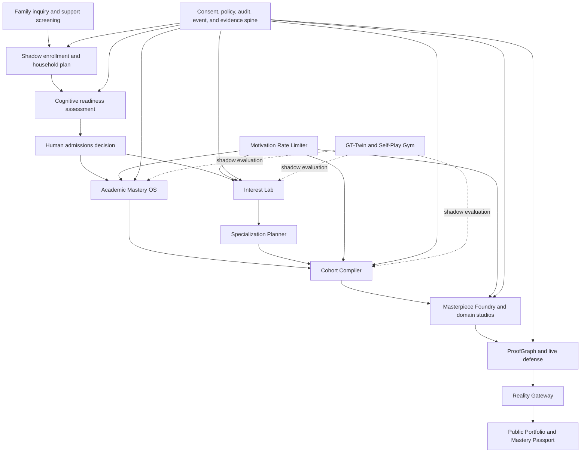
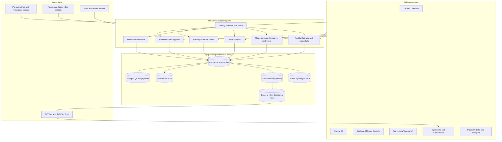
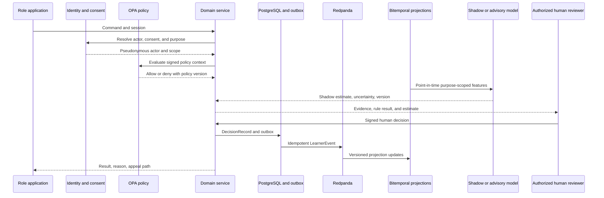
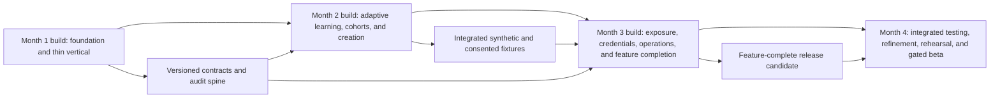

# GT100K Full-Program Operating System

## Product Requirements Document

| Field | Value |
|---|---|
| Product | GT100K |
| Document status | Implementation baseline |
| Version | 1.2 |
| Date | 2026-07-17 |
| Initial market | United States, English-first |
| Learner ages | 6 through 14 |
| Month 3 build target | Feature-complete release candidate with all planned product paths implemented |
| Month 4 validation target | Integrated testing, refinement, release rehearsal, and gated beta for 1,000 to 5,000 learners |
| Scale target | 100,000 enrolled learners |
| Long-horizon goal | MIT-level academic readiness by the end of eighth grade, paired with a durable field of interest and an evidence-backed body of work |

## 0. Change log

**v1.2 (2026-07-17) — "max defensible intensity" revision.** Applies the decisions in `PRD-review.md` to raise program intensity to the strongest form that preserves the child-safety and legal rights limits (the `G`-class dials stay fixed). Summary of changes and residual risks:

- **Friction (§13).** Added a non-punitive, potential-based *independence reward*: shortcutting after an AI rescue earns near zero, while asking for help never lowers access, mastery credit, or standing. Mastery-credit rules (§12) are unchanged.
- **Rivalry (§15, §23).** Cross-cohort *visible* standings are now permitted, ranked on velocity / mastery-gain / effort (sprint-reset, opt-out, safeguarding-gated). The former blanket ban on public leaderboards is narrowed to *fixed-ability caste* rankings. **Residual risk:** cross-cohort visibility for minors raises bullying, caste, and equity exposure; governance and counsel should confirm the narrowed §23 line before build.
- **Model authority (§8.5).** Added a Shadow→Bounded-automation promotion path gated on *reversibility + short-horizon feedback*, not stakes alone. Reversible, fast-feedback models (passion-probe selection, cohort repair within churn budget, difficulty/friction titration within dose caps, retrieval scheduling, mentor-attention allocation) may act with a guide veto and one-click revert. Irreversible or identity-defining decisions stay human/Shadow.
- **Selection (§10.1, §11, §33.1).** Sharpened on two axes: the psychometric board may set a higher cognitive floor, and the family-execution signal is promoted from Shadow to *Advisory*. **Residual risk:** a sharper cognitive gate on minors raises disparate-impact and COPPA/FERPA/IDEA exposure; the subgroup false-exclusion limit and humane ROUTE remain hard constraints, and no automated rejection is permitted.
- **Radical-dose R&D track (§31.1).** Added a quarantined, research-consent track that studies the full radical dose in simulation and feeds a governance roadmap to loosen production further over time — never touching a live child's status and never using any §23-prohibited mechanism.

Rights limits that did **not** move: child assent/veto, safeguarding override, no surveillance or biometric-truth claims, no irrevocable contracts, no automated rejection, accessibility exemptions, and the subgroup-fairness gates.

## 1. Executive summary

GT100K serves children whose families choose an intensive program that can span up to eight years. The program has two daily halves. The morning block builds academic mastery through adaptive practice, independent verification, retrieval, and an answer-blind Socratic tutor. The afternoon block helps each child discover a durable interest and turn it into ambitious projects, peer collaboration, expert mentorship, and public evidence.

The product supports the complete journey from initial family inquiry to portable credentials. Admissions staff evaluate family execution and cognitive readiness with explicit policies, uncertainty bands, accommodations, human review, and appeals. Guides use the same platform to track mastery, protect motivation, form cohorts, manage interventions, and supervise project work. Students use professional tools in isolated workspaces. Reviewers can trace a finished artifact through attempts, revisions, tests, assistance, and student decisions. External audiences receive only the exposure that a student, guardian, safety reviewer, and program policy authorize.

GT100K measures academic readiness through a benchmark portfolio rather than a single score. The required targets at age 14 are an SAT score of at least 1570 and scores of 5 on AP Calculus BC, AP Physics C, and AP English Literature. The program also measures mathematical explanation, scientific modeling, research practice, writing, project execution, collaboration, and the ability to defend one’s work. Academic acceleration without durable interest produces a strong test taker who may stop when adult pressure ends. Passion without foundations caps the complexity of what the child can build. GT100K develops both.

The product treats passion as a developing relationship between a child, an activity, and a context. It does not assign a permanent identity from a quiz, a biometric stream, or a short engagement spike. The Interest Lab gives children repeated encounters with domains and work modes. The Passion Engine maintains mutable hypotheses, records evidence and counterevidence, and proposes the next informative project. Students, parents, and guides review each proposal. The program commits more time only after the child returns by choice, expands the work without prompting, gains competence, and recovers after difficulty.

The product runs high-intensity learning under explicit limits. Each machine-generated pressure action requires a MotivationDoseToken. Competition, deadlines, parent nudges, public comparison, and help refusal consume a bounded budget. A guide can veto or reverse any action. Safety rules override performance goals. The system reduces load when sleep, health, broad distress, bullying, or injury appears. A fourteen-day diagnostic process distinguishes a hard step from a bad context or a fading interest. Persistent dissent and sustained loss of voluntary return reopen exploration.

GT100K uses models to estimate, rank, summarize, and simulate. Humans retain authority over admission, intensity, specialization, safeguarding, discipline, public release, and route transitions. The Month 4 beta keeps irreversible, high-stakes learned policies in shadow mode, while reversible, fast-feedback models may act inside a bounded, human-vetoable envelope (§8.5). Staff can compare a model recommendation with the human decision, and no model can change a child’s admission, specialization, route, or credential status. The program promotes a model only after local validation, subgroup analysis, documented policy approval, and an appeal workflow.

The first three months build the complete product. Month 1 establishes identity, consent, admissions, mastery, evidence capture, and the first end-to-end vertical slice. Month 2 adds passion inference, motivation limits, cohort formation, project agents, audio tooling, and proof records. Month 3 completes controlled external release, portable credentials, policy simulation, operations tooling, and every production integration. The team enters Month 4 with a feature-complete release candidate. Month 4 runs integrated testing, refinement, security and accessibility hardening, release rehearsal, 100,000-learner load tests, and gated enrollment at 1,000, 2,500, and 5,000 learners. The program will need years of outcome data to validate MIT readiness, durable passion, family continuation, and causal peer effects.

## 2. Product mission and success definition

### 2.1 Mission

GT100K gives selected children the foundations, environment, peers, tools, and sustained support required to reach advanced academic readiness by age 14 and build work in a field they choose to pursue. The program must preserve the child’s desire to return to that field after novelty, rewards, and adult prompts fade.

### 2.2 Product promise to the child

The child receives five promises:

1. The program will show them work they may not encounter at home or school.
2. The program will provide the knowledge, equipment, peers, and experts needed to pursue a promising interest.
3. The program will ask for difficult work and provide a safe route through setbacks.
4. The program will explain consequential decisions and provide a way to challenge them.
5. The child will own a portable record of what they mastered, made, tested, and defended.

### 2.3 Product promise to the family

The family receives a concrete operating plan, a named guide, schedule support, equipment and connectivity support where required, clear intensity limits, and access to every consequential decision record. The program evaluates the family against declared availability and recovery behavior. It does not infer commitment from wealth, accent, caregiver structure, or a perfect attendance record.

### 2.4 Product promise to reviewers and institutions

Each claim about a learner links to evidence. Academic credentials link to verified assessments. Project credentials link to source artifacts, revisions, tests, assistance records, contribution maps, and a live defense when required. Public outcomes link to a specific artifact version, audience, release policy, and observation window. Reviewers can verify the record without receiving private family, wellbeing, or workspace data.

### 2.5 Definition of MIT-level readiness

GT100K uses the phrase “MIT-level readiness” as an operational target, not an admissions guarantee or a statement of personal worth. A learner meets the target when the program has current, independently verified evidence across six dimensions.

| Dimension | Age-14 target | Evidence |
|---|---|---|
| Standardized readiness | SAT 1570 or higher | Official or approved secure administration |
| Advanced mathematics | AP Calculus BC score of 5 | Official AP result plus internal transfer tasks |
| Calculus-based science | AP Physics C score of 5 | Official AP result plus experiment and modeling evidence |
| Advanced verbal analysis | AP English Literature score of 5 | Official AP result plus timed and revised writing |
| Independent construction | At least one multi-cycle masterpiece | ProofGraph packet, live defense, and external outcome |
| Learning autonomy | Can plan, recover, seek bounded help, and explain decisions | Longitudinal mastery and project evidence |

The system tracks leading indicators before official tests become age-appropriate. These include mastery retention, far transfer, reasoning speed, writing quality, project complexity, revision quality, independent planning, and recovery after failure. Staff may not convert a leading indicator into a claim that the learner has achieved the long-horizon outcome.

### 2.6 Program success metrics

The executive scorecard contains seven groups of measures.

| Group | Primary measures |
|---|---|
| Academic | Independent mastery, delayed retention, far transfer, benchmark trajectory, false unlock and false lockout rates |
| Passion | Voluntary return after 7 and 30 days, self-authored scope growth, chosen difficulty, interest renewal, protected exploration coverage |
| Motivation | Autonomous reasons for work, pressure and tension, healthy recovery, sleep protection, prompt dependence |
| Social | Belonging, solo progress after cohort work, cohort stability, role balance, bullying and safeguarding reports |
| Masterpiece | Verified milestones, revision depth, reproducibility, expert review, real user or audience outcomes |
| Equity | Subgroup error, access to costly domains, accommodations, appeal outcomes, support allocation, family burden |
| Operations | Availability, latency, event durability, workspace startup, incident response, cost per learner, staff queue age |

No team may optimize a local metric without its paired guardrail. Faster mastery pairs with retention and false unlocks. More project time pairs with sleep and voluntary return. Stronger rivalry pairs with belonging and individual non-harm. More public exposure pairs with privacy incidents and child consent.

## 3. Scope

### 3.1 In scope

This PRD covers:

- family recruitment, qualification, support planning, shadow enrollment, and admissions;
- cognitive and trainability assessment with psychometric governance;
- the academic competency graph, practice supply, mastery verification, retrieval scheduling, and Socratic tutoring;
- interest discovery, specialization, motivation management, and structured persistence;
- cohort formation, live collaboration, short competition formats, and cohort health;
- project planning, secure workspaces, creative and technical tools, mentors, equipment, and resource scheduling;
- artifact provenance, evaluation, student defense, public release, outcomes, and portable credentials;
- identity, consent, data, policy, model, security, reliability, simulation, and governance infrastructure;
- staff workflows for admissions, psychometrics, guides, mentors, safeguarding, review, operations, and appeals.

### 3.2 Out of scope for the initial release candidate and beta

Neither the Month 3 feature-complete release candidate nor the Month 4 beta claims:

- proof that the program causes age-14 MIT readiness;
- validated prediction of eight-year family continuation;
- autonomous admission, route transition, discipline, or intensity decisions;
- a completed grade-by-grade content library for every subject;
- public release without human approval;
- clinical diagnosis of burnout, attention, emotion, or mental health;
- production authority for digital-twin or reinforcement-learning policies;
- nationwide legal approval for biometric or home-signal collection.

### 3.3 Prohibited product behavior

GT100K will not implement financial escrow, income-share agreements for minors, fixed-ability caste leaderboards, automatic expulsion, covert cameras or microphones, biometric truth claims, punishment for approved accommodations, or automated AI-authorship accusations. Staff cannot use a sensitive signal as the sole basis for admission, discipline, specialization, or route transition. Project agents cannot contact an adult, spend money, publish work, change access, or deploy to a public environment without an approved capability and a named human action.

## 4. Product principles

### 4.1 Evidence before authority

Each model output states its uncertainty, evidence, counterevidence, missing context, model version, and safe next action. A deterministic policy service applies the approved rule. The model cannot change the rule through a weight update. Staff can replay a past decision with the exact evidence, policy, and model versions used at that time.

### 4.2 High structure with meaningful autonomy

The program sets demanding goals, deadlines, mastery thresholds, and safety limits. The child receives consequential choices over project question, artifact, method, sequence, collaborator, mentor, audience, and challenge route. Staff explain the reason for required work. The child’s assent governs identity-linked specialization and public exposure. Structure cannot become psychological control.

Research on choice, autonomy support, and interest development supports this combination. Patall, Cooper, and Robinson found positive average effects of choice on intrinsic motivation and related outcomes. Hidi and Renninger describe interest as a progression from situational triggers to a self-sustaining individual interest. Patzak and Zhang’s 2025 review treats autonomy support and instructional structure as mutually supportive practices rather than opposing choices.

### 4.3 Durable learning over session performance

The platform rewards independent retrieval, delayed retention, transfer, explanation, and revision. It does not grant mastery because a learner completed an assisted item. A learner can request help without losing access or status. The platform records assistance and schedules an unassisted verification after the learner has had time to consolidate the concept.

### 4.4 Passion develops through work

The Interest Lab gives the child authentic problems, tools, and increasing knowledge. The system looks for repeated return after novelty decays. It distinguishes a preferred topic from a preferred work mode. A child may love debugging across audio, robotics, and games, or love explaining across science and history. The Specialization Planner can build a spine around either pattern.

### 4.5 Competition is a bounded intervention

The program uses stable peer groups, cooperative missions, private near-peer comparisons, personal-best challenges, and short tournaments. It does not build a permanent social hierarchy. The Motivation Rate Limiter meters rivalry, and the cohort optimizer enforces non-harm and churn constraints. Guides can remove competition without changing the learner’s academic or program status.

### 4.6 Professional tools with child-safe boundaries

Students use real code, data, audio, research, media, and deployment tools. A capability gateway replaces open network and filesystem access. Each tool call carries the student, project, purpose, budget, expiry, and policy. The public runtime has no route into the student workspace.

### 4.7 Proof of process over detection

GT100K records how a learner built an artifact. The system stores attempts, branches, revisions, tests, prompts, mentor help, tool calls, and contribution claims. An anomaly can trigger a live defense, but no model can accuse or reject a learner. The program teaches declared AI collaboration and evaluates whether the child can explain, modify, test, and extend the work.

### 4.8 Privacy follows purpose

Identity, admissions, learning, wellbeing, sensitive research, private project evidence, and public portfolio data occupy seven separate policy and encryption domains. Each collection names its purpose, retention, allowed users, and model-training status. The platform denies a cross-purpose read even when the requesting service has technical access to the same storage account.

## 5. Evidence classification

The PRD labels requirements with one of six evidence classes.

| Class | Meaning | Product treatment |
|---|---|---|
| E1 | Supported by meta-analysis, replicated experiments, or strong operational evidence | May inform a production rule after local validation |
| E2 | Supported by narrower experiments, longitudinal evidence, or a mature external standard | Launch with monitoring and bounded authority |
| E3 | Plausible design grounded in theory or adjacent domains | Run in shadow mode or a reversible pilot |
| R | Research bet with unvalidated construct or domain transfer | No production authority; collect evidence under separate consent |
| G | Governance, safety, legal, or rights requirement | Enforce as policy regardless of measured product lift |
| ENG | Established engineering control or service objective | Validate through test, load, security, or operational evidence |

Examples:

- mastery practice, worked examples, assisted discovery, feedback, retrieval, and autonomy-supportive structure enter as E1 or E2;
- contextual passion probes, level-plus-velocity cohort matching, and comparative project judgment enter as E2 or E3;
- family survival prediction, causal peer chemistry, digital twins, and motivation MPC enter as E3;
- voice-stress conviction, gaze-based passion inference, rPPG burnout inference, and home-audio attestation enter as R;
- child assent, appeal, privacy separation, and human authority enter as G; isolation, replay, load limits, and disaster recovery enter as ENG.

Software delivery speed does not change an evidence class. The program may build an R-class system in a month, but it cannot grant that system authority without valid child data, psychometric review, safety review, and subgroup evidence.

## 6. Operating model

### 6.1 Daily structure

The default weekday contains two academic hours and an afternoon passion block.

| Block | Purpose | Default form |
|---|---|---|
| Academic preparation | Plan, device check, prior-day retrieval | 10 minutes |
| Quantitative mastery | Mathematics and calculus pathway | Two focused sessions with a break |
| Verbal mastery | Reading, writing, argument, and literature | Two focused sessions with a break |
| Recovery and movement | Food, outdoor movement, social time | Protected interval |
| Interest or specialization studio | Probe, project, apprenticeship, cohort mission, or critique | Two to four hours by age and plan |
| Reflection and evidence | Update plan, record decisions, choose next action | 10 to 20 minutes |

Science connects the morning and afternoon halves. Learners study prerequisite mathematics and language in the mastery block, then apply them through modeling, experiments, research, and projects. A learner building a speaker uses ratios, logarithms, functions, waves, electricity, measurement, technical writing, and argument. The system records both the core competency and the project evidence.

### 6.2 Weekly rhythm

Each week includes independent mastery checks, one cohort mission, one project critique, one protected free-choice period, and one guide review. The guide review covers progress, pressure, sleep, belonging, help use, family burden, and the learner’s desire to return. The program does not convert the review into a performance score.

### 6.3 Guide role

Guides supervise motivation, planning, safeguarding, and execution. Subject models and expert mentors provide content help. Each learner has a named guide and a backup. The beta staffs guides according to observed queue and safety load, with an initial planning ratio of one guide per 25 to 40 learners. The ratio drops for younger cohorts and learners with active interventions.

### 6.4 Family role

Families provide agreed schedule windows, respond to safety and logistics requests, support attendance, and protect rest. The Family OS helps a household recover from missed work without turning one disruption into a breach. Parents can set stricter health and privacy limits. They cannot use the platform to increase machine-generated pressure outside approved budgets.

### 6.5 Human decision bodies

The beta establishes five named bodies:

- an admissions panel with psychometric and accommodation expertise;
- a learner-plan panel for contested specialization or intensity decisions;
- a safeguarding team with authority to pause any program action;
- a model and data governance board that approves features, releases, and research use;
- a public-release reviewer for identity, contact, rights, spending, and audience risk.

Each body records members, conflicts, evidence reviewed, decision, rationale, expiry, and appeal route.

The learner-plan panel may mediate logistics and required academic routes. It cannot override the child's veto over identity-linked specialization, increased pressure or rivalry, sensitive research, recording, optional mentor interaction, or public release.

## 7. System map

The shared platform records each transition as a signed, versioned event. Product services own their operational state. The central event and evidence layers let authorized staff reconstruct a journey without creating a single unrestricted learner profile.

## 8. Global policy and decision requirements

### 8.1 Consequential decision boundary

A consequential decision changes access, intensity, cohort, specialization, privacy, public exposure, credential status, or program participation. GT100K requires a human owner for each such decision. A model may prepare evidence and a recommendation. A rules service may block an action that violates policy. Neither may issue the final decision during the beta.

| ID | Requirement |
|---|---|
| POL-001 | Each consequential decision must name a human owner, policy version, evidence set, rationale, expiry, and appeal route. |
| POL-002 | The system must show uncertainty and abstain when evidence falls outside the validated population or feature range. |
| POL-003 | Staff must record any override of a model or policy recommendation with a reason code and free-text rationale. |
| POL-004 | The platform must replay a decision as it appeared at the time without substituting current features, models, or policy. |
| POL-005 | Staff must not use undisclosed notes, protected-class proxies, or expired consent in a decision. |
| POL-006 | A child or guardian can correct factual evidence and appeal an interpretation. The system preserves the original record and attaches the correction. |
| POL-007 | A safeguarding hold pauses any conflicting workflow, token, cohort move, project action, or public exposure. |
| POL-008 | Model disagreement, missing data, or multi-informant disagreement must remain visible. The product must not average disagreement into a false consensus. |

### 8.2 Child assent and structured persistence

Parents provide legal consent where required. Children provide developmentally appropriate assent for intensive participation, interest-linked specialization, sensitive-signal research, recording, mentor interaction, and public release. The product asks for assent in language and controls appropriate to the child’s age. A checked guardian box cannot stand in for the child’s answer.

A refusal during a hard task starts inquiry rather than punishment or trait inference. Closing one task does not change an agreed required academic goal by itself. The guide records the child's account, offers another route, and checks whether assent to the broader activity remains.

The structured persistence workflow follows these rules:

1. A local resistance event starts a diagnostic record rather than an intensity penalty.
2. The guide checks task difficulty, missing knowledge, sensory access, tool failure, peer conflict, mentor fit, fatigue, family stress, and clarity of purpose.
3. The learner chooses among safe repair options. The program holds the goal for up to fourteen days while staff change one context variable at a time.
4. Sleep disruption, broad distress, injury, bullying, somatic complaints, panic, or safeguarding concerns trigger an immediate deload and human review. No diagnostic window delays this action.
5. The plan panel reopens exploration when low voluntary return continues for four to six weeks after rest and two reasonable context repairs, or when the child sustains explicit dissent through the review process.
6. A quarterly renewal asks the child to deepen, branch, park, or replace the specialization. None of these choices removes previously earned mastery or project evidence.

The fourteen-day hold applies only while the child assents to the broader goal. Withdrawal of assent to intensive participation pauses the program and starts a private review. Withdrawal stops sensitive research, recording, public exposure, optional specialization, and optional mentor interaction at once. Staff may request only closure needed for equipment safety, teammate handoff, or data integrity. A parent, guide, or panel cannot override these boundaries.

The product must not show parents a button that raises intensity. Parents can request a review. The guide and policy service apply the agreed tier and pressure budget. Children can request help, privacy, a different adult, or a safety review at any time.

### 8.3 Accommodation and access policy

Admissions and learning services must support disability, language, sensory, motor, reading, and executive-function accommodations. The accommodation service stores the approved support separately from performance evidence and exposes only the minimum required instruction to the consuming service.

Approved support does not consume a help penalty. A screen reader, extended time, language clarification, alternate input, sensory break, calculator permitted by policy, communication aid, or human reader cannot reduce mastery credit unless the construct being measured requires the excluded skill and a psychometrician approves that rule. The decision record must state the construct and accommodation effect.

GT100K supplies devices, connectivity, project equipment, and schedule alternatives when a missing resource would block participation. The Family OS tests whether support restores feasibility before staff interpret missed obligations as low commitment. The Interest Lab equalizes exposure to costly fields through shared kits, remote labs, simulations, loaners, and regional partners.

### 8.4 Admission and route states

The admissions policy supports five operational states even though the assessment API returns the three compact outcomes `ADMIT`, `VERIFY`, and `ROUTE`.

| State | Meaning | Required next action |
|---|---|---|
| Provisional | The family has entered shadow enrollment | Complete the household plan, support test, and assessment |
| Admit | Evidence meets the current policy with adequate certainty | Human panel confirms seat, support package, and start plan |
| Verify | Evidence falls in an uncertainty, integrity, or accommodation band | Provide a parallel form, specialist review, or extended trial |
| Waitlist | The learner qualifies but capacity or a required support service is unavailable | Preserve evidence, state priority rule, and offer a review date |
| Route | Current evidence does not support this program at this time | Provide an explanation, useful evidence, partner options, and reapplication policy |

The Route state cannot present the child as incapable or deficient. The program reports the assessed constructs, uncertainty, conditions, and available paths. A routed family can export its records and request deletion according to retention law. The product records whether the family received and used a referral so the program can measure the quality of its off-ramp.

After enrollment, a learner may move to a reduced-intensity plan, partner program, temporary leave, or full exit. The plan panel uses current wellbeing, motivation, learning, and family evidence. A predictive risk score cannot trigger the move. The child keeps earned credentials and can export project work.

### 8.5 Research and model authority

Each model has a declared authority level:

| Level | Use |
|---|---|
| Lab | Offline development on synthetic, public, or consented research data |
| Shadow | Runs on live inputs but cannot change a user-visible decision or action |
| Advisory | Shows a recommendation to an authorized human who owns the decision |
| Bounded automation | Acts inside a narrow, reversible envelope with monitoring and a human kill switch |
| Retired | Receives no new data and cannot serve decisions |

The Month 4 beta permits bounded automation for low-risk scheduling, reminders, content routing, resource cleanup, and previously approved project actions. Beyond these, the beta promotes a model from Shadow to **Bounded automation** when its action is reversible, low-harm, human-kill-switched, and validated on a short-horizon proxy outcome — for example measured weekly skill gain, flow-band residence, or voluntary return — rather than the eight-year outcome. Under this rule the beta runs the following in bounded automation, each with a guide veto window and one-click revert: passion-probe selection (§14.4), cohort repair within the churn budget (§15), difficulty-and-friction titration within the rules-engine dose caps (§14.8), retrieval scheduling (§12), and mentor-attention allocation (§18). It keeps at Shadow every irreversible, identity-defining, or only-eight-year-verifiable decision: learned admissions cognitive-risk prediction, the cognitive-floor cut, intensity ceilings, passion specialization commitment, cohort causal uplift, safeguarding, sensitive signals, authenticity anomalies, public release, and route prediction. The family-execution commitment signal may run **Advisory** to the human admissions panel (§10.1, RF-04). Fixed, validated psychometric scoring rules may supply evidence to a human admissions panel, but they do not adapt online or issue the decision.

The model governance board must approve a move between levels. The release packet includes the intended population, data lineage, feature list, evaluation protocol, subgroup results, calibration, known failure modes, abuse tests, privacy review, safety review, monitoring thresholds, rollback method, and owner. A model trained on adult learners, public emotion corpora, or synthetic students cannot receive child-facing authority from benchmark performance alone.

### 8.6 Sensitive-signal policy

The Sensitive Signal Lab is R-class research governed by Section 14.11. It requires separate parent consent and child assent, uploads no raw research media, and grants no beta decision-support authority. Staff making or advising child decisions cannot view its outputs. Refusal, missingness, device quality, or withdrawal cannot change admission or program access.

A project recording is not Sensitive Signal Lab collection. It follows a separate, visible consent flow and the private project-evidence domain. Any post-beta advisory proposal requires external scientific, legal, privacy, subgroup, and child-impact review plus a no-signal path; it cannot authorize a single-signal or automated decision.

### 8.7 Staff service levels

| Workflow | Beta service target |
|---|---|
| Safeguarding alert | Human acknowledgement within 15 minutes during program hours |
| Child request for a different adult | Same-day private response |
| Admission or accommodation appeal | Intake within 2 business days; decision target within 10 business days |
| Sensitive-data access request | Logged approval before access; quarterly entitlement review |
| Public exposure emergency | Lease revocation under 5 seconds at p99; human incident response at once |
| Project tool or spend escalation | Human decision before the current lease expires |
| Model safety threshold breach | Automatic traffic halt or shadow fallback, followed by owner review |
| Data correction or export | Status visible to the requester; completion within the legal deadline |

## 9. Personas and role applications

### 9.1 Primary personas

| Persona | Need | Product obligation |
|---|---|---|
| Student, ages 6-14 | Challenge, agency, belonging, understandable feedback, safe help, and ownership of work | Use age-appropriate language, show evidence and choices, honor assent, and provide appeal and exit controls |
| Parent or caregiver | A feasible family plan, honest progress, clear responsibilities, and support before sanctions | Separate support needs from commitment, minimize data collection, and show the effect of requested changes |
| Guide | A concise queue for academic, motivational, cohort, and safeguarding action | Rank by policy and evidence, expose uncertainty, and avoid opaque risk scores |
| Domain mentor | Project context, student decisions, rubric evidence, and bounded communication | Limit access to assigned projects, record critique, and escalate safety issues |
| Admissions reviewer | Valid assessment evidence, family-trial history, accommodations, policy, and appeals | Keep model estimates advisory and make each decision reproducible |
| Operator or governor | Reliability, psychometrics, fairness, privacy, staffing, cost, incidents, and release state | Provide immutable audit, subgroup views with privacy thresholds, kill switches, and change approval |
| External reviewer | A credible artifact, declared assistance, a usable rubric, and limited contact with minors | Reveal the minimum evidence required and route all contact through controlled channels |

### 9.2 Six applications

**Student Compass.** The student sees today's mastery plan, Interest Lab choices, specialization allocation, cohort room, Foundry milestones, equipment reservations, reflections, appeals, and private portfolio. A progress view distinguishes attempted, supported, independently verified, retained, and transferred mastery. The interface may show cross-cohort gain-based standings (§15) but must not show fixed-ability caste ranks.

**Family OS.** The family completes onboarding, builds a household schedule, requests devices or alternate participation windows, manages consent, reviews obligations, and receives coaching. The family sees trends and evidence without receiving surveillance-style activity feeds or private student reflections that the child marked confidential, subject to safeguarding policy.

**Guide and Mentor Console.** Guides receive action queues, mastery evidence, child-raised concerns, passion hypotheses, cohort health, project blockers, and safeguarding workflows. Mentors receive assigned project context, critique tools, and communication controls. The console separates observations from model inferences.

**Admissions Workbench.** Reviewers manage the family trial, assessment sessions, accommodations, retests, policy decisions, overrides, and appeals. Reviewers can see whether an optional research workflow is unavailable or complete, but they cannot view Sensitive Signal Lab features or outputs. Approved research reviewers use the isolated governance path.

**Operations and Governance Console.** Authorized staff manage item calibration, model releases, feature and policy versions, consent coverage, fairness audits, incidents, staffing, equipment, capacity, deletion, and service health. Four-eyes approval applies to production policy changes, public credential issuers, and high-stakes model promotion.

**Public Portfolio and Mastery Passport.** A student-approved page presents verified artifacts, selected credentials, assistance context, and outcomes tied to specific releases. The verifier checks signatures without opening private source material. The student can revoke audience access where law and credential rules permit.

### 9.3 Shared application acceptance criteria

- A student can move from today's plan to the supporting evidence, policy explanation, appeal control, or help channel in three interactions or fewer.
- Each role sees only records allowed by purpose, consent, assignment, and jurisdiction.
- The applications meet WCAG 2.2 AA and support keyboard, switch, screen-reader, caption, reduced-motion, high-contrast, and age-appropriate reading modes.
- The platform records all state-changing actions with actor, event time, ingest time, consent purpose, schema version, policy version, and evidence references.
- A child can request a correction or mark a disputed inference without deleting the original audit record.

## 10. Recruitment and family partnership

Recruitment seeks families who can sustain the operating cadence after the program supplies reasonable support. The program must not use wealth, accent, employment type, family structure, a personality profile, or access to private household surveillance as a proxy for commitment. Outreach materials state the workload, the experimental status of the beta, selection rules, compensation, data use, and route options in plain language.

Ethical prospecting uses opt-in referrals, community and school partnerships, public information sessions, and family-initiated interest. Outreach ranking may optimize delivery and language fit, but it cannot predict child ability, scrape minors, buy household vulnerability data, or target families through protected-class proxies. Every source carries campaign, message, eligibility, and conversion metadata so operators can audit who was reached, excluded, or pressured. A decline suppresses further contact except for a family-requested follow-up.

Qualified families enter a compensated 21-to-28-day shadow enrollment. They experience the real schedule, parent handoffs, a planned disruption, a missed obligation, recovery planning, and a support request. The trial measures follow-through against the family's declared availability, honest escalation, and recovery after disruption. Perfect attendance is not the goal.

The Household Schedule Compiler accepts availability, device constraints, caregiver handoffs, rest, and accessibility needs. CP-SAT tests a weekly plan against illness, outages, shift changes, and caregiver conflicts. A second solve finds a support package that restores feasibility. Staff review the result before recording an unmet obligation as evidence.

Participation uses a renewable agreement, not an irrevocable eight-year contract. The child and caregiver renew at defined intervals after reviewing workload, evidence, alternatives, and concerns. Families can pause or leave without financial penalty. Staff offer a humane transition record and route recommendations after non-selection or withdrawal.

### 10.1 Functional requirements

- **RF-00:** Recruitment shall record lawful source, consent basis, message version, eligibility rule, suppression state, and subgroup reach while prohibiting purchased minor profiles, covert enrichment, and prestige or outcome guarantees.
- **RF-01:** Family OS shall create a versioned `FamilyPlan` with availability, responsibilities, rest windows, support, and renewal date.
- **RF-02:** The trial workflow shall capture signed `CommitmentEvent` records and distinguish completion, reschedule, support request, excused disruption, and recovery.
- **RF-03:** The schedule solver shall return feasible plans, binding constraints, and the least-cost support options under each shock scenario.
- **RF-04:** An interpretable family-execution model may estimate withdrawal or support need. Once locally validated for calibration and subgroup fairness, it runs in **Advisory** mode: it is shown to the human admissions panel alongside the trial evidence. Staff shall not use the score as the sole basis for selection, and it shall never trigger an automated rejection.
- **RF-05:** The decision service shall support `CONTINUE_TRIAL`, `READY_FOR_REVIEW`, `OFFER_SUPPORT`, and `CLOSE_WITH_ROUTE` before admissions review.
- **RF-06:** Family members shall receive the evidence, policy reason, correction path, and appeal deadline for each consequential decision.

### 10.2 Acceptance criteria

- A replay produces the same trial state from duplicate, late, and out-of-order events.
- A family with a resource constraint receives a support feasibility review before a reviewer records a commitment concern.
- Staff can reproduce the exact evidence and policy behind a trial outcome.
- The product reports subgroup false-decline rates and abstains when sample sizes cannot support a stable estimate.
- The trial collects no ambient home audio, continuous screen capture, precise location history, or employer data.

### 10.3 Family Coach

- **FC-01:** Family OS shall offer schedule repair, support discovery, renewal preparation, and plain-language explanations. It shall not diagnose, shame, score parental devotion, or recommend more intensity.
- **FC-02:** Each message shall name its purpose, source, quiet-hour status, opt-out control, and guide escalation path. A pressure-bearing parent nudge requires a `MotivationDoseToken`.
- **FC-03:** Coaching and support requests remain outside admissions and family-risk features. Muting coaching cannot change the child's standing.
- **FC-04:** Repeated plan failure, family conflict, access loss, or a child concern routes to the named guide.

Tests shall prove quiet-hour suppression, opt-out in one interaction, token rejection, purpose isolation, duplicate prevention, support-first repair, and no admissions-evidence change after coaching refusal.

## 11. Cognitive Floor Engine

The Cognitive Floor Engine estimates whether current evidence supports the program's accelerated path. It measures baseline reasoning, learning rate after a short instruction, near and far transfer, delayed retention, and speed-accuracy tradeoff. The engine does not convert one score into a claim about a child's worth or fixed potential.

Credentialed psychometricians define the construct, validate item families, and map any threshold to licensed reference measures. Human reviewers approve each generative template and its scoring logic. Response time may flag device faults or unusual sessions but cannot reject a candidate.

The Rust/WASM client delivers visual, verbal, quantitative, spatial, and approved auditory items with monotonic timing and offline recovery. The item service enforces exposure limits and streams signed attempts. A multidimensional Bayesian IRT model updates the readiness posterior. A boundary-focused CAT or SPRT policy selects items that reduce uncertainty near the configured floor and stops once the evidence enters a decision region or reaches the session burden cap.

Generative item families instantiate reviewed templates under content, difficulty, and scoring constraints. Psychometric information must remain adequate at the admissions boundary and through the extreme right tail so the engine can separate a clear boundary result from unresolved headroom without imposing a fixed ceiling. Exposure control applies across generated siblings, not only exact item IDs. Tail estimates remain construct-specific distributions and never become a public IQ label.

The engine returns one of three policy inputs:

- `ADMIT`: the validated evidence clears the configured boundary with the required confidence and no unresolved validity issue.
- `VERIFY`: uncertainty, disagreement, device quality, language, health, accommodation, or exposure requires a parallel form, delayed check, or psychometric review.
- `ROUTE`: validated evidence does not support the accelerated path after applicable verification. A reviewer supplies alternatives and preserves appeal rights.

Admissions staff own the outcome. The engine cannot combine family commitment, voice, gaze, emotion, or home behavior into the cognitive posterior.

### 11.1 Functional requirements and acceptance criteria

- **CF-01:** Each `AssessmentSession` shall reference item parameters, client version, accommodation profile, device checks, consent, and posterior snapshots.
- **CF-02:** The engine shall enforce item-family and individual-item exposure ceilings across sessions.
- **CF-03:** The engine shall support large-print, screen-reader-compatible, extended-time, motor, language, and quiet-environment accommodations without treating the accommodation as a negative feature.
- **CF-04:** The psychometrics console shall report information curves, posterior coverage, retest agreement, item exposure, test-retest reliability, and differential item functioning.
- **CF-05:** A policy release shall fail if any approved subgroup breaches its false-exclusion, DIF, or posterior-coverage limit.
- **CF-06:** The Workbench shall show posterior intervals, construct-level evidence, validity flags, applied rule, human owner, and appeal path.
- The simulator must process 100,000 candidates, stop clear cases before the item cap, and keep declared false-decision risk within the configured budget.
- The platform must replay an assessment decision from signed events and versioned parameters.
- A borderline candidate must receive `VERIFY`, not a forced binary decision.
- A consent withdrawal must stop new analysis and trigger field-level retention and deletion workflows.

## 12. Academic Mastery OS

The Academic Mastery OS turns the readiness graph into a daily plan. It chooses a small set of new nodes, prerequisite repair, spaced retrieval, writing or explanation, and an independent check. The plan respects the student's available time, accommodation, prior help, and current specialization links.

The first beta uses interpretable knowledge tracing. PFA, BKT, or an interpretable knowledge tracing variant estimates opportunity, success, slip, and guess effects by skill. The team may compare sequence models in shadow mode, but a deep model cannot unlock a node on its own. A versioned mastery policy requires at least 90 percent performance on an independent, unassisted assessment and may require multiple item families, an explanation, or transfer evidence for high-impact nodes. FSRS-style scheduling sets later retrieval checks from observed recall.

The Practice-Item Foundry creates variations from reviewed item models. Automated checks and human sampling validate correctness. The system calibrates difficulty after use and quarantines drift, leakage, ambiguity, or subgroup DIF. Unvalidated content cannot enter a consequential check.

The competency graph has two required academic spines. The quantitative spine runs from number sense and arithmetic through algebra, geometry, probability, statistics, precalculus, calculus, and mathematical modeling. The verbal spine runs from decoding and comprehension through vocabulary, composition, argument, research, rhetoric, and literature. Science, computation, and project nodes cross-link both spines. Each node maps to age-appropriate leading indicators and, where valid, SAT and AP readiness evidence.

### 12.1 Mastery delivery and measurement ownership

The Learning Measurement owner configures four 25-minute focus blocks inside the two-hour mastery period, with movement breaks and accommodation overrides from 15 to 45 minutes. Practice selection targets a rolling independent success band of 70 to 85 percent. This zone-of-proximal-development practice band does not replace the 90 percent independent mastery gate.

PFA is the beta gating baseline. BKT and IKT run as challengers until they improve calibration without subgroup harm. Each item and skill carries reading-demand metadata. Psychometrics and accessibility owners audit error by skill and reading-access group; an absolute false-lockout gap above five percentage points, or any skill gap above ten points, freezes that gate pending repair.

### 12.2 Functional requirements

- **MO-01:** Each `MasteryState` shall include competency version, evidence set, support status, posterior or rule state, retention due date, and decision source.
- **MO-02:** The planner shall distinguish exposure, guided practice, supported success, independent verification, retention, and far transfer.
- **MO-03:** A `HelpReceipt` shall follow work into later mastery decisions so supported success cannot count as independent proof.
- **MO-04:** The system shall schedule a fresh unassisted check after help and allow accessibility tools that do not supply the target reasoning.
- **MO-05:** The guide can override a plan with a reason, duration, and review date. The system preserves both plans for replay.
- **MO-06:** Benchmark dashboards shall report coverage and uncertainty, not a guaranteed future test score.

### 12.3 Acceptance criteria

- A student cannot unlock a prerequisite-dependent node through repeated copies of one item family.
- A mastery claim survives a delayed check and at least one changed-context task for nodes marked transfer-critical.
- Item generation fails closed when a verifier, rubric, or calibration record is absent.
- A student who uses approved text-to-speech or motor assistance receives no help penalty when the tool does not solve the tested construct.
- A guide can explain every task in the daily plan through a prerequisite, retrieval, repair, transfer, or student-goal link.

## 13. Answer-Blind Socratic Tutor

The tutor helps the student think without seeing or generating the protected answer. A separate grader service owns answer keys and correctness checks. The tutor receives the problem, the student's attempt, a misconception code or bounded diagnostic, permitted context, and the next allowed action. It never receives the final answer for an active mastery item.

The interaction state machine requires an attempt before a content hint unless an accessibility or safety policy applies. It can ask the student to restate the problem, identify knowns, draw a representation, test a simpler case, compare two approaches, retrieve a prior concept, or explain a contradiction. Each escalation creates a `TutorAction` and `HelpReceipt`. After substantial help, the system schedules a different unassisted item.

**Independence reward (potential-based, non-punitive).** Mastery credit is never reduced by asking for help (§12); separately, the platform grants a visible *independence reward* that accrues only from unassisted first-attempt success and the later unassisted verification. Because a post-rescue attempt barely changes the knowledge-tracing mastery estimate, the reward it yields is near zero by construction — the potential-based form of a friction tax (Ng, Harada & Russell, 1999) — so shortcutting after an AI rescue is worth almost nothing without penalizing the child. Requesting help never lowers access, mastery credit, program standing, or independence reward already earned; accessibility and safety help are exempt and never affect the reward. Only the delayed unassisted check unlocks the top independence tier.

The tutor and grader run in separate trust domains, service accounts, networks, and logs. The tutor uses a curated misconception library and evaluated retrieval. The team may QLoRA-tune an open model on Socratic transcripts and test GRPO or related methods in an offline gym. Production policy, a solution-leakage classifier, deterministic output checks, and a red-team suite enforce the answer-blind contract.

**User story:** "I am John. My crossover simulation clips at high volume, and I do not know why. I want a clue without the tutor writing the filter for me." The tutor asks John to inspect peak level before and after each stage, compare linear and decibel scales, and predict which coefficient changes gain. It records the help and later asks him to diagnose a different filter without assistance.

### 13.1 Acceptance criteria

- The tutor cannot access answer-key storage, grader traces, hidden tests, or another student's work.
- The red-team and jailbreak suite measures direct leakage, paraphrased leakage, prompt injection, multi-turn extraction, retrieval poisoning, role confusion, encoded requests, and tool misuse. A release must meet the configured leakage ceiling.
- The tutor offers a live (in person) human expert to help after repeated stalled turns or a student request.
- The system exempts captions, translation approved by assessment policy, screen readers, speech input, and motor support from help decay.
- The student can inspect the help receipt and challenge an incorrect classification.
- Grader downtime cannot cause the tutor to invent a correctness judgment.
- A post-AI-rescue attempt yields near-zero independence reward, while help access, mastery credit, and previously earned independence standing are unchanged; accessibility and safety help never affect the reward.

## 14. Child Experience, Passion Development, and Sustainable Specialization

### 14.1 Product position and evidence standard

GT100K serves a child whose parent may initiate enrollment and whose goals may still be vague. The program builds academic capability, tests work worth returning to, and protects agency. It must never assign an identity from a survey, engagement score, parent claim, or biometric signal.

The product treats passion as a developmental process. Interest can start with a compelling experience, grow through knowledge and competence, survive setbacks, combine with other interests, or fade. GT100K records a mutable `InterestHypothesis`, tests it through bounded projects, and asks the child to interpret the evidence. A hypothesis supports planning. It does not define the child.

Requirements in this section use the six evidence classes defined in Section 5: E1, E2, E3, R, G, and ENG.

The beta keeps learned models that recommend specialization, persistence, or route changes in shadow mode; a learned controller may titrate intensity only within the rules-engine dose caps as bounded automation (§8.5). A child, parent, and accountable guide make the specialization, persistence, and route decisions under the authority rules below. The platform records the evidence, policy version, human decision, dissent, and appeal path.

### 14.2 Primary child persona

The primary persona is a child age 6 to 14 with enough assessed readiness to enter the program, subject to a human admissions decision. A parent or guardian often starts the application. The child may like learning but lack the vocabulary or experience to name a field. The child may also arrive with a strong claim that reflects a durable interest, a recent novelty, peer influence, parental projection, or some mixture.

The product makes no domain, pace, or passion assumption from sex or gender.

The child needs:

- a two-hour mastery block plus broad access to unfamiliar domains before specialization;
- projects that connect mastery to objects, audiences, and problems the child values;
- control over safe choices, privacy, intensity, and public exposure;
- help during distress, disability, or safety risk, with adults who examine resistance rather than punish it;
- a portfolio that proves growth without turning the child into a public brand.

#### 14.2.1 Canonical user story

> I’m John. I like learning, but I care most about audio systems. I want to take speakers apart, hear what changes when I move them, and build something that sounds better than what I have now. I want adults to help me learn the hard parts without taking over my project.

John represents any child with an emerging interest. The audio domain makes the journey concrete because it joins music, perception, mathematics, physics, electronics, software, fabrication, and communication. GT100K must support an equivalent path for a child drawn to organisms, proofs, machines, stories, public problems, performance, or a field the initial taxonomy missed.

### 14.3 John’s end-to-end journey

#### 14.3.1 Parent-initiated application and child assent

John’s parents start the application when he is ten. The Family OS explains the pace, schedule, Interest Lab, data practices, public portfolio, and exit options in parent and child language. John completes an assent conversation without a parent answering for him and can ask for a private guide conversation. Refusal of optional sensors, public display, or a proposed project cannot reduce his admissions standing.

The admissions panel uses the family trial and Cognitive Floor Engine under a separate policy. Interest evidence cannot affect John’s result. A human panel issues `ADMIT`, `VERIFY`, or `ROUTE` with a reason and appeal route. If admitted, John begins with no passion label. His statement about speakers becomes a low-confidence starting claim.

#### 14.3.2 Balanced Interest Lab

John enters an eight-to-twelve-week Interest Lab. He sees 18 to 24 micro-projects lasting 30 to 90 minutes. The set covers at least six content domains and six work modes. Audio receives enough exposure to test John’s claim, but the system also offers mechanical design, life science, visual storytelling, computation, and civic problem solving. John chooses from two or three eligible probes at each choice point.

Audio probes include a room-listening map, passive amplifier, safe speaker teardown, frequency-response measurement, podcast repair, and simulated crossover. Matched probes cover mechanics, ecology, visual narrative, and data explanation. The Lab tests whether John's sustained return centers on audio, instrumented debugging, making objects, composing, or explaining.

Staff calibrate each probe to John’s skill and provide equivalent equipment. The platform records offers, choices, revisions, harder-constraint requests, and returns after the requirement ends. It captures no screen video or raw keystroke stream. A local adapter summarizes artifact changes such as “revised the filter after measurement.”

John returns to the room-acoustics probe nine days later without a prompt. He rejects an easy poster option, asks whether a bookshelf changes a room mode, and revises his measurement plan after poor first results. He enjoys the podcast task but does not return after the novelty ends. Those differences matter more than a five-star rating at the end of either session.

#### 14.3.3 A revisable interest hypothesis

After sufficient coverage, the Guide Console presents evidence rather than a verdict:

> Emerging hypothesis: John may sustain interest in measuring and improving physical audio systems. Evidence includes two voluntary returns, self-authored measurement questions, recovery after a failed test, and competence growth in acoustic modeling. Competing explanation: he may prefer instrumented debugging across domains rather than audio as a topic. Confidence remains limited because collaborative and performance probes lack coverage.

John can agree, disagree, annotate an event, or withdraw an optional reflection from model use. His parent can add access context but cannot convert a parent report into confirmed interest. The next plan tests the competing explanation through one non-audio debugging project and one audio fabrication project.

#### 14.3.4 Specialization plan

John’s evidence supports an initial specialization. The age 9 to 11 afternoon default assigns 60 percent to a primary spine, 25 percent to adjacent depth, and 15 percent to wildcard exploration. John and his guide name the current spine “acoustic systems and sound engineering.” The plan makes no career claim. Adjacent work covers waves, algebra, electronics, code, and technical explanation.

The two-hour mastery block remains intact. Audio creates uses for mathematics and writing but cannot replace independent mastery gates. The quarterly plan names protected exploration, stop conditions, and a child-authored question.

#### 14.3.5 Project ladder and productive difficulty

John moves from short probes to a project ladder: characterize a room, build and compare enclosures, design a passive crossover, write a digital filter, and measure a complete system. The Socratic Mentor Mesh asks for predictions and points to prerequisites. It does not generate a finished crossover or enclosure plan for him. Accessibility support, tool safety, and clarification remain available without a help penalty.

Each project produces sketches, calculations, measurements, failed versions, design decisions, mentor critique, and a later solo explanation. ProofGraph records AI assistance. Evaluation rewards demonstrated capability and revision quality.

#### 14.3.6 Setback, repair, and persistence

John’s first two-way speaker sounds harsh. He stops for several days and says the cohort critic “makes everything feel stupid.” His guide starts the persistence protocol, freezes rivalry, and checks the goal, task, mentor, cohort, difficulty, sleep, and equipment. John still wants the speaker but asks for a different critique format.

The guide retains the goal and changes the context. John receives written mentor critique and runs a smaller filter experiment. His voluntary return recovers. If two repairs failed across four to six weeks, or John sustained a wish to stop, the team would park the spine and reopen exploration.

#### 14.3.7 Masterpiece, expert critique, and controlled exposure

John’s capstone is a measured speaker system. He defines the use case, models the enclosure, builds the crossover, implements optional DSP correction, runs blind listening tests, and publishes limitations. An audio engineer reviews it. John revises one decision in a live defense.

Reality Gateway moves from private simulation to cohort review, family audience, expert panel, and public portfolio. John may stop at any stage. Public release requires his assent, parent consent, and an `ExposureLease` limiting audience, contact, data, comments, and duration. His Passport attests to evidence in acoustics, electronics, computation, and communication, never passion or career identity.

Across successive quarters, John’s spine advances from room measurement and enclosure geometry through circuits, signals, Fourier analysis, optimization, and technical argument. Morning mastery gates verify each prerequisite without giving project enthusiasm academic credit. At age 14, Section 2.5 determines readiness; the speaker masterpiece supplies construction evidence and does not replace standardized, transfer, or writing evidence.

### 14.4 Interest Lab

#### 14.4.1 Purpose and design

Interest Lab tests where a child returns after novelty, praise, and obligation decline. It exposes domains and work modes because topic-only recommendations can miss a preference for diagnosing, composing, building, persuading, investigating, or caring.

Each probe definition contains domain, work mode, prerequisites, target difficulty, autonomy level, solo or group mode, audience condition, equipment, accessibility variants, expected burden, safety class, and artifact evidence. A probe family must provide equivalent variants so repeated exposure does not become answer recall.

The offer service starts with a balanced incomplete block. A constrained contextual bandit selects later offers as bounded automation (reversible, guide-vetoable, one-click revert) under §8.5, while a rules engine still enforces coverage, burden, and the exploration floor. The selection objective values information gain about competing hypotheses. It does not optimize time in product, completion count, or praise response. The engine keeps a permanent exploration floor and gives dormant interests a path back into the offer set.

A Bayesian state model may combine the consent-valid signal families into candidate `InterestHypothesis` revisions, with explicit priors, competing explanations, missingness, and posterior intervals. During beta it runs in shadow mode: it cannot change the child's offers, label, or allocation. The rules engine and guide use raw evidence plus the child's account to author the operative record.

#### 14.4.2 Functional requirements

- **PASS-001 [G]:** Student Compass shall show the child why each probe appears and shall identify whether a guide, rule, or shadow model proposed it.
- **PASS-002 [E3]:** The Lab shall offer 18 to 24 probes over eight to twelve weeks, with coverage across at least six domains, six work modes, solo and collaborative work, two difficulty bands, and audience and no-audience conditions.
- **PASS-003 [G]:** The child shall choose among at least two safe, prerequisite-valid offers. A guide may assign a diagnostic probe only after explaining the purpose and recording the child’s response.
- **PASS-004 [R]:** The event model shall capture delayed voluntary return at 7 and 30 days, unrequired revision, chosen challenge, recovery after criticism or failure, self-authored scope, and prompt dependence.
- **PASS-005 [G]:** The platform shall separate required participation from discretionary behavior. A return caused by a reminder, deadline, parent nudge, rivalry event, or reward shall carry that intervention context.
- **PASS-006 [G]:** Accessibility help, safety intervention, translation, motor support, and communication support shall never count as low persistence or reduce a mastery or interest signal.
- **PASS-007 [R]:** Local artifact adapters may emit coarse semantic transitions. They shall not transmit screen recordings, raw keystrokes, or unrelated file contents.
- **PASS-008 [G]:** A child may dispute an event, attach context, or withdraw an optional reflection from future modeling without losing access to the program.
- **PASS-009 [R]:** The shadow bandit shall log offer propensity, eligible set, policy version, burden cost, and coverage constraints so evaluators can replay and compare policies.
- **PASS-010 [G]:** No `InterestHypothesis` or probe result may enter admissions, discipline, family-fidelity scoring, public ranking, or commercial targeting.

#### 14.4.3 Interest Lab acceptance criteria

1. A synthetic student who clicks every easy audio probe but never revises or returns must not receive a confirmed audio hypothesis.
2. A student who starts with low skill, requests instruction, returns after failure, and authors harder goals must remain eligible for a high-drive hypothesis.
3. A completed Lab record must meet the coverage matrix or state each gap. The system cannot hide a gap behind a confidence score.
4. Reminder-driven work and discretionary work must produce distinct events and distinct model features.
5. With the adaptive policy disabled, the rules engine must still generate a complete, balanced Lab.
6. A withdrawn optional reflection must disappear from the next feature build and model replay under the retention policy.
7. A child who uses assistive input or receives a safety rescue must receive the same interest interpretation as an equivalent child who completes the substantive decision unaided.

### 14.5 Mutable `InterestHypothesis` contract

`InterestHypothesis` is a versioned evidence record, not a scalar passion score. Services append revisions and expose a current bitemporal view. Past decisions remain replayable under the model and policy versions that produced them.

| Field | Requirement |
|---|---|
| `hypothesis_id`, `learner_ref`, `version` | Use pseudonymous identifiers and monotonic revisions. |
| `candidate_domain` | Name a broad domain or cross-domain theme. Avoid career identity. |
| `work_mode_profile` | Represent verbs such as build, investigate, compose, explain, perform, debug, or collaborate. |
| `state` | One of `EXPLORING`, `EMERGING`, `CANDIDATE_SPINE`, `ACTIVE`, `CONTESTED`, `PARKED`, or `REOPENED`. |
| `evidence_refs` | Point to consent-valid events and artifacts. Store source, intervention context, and reliability. |
| `signal_summary` | Report voluntary return, scope authorship, competence growth, novelty decay, failure recovery, prompt dependence, and context effects as separate values. |
| `competing_explanations` | Name plausible alternatives, including novelty, ease, praise, peer belonging, parent pressure, resource access, and preference for a work mode over a topic. |
| `coverage_gaps` | List untested domains, work modes, contexts, and accessibility conditions. |
| `uncertainty` | Store posterior intervals or an evidence grade. Never display false precision to a child. |
| `next_probe` | Name the smallest safe test that can distinguish the leading explanations. |
| `child_position` | Record `AGREE`, `UNSURE`, `DISAGREE`, `DECLINE_TO_LABEL`, or `REQUEST_TO_PARK`. Link withdrawal to `AssentRecord` rather than burying it in free text. |
| `family_context` | Store parent-supplied access or history context as a distinct source. |
| `guide_review` | Store the accountable guide, decision, rationale, and review date. |
| `model_version`, `policy_version` | Support audit, shadow evaluation, and rollback. |
| `valid_time`, `record_time` | Preserve what staff knew and when they knew it. |

The lifecycle permits contradiction. New evidence may lower confidence, split one hypothesis into two, combine related domains under a work mode, park a spine, or reopen an old interest. A parked hypothesis remains private and subject to correction, export, retention, and deletion policy; it no longer steers allocation. The interface must use phrases such as “current evidence suggests” and “next test,” never “you are an audio person.”

The hypothesis service must meet these rules:

- It needs evidence from at least three signal families before `CANDIDATE_SPINE`, including one delayed discretionary signal and one artifact or competence signal.
- It cannot infer low interest from missing data until staff rule out access, health, schedule, equipment, and consent causes.
- It cannot turn a team artifact into individual evidence without a solo explanation, extension, or traceable contribution.
- It applies posterior decay or a scheduled review after inactivity. It does not preserve stale certainty.
- It displays the strongest disconfirming evidence next to the strongest supporting evidence.
- It sends every model-proposed state change to shadow logs during beta. A human guide authors the operative revision.

### 14.6 Research basis for passion development

The four-phase model describes triggered and maintained situational interest followed by emerging and well-developed individual interest. GT100K maps those phases to probes, repeated return, specialization candidacy, and sustained self-authored work. **[E2]** See [Hidi and Renninger, 2006](https://doi.org/10.1207/s15326985ep4102_4).

Self-Determination Theory identifies autonomy, competence, and relatedness as supports for internalized motivation. GT100K uses choice, visible competence, safe belonging, and child-readable constraints. A prompt that raises output while harming autonomy or belonging counts as a harmful dose. **[E1]** See [Deci and Ryan, 2000](https://doi.org/10.1207/S15327965PLI1104_01).

Meaningful choice can improve motivation, effort, and performance. The product gives bounded choices instead of an unstructured catalog. **[E1]** See [Patall, Cooper, and Robinson, 2008](https://doi.org/10.1037/0033-2909.134.2.270).

Students can develop interest by finding personal value in a topic. GT100K lets children connect prerequisite work to their own project questions instead of waiting for spontaneous fascination. **[E2]** See the utility-value intervention by [Hulleman and Harackiewicz, 2009](https://doi.org/10.1126/science.1177067).

A “find your passion” mindset can cause people to expect effortless fit and withdraw when difficulty appears. GT100K teaches that interests require knowledge, practice, and repair. The interface avoids soulmate language about fields. **[E2]** See [O’Keefe, Dweck, and Walton, 2018](https://doi.org/10.1177/0956797618780643).

Extrinsic rewards can undermine intrinsic motivation when recipients experience them as controlling, with important variation by reward type and context. GT100K meters deadlines, comparison, nudges, and rewards through `MotivationDoseToken` rather than treating more engagement as proof of benefit. **[E1]** See [Deci, Koestner, and Ryan, 1999](https://doi.org/10.1037/0033-2909.125.6.627).

The dualistic model of passion distinguishes flexible, integrated pursuit from rigid pursuit tied to identity or external validation. The program favors harmonious pursuit: the child can rest, maintain relationships, change direction, and value the work without making continuation a condition of worth. **[E2]** See [Vallerand et al., 2003](https://doi.org/10.1037/0022-3514.85.4.756).

Conditions that hurt current performance can aid durable learning, but performance difficulty alone does not establish desirable learning. GT100K checks delayed retention, transfer, and wellbeing before increasing friction. **[E1]** See [Soderstrom and Bjork, 2015](https://doi.org/10.1177/1745691615569000). The proposed 85 percent success target supplies a simulation prior for simple classification tasks, not a universal target for children or complex projects. **[R]** See [Wilson et al., 2019](https://doi.org/10.1038/s41467-019-12552-4).

Academic acceleration does not imply psychological harm for gifted youth, but that finding cannot justify a fixed intensity for each child or every program design. GT100K measures wellbeing and permits repair, deload, and route changes. **[E2]** See [Bernstein, Lubinski, and Benbow, 2021](https://doi.org/10.1037/edu0000500).

### 14.7 Specialization Planner

The planner allocates the afternoon passion and project block. It does not reduce the two-hour mastery block, sleep, physical activity, family obligations, accommodations, or recovery time.

| Age | Primary spine | Adjacent depth | Wildcard exploration | Planning horizon |
|---|---:|---:|---:|---|
| 6 to 8 | 50% | 30% | 20% | Six-week plan with monthly review |
| 9 to 11 | 60% | 25% | 15% | Quarterly plan with six-week check |
| 12 to 14 | 70% | 20% | 10% | Quarterly plan with monthly child pulse |

The percentage splits and review cadences are [E3] operating defaults, not research-validated optima. Any allocation change requires child assent. The fourteen-day and four-to-six-week thresholds are [E3]; assent, veto, and immediate safety deload are [G].

The primary spine develops depth. Adjacent work supplies prerequisites and neighboring practices. Wildcard exploration protects option value and gives the child a low-stakes route toward change. Percentages serve as defaults, not earned privileges. A guide may vary an allocation by ten percentage points for access, season, project stage, health, or a child’s request. Larger changes require a recorded review and child assent.

Each `SpecializationPlan` shall include the active hypothesis version, child-authored goal, allocation, prerequisite map, project ladder, mentor and cohort needs, pressure budget, rest windows, wildcard offers, review date, disconfirming evidence, and exit conditions. The planner shall retain at least one adjacent path and one wildcard path. It shall support two co-primary interests by alternating sprints or choosing a broader spine when that arrangement fits the child’s evidence.

#### 14.7.1 Decision authority

| Decision | Child | Parent or guardian | Guide or review panel | Model |
|---|---|---|---|---|
| Join the program | Gives developmentally appropriate assent and may raise dissent | Gives legal consent and accepts family duties | Decides eligibility under admissions policy | Supplies shadow evidence only for high-stakes inputs |
| Choose a safe probe | Chooses from eligible offers | May add access context | Sets prerequisites and safety limits | May select offers as bounded automation within rules (§8.5) |
| Adopt or renew a specialization | Co-authors and can decline the label | Consulted on schedule and resources | Approves the plan and records rationale | Proposes with evidence and uncertainty |
| Increase pressure or rivalry | Can refuse or request a lower setting | Cannot override child refusal | Authorizes within the pressure policy | Shadow recommendation only |
| Start a safety deload | Can trigger | Can trigger | Must act and assess support needs | Can flag; cannot decide |
| Park or reopen a spine | Can request at any time | May request review | Confirms plan and protects continuity | Supplies evidence only |
| Use a sensitive signal | Gives separate, revocable assent | Gives separate, purpose-specific consent | Confirms jurisdiction and protocol | Processes only within approved study |
| Publish work | Holds a veto | Gives required consent | Enforces safeguarding and exposure lease | No authority |

Parents receive progress, support needs, and agreed plan summaries. They do not receive private child reflections or inferred affect unless a stated safeguarding rule requires disclosure. Guides cannot use family pressure to manufacture assent. Children cannot waive equipment safety, safeguarding, legal consent, or prerequisite constraints.

### 14.8 Structured persistence and intensity decisions

Persistence means keeping a valued goal long enough to diagnose a solvable obstacle. It does not mean forcing the same task, mentor, cohort, pace, or public commitment. The guide starts a diagnostic cycle when the child asks to stop, voluntary return falls, prompt dependence rises, recovery slows, conflict repeats, or the weekly pulse shows pressure or broad distress.

The standard cycle lasts 14 days:

1. **Day 0, listen and screen.** The guide records the child’s account before interpreting telemetry. The guide checks sleep loss, illness, injury, bullying, family disruption, access failure, and safeguarding risk. Any red condition starts a deload at once.
2. **Days 1 to 3, freeze escalation.** The system blocks new rivalry, public comparison, extra deadlines, and help restrictions. The child identifies whether the goal still matters and which context feels wrong.
3. **Days 4 to 10, repair one context.** The guide changes the task, mentor, cohort, difficulty, role, equipment, schedule, or critique format while preserving the goal where the child agrees. One change at a time keeps the evidence interpretable.
4. **Days 11 to 14, review.** The team examines the child’s account, voluntary starts, recovery, project advance, rest, and pressure. It may resume the plan, continue the repair, lower intensity, or begin a second repair.

The team parks or reopens a specialization after persistent child dissent or after four to six weeks of low voluntary return across two context repairs. A child does not need to demonstrate distress to request a different path. A guide may ask for a short closure task when it protects equipment, teammates, or data integrity, but cannot condition release on extra performance.

Sleep loss, broad distress across settings, injury, self-harm concern, abuse concern, or acute safeguarding risk bypasses the 14-day cycle. The guide stops pressure-bearing features, restores help, follows the safeguarding protocol, and involves qualified professionals where required. Product telemetry cannot diagnose depression, anxiety, burnout, or any medical condition.

Every platform-generated deadline, rivalry escalation, public comparison, help refusal, or parent nudge requires a short-lived `MotivationDoseToken`. The token records source, purpose, dose class, expiry, cumulative budget, available help, child setting, guide authorization, and observed response. Accessibility support and safety help sit outside the dose economy. During beta, a rules engine enforces the caps; within those caps the model-predictive controller may titrate difficulty and friction as bounded automation (guide veto, one-click revert, §8.5). It cannot raise a cap, issue pressure beyond the rules-engine budget, or act during a protected rest window.

### 14.9 Motivation and wellbeing measurement

The program separates autonomous motivation, learning, output, and wellbeing. A single engagement score would hide harmful tradeoffs.

| Measure family | Measures | Required interpretation |
|---|---|---|
| Autonomous return | Return after 7 or 30 days without reminder, reward, deadline, or parent prompt | Strong interest evidence only after access and schedule checks |
| Self-authorship | Child-proposed questions, milestones, revisions, or constraints | Distinguish genuine scope from mentor-authored wording |
| Competence growth | Independent mastery, artifact quality, transfer, and explanation | Low initial skill does not mean low interest |
| Recovery | Time and behavior after error, critique, or failed build | Examine task and social context before trait inference |
| Prompt dependence | Starts or advances per adult or system prompt | Rising dependence can signal excess external control or an access need |
| Pressure exposure | Token count and dose, rivalry, public comparison, parent nudges, help restrictions | Compare output after dose tapers, not only during dose |
| Child pulse | Desire to return, sense of choice, competence, belonging, pressure, fatigue, and wish for change | Use age-appropriate text, icons, or supported communication |
| Rest and health | Protected rest kept, child or family report of sleep disruption, injury, or broad distress | Start human review; do not diagnose from telemetry |
| Belonging and safety | Cohort inclusion, mentor trust, conflict, bullying, ability to ask for help | Safety reports override productivity goals |

Operations dashboards shall report median and tail values by age band, accommodation status, device class, program site, and other approved audit groups where sample size protects privacy. Staff shall monitor missingness because children with the least access can look disengaged. Five-person cohort dashboards shall use the threshold secure-aggregation service in Section 29 and suppress incomplete or small-cell views.

Beta acceptance criteria include:

- 100 percent of pressure-bearing machine actions present a valid token and auditable human or rule authority.
- Zero learned-model outputs change a specialization commitment, route, admissions decision, or intensity ceiling. Bounded-automation controllers may act only within rules-engine caps, with a guide veto and one-click revert (§8.5).
- Each active plan offers an accessible child pulse, review date, rest window, wildcard allocation, and lower-intensity request path. A declined or omitted pulse creates missing data, never an adverse signal.
- Dashboards distinguish prompted and unprompted work and show post-incentive behavior.
- Staff can replay the evidence available for any plan change and see later corrections.
- A child can request a lower pressure setting in two interactions or fewer, and the setting takes effect before the next pressure-bearing action.
- The program sets calibration, false-alarm, subgroup, and intervention-lift thresholds before a learned policy receives any live authority.

### 14.10 Failure and recovery cases

| Case | Required response |
|---|---|
| Novelty spike | Keep the hypothesis `EMERGING`; schedule delayed return and a novelty-matched probe. |
| High skill, low voluntary return | Record competence without inferring passion. Offer a harder or different work mode, then preserve exploration. |
| Low skill, repeated self-authored return | Provide instruction and tools. Do not route the child away for weak first artifacts. |
| Parent projection | Separate parent reports from child choices. Give the child a private guide channel and balanced probes. |
| Mentor mismatch | Retain the goal and change mentor or critique form before judging the domain. |
| Cohort ridicule or chronic losing | Stop rivalry, preserve artifact access, investigate safeguarding, and offer solo or alternate-cohort work. |
| Equipment or bandwidth gap | Supply a loan, offline path, alternate schedule, or equivalent kit. Treat missing work as access data. |
| Disability or communication difference | Use approved accommodations and within-child comparisons. Do not treat eye contact, speech pattern, motor speed, or help use as drive. |
| Illness, grief, or family disruption | Suspend inference, reduce load, and restart the evidence window after recovery. |
| Two strong interests | Support co-primary sprints or a shared theme. Do not force a premature winner. |
| Interest shift after specialization | Mark the old hypothesis `CONTESTED` or `PARKED`, protect transferable work, and reopen the Lab. |
| Team success with unclear contribution | Request a solo extension or explanation before updating individual evidence. |
| Child refuses all probes | Check assent, overload, design fit, and access with a human. Do not escalate rewards or pressure by default. |
| Model and child disagree | The child’s account appears beside the model evidence. The guide decides the plan and records why. |

The end-to-end test suite shall run each case with decision replay, consent withdrawal, model rollback, and appeal. The program passes only if no case can trigger automatic exclusion, forced continuation, public exposure, or a sensitive-signal action.

### 14.11 Sensitive Signal Lab boundaries

The Sensitive Signal Lab is a separate research surface. It may study voice prosody, gaze, remote photoplethysmography, interaction biometrics, or home-audio attestations under purpose-specific consent. These signals cannot establish truth, deception, commitment, passion, attention, mental state, diagnosis, or eligibility. Research on facial and vocal expression does not support universal one-to-one emotion decoding across people and contexts. **[E1]** See [Barrett et al., 2019](https://doi.org/10.1177/1529100619832930).

Remote photoplethysmography can estimate pulse-related signals under controlled conditions, but device, lighting, motion, physiology, and skin appearance create error. **[R]** See [Wang et al., 2017](https://doi.org/10.1109/TBME.2016.2609282). GT100K treats such a technical pulse estimate as insufficient to validate any wellbeing inference; that constraint is program policy, not a claim of the cited paper.

The Lab shall enforce these controls:

- **SENS-001 [G]:** Parent consent and child assent shall name one signal, purpose, retention period, reviewers, and consequence of refusal. Bundled “multimodal consent” is invalid.
- **SENS-002 [G]:** A visible indicator shall remain on during collection. The platform shall provide a hardware or software stop control and prohibit background collection.
- **SENS-003 [G]:** Raw camera, microphone, and home-audio buffers shall stay on device and be discarded after feature extraction. If a child saves audio as a project artifact, the artifact follows a separate content-consent path.
- **SENS-004 [G]:** Derived research features shall use a pseudonymous identifier, encryption, purpose-bound access, and a protocol-specific numeric expiry approved before collection. Storage shall fail closed when consent or expiry is absent. Withdrawal starts crypto-shredding.
- **SENS-005 [G]:** Sensitive features shall remain outside admissions, mastery, discipline, family-fidelity, pressure, cohort, safeguarding, credential, and public portfolio stores.
- **SENS-006 [G]:** Missing, noisy, refused, or incompatible sensor data shall never count against a child.
- **SENS-007 [G]:** The Lab shall prohibit face recognition, identity matching, lie detection, covert surveillance, medical diagnosis, advertising, sale, and training unrelated foundation models.
- **SENS-008 [R]:** Researchers shall evaluate device, lighting, motion, skin appearance, age, accent, language, disability, and communication-mode performance before interpreting any derived feature.
- **SENS-009 [G]:** During beta, sensitive models shall run in shadow mode. Their outputs may appear only to approved research reviewers and cannot alter the child experience.
- **SENS-010 [G]:** A jurisdiction service shall disable protocols that conflict with applicable law or school policy. The review shall cover the [FTC COPPA Rule](https://www.ftc.gov/legal-library/browse/rules/childrens-online-privacy-protection-rule-coppa), state biometric laws, and the [EU AI Act](https://eur-lex.europa.eu/eli/reg/2024/1689/oj/eng) before expansion outside the US beta.
- **SENS-011 [G]:** Governance shall follow a documented risk process aligned with the [NIST AI Risk Management Framework](https://www.nist.gov/itl/ai-risk-management-framework), including model cards, data sheets, incident response, subgroup audits, and an independent release review.

Sensitive Signal Lab acceptance tests shall confirm that a packet capture contains no raw media egress; withdrawal stops collection before the next session and removes derived features under policy; an admissions or specialization service cannot query the sensitive store; a refused sensor produces no degraded offer, score, or message; and the jurisdiction gate blocks a prohibited protocol. Red-team tests shall attempt covert restart, consent-token replay, cross-purpose joins, raw-buffer persistence, model-output leakage, and inference from missingness.

The Month 4 beta tests consented collection, limits, deletion, and isolation from authority. Any later decision-support proposal requires a new evidence review, subgroup validation, child and parent research, legal review, and human-panel policy. No validation can authorize a single-signal or automatic consequential decision.

## 15. Cohort Compiler, Arena, and RivalryMix

The program forms stable cohorts of five or six inside age, schedule, safeguarding, and level-plus-velocity calipers. During beta, deterministic rules value close pace, compatible intensity, role coverage, pair history, accommodations, rivalry dose, churn, and repeated pairings. A learned lower confidence bound on benefit is logged only after the assignment is locked. Cross-cohort *visible* standings are permitted, ranked on velocity, mastery-gain, and effort, refreshed and reset each sprint. Fixed-ability caste rankings, public tier names, and any standing derived from a protected attribute remain prohibited. Every child can hide their own standing without penalty, and per-pod belonging is monitored as a rollback gate.

HNSW candidate search limits the match space. CP-SAT or branch-and-price assigns cohorts under hard constraints and an individual non-harm floor. PostgreSQL commits a roster as one transaction and stores the prior snapshot for rollback. The beta starts with rule-based assignments. Cohort repair may auto-apply within the churn budget as bounded automation with a guide veto window and rollback (§8.5); peer-effect causal-uplift models remain Shadow until randomized neighbor swaps and solo checkpoints support credible estimates under network interference.

Arena sessions mix cooperative missions with short rivalry events. Private level and velocity ratings drive matchmaking so contests stay near-peer; visible standings rank gain and effort, never fixed ability, and do not define academic worth. A student can request a safety separation or cohort review. Guides approve moves that exceed the churn budget.

RivalryMix runs on WebRTC. Each client extracts voice activity, overlap, response latency, turn duration, and audio quality through an AudioWorklet and Rust/WASM. Raw audio stays on the call path unless all required parties consent to recording. The service can identify observable patterns such as one speaker holding most turns or repeated interruption. It cannot infer honesty, emotion, personality, or motivation from a voice. Guides can start a rotating challenger, evidence round, silent-member entry, or pause.

The room displays an analytics indicator. A student may disable personal turn analytics without leaving the call. Missing or refused analytics cannot lower cohort status, trigger an intervention, or enter a motivation hypothesis.

### 15.1 Collaboration media plane

Regional LiveKit SFUs on EKS use coturn fallback, expiring room tokens, DTLS-SRTP, tenant isolation, and consent-gated recording. Clients compute RivalryMix features on device. The service stores no raw media unless all required parties approve a named purpose and retention rule.

The plane must support 20,000 synthetic five-person rooms, p95 join under five seconds, p95 reconnect under ten seconds, and usable audio under five percent packet loss. Chaos tests cover SFU loss, TURN exhaustion, region failure, token replay, unauthorized recording, room crossover, and immediate safeguarding shutdown.

### 15.2 Acceptance criteria

- A 100,000-student synthetic compile places eligible students within the service-level target, honors all hard constraints, and produces no duplicate assignment.
- No accepted cohort violates rule-based safety separation, pace, schedule, accommodation, rivalry-dose, churn, or individual non-harm constraints. Shadow forecasts cannot override child reports.
- Weekly changes stay within the churn budget unless a safety owner records an exception.
- The student sees private goals, team outcomes, and cross-cohort gain-based standings; the platform shows no fixed-ability caste rank, and any child can hide their standing without penalty.
- RivalryMix keeps feature-to-guide-screen latency below 250 ms at p95 under the target room load.
- Packet loss or audio noise lowers confidence and suppresses intervention prompts rather than creating a false behavioral label.
- Reports of bullying, coercion, or exclusion bypass optimization and enter the safeguarding workflow.

## 16. Masterpiece Foundry

The Foundry gives unlike projects one execution contract without forcing them into one rubric. A `MasterpieceSpec` declares the domain, target outcome, milestone DAG, prerequisite evidence, risk class, resource budget, assistance budget, and approval owners. Each `MilestoneContract` declares inputs, artifact type, verifier, rubric, pass threshold, retry policy, and evidence requirements.

Domain adapters cover software, research, robotics, startups, documentary, and audio. Temporal runs durable workflows. Reconciliation controllers compare the desired project state with signed evidence and propose the next eligible transition. An agent can propose a milestone, test plan, or critique; the student or named reviewer approves any execution that spends money, publishes work, changes the project scope, contacts an outsider, or modifies student-authored source.

The resource broker schedules compute, storage, equipment, lab windows, and expert minutes through TTL-bound `ResourceLease` records. CP-SAT handles time windows, and dominant-resource fairness protects shared capacity.

Untrusted code, media decoders, models, and build tools run in Firecracker or equivalent isolated workspaces with default-deny networking, ephemeral identity, signed images, read-only bases, and quota-bound egress. Capability-scoped MCP tools expose only the project files and operations named in the lease. CRDT collaboration supports intermittent connectivity and preserves author attribution.

### 16.1 Acceptance criteria

- The control plane reaches 99.9 percent availability, p95 event-to-reconciliation under two seconds, and p95 warm workspace launch under 45 seconds.
- The broker issues no lease without an atomic reservation and reclaims expired leases.
- A malicious project file cannot access another tenant, widen an MCP capability, or instruct an agent to certify unsupported evidence.
- Temporal retries do not duplicate spend, equipment reservations, releases, or attestations.
- A student can reject an agent proposal and continue the project without penalty.
- The Foundry supports at least one complete adapter flow for software, research, robotics, startup, documentary, and audio before the Month 3 feature-complete build gate.

## 17. Resonance Audio Studio

Resonance gives students a browser-native environment for audio engineering and media production. A Rust DSP core runs through WASM and an AudioWorklet so the real-time path does not depend on cloud round trips. The Next.js interface supports multitrack recording and editing, waveform and spectrogram views, node-based routing, and evidence capture.

The beta feature set includes FFT and STFT analysis, biquad and FIR filters, crossover design, enclosure-response experiments, spectral denoise, compression, limiting, clipping detection, LUFS and true-peak metering, impulse-response measurement, and room-correction previews. Later adapters may add phase-vocoder time stretch, pitch shift, and collaborative automation. Students can export measurements, settings, code, stems, and renders as ProofGraph evidence.

Collaborative sessions synchronize tracks, automation, annotations, and experiment states through CRDT operations while WebRTC carries bounded live presence. Each edit retains author and source lineage. A participant can fork the session, mute live communication, or continue asynchronously without losing evidence.

Resonance enforces hearing-safe headphone and sweep profiles, warns before amplified tests, and requires an adult-approved protocol for powered-speaker measurements. It cannot present device gain as calibrated SPL without calibration evidence. John's physical-build gate covers hearing, mains isolation, battery and amplifier limits, soldering, ventilation, cutting tools, enclosure stability, and adult supervision by risk class.

John uses Resonance to sweep a prototype speaker, identify a cabinet resonance, compare crossover slopes, and test a room-correction filter. The studio asks him to state a prediction before each change. A blind A/B session collects listener choices under an `ExposureLease`. John links the measurements and listening protocol to his claim that the new design improves vocal clarity.

### 17.1 Acceptance criteria

- The audio engine sustains glitch-free processing at the declared channel count and sample rate on the minimum supported student device.
- The studio reports round-trip latency, underruns, clipping, and device limitations instead of hiding degraded conditions.
- Reference fixtures keep FFT, filter, loudness, and export results within declared tolerances across supported browsers.
- A collaborator cannot overwrite another student's source recording or contribution history.
- The interface warns before microphone capture, shows recording state, and respects consent and retention settings.
- A complete John test produces an enclosure trace, crossover configuration, DSP code or graph, listening-study result, final render, and signed evidence packet.

## 18. Socratic Mentor Mesh

The Mentor Mesh supplies bounded project help through role-specialized agents and human experts. A producer agent tracks dependencies. A research agent retrieves reviewed sources. A technical reviewer checks tests and assumptions. A craft mentor critiques form and audience fit. A red-team agent probes safety, security, evidence, and failure modes. None of these agents owns the student's deliverable.

Evaluated RAG limits each agent to approved corpora, student-authorized project context, and cited sources. Fixed evaluation sets measure retrieval precision, citation support, hallucination, age suitability, and solution leakage. The mesh records model, prompt, retrieval corpus, tool call, and output in the assistance lineage.

The solution-leakage firewall blocks final deliverables, hidden-test extraction, fabricated evidence, and cross-project retrieval. Agents may generate a small illustrative example outside the student's target solution when policy permits. They may execute a tool only after a capability check and, for consequential actions, a student approval step. Human mentors receive an escalation when the student asks, the agent lacks confidence, critique repeats without progress, or policy detects safety or domain risk.

### 18.1 Expert matching

- **EM-01:** The matcher ranks eligible experts by verified skill, project need, availability, language, accessibility, time zone, and child preference.
- **EM-02:** Eligibility requires identity verification, safeguarding clearance, conflict disclosure, training, an active assignment, and approved communication channels.
- **EM-03:** The student may decline or request reassignment. The matcher cannot expose family, assessment, wellbeing, peer, or private passion data.
- **EM-04:** An internal `MentorAssignment` records project scope, permitted evidence, contact limits, start, expiry, supervisor, and revocation reason.

Acceptance requires complete clearance and scoped access, no off-platform contact path, a proposal within five business days, same-day suspension after a safety report, and reassignment review within one business day.

### 18.2 Acceptance criteria

- Every agent action maps to a project milestone, permitted role, capability, and assistance record.
- The mesh cannot publish, spend, contact, reserve scarce equipment, or merge source without the required human or student approval.
- Retrieval evaluation meets the release thresholds on the fixed corpus and project-poisoning suite.
- A student can ask, "Why did you suggest this?" and receive cited project evidence and the applicable rubric.
- A human mentor can see prior assistance without seeing private data outside the project scope.

## 19. ProofGraph and evaluation

ProofGraph stores a content-addressed evidence DAG. Node types include `Artifact`, `Attempt`, `Transformation`, `Claim`, `Assistance`, `Review`, `Contribution`, and `Outcome`. Edges include `derived_from`, `authored_by`, `used_tool`, `validates`, `contradicts`, and `released_as`. Each node records hashes, actor, toolchain or container version, model involvement, inputs, timestamp, and consent scope.

Each milestone creates a `ProofPacket` with source and artifact hashes, failed branches, reproducible run instructions, verifier output, contribution attestations, assistance lineage, review evidence, and outcomes tied to an exact release. Merkle checkpoints and C2PA or in-toto attestations make later changes visible. WASI verifiers run without ambient network or filesystem access.

Evaluation combines deterministic checks with human judgment. Software builds and tests run in frozen containers. Research adapters rerun analyses. Audio adapters verify sources, edit lineage, measurement fixtures, rights, and delivery specifications. Physical adapters bind CAD, firmware, bill of materials, and signed sensor runs.

Open-ended work uses adaptive comparative judgment and anchored rubrics. Calibrated model panels may suggest comparisons, while conformal intervals trigger more review under uncertainty. A human owns the result. A sampled live defense asks the student to explain a decision, modify a component, or reconstruct a step. Reviewers treat discontinuity as a sampling signal, never proof of misconduct.

### 19.1 Acceptance criteria

- The service achieves 99.99 percent durability for acknowledged attestations and produces a non-render proof packet within 60 seconds.
- At least 95 percent of jobs declared hermetic reproduce inside the allowed tolerance.
- Tampering, replay, poisoned artifacts, nondeterministic verifiers, and cross-project attribution fail the security suite.
- Accessibility assistance remains visible but does not reduce independence when it does not substitute for the target skill.
- A team artifact includes a per-member `ContributionAttestation`, solo defense sample, and dispute process.
- A reviewer can trace a public claim to private evidence without gaining access to unrelated private work.

## 20. Reality Gateway

The Reality Gateway gives student work measured contact with real audiences. Each release moves through exposure rings: hermetic simulation, cohort review, family review, opt-in school panel, bounded external sandbox, and public release. A student may stop before any ring.

An `ExposureLease` fixes audience, contact channels, data fields, traffic, external APIs, spending, geography, and duration. Each `ReleaseCandidate` names its metric, stopping rule, attested artifact, requested exposure, consent basis, and rollback target. OPA policy checks risk and jurisdiction. A named human approves external or public rings.

The public plane cannot route into a student workspace. Signed builds cross into separate accounts and namespaces. Token buckets and atomic reservations cap traffic and spend. Apps use canary release and rollback. Films use opt-in panels. Research projects use frozen protocols and replication jobs. Physical projects use signed test windows. Outcomes bind to the artifact hash, audience, lease, consent, and policy version before ProofGraph records them.

### 20.1 Acceptance criteria

- Emergency revocation reaches all enforcement points within five seconds at p99.
- No request, contact, telemetry field, API call, or spend enters without a valid lease.
- Consent, policy, or audit outage fails closed.
- The public runtime has no credential or network route to a Foundry workspace.
- A child can preview the public page and withdraw approval before release.
- A child can request revocation after release. Enforcement points block future access within the revocation SLO, and the prepublication interface explains that GT100K cannot retrieve copies an outside viewer has made.
- The system supports one app release, audio screening, research replication, and physical test through the same lease contract.

## 21. Portable Mastery Passport

The Mastery Passport gives the learner a standards-based record that can leave GT100K. The competency graph uses 1EdTech CASE identifiers where mappings exist. The issuer packages selected mastery evidence through Open Badges 3.0 and the Comprehensive Learner Record. W3C Verifiable Credentials carry issuer, subject, competency, evidence, validity, and status data. C2PA links public artifacts to provenance records.

The student selects disclosures, and the caregiver supplies consent where law requires it. Either may refuse; a caregiver cannot publish optional portfolio evidence over the child's objection. Selective disclosure allows a student to prove a competency cluster or credential condition without exposing the full learning record. The platform supplies a human-readable export, a standards export, issuer public keys, revocation or status endpoints, and a university verifier. The verifier never requires an MCP connection to private project files; it requests a scoped proof packet after student approval.

**User story:** "I am John. I want an engineering program to see that I can model filters, run an acoustic experiment, write a technical argument, and defend my speaker design. I do not want to expose my family schedule, assessment history, peer analytics, or private drafts." John selects the four credentials and one public artifact. The verifier checks issuer signatures and follows each allowed evidence link.

### 21.1 Acceptance criteria

- A learner can export credentials and evidence in documented, interoperable formats without paying a fee.
- A third-party verifier can validate signatures, status, competency mappings, and selected evidence without a GT100K account.
- Revocation of audience access does not falsify an issued credential; status records explain the scope that remains verifiable.
- The passport excludes admissions scores, family-risk estimates, wellbeing data, raw cohort telemetry, and disputed inferences unless the learner requests a lawful disclosure.
- The product preserves issuer and schema version so credentials remain interpretable after a competency-map update.

## 22. Cross-system nonfunctional requirements

- **Privacy:** The seven domains in Section 29 use separate policy and encryption boundaries. Services authorize access by purpose. Field-level retention, crypto-shredding, export, and deletion workflows apply to derived features as well as source data.
- **Security:** Services use short-lived workload identity, encryption in transit and at rest, least privilege, signed artifacts, tenant isolation, secrets rotation, and immutable security audit. The team tests OWASP LLM threats, indirect prompt injection, MCP scope escalation, supply-chain compromise, and cross-tenant access.
- **Reliability:** Transactional outboxes, idempotency keys, dead-letter handling, replayable projections, bitemporal state, backups, and tested disaster recovery protect consequential workflows. Control paths fail closed where consent, policy, or identity cannot resolve.
- **Scale:** The Month 4 validation run covers 100,000 registered learners, correlated school-bell traffic, 10,000 events per second, 20,000 concurrent cohort rooms at scenario peak, workspace launch bursts, tutor queues, credential verification, and emergency exposure revocation.
- **Observability:** OpenTelemetry traces connect a user action to service, policy, model, evidence, and outcome. Prometheus and Grafana report SLOs, capacity, cost, subgroup errors, overrides, appeals, and kill-switch state.
- **Accessibility and localization:** User interfaces meet WCAG 2.2 AA, support assistive technology, separate tested construct from access method, and externalize language and locale formats. English-first content must not create an English-only architecture.
- **Model governance:** MLflow records data, code, feature, model, evaluation, approver, and rollback lineage. A model release needs offline evaluation, subgroup review, red-team results, shadow comparison, and signed approval. Irreversible, high-stakes models remain shadow-only during the beta; reversible, fast-feedback models may be promoted to bounded automation under §8.5.
- **Cost:** Operators can attribute compute, storage, model inference, mentor time, equipment, and external spend by program, cohort, and project without exposing student-level cost as a pressure mechanism.

## 23. Global exclusions

The product excludes financial escrow for family compliance, income-share underwriting for minors, irrevocable participation contracts, fixed-ability caste leaderboards, automatic expulsion, automated admissions, automated rejection, covert surveillance, continuous home sensing, biometric truth or motivation claims, emotion-based discipline, single-signal decisions, and AI-authorship accusations. It also excludes agent access to open-ended funds, unrestricted internet, cross-student data, or public release authority.

Cross-cohort visible standings ranked on velocity, mastery-gain, and effort — sprint-reset, opt-out, and safeguarding-gated (§15) — are permitted and are not "ability leaderboards" within the meaning of this exclusion (v1.2). Standings that expose fixed ability, build a durable caste, or reach an audience outside the enrolled program remain prohibited; any external exposure follows the `ExposureLease` consent flow (§20).

The Month 4 beta does not claim that its short observation window causes MIT-level readiness, that a learned `InterestHypothesis` update reveals a child's permanent vocation, that an assessment score fixes a ceiling, or that more pressure produces more learning. Product reports must name the evidence window, uncertainty, subgroup limits, and human decision owner.

## 24. Evidence anchors for this scope

- **[SRC-01, E1]** VanLehn, K. (2011). The relative effectiveness of human tutoring, intelligent tutoring systems, and other tutoring systems. *Educational Psychologist*, 46(4), 197-221. Supports the bounded Socratic Tutor in Section 13.
- **[SRC-02, E1]** Soderstrom, N. C., and Bjork, R. A. (2015). Learning versus performance. *Perspectives on Psychological Science*, 10(2), 176-199. Supports delayed retention and transfer checks in Section 12.
- **[SRC-03, E2]** Kapur, M. (2008). Productive failure. *Cognition and Instruction*, 26(3), 379-424. Supports bounded struggle with instruction, repair, and later verification.
- **[SRC-04, E2]** Steenbergen-Hu, S., Makel, M. C., and Olszewski-Kubilius, P. (2016). Effects of ability grouping and acceleration. *Review of Educational Research*, 86(4), 849-899. Supports acceleration and near-peer grouping, subject to local non-harm tests.
- **[SRC-05, E2]** Bernstein, B. O., Lubinski, D., and Benbow, C. P. (2021). Academic acceleration and psychological well-being. *Journal of Educational Psychology*, 113(4), 830-845. Supports testing acceleration without treating it as proof that every intensity is safe.
- **[SRC-06, E2]** Ericsson, K. A., and Kintsch, W. (1995). Long-term working memory. *Psychological Review*, 102(2), 211-245. Supports structured knowledge and retrieval as prerequisites for advanced performance.
- **[STD-01, E2]** 1EdTech CASE, Open Badges 3.0, and Comprehensive Learner Record specifications. Defines interoperability requirements in Section 21.
- **[STD-02, E2]** W3C Verifiable Credentials Data Model 2.0 and C2PA technical specifications. Defines credential and artifact-provenance requirements in Sections 19 and 21.
- **[SRC-07, E2]** Shen et al. (2024), [A Survey of Knowledge Tracing](https://doi.org/10.1109/TLT.2024.3383325), and Pavlik, Cen, and Koedinger (2009), [Performance Factors Analysis](https://eric.ed.gov/?id=ED506305), support the interpretable PFA/BKT baseline and challenger design.
- **[SRC-08, E3]** Minn, Vie, Takeuchi, Kashima & Zhu (2022), [Interpretable Knowledge Tracing](https://arxiv.org/abs/2112.11209), supports IKT as a shadow challenger, not autonomous gating.
- **[SRC-09, E3]** [Pedagogical RL](https://arxiv.org/abs/2505.15607), [ES-LLMs](https://arxiv.org/abs/2603.23990), and [ConvoLearn](https://arxiv.org/abs/2601.08950) motivate answer withholding, separated policy and rendering, and QLoRA/GRPO experiments; none receives beta authority.
- **[SRC-10, G/ENG]** The [EPFL adversarial answer-extraction benchmark](https://arxiv.org/abs/2604.18660) and [OWASP LLM01](https://genai.owasp.org/llmrisk/llm01-prompt-injection/) support defense-in-depth, jailbreak tests, and the rule that tutor output is never trusted as a mastery decision.

## 25. Architecture mandate

GT100K uses one program platform across admission, mastery, passion discovery, cohorting, project production, proof, and controlled publication. The platform serves children ages 6 to 14, their families, guides, mentors, admissions staff, operators, and outside reviewers. It must reach feature completion in Month 3, support a live beta of 1,000 to 5,000 students in Month 4, and survive synthetic workloads that represent 100,000 registered learners.

Delivery assumes an AI-native engineering workflow using Codex, Claude, Cursor, and frontier reasoning models for parallel design, implementation, tests, migration, red-team generation, and documentation. The roadmap plans around a 50x velocity hypothesis and therefore preserves the broad scope. Generated changes still require owned contracts, review, automated evidence, security gates, and rollback; development speed grants no model child-facing authority.

The architecture assigns authority to deterministic services and named people. Statistical models estimate state, rank safe options, or render an action that a rules engine selected. Models cannot admit a child, remove a child, raise pressure, deny help, publish work, or issue a credential. OPA policies, workflow state machines, and authorized staff own those actions. During the Month 4 beta, learned admissions, wellbeing, biometric, and peer-effect models run in shadow mode; a learned motivation controller may act only within rules-engine dose caps as bounded automation with a guide veto and one-click revert (§8.5). Staff can compare shadow recommendations with outcomes without exposing children to model-driven decisions on any irreversible or identity-defining matter.

The architecture inherits the evidence classes in Section 5. Learning mechanisms with strong evidence use E1 or E2; less-settled transfers use E3; learned `InterestHypothesis` updates, learned MotivationDose control, causal cohort effects, and digital-twin policy evaluation use R until validated. Deterministic dose caps and vetoes use G/ENG. Rights and authority boundaries use G; transactional outboxes, multi-zone deployment, queue-depth autoscaling, and other production controls use ENG.

The [Implementation Blueprint](RESEARCH-implementation-blueprint.md) supplies the evidence basis for the two-hour structure, interpretable PFA/BKT/IKT gates, deterministic tutor control, QLoRA plus GRPO tutor training, per-skill fairness audits, and queue-based LLM scaling. The proposal files supply product mechanisms and engineering designs. A requirement keeps its evidence label until the governance board approves a cited change.

## 26. System map and technology stack

The web-first monorepo contains six Next.js and TypeScript applications, shared design and accessibility packages, generated Protobuf clients, policy fixtures, and end-to-end tests. FastAPI exposes model and research APIs. Go services own low-latency commands, leases, event ingestion, and assignment commits. Rust supplies WASM assessment renderers, AudioWorklet DSP, content verifiers, and security-sensitive gateways.

Protobuf over gRPC carries internal commands and queries. Redpanda carries immutable domain events. PostgreSQL owns transactional records, bitemporal projections, pgvector indexes, reservations, and decision ledgers. Redis serves revocation lists, session state, and low-latency mastery reads. Flink computes streaming features from versioned definitions; Feast serves the same definitions online and through point-in-time Iceberg joins. S3 stores encrypted artifacts and Iceberg tables. Temporal executes family trials, appeals, project milestones, credential issuance, and deletion workflows. OPA and Rego enforce policy at service and workload boundaries.

Triton and vLLM serve approved models. KEDA scales inference on waiting requests and queue-to-compute ratios. AWS EKS, RDS, S3, KMS, CloudFront, and isolated workload accounts form the runtime. Terraform defines infrastructure; GitHub Actions builds and signs artifacts; Argo CD and Argo Rollouts promote them. OpenTelemetry, Prometheus, Grafana, and MLflow record service, policy, data, and model lineage.

Python services use PyTorch for neural models and Pyro for Bayesian psychometric, passion, and state-space research models. MLflow records their data, feature, model, approval, and rollback lineage.

### 26.1 Frontend allocation

All applications use Next.js App Router, React, strict TypeScript, the kickoff Node LTS, pnpm workspaces, and Turborepo. Shared packages provide Protobuf clients, identity, telemetry, design tokens, localization, and Playwright/axe fixtures. Student and staff component libraries remain separate.

| Application | Client plan and boundary |
|---|---|
| Student Compass | Installable PWA with React Aria, TanStack Query, an encrypted IndexedDB outbox, LiveKit rooms, Yjs project state, and route-loaded Rust/WASM Resonance. Offline actions cannot finalize mastery, dose, milestones, or exposure. |
| Family OS | Responsive low-bandwidth PWA for schedules, support, consent receipts, quiet hours, and coaching. |
| Guide and Mentor | Staff origin with virtualized evidence queues, rubric and diff views, WebSocket updates, and assignment-scoped mentor sessions. |
| Admissions | Separate short-session staff origin with replay, parallel forms, accommodations, four-eyes decisions, and no passion or sensitive-research access. |
| Operations | Isolated admin origin for SRE, policy, models, psychometrics, privacy, staffing, equipment, incidents, and kill switches. |
| Public Portfolio | Server-rendered public app in a separate AWS account; it calls only Reality Gateway and credential verification and has no route to private stores. |

Browsers call same-origin role BFFs. BFFs compose purpose-filtered views but own no consequential rule. Internal commands use Protobuf gRPC or ConnectRPC with mTLS, deadlines, and idempotency. Redpanda carries events; WebRTC and Yjs carry collaboration. MCP calls pass through a scoped capability gateway. The four-month build adds no GraphQL schema.

### 26.2 Backend and language ownership

| Runtime | Owned work |
|---|---|
| Go | Identity and consent, admissions and family workflows, mastery and tutor control, motivation ledger, cohorts, Foundry resources, ProofGraph index, Reality Gateway, credentials, event relays, inference broker, and communications. |
| Python | FastAPI model APIs, PyTorch/Pyro research, psychometrics, PFA/BKT/IKT challengers, OR-Tools optimization, comparative evaluation, GT-Twin, and offline policy analysis. |
| Rust | Assessment WASM, Resonance DSP and workers, Firecracker supervisor, capability gateway, content parsers, deterministic verifiers, and WASI modules. |
| Managed runtimes | LiveKit/coturn media, Temporal workflows, Redpanda, Flink/Feast, Triton/vLLM, PostgreSQL, Redis, S3/Iceberg, and MLflow behind owned contracts. |

Each deployable owns database credentials, migrations, outbox, SLO, on-call owner, and contract namespace. Identity, sensitive research, workload sandboxes, public release, and core services use separate AWS accounts or trust boundaries. A Go inference broker enforces purpose, provider, prompt and adapter version, token budget, authority level, fallback, and kill switch before any model call.

### 26.3 Rust and C++ decision

GT100K uses Rust for new native and WASM code. It gives the audio callback, assessment runtime, untrusted parsers, verifiers, and capability gateways one memory-safe toolchain without a garbage collector. The team writes no first-party C++ during Months 1 through 4.

The product can consume vetted C or C++ components such as the OR-Tools core, browser WebRTC, or media codecs through a browser API, Python wrapper, narrow C ABI, or isolated process. A new C++ component requires a measured Rust gap, an owner, license review, fuzzing, sanitizers, pinned provenance, and an architecture decision record. Month 4 benchmarks audio dropout, callback time, memory, startup, thermals, numerical tolerance, and cross-browser behavior before reopening this choice.

### 26.4 Repository and delivery layout

The monorepo uses `apps/`, `packages/`, `services/`, `model-services/`, `crates/`, `proto/`, `policies/`, `workflows/`, `infra/`, `runbooks/`, and `test-scenarios/`. Buf owns schema compatibility. Cargo, Go workspaces, and uv lock their ecosystems. GitHub Actions tests and signs artifacts; Argo CD deploys them; OpenFeature controls release rings without bypassing consent or policy.

### 26.5 Added platform components

The detailed allocation adds five components that the earlier PRD implied but did not own: a Go inference broker for model authority and provider policy; a communications service for quiet hours, suppression, receipts, and parent-nudge tokens; an encrypted client outbox for interrupted sessions; separate student and staff design systems; and a quarantine path that scans and hashes uploads before privileged reviewers or ProofGraph can open them.

### 26.6 Open architecture decisions

The recommended four-month default uses managed LiveKit, Redpanda, and Temporal in US regions under child-data processing agreements; a policy that requires self-hosting changes Month 1 staffing. The recommended launch matrix gives current Chrome and Edge on managed laptops the full Resonance tier, gives Safari and iPadOS a reduced audio tier, and supplies loaner hardware for WebUSB or fabrication quests. Product ownership must confirm both decisions at kickoff.

## 27. Service boundaries and data flow

Each service owns one decision domain and its authoritative tables. Other services consume published contracts or call a narrow API. They cannot read another service's database.

| Boundary | Owned state and responsibility |
|---|---|
| Identity and Consent | Legal identity crosswalk, guardian authority, child assent, consent purposes, retention clocks, account recovery, and revocation. |
| Admissions | Family trial, schedule feasibility, support package, assessment session, human decision, override, retest, and appeal. |
| Learning | Competency graph, mastery projection, retrieval schedule, independent verification, and benchmark mapping. |
| Tutor Control | Attempt state, approved pedagogical action, hint cap, help receipt, grader isolation, and later unassisted check. |
| Passion and Specialization | Probe assignment, propensity, InterestHypothesis, exploration floor, student response, and renewable plan. |
| Motivation | Dose taxonomy, token budget, rest constraints, veto, rollback, and bounded-automation controller output within caps. |
| Cohort | Candidate set, assignment snapshot, churn budget, safety separation, room state, health event, and rollback. |
| Sensitive Signal Research | Study protocol, consent token, jurisdiction gate, derived feature, absolute expiry, and research export. Admissions, learning, and specialization cannot query this boundary. |
| Foundry and Resources | Masterpiece specification, milestone DAG, workspace, equipment or expert reservation, agent capability, and approval. |
| Proof and Evaluation | Content-addressed evidence, contribution lineage, assistance disclosure, verifier result, review, and authorship defense. |
| Exposure and Credentials | Release candidate, ExposureLease, audience routing, budget, kill switch, outcome, portfolio view, and credential status. |
| Simulation and Model Governance | Research-view manifest, simulator version, off-policy report, release packet, signed threshold, authority level, and rollback approval. |

A command follows a fixed path. The edge verifies the session and resolves a pseudonymous actor reference. The consent service confirms the declared purpose. The local OPA sidecar evaluates the signed policy bundle. The domain service writes state and an outbox row in one PostgreSQL transaction. An outbox relay publishes the event to Redpanda with an idempotency key. Consumers update their own bitemporal projections and feature views. At-least-once delivery is acceptable because each consumer rejects a duplicate contract ID and preserves the first valid result.

Models receive point-in-time feature snapshots through purpose-scoped APIs. A model returns an estimate, uncertainty interval, model version, feature-view version, and evidence references. A decision service applies policy and records the authorized person. This sequence prevents training-serving leakage and lets staff replay a past decision with the evidence, policy, and model available at that time.

ProofGraph binds artifact hashes, tool calls, reviews, and assistance to project milestones. Reality Gateway accepts signed release candidates from Foundry, never a live workspace. It copies an approved build across an account boundary, attaches an ExposureLease, and writes measured outcomes back to ProofGraph. The credential service reads verified evidence and competency mappings, then asks an authorized issuer to sign a learner-owned credential.

## 28. Versioned public contracts

All public contracts use Protobuf and JSON representations generated from one registry. A common header carries `contract_id`, `schema_version`, `tenant_id`, `actor_ref`, `occurred_at`, `recorded_at`, `correlation_id`, `causation_id`, `consent_purpose`, `policy_version`, optional `model_version`, and `evidence_refs`. Buf rejects breaking changes. Producers add fields under new tags and preserve old readers through a published deprecation window.

| Contract | Required fields | Invariants |
|---|---|---|
| `LearnerEvent` | `event_type`, pseudonymous `learner_ref`, event and ingest time, source, session or cohort or project context, payload schema, intervention source, action propensity, feature-view version, evidence references. | The producer signs the envelope. Event time and ingest time remain distinct. The producer logs propensity before the outcome. Consumers treat the event as immutable and idempotent. |
| `ConsentGrant` | `subject_ref`, guardian authority, purpose, data categories, processors, jurisdiction, effective and expiry time, collection method, document hash, withdrawal state. | A service may use data only for an active matching purpose. Withdrawal blocks new processing and starts the applicable deletion workflow. |
| `AssentRecord` | `child_ref`, age band, plain-language notice version, choices shown, response, facilitator, timestamp, renewal date. | Guardian consent cannot substitute for child assent where the product can honor a refusal. Staff record dissent and stop optional collection. |
| `DecisionRecord` | `decision_type`, subject, candidates considered, outcome, reason codes, evidence snapshot, uncertainty, policy and model versions, authorized human, effective time. | Consequential records require a named human and a policy result. Records remain append-only and replayable. A model output cannot fill `authorized_human`. |
| `OverrideRecord` | target decision, prior outcome, new outcome, authorized role, rationale, evidence, expiry or review date. | Four-eyes approval applies to admissions, public exposure, safeguarding, and credential revocation. An override creates a new record and preserves the original. |
| `Appeal` | appellant role, target decision, grounds, submitted evidence, requested remedy, status, independent reviewer, deadlines, resolution. | The reviewer cannot be the original decision owner. Filing an appeal cannot reduce access or trigger retaliation. The system records late and reopened cases. |
| `FamilyPlan` | household availability intervals, program blocks, device and transport constraints, recovery windows, responsibilities, support links, effective range, renewal date, plan version. | The plan excludes employer names, diagnoses, and full calendars unless a family chooses to provide them for a stated purpose. The compiler preserves rest and declared hard constraints. |
| `CommitmentEvent` | plan reference, obligation type, due window, completion or exception, disruption class, escalation time, recovery action, receipts. | The admissions team evaluates recovery and honest escalation, not perfect attendance. A resource barrier cannot count as low commitment before staff offer the approved support. |
| `SupportPackage` | barrier codes, offered resources, owner, start and end, capacity reservation, family acceptance, review date, outcome. | The decision policy evaluates the family under the feasible package. Staff cannot infer protected attributes from a support code or expose it to peers. |
| `AssessmentSession` | form and item-family versions, accommodation profile, device runtime attestation, responses, response times, exposure decisions, integrity flags, start and end, status. | The assessment service separates responses from identity. Flags route to review and cannot decide admission. Retests use independent forms and preserve accommodations. |
| `ReadinessPosterior` | baseline reasoning, learning-rate, near-transfer, far-transfer, retention and speed-accuracy distributions, credible intervals, calibration cohort, estimator version, outcome suggestion. | The contract reports a distribution rather than a scalar IQ label. OPA maps validated evidence to `ADMIT`, `VERIFY`, or `ROUTE`; a psychometrist owns the live cut policy. |
| `MasteryState` | learner, competency and competency version, evidence set, support status, decision source, probability, attempts, independent-evidence count, retention due date, model and item versions, fairness-audit status, state interval. | A node unlock requires policy evidence, including at least 90 percent independent verification when that gate applies. Accessibility help cannot lower mastery or independence credit. Corrections create a new bitemporal interval. |
| `TutorAction` | problem, attempt state, diagnosed misconception, allowed intent, hint abstraction, prohibited content hash, renderer model, grader reference, latency budget. | A deterministic controller selects the intent. The renderer lacks answer and grader secrets. The grader runs in a separate trust domain. Attempt-before-hint and hint caps execute as code. |
| `HelpReceipt` | action reference, assistance class, information depth, source, accommodation flag, student acknowledgment, follow-up competency and verification due date. | Accessibility support remains exempt from independence penalties. Substitutive help requires a later unassisted check. The product shows the receipt to the student. |
| `InterestHypothesis` | hypothesis ID and version, learner reference, candidate domains, work-mode profile, lifecycle state, separated signal summary, evidence references, competing explanations, coverage gaps, uncertainty, next probe, child position, family context, guide review, model and policy versions, valid time, record time. | The record contains no scalar passion or drive score. Students can dispute evidence, reject language, request a probe, or request parking. Admissions, pressure, discipline, credentials, and public rankings cannot consume it. |
| `SpecializationPlan` | primary spine, adjacent and wildcard allocation, child-authored goal, projects, prerequisites, pressure budget, rest windows, disconfirming evidence, exit conditions, child assent, family and guide acknowledgment, start and renewal. | Staff review at least quarterly. The plan preserves exploration and an exit path. The 14-day protocol cannot override assent withdrawal or safety deload. |
| `MotivationDoseToken` | intervention type, issuer, learner or cohort scope, dose units, reason, budget before and after, child setting, guide authorization, observed response, issue and expiry, rest and help checks, policy result. | Deadlines, rivalry escalation, public comparison, help refusal, and parent nudges require a valid token. Tokens cannot transfer or renew themselves. Human veto and emergency deload revoke active tokens. |
| `CohortAssignment` | snapshot, member references, role, level and velocity bands, candidate-set hash, objective terms, constraints, start and planned review, prior assignment, rollback reference. | Each learner has one active assignment per activity. Groups contain five or six unless staff approve a documented exception. Individual non-harm, safety separation, churn, schedule, and accommodation constraints act as hard constraints. |
| `CohortHealthEvent` | assignment, reporter, event class, affected members, severity, evidence scope, immediate action, safeguarding link, follow-up owner. | Peer views receive aggregated health data only. Bullying or safeguarding events bypass optimization and route to humans. A health report cannot reduce a student's rating. |
| `MasterpieceSpec` | owner and cohort, domain kind, purpose, target contract, milestone DAG, prerequisites, risk class, resource and assistance budgets, exposure intent, approval owners, version. | Students approve the initial specification and material agent changes. Controllers advance only after signed milestone evidence. Each version preserves prior intent and approvals. |
| `MilestoneContract` | inputs, artifact type, verifier, rubric, pass threshold, evidence requirements, review role, retry and compensation policy, next-state rules. | The verifier version and input hashes bind each result. A failed verifier cannot erase an artifact. Human judgment records rubric and confidence. |
| `ResourceLease` | resource, project, capacity, reservation window, capability scope, budget, issuer, expiry, renewal policy, revocation reason. | PostgreSQL commits reservations atomically. Leases expire closed, apply least privilege, and cannot grant a capability absent from the approved project risk class. |
| `ProofPacket` | artifact and source hashes, evidence-DAG root, failed branches, run manifest, verifier results, review anchors, assistance ledger, contribution map, external outcomes, Merkle checkpoint. | A packet binds claims to an exact artifact. The system discloses AI and human assistance without making an AI-authorship accusation. Hermetic claims require a successful reproduction. |
| `ContributionAttestation` | contributor, artifact range or task, role, signed action evidence, peer acknowledgment, disputes, reviewer conclusion. | Team credit sums do not need to equal a false percentage. The record separates observation from inference and provides a dispute path. |
| `ExposureLease` | release hash, ring, audience, contact, data, traffic, API, spend, geography and duration caps, consent basis, approver, stopping rule, rollback target, revocation endpoint. | Requests fail closed without a valid local lease. Public release requires a named adult approver. Emergency revocation takes precedence over workflow state and budget. |
| `MasteryCredential` | learner-controlled subject identifier, CASE competencies, Open Badges or CLR claims, proof-packet references, issuer, issue and expiry, status-list endpoint, selective-disclosure suite. | The issuer signs only verified claims. The learner can export the credential. Revocation preserves the reason in a private ledger and reveals only status to verifiers. |

## 29. Privacy, data separation, and policy as code

GT100K maintains seven data zones: identity, admissions, learning, wellbeing, sensitive research, private project evidence, and public portfolio. Each zone uses a separate database role, KMS key hierarchy, storage prefix, service account, retention schedule, and audit stream. The identity service alone maps a legal identity to a pseudonymous learner reference. Public portfolio identifiers have no reversible relation to internal identifiers outside that service.

The US-first legal map covers COPPA, FERPA where GT100K acts for an educational institution or maintains education records, applicable state student-privacy and biometric laws, disability and accessibility duties, records-access rights, research review, and breach notice. A jurisdiction owner records applicability and approved data flow before a site or partner launches.

Purpose-based authorization evaluates role, tenant, purpose, jurisdiction, consent, assent, record sensitivity, and requested fields. APIs return field-filtered views. Staff cannot export raw assessment responses, passion evidence, wellbeing notes, or private project traces through analytics tools. Cohort metrics use threshold secure aggregation with contribution clipping, ephemeral client keys, and a minimum of five valid contributors. The aggregation service receives encrypted shares, not individual values; missing shares abort the aggregate, and sparse results remain suppressed. A cohort member receives no individual wellbeing estimate about another child.

A packet-capture and compromised-aggregator test must prove that the central service cannot reconstruct one child's value from a valid, incomplete, replayed, or malicious five-person aggregation.

Retention applies at field level. Raw assessment media remains on device and leaves only a bounded derived feature under a separately consented protocol. The beta discards voice, gaze, and rPPG source media after local processing. Each sensitive protocol declares an absolute feature-expiry time before collection, and storage fails closed when it is absent. Sensitive features cannot enter admissions or discipline. Envelope encryption assigns per-subject or per-project data keys. Withdrawal starts crypto-shredding; the deletion workflow also tombstones rows, removes vectors and features, and verifies downstream erasure. Only nonidentifying integrity hashes may remain where law permits.

OPA evaluates signed Rego bundles at ingress, domain commands, model feature access, workspace capabilities, resource grants, credential issuance, and audience routing. Git stores policy source, test cases, owner, evidence label, and effective date. CI runs decision tables, subgroup fixtures, historical replay, and deny-by-default tests. Two authorized reviewers sign high-stakes bundle releases. Each evaluation writes input hashes, result, reason codes, bundle digest, and decision ID. Emergency policies can revoke exposure, agent capabilities, and MotivationDose tokens without waiting for a deployment.

## 30. Reliability, security, and operations

The beta targets 99.9 percent monthly availability for authenticated applications and control APIs, 99.95 percent for Reality Gateway audience routing, and 99.99 percent acknowledged-event durability. The event spine must sustain 10,000 events per second with no acknowledged loss. Domain command APIs target p95 below 300 ms. Tutor generation targets p95 first token below 2.5 seconds under the beta concurrency profile. Warm project workspaces target p95 below 45 seconds. Emergency ExposureLease revocation must reach sidecars within five seconds at p99.

Services deploy across three availability zones. RDS uses point-in-time recovery and tested cross-region snapshots. Redpanda replicates across zones. Temporal workflows use idempotent activities and compensation. Consumers use dead-letter topics with replay tools. Operators run quarterly restore exercises after the beta and two restore exercises during Month 4 validation. Before Wave 1, SRE approves and tests system-specific RTO and RPO targets for identity and consent, decision ledgers, Redpanda, project evidence, and public routing; enrollment cannot start with an unset target. Dashboards cover consent failures, policy denies, queue depth, event lag, model drift, subgroup guardrails, cohort churn, dose issuance, workspace capacity, proof-verifier failures, spend, and revocation propagation.

Security uses passkeys or phishing-resistant MFA for staff, short-lived workload identity, mTLS, least-privilege IAM, default-deny networks, signed images, SBOMs, admission control, secret rotation, and tenant-scoped audit. Firecracker or gVisor isolates untrusted builds and media decoders. Project MCP servers expose capability-scoped tools and record calls. The public runtime has no network route to student workspaces or identity stores.

Red teams test prompt injection, answer extraction, grader leakage, tool escalation, cross-tenant access, artifact poisoning, replay, resource exhaustion, and portfolio deanonymization. A child-safety incident commander can freeze a cohort room, disable contact, revoke a release, or restore help. Models and detectors produce review signals. Staff cannot use them as proof of cheating, intent, emotion, or truth.

## 31. GT-Twin and Self-Play Gym

GT-Twin builds synthetic learner trajectories from deidentified, consent-compatible event views. A twin includes mastery transitions, response timing, forgetting, probe choices, workload, intervention exposure, and cohort context. It excludes legal identity and raw sensitive media. Researchers validate each simulator against held-out trajectory distributions, calibration curves, subgroup error, and failure cases. They publish a simulator card with supported decisions and extrapolation limits.

The Self-Play Gym tests curriculum sequences, tutor policies, passion probes, cohort rules, and motivation budgets against synthetic populations. It uses causal replay, doubly robust off-policy evaluation, sensitivity analysis, and high-confidence lower bounds. A policy qualifies for live consideration only if it beats the current rule on the primary outcome, stays inside every subgroup guardrail, and passes stress cases for missing data, distribution shift, and adversarial behavior. Simulation can shortlist a policy. The governance board must still approve a prospective shadow test, followed by a bounded human-owned pilot. The Gym has no production write credential and cannot publish a child-facing policy bundle.

### 31.1 Radical-Dose R&D Track

The Radical-Dose R&D Track is a quarantined research surface that studies the Brainlift's full-intensity design past today's defensible production line: stronger retrieval friction, ability-based and cross-cohort rivalry, a higher and harder selection bar, denser dosing, and faster specialization. It exists so the production program can stay at the max-defensible ceiling while the organization keeps learning where the true frontier is.

The track operates under four hard rules:

1. **Simulation first.** Radical policies run against GT-Twin populations (§31) with doubly robust off-policy evaluation, subgroup analysis, and high-confidence lower bounds before any human subject is involved.
2. **Separate research consent.** Any study involving real children requires purpose-specific parent consent and child assent, an independent research-ethics review, and a no-participation path with no effect on the child's program status, admission, cohort, or credentials.
3. **No live-status effect.** A radical-track output can never change a live child's admission, intensity, specialization, cohort, route, or credential. It produces evidence, not decisions.
4. **Bounded by §23.** The track may vary intensity dials only. It may not use any mechanism prohibited in §23 — no surveillance, biometric-truth claims, irrevocable contracts, automated rejection, or single-signal decisions — even under research consent.

Validated findings feed a governance roadmap. The model and data governance board may, on the strength of that evidence plus legal, subgroup, and child-impact review, approve loosening a specific production control past the current defensible setting through the normal promotion process (§8.5). The roadmap is explicit that today's production ceiling is a starting line, not a permanent bound, and that every move past it must clear the same rights limits that constrain the current design.

## 32. Four-month delivery plan: three build months plus validation

Months 1 through 3 fund feature construction. Engineers still write unit, contract, component, migration, and security tests with each change because those tests define done code. The program does not schedule live enrollment, broad validation, release certification, or cross-system refinement during those months. Month 4 adds no planned product system. Teams use it to test the assembled product, fix defects, tune measured thresholds, complete external reviews, rehearse operations, and open the gated beta.

### 32.1 Month 1: trustworthy end-to-end foundation

Weeks 1 and 2 establish the monorepo, six application shells, identity vault, guardian consent and child assent, role and purpose authorization, contract registry, Redpanda, domain PostgreSQL instances, S3, Terraform, CI/CD, telemetry, and signed OPA bundles. The team implements `LearnerEvent`, consent, decision, override, appeal, and audit contracts first because all later work depends on them.

Weeks 2 and 3 add Family OS onboarding, the 21-to-28-day trial workflow, schedule and support compiler, Admissions Workbench, an assessment simulator with Rust/WASM rendering, and rules-based `ADMIT`, `VERIFY`, or `ROUTE` recommendations for human review. The Month 4 beta will use fixed item parameters, deterministic posterior scoring rules, and human judgment. Learned psychometric models remain shadow through the beta; independent calibration review supports post-beta advisory consideration.

Weeks 3 and 4 add the competency graph, PFA baseline, 90 percent independent gate, retrieval queue, separate tutor and grader services, attempt-before-hint controls, and help receipts. Student Compass receives the two-hour daily plan and an Interest Lab registry. Foundry receives a project registry, Temporal skeleton, capability-scoped MCP gateway, and one isolated workspace type. Resonance implements a speaker-and-filter quest with browser audio capture, FFT display, and saved evidence.

Month 1 construction gate: a synthetic fixture family can grant and withdraw consent, complete intake, receive a replayable human decision, appeal it, start a mastery session, receive a policy-approved Socratic hint, complete an audio interest probe, and open an isolated project. Developers can trace each consequential action to consent, policy, evidence, software version, and authorized person. An automated deletion test removes the fixture learner across all Month 1 stores.

### 32.2 Month 2: adaptation, passion, cohorts, and creation

The passion team implements balanced probe assignment, propensity logging, delayed voluntary-return tasks, InterestHypothesis, specialization planning, quarterly renewal, the 14-day persistence protocol, and child challenge controls. It trains novelty and return models against synthetic or consented data and exposes results in shadow mode. Family OS adds the coach, support requests, and plan repair.

The motivation team implements the dose ledger and token gateway before any automated pressure feature. It encodes rest, help availability, weekly child pulse, veto, and deload rules. A conservative MPC produces shadow recommendations and counterfactual reports. The cohort team builds HNSW candidate generation, rule-based level and velocity bands, CP-SAT assignment, atomic commits, rollback, private ratings, WebRTC rooms, and RivalryMix turn-taking summaries. Learned peer effects remain shadow estimates.

Foundry adds software, research, robotics, documentary, startup, and audio DAG adapters; Firecracker workspaces; resource and equipment leases; CRDT collaboration; expert matching; and student approval for agent actions. The Mentor Mesh adds producer, research, craft, technical-review, and red-team roles behind an answer-leakage firewall. Resonance adds multitrack editing, STFT, filters, crossovers, enclosure simulation, dynamics, LUFS measurement, and room-correction experiments.

ProofGraph ingests content-addressed evidence, Merkle checkpoints, assistance and contribution lineage, deterministic WASI verifiers, comparative judgment, model-panel calibration, and a live authorship defense. Sensitive Signal Lab may run on-device research pipelines under separate consent. It discards source media, publishes no child-facing score, and supplies only shadow audit reports.

Month 2 construction gate: synthetic learner fixtures can receive a reversible interest hypothesis, choose or reject a specialization, join a cohort of five or six, complete a project milestone, disclose help, receive review, and challenge the evidence. Developers can revert the cohort, restore help, revoke an agent capability, and replay the full path.

### 32.3 Month 3: feature completion and production integration

The team adds online cohort repair, advanced ProofGraph provenance, remix lineage, signed public portfolios, CASE mappings, Open Badges and CLR issuance, selective disclosure, and university verification. Reality Gateway supports simulation, peer, family, opt-in panel, bounded external sandbox, and public rings. It enforces audience, contact, data, traffic, spend, API, and duration limits through ExposureLease sidecars and an independent kill switch.

GT-Twin receives deidentified event snapshots, synthetic-population generators, causal replay, off-policy evaluation, and subgroup rollback reports. The governance console adds model and policy release gates, fairness and psychometric dashboards, retention operations, incident management, staffing, and equipment capacity. Teams finish accessibility behavior, jurisdiction controls, deletion and restore tooling, cross-tenant boundaries, emergency revocation, runbooks, load generators, fault-injection hooks, red-team harnesses, and release dashboards. Month 4 uses those completed controls and harnesses for independent validation.

Month 3 construction gate: a feature-complete release candidate runs in a production-like staging environment. Every planned user path, service boundary, contract, policy, migration, operational control, adapter, and admin workflow exists. The John speaker-system journey produces a signed evidence packet. No live-child enrollment is required to pass this gate. The team records unfinished scope as a release blocker rather than moving feature construction into Month 4.

### 32.4 Month 4: validation, refinement, and gated beta

Days 1 through 7 run the cross-system, accessibility, legal, psychometric, privacy, fairness, red-team, chaos, disaster-recovery, deletion, cross-tenant, 100,000-learner load, staff-simulation, incident, support-queue, release-rehearsal, and complete John-journey program. Teams fix blockers and rerun affected suites throughout the week. Enrollment begins only after the release board signs the threshold registry. Subject to every gate, Days 8 through 14 operate Wave 1 at 1,000 learners, Days 15 through 21 operate Wave 2 at 2,500 learners, and Days 22 through 28 operate Wave 3 at 5,000 learners. Engineering remains reserved for measured fixes, tuning, and regression throughout Month 4; no planned feature scope enters the month.

This schedule assumes no pause. A sentinel event, failed threshold, incomplete review, or unresolved blocker pauses promotion and extends validation beyond Month 4. The program cannot waive a gate to reach 5,000 learners by a date.

The program treats each enrollment wave as a release decision.

| Wave | Entry conditions | Observation window | Promotion or pause rule |
|---|---|---|---|
| 1,000 learners | All Month 4 pre-enrollment release-readiness tests and reviews pass; support staffing and safeguarding coverage meet forecast; no open critical security finding. | At least seven operating days with peak-load rehearsal. | Promote when safety response, consent, tutor, event durability, support backlog, subgroup error, and availability stay inside signed thresholds. Pause for any sentinel event or capacity breach. |
| 2,500 learners | Wave 1 corrective actions close; cohort and workspace capacity retain 30 percent headroom; restore drill passes. | At least seven operating days, including a project deadline peak. | Promote when p95 latency, queue age, guide caseload, appeal age, dose violations, cohort churn, and proof backlog meet targets. |
| 5,000 learners | Wave 2 review and independent privacy or security sign-off complete; public exposure stays opt-in. | Continue through the beta with weekly governance review. | Freeze growth if a high-severity child-safety incident, cross-tenant breach, material consent failure, unbounded spend, or subgroup guardrail breach occurs. |

#### 32.4.1 Wave staffing and capacity

| Enrollment | Guides, including 15% backup | Admissions reviewers | Psychometricians | Safeguarding on duty | Mentor operations | Credential issuers | SRE and security on call |
|---:|---:|---:|---:|---:|---:|---:|---:|
| 1,000 | 40 | 8 | 3 | 3 | 5 | 2 | 3 |
| 2,500 | 97 | 18 | 6 | 6 | 12 | 4 | 5 |
| 5,000 | 192 | 35 | 10 | 12 | 24 | 8 | 8 |

The release board counts trained, scheduled staff rather than offers or hires. It freezes enrollment when average guide caseload exceeds 30, backup coverage falls below 15 percent, safeguarding coverage falls below two staff, or a human-review queue breaches its SLO for two operating days.

Months 1 through 3 run smaller deterministic load and failure-injection checks in CI. The formal Month 4 release-readiness run uses 100,000 registered learners, school-bell traffic bursts, 10,000 events per second, concurrent cohort compilation, 10,000 queued workspace launches, tutor saturation, mass consent withdrawal, and emergency revocation. A synthetic result proves capacity behavior, not educational efficacy.

Month 4 exit target: the 5,000-learner wave completes governance review with human-owned admissions, intensity, safeguarding, publication, and credential decisions. If a signed pause rule fires, the program ends the calendar month in a controlled hold at the current safe enrollment ceiling with named blockers, owners, and retest evidence; it does not declare beta completion. Irreversible and identity-defining learned models remain in shadow mode; reversible bounded-automation controllers stay within their signed caps. Operators can reconstruct historical state, revoke external exposure within the SLO, restore the platform from backups, and publish the signed validation report.

## 33. Verification and success measures

### 33.1 Release Threshold Registry

Operations stores each threshold with ID, owner, value, unit, population, measurement window, evidence class, approval date, policy version, and rollback action. Two authorized reviewers approve changes. CI rejects a policy bundle that references an absent or expired threshold.

| Area | Initial beta release threshold | Owner and failure action |
|---|---|---|
| Cognitive boundary | Before enrollment, the psychometric board validates, remaps, raises, or rejects the brainlift's hypothesized IQ-equivalent 120 to 125 range against licensed instruments and a representative sample. For the approved construct `g` and selected floor, `ADMIT` requires `P(g ≥ floor) ≥ .95`; `ROUTE` requires `≤ .05` after independent retest; otherwise `VERIFY`. To sharpen selection (v1.2), the board may set the floor toward the upper end of, or above, the hypothesized range; any increase must hold the subgroup false-exclusion gap within its limit and preserve humane `ROUTE` with alternatives (§8.4). | Lead psychometrician per form; stop the affected form. |
| Assessment validity | Posterior coverage 93 to 97 percent; subgroup false-exclusion gap at most three points; no unresolved material-DIF item; exposure at most 5 percent per item and 15 percent per family. | Psychometrics panel weekly; quarantine and retest. |
| Tutor integrity | No hidden-answer access; full-solution leakage below 1 percent in at least 10,000 adversarial conversations; three content hints before a human-help offer. | Tutor safety owner per build; block and restore. |
| Motivation dose | At most two pressure tokens per day, six per seven days, one parent nudge per day, and none during a ten-hour protected rest window. | Learner-plan panel rolling seven days; revoke, restore help, notify guide. |
| Cohort compiler | 100,000-learner solve within 30 minutes; repair p95 within 60 seconds; zero hard-constraint breaches; weekly churn at most 10 percent. | Cohort owner per build and week; rollback or freeze. |
| Rivalry visibility | Standings are gain-based and sprint-reset; zero standings derived from a protected attribute or fixed-ability caste; opt-out honored before the next session; per-pod belonging index holds within its signed band or visible rivalry auto-reverts to private. | Cohort and safeguarding owners; auto-revert to private and notify guide. |
| Resonance | Declared minimum of four CPU cores, 8 GB RAM, current or prior supported browser; eight mono tracks at 48 kHz; fewer than one underrun per ten minutes; FFT error under 0.5 dB and LUFS error under 0.3 LU. | Audio owner per browser release; lower the profile or block. |
| Mentor RAG | Citation support at least 98 percent, context precision at least 90 percent, and zero cross-project retrieval or target-deliverable generation in the security suite. | Mentor owner per corpus or model; disable failed version. |
| Wave promotion | Availability at least 99.9 percent; no open critical safety, consent, or security incident; 99 percent of safeguarding alerts acknowledged within 15 minutes; guide queue p95 under one business day; appeals within SLO. | Beta release board over prior seven days; hold enrollment. |

These values are signed starting policies, not universal scientific constants. The named owner may tighten them; material relaxation requires governance review, subgroup replay, and a new policy version.

### 33.2 Verification program

Verification has two layers. During Months 1 through 3, engineers run unit, contract, component, migration, policy-fixture, deterministic-model, service-security, and budgeted performance tests as the definition of done for each change. Month 4 runs the assembled-system program: cross-application integration and end-to-end tests, independent accessibility, legal, psychometric, privacy, fairness, and security review, full-scale load, chaos and disaster recovery, deletion and consent withdrawal, cross-tenant isolation, operational rehearsal, and live-wave monitoring. Month 4 permits defect fixes, measured threshold tuning, and regression work, but no planned feature construction.

The test program uses contract, component, integration, policy, model, psychometric, security, load, chaos, and end-to-end suites. Consumer-driven contract tests cover current and prior schema versions. Property tests cover idempotency, temporal ordering, budget conservation, one active cohort assignment, lease expiry, and decision replay. Policy fixtures cover roles, purposes, jurisdictions, accommodations, appeals, dissent, emergency deload, and deny-by-default behavior.

Psychometric tests measure posterior coverage, information near the floor, test-retest reliability, item exposure, differential item functioning, accommodation equivalence, speed-accuracy behavior, and subgroup false exclusion. Mastery tests measure calibration, false unlock and lockout, per-skill reading-related bias, delayed retention, and far transfer. Tutor tests measure answer leakage, attempt compliance, hint efficiency, misconception repair, later independent performance, accessibility exemption, and robustness against trained answer-extraction attacks.

Passion tests measure domain and work-mode coverage, voluntary return after incentives stop, self-authored scope, failure recovery, novelty decay, burden, student override, and foreclosure across untested interests. Motivation tests measure token bypass, dose caps, rest, help availability, veto, deload, pressure dependence, and controller shadow error. Cohort tests measure hard-constraint satisfaction, individual non-harm, churn, waiting time, belonging, bullying response, and rollback. Foundry and ProofGraph tests cover sandbox escape, capability escalation, reservation races, artifact tampering, replay, reproduction, assistance disclosure, contribution disputes, and poisoned files.

The canonical end-to-end case follows John from parent onboarding through acoustics probes, a speaker-design specialization, a five-person cohort challenge, crossover and enclosure work in Resonance, a physical build, DSP measurement, expert critique, live defense, bounded audience test, public evidence page, and portable credential. Variants cover a borderline assessment, accommodation, parent-child disagreement, fading interest, temporary resistance, mentor mismatch, bullying, overwork, non-selection, appeal, consent withdrawal, and a humane route to another program.

| Outcome family | Beta measure |
|---|---|
| Learning | Mastery calibration, independent verification, delayed retention, far transfer, benchmark trajectory, false unlock and lockout. |
| Passion and agency | Exploration coverage, voluntary return, self-authored milestones, child override resolution, healthy recovery, specialization renewal. |
| Wellbeing and belonging | Weekly child pulse, rest violations, pressure dose, help availability, cohort safety, withdrawal, safeguarding response time. |
| Project proof | Milestone completion, verifier pass, reproduction, contribution disputes, assistance disclosure, expert calibration, external use. |
| Equity and governance | DIF, subgroup error and latency, support-package access, appeals and reversals, consent withdrawal, deletion completion, override rate. |
| Platform | Availability, p95 and p99 latency, event loss, queue age, workspace launch, policy errors, security incidents, restore time, cost per active learner. |

MIT-level readiness remains an eight-year outcome. The Month 4 beta can validate program operations, measurement quality, safety, agency, learning leading indicators, and system capacity. It cannot claim that the initial build or Month 4 beta caused an age-14 outcome.

## 34. Principal risks and controls

| Risk | Control and release response |
|---|---|
| Selection creates false exclusion or wealth bias. | Use compensated trials, support-package optimization, accommodations, DIF audits, uncertainty outcomes, retests, human review, and appeals. Freeze the affected policy when subgroup error exceeds the approved band. |
| Passion recommendations create early foreclosure. | Preserve balanced exploration, uncertainty, expiry, child rejection, wildcard time, quarterly renewal, and evidence both for and against a hypothesis. |
| Competition damages motivation or safety. | Require dose tokens, private ratings, short rivalry windows, cooperative missions, non-harm constraints, churn caps, child pulses, and immediate human deload. |
| Tutor friction becomes neglect or punishment. | Guarantee an available help path, exempt accessibility support, cap hints through transparent rules, verify later learning, and audit answer leakage and frustration. |
| Sensitive signals enable surveillance or pseudoscience. | Require separate consent, local processing, source deletion, jurisdiction gates, shadow-only use, subgroup audits, and a ban on truth, cheating, diagnosis, or single-signal decisions. |
| Agent tools or student code cross tenant boundaries. | Use microVM isolation, scoped MCP capabilities, short-lived identity, default-deny egress, signed images, quotas, red teams, and public-runtime separation. |
| Digital twins create false confidence. | Publish validity limits, require held-out calibration and sensitivity analysis, block production credentials, and move through shadow and bounded human-owned pilots. |
| Three-month construction speed hides operational debt. | Enforce contract ownership and continuous developer tests during construction, then use Month 4 for integrated SLO, restore, deletion, security, accessibility, load, and release-gate validation; freeze growth when a sentinel threshold fails. |

## 35. Proposal traceability appendix and consolidated index

The brainlift and implementation blueprint are foundations rather than proposals. GT100K retains their two-hour mastery backbone, family-operating evidence, cognitive boundary, near-peer grouping, early depth, deliberate retrieval friction, interpretable PFA/BKT/IKT, answer-blind tutoring, and adversarial evaluation. It converts family selection into support-adjusted partnership; protects breadth and child assent; and rejects IQ-as-destiny, punitive help taxes, self-reported marketing as evidence, and any safety override. Under the v1.2 "max defensible intensity" revision it also adds a non-punitive independence reward (§13), cross-cohort gain-based visible rivalry (§15, §23), a Shadow→bounded-automation promotion path for reversible fast-feedback models with irreversible decisions kept human (§8.5), a sharper cognitive floor plus an advisory family-execution signal (§10, §11, §33.1), and a quarantined radical-dose R&D track that feeds a governance roadmap (§31.1).

`Split` means GT100K retains a safe mechanism while deferring or rejecting its proposed authority, sensing, or incentive design.

M1, M2, and M3 identify construction allocation, not live rollout. Month 4 validates the integrated retained system and is not repeated in every row.

| Source | Idea | Disposition | PRD destination / build month | Rationale |
|---|---|---|---|---|
| `claudeProposal.md` | CONVICTION | Split | §§10, 14.11 / M1-M2 | Trial evidence retained; vocal conviction rejected. |
| `claudeProposal.md` | HEADROOM | Merged | §11 / M1 | Becomes Cognitive Floor Engine. |
| `claudeProposal.md` | DIVINER | Merged | §14 / M2 | Becomes shadow Passion Engine. |
| `claudeProposal.md` | GOVERNOR | Merged | §14.8 / M2 | Rules ship; learned control titrates within caps as bounded automation (§8.5, v1.2). |
| `claudeProposal.md` | PHALANX | Merged | §15 / M2 | Becomes constrained cohort compiler. |
| `claudeProposal.md` | ATELIER DSP Studio | Merged | §17 / M1-M2 | Becomes Resonance Audio Studio. |
| `claudeProposal.md` | PRAXIS | Merged | §18 / M2 | Becomes Socratic Mentor Mesh. |
| `claudeWorkflowProposal.md` | Fidelity Survival Engine | Deferred→Advisory | §10 / M1 | Family-execution signal promoted to advisory after local validation (§10.1 RF-04, v1.2); never sole basis or automated rejection. |
| `claudeWorkflowProposal.md` | Floor CAT and WASM Runtime | Retained | §11 / M1 | Core assessment delivery. |
| `claudeWorkflowProposal.md` | Latent-Drive Cartographer | Merged | §14 / M2 | Balanced probes precede a bounded-automation bandit for probe selection (§8.5, v1.2). |
| `claudeWorkflowProposal.md` | Flow/Burnout Sentinel and Friction Governor | Split | §§14.8, 14.11 / M2 | Hard caps retained; affect model stays research-only. |
| `claudeWorkflowProposal.md` | Cohort Orchestration Engine | Merged | §15 / M2 | CP-SAT compiler with human rollback. |
| `claudeWorkflowProposal.md` | AlphaX Socratic Scaffolding Mesh | Merged | §§16, 18 / M2 | Capability-scoped mentor agents. |
| `claudeWorkflowProposal.md` | Masterpiece Provenance Ledger | Merged | §19 / M2 | Becomes ProofGraph. |
| `claudeWorkflowProposal.md` | GT-Twin Population Policy Simulator | Retained | §31 / M3 | Offline evaluation only. |
| `codexProposal.md` | Gatehouse | Retained | §§10-11 / M1 | Human-owned intake and assessment. |
| `codexProposal.md` | Passion Wind Tunnel | Retained | §14 / M2 | Canonical Interest Lab design. |
| `codexProposal.md` | Motivation Rate Limiter | Retained | §14.8 / M2 | Canonical pressure-token gateway. |
| `codexProposal.md` | Causal Cohort Compiler | Retained | §15 / M2-M3 | Rules first; causal model shadow. |
| `codexProposal.md` | Masterpiece Control Plane | Merged | §16 / M1-M2 | Renamed Masterpiece Foundry. |
| `codexProposal.md` | ProofGraph | Retained | §19 / M2 | Canonical evidence DAG. |
| `codexProposal.md` | Reality Gateway | Retained | §20 / M3 | Canonical exposure control. |
| `cursorProposal.md` | CRUCIBLE | Merged | §11 / M1 | Generative, exposure-controlled Floor Engine. |
| `cursorProposal.md` | COVENANT | Split | §10 / M1 | Family workflow retained; adversarial pressure rejected. |
| `cursorProposal.md` | DIVINING ROD | Merged | §14 / M2 | Becomes mutable interest inference. |
| `cursorProposal.md` | COLOSSEUM | Merged | §15 / M2 | Becomes cohort compiler and Arena. |
| `cursorProposal.md` | PROOF-OF-STRUGGLE | Split | §§13, 14.8 / M1-M2 | Receipts retained; punitive ELO decay rejected; non-punitive potential-based independence reward added (§13, v1.2). |
| `cursorProposal.md` | THE FORGE | Merged | §§16, 19 / M1-M2 | Foundry plus ProofGraph. |
| `cursorProposal.md` | MNEMOSYNE | Merged | §§25-29 / M1 | Becomes event and data spine. |
| `cursorProposal2.md` | Neuralese | Merged | §§25-29 / M1 | Becomes versioned LearnerEvent spine. |
| `cursorProposal2.md` | Cerberus | Merged | §11 / M1 | Becomes coaching-resistant Floor Engine. |
| `cursorProposal2.md` | Odysseus | Merged | §10 / M1 | Becomes renewable Family OS. |
| `cursorProposal2.md` | Divining Rod | Merged | §14 / M2 | Becomes Interest Lab and hypothesis service. |
| `cursorProposal2.md` | Colosseum | Merged | §15 / M2 | Private ratings and bounded rivalry. |
| `cursorProposal2.md` | Anvil | Split | §13 / M1-M2 | Answer-blind tutor retained; punitive tax rejected; non-punitive independence reward added (§13, v1.2). |
| `cursorProposal2.md` | Atelier | Merged | §§16-19 / M2 | Foundry, mentors, and proof. |
| `cursorProposal2.md` | Oracle | Split | §31 / M3 | Simulator retained; talent authority deferred. |
| `cursorProposal3.md` | P1 Commitment Oracle | Split | §10 / M1 | Trial retained; surveillance and automatic rejection rejected. |
| `cursorProposal3.md` | P2 Cognitive Floor Engine | Split | §11 / M1 | Reviewed tail items retained; autonomous generation deferred. |
| `cursorProposal3.md` | P3 Passion Discovery Engine | Merged | §14 / M2 | Human-authored operative hypotheses. |
| `cursorProposal3.md` | P4 Flow Oracle and Burnout Radar | Split | §§14.8, 14.11 / M2 | Deload rules retained; physiology stays shadow research. |
| `cursorProposal3.md` | P5 Rivalry Engine | Merged | §15 / M2-M3 | Bounded Arena and cohort repair. |
| `cursorProposal3.md` | P6 Friction and Integrity Engine | Split | §§13, 19 / M1-M2 | Answer blindness retained; detector sanctions rejected. |
| `cursorProposal3.md` | P7 Masterpiece Platform | Merged | §§16-20 / M2-M3 | Foundry-to-exposure chain. |
| `cursorProposal3.md` | P8 Learner Event Spine | Retained | §§25-29 / M1 | Causal-ready bitemporal substrate. |
| `cursorProposal3.md` | Pedagogical Self-Play Gym | Split | §31 / M3 | Offline gym ships; policy promotion deferred. |
| `cursorProposal3.md` | A1 Fanatical-Family Prospecting | Split | §10 / M1 | Ethical outreach retained; ability targeting rejected. |
| `cursorProposal3.md` | A2 Household Operating System | Merged | §10 / M1-M2 | Family planning and coaching. |
| `cursorProposal3.md` | A3 Self-Calibrating Practice-Item Foundry | Merged | §12 / M1-M2 | Reviewed generation with DIF quarantine. |
| `cursorProposal3.md` | A4 Chronobiological Scheduler | Split | §12 / M1; later research | FSRS retained; wearable scheduling deferred. |
| `cursorProposal3.md` | A5 Zero-Knowledge Learner Data Fabric | Split | §29 / M1; later research | Separation retained; federation and ZK deferred. |
| `cursorProposal3.md` | A6 Portable Mastery Passport | Retained | §21 / M3 | Standards-based learner export. |
| `cursorProposal3.md` | A7 Human-Capital Underwriting Engine | Rejected | §23 | No minor underwriting or income-share finance. |
| `geminiProposal.md` | Psychometric NLP Family Obsession Predictor | Deferred | §10 / M1 shadow | Unvalidated, bias-prone family-risk signal. |
| `geminiProposal.md` | Cognitive Floor Assessment WASM | Retained | §11 / M1 | Secure low-latency assessment client. |
| `geminiProposal.md` | Continuation Contract Ledger | Split | §10 / M1 | Ledger retained; irrevocable contract rejected. |
| `geminiProposal.md` | Intake DAG Orchestrator | Split | §§10-11 / M1 | Workflow retained; autonomous admission rejected. |
| `geminiProposal.md` | Latent Passion Vectorization | Merged | §14 / M2 | Evidence-backed shadow hypothesis model. |
| `geminiProposal.md` | Spine Curriculum Generator | Split | §§12, 14.7 / M2 | Planner retained; breadth elimination rejected. |
| `geminiProposal.md` | Motivation and Burnout Forecaster | Deferred | §14.9 / M2 shadow | Cannot diagnose or control intensity. |
| `geminiProposal.md` | Stateful Multi-Agent Pod Orchestrator | Split | §15 / M2 | Optimization retained; agent reshuffling rejected. |
| `geminiProposal.md` | Rivalry ELO Ledger | Split | §15 / M2 | Private ratings drive matchmaking; cross-cohort gain-based visible standings added; fixed-ability caste ranks rejected (§15, §23, v1.2). |
| `geminiProposal.md` | Low-Latency Project Arena | Merged | §15 / M2 | Becomes WebRTC Arena. |
| `geminiProposal.md` | AI Socratic Persona | Merged | §§13, 18 / M1-M2 | Answer-blind tutor and mentor renderer. |
| `geminiProposal.md` | Dopamine and Engagement Telemetry Tracker | Rejected | §§14.9, 23 | Surveillance and inferred dopamine lack validity. |
| `geminiProposal.md` | Adaptive ELO Decay Gateway | Split | §13 / M1-M2 | Help receipts retained; punitive decay rejected; non-punitive independence reward added (§13, v1.2). |
| `geminiProposal.md` | Masterpiece Graph Database | Merged | §§16, 19 / M2 | DAG state plus evidence graph. |
| `geminiProposal.md` | Autonomous Resource Allocator MCP | Split | §16 / M2 | Scoped broker retained; autonomous spend rejected. |
| `geminiProposal.md` | External Expert Matchmaker | Retained | §16 / M2 | Human-vetted expert matching. |
| `geminiProposal.md` | Zero-Trust Cloud Infrastructure | Retained | §§29-30 / M1 | Required tenant and workload isolation. |
| `geminiProposal.md` | Adversarial Threat Detection | Retained | §30 / M1-M3 | Continuous tutor and tool red teams. |
| `geminiProposal.md` | GitOps Deployment Pipeline | Retained | §§26, 30 / M1 | Signed staged releases. |
| `geminiProposal.md` | Observability Suite | Retained | §§22, 30 / M1 | SLO and safety telemetry. |
| `geminiProposal2.md` | Crucible Adversarial Intake Simulator | Rejected | §§10, 23 | Emotional interrogation cannot measure commitment. |
| `geminiProposal2.md` | DSP-Powered Acoustic Rivalry Environment | Split | §§15, 17 / M2 | Rust audio retained; ambient surveillance rejected. |
| `geminiProposal2.md` | Socratic ELO Decay Engine and RAG Interrogator | Split | §13 / M1-M2 | Retrieval retained; exponential penalty rejected. |
| `geminiProposal2.md` | Ephemeral Masterpiece MCP Kubernetes Fleet | Merged | §16 / M1-M2 | Becomes isolated capability-scoped workspaces. |
| `geminiProposal2.md` | Latent Attention Vector Inference | Split | §14.11 / M2 research | On-device study allowed; biometric selection rejected. |
| `proposal3.md` | Covenant Ledger | Merged | §10 / M1 | Family trial and support evidence. |
| `proposal3.md` | FloorGate | Merged | §11 / M1 | Sequential assessment and integrity review. |
| `proposal3.md` | DriveScope | Merged | §14 / M2 | Counterfactual Interest Lab evidence. |
| `proposal3.md` | Motive MPC | Split | §14.8 / M2 | Token rules ship; MPC titrates within caps as bounded automation (§8.5, v1.2). |
| `proposal3.md` | CohortGraph | Merged | §15 / M2-M3 | Batch compile and online repair. |
| `proposal3.md` | RivalryMix | Retained | §15 / M2 | Observable turn-taking only. |
| `proposal3.md` | AlphaX Foundry | Merged | §§16-20 / M2-M3 | Foundry, proof, and exposure chain. |
| `proposal4.md` | VERITAS | Split | §§10, 14.11 / M2 research | Prosody study allowed; conviction scoring rejected. |
| `proposal4.md` | THRESHOLD | Merged | §11 / M1 | Becomes Cognitive Floor Engine. |
| `proposal4.md` | LODESTAR | Merged | §14 / M2 | Becomes Passion Engine. |
| `proposal4.md` | FLOWSTATE | Split | §14.8 / M2 | Safety rules retained; learned control bounded within caps (§8.5, v1.2). |
| `proposal4.md` | CRUCIBLE Cohort Engine | Merged | §15 / M2 | Becomes cohort compiler and Arena. |
| `proposal4.md` | RESONANCE | Retained | §17 / M1-M2 | Canonical browser-native audio studio. |
| `proposal4.md` | ATELIER Mentor Pipeline | Merged | §§16, 18 / M2 | Foundry agents and Mentor Mesh. |

The consolidation rejects financial escrow and income-share underwriting for minors, public fixed-ability rankings, automatic expulsion, covert surveillance, biometric truth claims, and AI-authorship accusations across all sources. It preserves the proposals' strongest engineering work while placing child agency, human authority, evidence quality, and reversible release controls inside the architecture.

## References

The final PRD cites the source proposals in the traceability appendix and uses the following research anchors for product policy:

- Hidi, S., and Renninger, K. A. (2006). [The Four-Phase Model of Interest Development](https://doi.org/10.1207/s15326985ep4102_4).
- Harackiewicz, J. M., Smith, J. L., and Priniski, S. J. (2016). [Interest Matters: The Importance of Promoting Interest in Education](https://doi.org/10.1177/2372732216655542).
- Patall, E. A., Cooper, H., and Robinson, J. C. (2008). [The Effects of Choice on Intrinsic Motivation and Related Outcomes](https://doi.org/10.1037/0033-2909.134.2.270).
- Ryan, R. M., and Deci, E. L. (2020). [Intrinsic and Extrinsic Motivation from a Self-Determination Theory Perspective](https://doi.org/10.1016/j.cedpsych.2020.101860).
- Patzak, A., and Zhang, X. (2025). [Blending Teacher Autonomy Support and Provision of Structure](https://doi.org/10.1007/s10648-025-09994-2).
- Curran, T., Hill, A. P., Appleton, P. R., Vallerand, R. J., and Standage, M. (2015). [The Psychology of Passion](https://doi.org/10.1007/s11031-015-9503-0).
- Howard, J. L., Bureau, J. S., Guay, F., Chong, J. X. Y., and Ryan, R. M. (2021). [Student Motivation and Associated Outcomes](https://doi.org/10.1177/1745691620966789).
- Alfieri, L., Brooks, P. J., Aldrich, N. J., and Tenenbaum, H. R. (2011). [Does Discovery-Based Instruction Enhance Learning?](https://doi.org/10.1037/a0021017).
- Wisniewski, B., Zierer, K., and Hattie, J. (2020). [The Power of Feedback Revisited](https://doi.org/10.3389/fpsyg.2019.03087).
- Raposa, E. B., et al. (2019). [The Effects of Youth Mentoring Programs](https://doi.org/10.1007/s10964-019-00982-8).
- Steenbergen-Hu, S., Makel, M. C., and Olszewski-Kubilius, P. (2016). [What One Hundred Years of Research Says About Ability Grouping and Acceleration](https://doi.org/10.3102/0034654316675417).
- Soderstrom, N. C., and Bjork, R. A. (2015). [Learning Versus Performance](https://doi.org/10.1177/1745691615569000).
- Kapur, M. (2008). [Productive Failure](https://doi.org/10.1080/07370000802212669).
- VanLehn, K. (2011). [The Relative Effectiveness of Human Tutoring and Intelligent Tutoring Systems](https://doi.org/10.1080/00461520.2011.611369).
- Deci, E. L., and Ryan, R. M. (2000). [The “What” and “Why” of Goal Pursuits](https://doi.org/10.1207/S15327965PLI1104_01).
- Hulleman, C. S., and Harackiewicz, J. M. (2009). [Promoting Interest and Performance in High School Science Classes](https://doi.org/10.1126/science.1177067).
- O’Keefe, P. A., Dweck, C. S., and Walton, G. M. (2018). [Implicit Theories of Interest](https://doi.org/10.1177/0956797618780643).
- Deci, E. L., Koestner, R., and Ryan, R. M. (1999). [A Meta-Analytic Review of Extrinsic Rewards and Intrinsic Motivation](https://doi.org/10.1037/0033-2909.125.6.627).
- Vallerand, R. J., et al. (2003). [On Obsessive and Harmonious Passion](https://doi.org/10.1037/0022-3514.85.4.756).
- Wilson, R. C., et al. (2019). [The Eighty-Five Percent Rule for Optimal Learning](https://doi.org/10.1038/s41467-019-12552-4).
- Bernstein, B. O., Lubinski, D., and Benbow, C. P. (2021). [Academic Acceleration and Psychological Well-Being](https://doi.org/10.1037/edu0000500).
- Barrett, L. F., et al. (2019). [Emotional Expressions Reconsidered](https://doi.org/10.1177/1529100619832930).
- Wang, W., et al. (2017). [Algorithmic Principles of Remote PPG](https://doi.org/10.1109/TBME.2016.2609282).
- [FTC Children's Online Privacy Protection Rule](https://www.ftc.gov/legal-library/browse/rules/childrens-online-privacy-protection-rule-coppa).
- [Regulation (EU) 2024/1689, Artificial Intelligence Act](https://eur-lex.europa.eu/eli/reg/2024/1689/oj/eng).
- NIST (2023). [AI Risk Management Framework 1.0](https://www.nist.gov/itl/ai-risk-management-framework).
