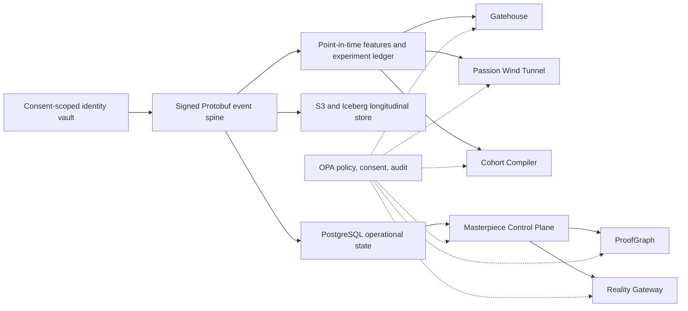

# GT100K Non-Core Systems Proposal

## Product thesis

The morning curriculum already solves instruction. The next platform should control the conditions around instruction: who enters, which pursuit earns a student's voluntary effort, which peers raise that effort, and whether an afternoon project survives contact with real users.

The seven proposals below form one loop:

1. Gatehouse admits against evidence and explicit policy.
2. Passion Wind Tunnel identifies a student's preferred kinds of work.
3. Motivation Rate Limiter controls the dose of external pressure.
4. Causal Cohort Compiler turns peer composition into a measured intervention.
5. Masterpiece Control Plane executes ambitious projects at 100,000-student scale.
6. ProofGraph proves authorship, contribution, and reproducibility.
7. Reality Gateway gives verified work bounded access to real audiences and infrastructure.

These systems build the admissions, motivation, social, and production machinery that the Brainlift treats as the remaining levers. Morning subject instruction remains out of scope.

## Portfolio map

| # | System | Primary lever | Technical center | Four-month proof |
|---|---|---|---|---|
| 1 | Gatehouse | Admissions and intake | Bayesian psychometrics, survival ML, robust scheduling, policy-as-code | Shadow enrollment, adaptive assessment, replayable decision engine |
| 2 | Passion Wind Tunnel | Passion discovery | Bayesian experimental design, causal inference, process mining | Adaptive micro-build pilot with delayed voluntary-return labels |
| 3 | Motivation Rate Limiter | Motivation preservation | Control theory, constrained decisioning, distributed policy enforcement | Pressure-token gateway and model-predictive controller in shadow mode |
| 4 | Causal Cohort Compiler | Peer pressure and rivalry | Causal ML under interference, hypergraph optimization, transactional scheduling | 100,000-student simulation and reversible pilot assignments |
| 5 | Masterpiece Control Plane | AlphaX execution | Event sourcing, reconciliation controllers, durable workflows, secure multi-tenancy | App and documentary adapters on isolated workspaces |
| 6 | ProofGraph | Authentic work | Content-addressed DAGs, signed attestations, WASM verification | Reproducible proof packets and live authorship defenses |
| 7 | Reality Gateway | Consequential output | Progressive delivery, capability security, consent, budget accounting | Controlled releases to an opt-in audience panel |

## Shared architecture

Seven separate databases and identity models would create seven incompatible versions of the student. A thin shared substrate prevents that split while each product retains its own service boundary.



The event envelope carries `event_id`, pseudonymous actor, cohort and project context, event time, intervention source, evidence references, consent scope, and schema version. Services publish through a transactional outbox to Redpanda or Kafka. PostgreSQL owns transactional state; S3 with Iceberg stores longitudinal training data; ClickHouse serves operational analysis; Feast or a small point-in-time feature service prevents training-serving leakage.

Go or Rust services handle gRPC control paths. Python, PyTorch, and Pyro handle models. Temporal owns long-running workflows. EKS, RDS, S3, IAM, Terraform, Docker, Kubernetes, GitHub Actions, Prometheus, Grafana, and OpenTelemetry supply the production layer from the Engineering Matrix. MLflow or Weights & Biases records data, model, and evaluation lineage.

The Matrix needs five additions for this program: causal experimentation, operations research, durable workflow execution, policy-as-code, and content provenance. The proposed stack adds Pyro, OR-Tools or CVXPY, Temporal, OPA/Rego, Sigstore or in-toto attestations, and gVisor or Firecracker isolation.

The identity vault stays separate from analytical identifiers. Each event carries a purpose and retention policy. Models produce estimates with uncertainty. Rego policies own gates, overrides, support guarantees, and appeals. This boundary keeps a model update from changing school policy through a side effect.

## 1. Gatehouse: admissions proof-of-commitment and cognitive boundary control plane

### Problem

Interviews and commitment essays reward rehearsal. A one-shot cognitive score near a hard floor carries test-day noise, item exposure, language effects, and coaching effects. Raw compliance also confuses commitment with stable work hours, broadband, childcare, and household wealth. At 100,000 students, those errors create large false-exclusion and attrition costs.

### Mechanism

Gatehouse combines three independent evidence paths and keeps the admission rule outside all three.

**Family Fidelity Flight Simulator.** A compensated 21-to-28-day shadow enrollment gives the family the actual operating cadence: parent accountability, planning, recovery after a missed obligation, schedule renegotiation, and student-parent coordination. The trial varies equivalent tasks inside declared availability windows. It measures recovery and honest escalation instead of perfect attendance. Server nonces, signed parent and student receipts, artifact hashes, replay detection, and rotating task templates make staged compliance expensive without cameras, emotion recognition, or household-device surveillance.

**Household Commitment Compiler.** Families declare availability intervals and resource constraints rather than employers, diagnoses, or full calendars. An OR-Tools CP-SAT solver compiles duties, devices, recovery windows, and program blocks into a feasible weekly plan. Monte Carlo shock tests add shift changes, outages, caregiver conflicts, and illness. A second optimization finds the smallest support package that restores feasibility, such as a device loan or alternate parent window. The system tests whether the school can make the contract workable before it treats a resource deficit as lack of commitment.

**Cognitive Boundary Calibrator.** A Rust-to-WASM assessment client runs novel baseline problems, a short standardized instruction, near transfer, far transfer, and delayed retention. A multidimensional Bayesian IRT and state-space model estimates a posterior over baseline reasoning, learning rate, transfer, forgetting, and speed-accuracy tradeoff. The adaptive item service selects the next item for information near the chosen boundary. After psychometric validation, policy can require `P(g >= floor | evidence) >= 0.95`; an uncertainty band triggers a new form, accommodation review, or appeal. Mapping `floor` to the Brainlift's proposed IQ 120-to-125 band requires a licensed instrument, a representative calibration sample, and credentialed psychometric review.

The family model starts with an interpretable competing-risk survival model. It estimates withdrawal, persistent obligation breach, and successful recovery under a named support package. OPA/Rego alone emits `ADMIT` after applying the cognitive posterior, family evidence, capacity, support guarantees, uncertainty rules, and appeal status. An append-only decision record stores evidence, model version, policy version, override, and reason code. Staff can replay any prior application under a proposed policy before release.

### Architecture and evaluation

- **Services:** Temporal trial workflow, Go gRPC assessment and decision services, Python/FastAPI model APIs, CP-SAT schedule compiler, OPA/Rego policy service.
- **Data:** Protobuf events through Redpanda, PostgreSQL bitemporal plans and decision ledger, encrypted S3 evidence, MLflow model registry.
- **Matrix anchors:** SQL and transaction isolation, Python and FastAPI, AWS and Terraform, gRPC and Kafka, Kubernetes MLOps, PyTorch, adversarial security, Rust/WASM.
- **Model tests:** posterior coverage and test information near the floor, differential item functioning, test-retest reliability, survival calibration, Brier score, support-treatment uplift, subgroup false-exclusion rate.
- **Selective-label control:** acceptance never becomes the truth label. The ledger stores assignment propensities, keeps predictors in shadow mode, and can support a consented gray-zone capacity lottery if admissions policy authorizes one.
- **System tests:** exact decision replay, duplicate-event rejection, policy regression, four-eyes override, key rotation, and unauthorized feature access.

### Four-month vertical slice

Build one adaptive reasoning domain, a 21-day trial workflow, the schedule compiler, a survival baseline, and a versioned admission policy. Run the models in shadow mode against synthetic families and a small consented pilot. The prototype should prove measurement, replay, and audit behavior. The age-14 outcome remains an unvalidated long-horizon target.

### Portfolio value

Gatehouse combines psychometrics, robust optimization, event-driven systems, high-stakes ML governance, and adversarial testing. Few portfolio projects make the distinction between a statistical estimate and the policy that acts on it visible in code.

## 2. Passion Wind Tunnel: identify drive through controlled choices

### Problem

Surveys capture the interests a child can name. Clicks capture novelty, ease, praise, and interface design. A recommender trained on either signal can lock a student into a topic that produced short sessions while missing the kind of work that draws the student back after failure. Early specialization makes that feedback loop costly.

### Mechanism

The Wind Tunnel runs a capped series of 30-to-90-minute AlphaX micro-builds. Each probe varies domain, work mode, calibrated difficulty, autonomy, audience, collaboration, help friction, and reward. The system observes choices after the requirement ends: voluntary return after 7 or 30 days, an unrequired revision, chosen difficulty, recovery after criticism, and self-authored scope growth. It treats skill and drive as separate latent factors.

For student `i` and domain/work-mode pair `d`, the model maintains

`z(i,d) = [intrinsic drive, skill, novelty half-life, failure recovery, audience elasticity, reward elasticity]`.

A hierarchical Bayesian state-space model predicts delayed voluntary return under a specified condition. Bayesian experimental design selects the next safe probe:

`a* = argmax_a I(z_i ; Y_(t+1) | history_i, a) - lambda * burden(a)`

subject to free-play, exposure, and workload caps. The objective rewards information gain and ignores minutes in the product.

A process-mining sensor adds a domain-independent craft vector. Local Rust/WASM adapters summarize semantic artifact changes from code, documents, storyboards, or experiment logs. They expose coarse transitions such as debugging, modeling, persuading, composing, investigating, and polishing. The model can discover that a student loves a verb across several topics. Coarse semantic changes replace keystroke or screen surveillance.

The cold-start design uses a balanced incomplete block of probes across domains and work modes. A permanent exploration floor prevents a narrow posterior from starving an untested interest. Posterior decay and change-point detection let the student change. The product hides passion scores from rankings and admissions.

### Architecture and evaluation

- **Services:** experiment randomizer, probe registry, artifact-diff adapters, posterior service, and routing API over FastAPI and gRPC.
- **Models:** PyTorch and Pyro hierarchical Bayes, conditional choice baseline, temporal process graph encoder after the baseline wins, inverse-propensity and doubly robust evaluation.
- **Data and serving:** Redpanda, PostgreSQL experiment and consent ledger, S3 artifact snapshots, pgvector for probe similarity, Triton or Ray Serve, Kubernetes, MLflow or W&B.
- **Matrix anchors:** Python, gRPC and Kafka, Kubernetes MLOps, PyTorch and Transformers, vector retrieval, adversarial model evaluation, Rust/WASM.
- **Success tests:** posterior calibration, 6-to-8-week voluntary re-entry, self-generated milestones, blinded artifact depth, exploration coverage, burden consumed, and withdrawal as a guardrail.

Random assignment of eligible probes creates the propensities needed for off-policy evaluation. A pilot compares adaptive discovery with a free-choice or topic-survey baseline. The individual posterior accepts team evidence after a solo extension or explanation sample.

### Four-month vertical slice

Create 24 difficulty-matched probes across four domains and six work modes. Ship the event contract and fixed randomizer in month one, a survival and choice baseline in month two, an information-gain policy in shadow mode in month three, and a small randomized pilot with delayed-return labels in month four.

### Portfolio value

This project demonstrates active learning, causal product instrumentation, Bayesian uncertainty, privacy-aware process mining, and delayed-outcome evaluation. It replaces the standard interest recommender with an experimental system that can state which evidence changed its belief.

## 3. Motivation Rate Limiter: a control plane for pressure and friction

### Problem

Competition, public comparison, deadlines, parent prompts, and taxed help can raise output. The same levers can replace self-propelled work with compliance. An engagement objective will keep increasing the dose because it sees the next session and misses the loss of voluntary return after the pressure stops.

### Mechanism

Each machine-generated deadline, rivalry escalation, public rank, help refusal, or parent nudge must obtain a short-lived `MotivationDoseToken` from a policy gateway. A PostgreSQL pressure ledger records dose, source, reason, expiry, and observed response. The cohort service and Masterpiece controllers cannot mint or bypass tokens.

A coarse latent state tracks self-initiation, recovery after failure, prompt dependence, voluntary return, and project advance. The estimator uses a hierarchical state-space model:

`m_(t+1) = A_i m_t + B_i action_t + E_i workload_t + error_t`

A robust model-predictive controller chooses a short action horizon that maximizes verified artifact advance and later self-initiation while charging a cost for external dose. Hard constraints cap total dose, rate of change, and time without an available help channel. A conditional-value-at-risk constraint blocks plans with excessive downside under model uncertainty. The controller always has a no-intervention action and uses a conservative lower confidence bound. The implementation excludes unconstrained reinforcement learning on children.

Coaches define safe token ranges, veto a decision, and restore help. Students can appeal or request a lower pressure setting. The scope covers platform-generated interventions and excludes diagnosis or claims about the full home environment.

### Architecture and evaluation

- **Control path:** Go or Rust gRPC gateway, idempotent token issuance, TTL enforcement, OPA policies, PostgreSQL ACID ledger, Kafka audit events.
- **Model path:** Python state estimation, CVXPY or OR-Tools controller, model registry, shadow decisions, and counterfactual replay.
- **Operations:** EKS, Terraform, GitHub Actions, Prometheus and Grafana dashboards for dose, override, help availability, and policy violations.
- **Matrix anchors:** relational transactions, low-latency gRPC, event streaming, Kubernetes deployment, MLOps monitoring, and adversarial security.
- **Evaluation:** bounded micro-randomized dose trials, then a cohort-randomized comparison with a fixed-intensity rule. Track artifact advance after incentives taper, voluntary starts, prompt dependence, withdrawal, and volatility.

The policy records underperformance under pressure as safety feedback and prohibits punishment. Solo artifact checks and signed intervention sources protect the progress signal without asking the model to read emotion.

### Four-month vertical slice

Define the dose taxonomy and gateway in month one. Add conservative rule budgets and a simulator in month two. Run the estimator and controller in shadow mode in month three. Month four supports a narrow, consented crossover pilot plus replay, chaos, and audit tests.

### Portfolio value

The Rate Limiter combines distributed policy enforcement, control theory, causal experimentation, and ML safety. It also creates a hard interface between the Brainlift's intensity lever and the requirement to preserve the student's own drive.

## 4. Causal Cohort Compiler: peer effects as a schedulable intervention

### Problem

Static score bands create tiers. Similarity clustering assumes that similar students help one another and ignores direction: student `j` can raise student `i` while `i` has no effect on `j`. Group membership changes all five or six students at once, so ordinary individual-level treatment models also fail.

### Mechanism

The compiler starts inside hard eligibility calipers for advancement velocity, friction tolerance, passion stage, schedule, and intensity. It runs scheduled, reversible sparring swaps between neighboring cohorts. Solo checkpoints before and after each swap identify directed peer effects without treating a shared team artifact as individual progress.

A Set Transformer or Deep Sets model estimates `uplift(i | group)` with uncertainty. The optimizer chooses groups `G` of five or six:

`maximize sum_G [sum_i LCB(uplift(i | G)) - lambda_1 * pace_variance(G) - lambda_2 * churn(G) - lambda_3 * repeated_pairs(G)]`

subject to one assignment per student, time-zone and accommodation constraints, safety separations, MotivationDoseToken limits, bounded weekly churn, and a non-harm lower bound for each member. A max-min term prevents the solver from manufacturing a weak cohort to improve the average.

At 100,000 students, the compiler avoids an all-pairs search. Pgvector or HNSW generates candidates inside age, pace, and time-zone shards. Parallel CP-SAT workers solve each shard. A min-cost-flow boundary pass places leftovers. PostgreSQL `SERIALIZABLE` commits prevent double placement; a prior snapshot gives instant rollback. Kafka triggers full compiles and incremental repairs through a Go gRPC assignment service.

### Evaluation and failure controls

- **Causal design:** randomize neighbor swaps inside narrow calipers; preserve an exploration holdout; use cluster-level analysis that accounts for network interference.
- **Primary outcomes:** solo advancement velocity, idle or wait time, cohort persistence, voluntary effort after competition, and withdrawal.
- **Feedback-loop controls:** no visible tier names, posterior bands rather than point ranks, scheduled promotion probes, pair-repeat caps, churn budgets, and coach or student appeal.
- **Anti-gaming:** hidden solo calibration, ProofGraph contribution attribution, individual defenses, and residual-correlation alerts for answer sharing or sandbagging. Alerts route to review.
- **Matrix anchors:** PostgreSQL and isolation, Python and PyTorch, gRPC and Kafka, Kubernetes and autoscaling, vector search, Prometheus/Grafana. OR-Tools and causal inference extend the Matrix.

### Four-month vertical slice

Month one builds event contracts, a population simulator, and a rule-based sharded matcher. Month two adds candidate generation, CP-SAT assignment, transactional commit, and rollback. Month three trains the peer-effect estimator on randomized synthetic swaps and runs it in shadow mode. Month four supports a small reversible pilot plus a 100,000-student load and failure test. A credible demo should compile 17,000 to 20,000 cohorts in minutes and repair a single vacancy in seconds.

### Portfolio value

The compiler joins causal inference under interference, hypergraph optimization, approximate nearest-neighbor search, and transaction-safe distributed scheduling. The result has more engineering depth than a clustering notebook and a tighter link to the Brainlift's peer thesis.

## 5. Masterpiece Control Plane: declarative execution for AlphaX

### Problem

An app, documentary, research claim, startup experiment, and robotics build use different tools and evidence. Human coordinators lack the capacity to schedule their compute, equipment, reviews, dependencies, and risk checks for 100,000 students. A generic task board also lets activity masquerade as progress.

### Mechanism

The platform uses a Kubernetes-style reconciliation loop. A student and coach declare a versioned desired state:

```text
MasterpieceSpec {
  domain_kind
  target_contract
  cohort_id
  milestone_dag
  prerequisite_evidence[]
  risk_class
  resource_budget
  assistance_budget
}

MilestoneContract {
  input_schema
  artifact_type
  verifier_ref
  pass_threshold
  retry_policy
}
```

Controllers compare desired state with signed evidence and emit the next eligible transition. Domain adapters compile software into build, test, security, and deployment contracts; documentary work into source, rights, edit, review, and export contracts; research into preregistration, data, analysis, and reproduction contracts; physical projects into CAD, bill-of-materials, firmware, and sensor-test contracts. Agents built with LangGraph can propose a DAG or critique a milestone. Temporal owns durable execution, and a student or named reviewer owns approval.

Project Registry, contract compiler, reconciliation controllers, workflow runner, artifact service, verifier farm, policy service, and resource broker communicate through Protobuf and gRPC. Redpanda carries state transitions. PostgreSQL stores authoritative state and materialized views. Each transition uses an idempotency key and references an artifact hash plus verifier version.

The resource broker applies dominant-resource fairness across CPU, GPU, render, storage, lab time, equipment, and expert-review minutes. CP-SAT handles equipment and time windows. Every grant is a TTL-bound `ResourceLease`; PostgreSQL serializable reservations prevent double booking. This turns scarce AlphaX capacity into a measured scheduler instead of a queue controlled by staff attention.

Untrusted code and media decoders run in isolated EKS namespaces with gVisor or Firecracker, default-deny networking, ephemeral workload identity, read-only base images, signed containers, quota-bound egress, and OPA policy. A scoped MCP server can expose Git, storage, build, dataset, or reservation tools. Capability tokens limit each agent and student workspace to the declared project.

### Reliability target

- 99.9% control-plane availability.
- p95 event-to-reconciliation under two seconds.
- p95 warm workspace launch under 45 seconds.
- No resource grant outside an atomic reservation.
- 10,000 events per second in a synthetic load run.
- Temporal retries and compensation, transactional outbox, dead-letter queues, checkpointed workspaces, expired-lease reclamation, and fail-closed policy checks.

**Matrix anchors:** SQL, AWS and Terraform, gRPC and Kafka, Docker and Kubernetes, agentic workflows, MCP, adversarial AI security, Rust/WASM verifiers. Temporal, OPA, Firecracker, and dominant-resource fairness extend the Matrix.

### Four-month vertical slice

Weeks 1 to 4 build event schemas, the registry, and controller runtime. Weeks 5 to 8 add isolated workspaces and the software adapter. Weeks 9 to 12 add the resource broker and documentary adapter. Weeks 13 to 16 run load, chaos, recovery, and cross-tenant security tests against 100 live and 10,000 simulated projects.

### Portfolio value

This project contains a custom scheduler, event sourcing, workflow reconciliation, zero-trust multi-tenancy, gRPC/Kafka services, and infrastructure as code. The same control plane can execute work across code, film, science, and physical builds without reducing those domains to a common checklist.

## 6. ProofGraph: proof-carrying artifacts and contribution lineage

### Problem

Reviewers cannot infer from a polished final artifact who made it, which failed attempts shaped it, how much AI or mentor help entered, or whether another person can reproduce the result. At AlphaX scale, outcome-only review rewards outsourcing and presentation skill.

### Mechanism

ProofGraph stores a content-addressed DAG with node types `Artifact`, `Attempt`, `Transformation`, `Claim`, `Assistance`, `Review`, and `Outcome`. Edges include `derived_from`, `authored_by`, `used_tool`, `validates`, and `contradicts`. Each node carries an artifact hash, author signature, toolchain or container version, model version where AI participated, inputs, cohort, and timestamp.

Each milestone produces a signed proof packet:

- artifact and source hashes;
- lineage and failed branches;
- reproducible run manifest;
- verifier output and version;
- contribution map for each teammate;
- assistance ledger with permitted accommodations separated from substitutive help;
- external outcome tied to an exact release.

The Brainlift's help tax becomes an auditable policy. A verifier score can receive an independence adjustment based on declared help level, while the raw artifact score remains intact. The system rewards honest declaration and keeps accessibility support outside the penalty.

Objective checks run as WASI plug-ins with no ambient network or filesystem. Software adapters rerun builds, tests, security checks, and benchmarks. Research adapters rerun a frozen analysis against a data snapshot. Documentary adapters verify source and edit lineage, rights, and export metadata before blinded review. Physical adapters bind CAD, firmware, and signed sensor runs.

Novelty or discontinuity models can select work for review. The review policy bars models from accusation or rejection. A sampled authorship defense asks the student to explain a decision from the private trace, modify one component, or reconstruct a small step. Human reviewers use anchored rubrics, and repeated anchor items estimate reviewer severity.

### Architecture and evaluation

- **Storage:** PostgreSQL recursive CTEs and JSONB, S3 Object Lock, blob-first commit with orphan reconciliation, signed Merkle checkpoints.
- **Services:** Rust or Go gRPC ingestion, canonicalizer, attestation signer, verifier farm, attribution service, audit API, and proof-packet renderer.
- **Security:** envelope encryption per student or project, Sigstore or in-toto-style attestations, OPA, WASM verifier sandbox, replay protection, and key destruction for privacy deletion while nonidentifying hashes remain.
- **Matrix anchors:** database internals, gRPC/Kafka, cloud and Kubernetes, MCP interfaces, adversarial security, Rust/WASM.
- **Targets:** p99 attestation ingest under 500 ms, 99.99% acknowledged-event durability, proof packet under 60 seconds for non-render work, and at least 95% reproduction for jobs declared hermetic.

### Four-month vertical slice

Build Git/CI and documentary-edit lineage adapters, four WASM verifiers, signed proof packets, team attribution, and a live defense workflow. Test tampering, replay, nondeterministic verification, poisoned artifacts, and deletion on a 50-team pilot.

### Portfolio value

ProofGraph applies software supply-chain security, reproducible builds, cryptographic provenance, and sandboxed plug-ins to human authorship. It gives the portfolio a systems-security core and answers the hardest operational question created by strong generative tools: whether the student owns the work and can defend it.

## 7. Reality Gateway: bounded exposure to real users and stakes

### Problem

A masterpiece needs users, viewers, judges, measurements, or replication. Public release by 100,000 minors also creates uncontrolled ingress, data collection, spending, external API access, and contact risk. A school can avoid those risks by keeping projects inside a demo environment, but that removes the consequence that makes AlphaX different.

### Mechanism

Every release moves through declared exposure rings:

`hermetic simulation -> cohort/rival review -> opt-in school panel -> bounded external sandbox -> public`

The gateway issues a short-lived `ExposureLease` that fixes audience, traffic, data, API, spend, and duration limits. Each `ReleaseCandidate` must name its success metric, stopping rule, artifact attestation, requested exposure, consent basis, and rollback target before it receives traffic.

The control plane includes an artifact-admission service, consent service, OPA risk policy, Envoy audience router, deployment controller, capability broker, budget ledger, outcome service, and independent kill switch. Token buckets and atomic reservations govern traffic, compute, paid APIs, screening slots, and spend. Apps receive canary traffic through Argo Rollouts. Films receive an opt-in screening audience with consent-scoped telemetry. Research projects receive preregistered benchmark or replication jobs. Physical builds receive signed test-window leases.

The public plane has no route into a student workspace. Signed builds cross an admission boundary into separate runtime accounts and namespaces. The gateway applies WAF rules, default-deny egress, scoped secrets, data minimization, per-project budgets, and immutable audit. A named human role approves high-risk rings and mints public exposure. Classifiers can flag a release for review.

Outcomes bind to the exact artifact hash, audience, lease, consent scope, and policy version. An app can claim retained users or reliability only for traffic the gateway observed. A documentary can claim audience recall only from the declared blinded panel. A research result can claim replication only from the frozen protocol and run. ProofGraph stores each outcome edge.

### Reliability target

- 99.95% audience routing availability.
- Emergency lease revocation under five seconds at p99.
- No request admitted without a valid local lease.
- Spend overshoot limited to one reserved atomic unit.
- Telemetry loss below 0.1%.
- Policy, consent, and audit outages fail closed; cached lease expiry works at the sidecar; circuit breakers stop external APIs; canaries roll back on declared limits.

**Matrix anchors and stack:** AWS EKS, RDS, S3 and CloudFront, Terraform, Argo Rollouts, Envoy or Istio, OPA, PostgreSQL, Redpanda, GitHub Actions, Prometheus/Grafana, OpenTelemetry, WAF, and the Matrix's adversarial-security pipeline.

### Four-month vertical slice

Release containerized apps through three rings to a 200-person opt-in panel. Run documentary screenings through the same consent and outcome plane. Support one quota-bound external API, then chaos-test revocation, rollback, budget races, audit loss, and cross-project access.

### Portfolio value

Reality Gateway unifies progressive delivery, zero-trust capabilities, consent, quota accounting, experimentation, and SRE. It turns a student artifact into a production system with attributable external results while keeping release authority outside the student sandbox.

## Four-month product recommendation

A single team should choose a subset; seven production systems exceed a sixteen-week sprint.

The strongest portfolio build is the AlphaX chain: Masterpiece Control Plane, a thin ProofGraph, and the first three Reality Gateway rings. These systems share the same artifact, lease, policy, and event models. They produce a live demonstration without waiting years for labels, and they cover backend, distributed systems, MLOps, security, agents, and SRE.

| Sprint phase | Deliverable |
|---|---|
| Weeks 1-3 | Protobuf contracts, identity and consent boundary, PostgreSQL state, Redpanda spine, Terraform/EKS, CI/CD, observability |
| Weeks 4-8 | Project registry, Temporal workflows, reconciliation controller, isolated software workspaces, resource leases |
| Weeks 9-12 | ProofGraph ingestion, signed proof packets, WASM verifiers, contribution and assistance lineage |
| Weeks 13-16 | Opt-in release ring, audience routing, budget and kill switches, chaos/load/red-team suite, measured public demo |

The strongest research-ML build is Passion Wind Tunnel plus Motivation Rate Limiter plus the simulator for Causal Cohort Compiler. It can show randomized instrumentation, posterior updates, constrained control, and large-scale optimization. It should label all learned policies as shadow or pilot policies until delayed outcomes accumulate.

Gatehouse deserves a separate admissions sprint because psychometric validation, consent, appeals, and selective-label correction carry more risk than a product feature. Its first release should establish the evidence ledger and decision boundary, then collect prospective data before any learned score changes admissions.

## Source basis

This proposal uses `gtBrainlift.md` for the educational and operating thesis and `impactful.md` for the engineering matrix. The proposed systems require the added architecture technologies.
