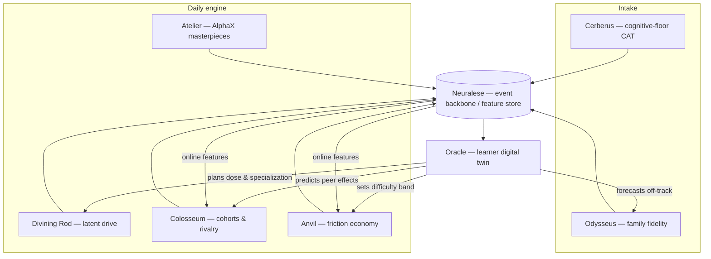

# The Non-Core Levers: An Architectural Proposal for 100k → MIT

**Author's framing.** The Brainlift's core claim is that pedagogy is solved and the *binding constraints are dose, environment totality, peer composition, and cognitive ceiling.* That means the highest-leverage engineering in this school is **not** the tutor. It is the machinery that **selects the right families, finds each child's vein of obsession, engineers rivalrous cohorts, prices friction so shortcuts are worthless, and lets 8th-graders ship real work** — all at a population of 100,000.

So the "non-core" levers are not peripheral. **They are the product.** This document proposes seven portfolio-defining systems (plus the distributed backbone they sit on), each one a direct mechanization of a Spiky Point of View (SPOV) from the Brainlift, and each mapped explicitly to the Engineering Matrix.

> **How to read this.** Every proposal follows the same three-part contract you asked for:
> **(1)** the pedagogical/operational problem, **(2)** the architectural mechanism + tech stack (with `[Matrix #n]` tags), **(3)** why it is a standout, elite portfolio addition. I also include the *signals* each system consumes, its *hard parts / failure modes*, and *research anchors*, because "technically rigorous" means naming the failure you're designing against.

### Matrix legend (referenced throughout)

`#1` PostgreSQL/SQL · `#2` async Python/FastAPI · `#3` AWS + Terraform IaC · `#4` gRPC/Protobuf/Kafka·Redpanda (Go/Rust) · `#5` Docker/K8s/CI-CD/Prometheus/Grafana/Triton (MLOps) · `#6` PyTorch/HF/Transformers · `#7` RAG (LangChain/LlamaIndex, Qdrant/pgvector, Ragas/TruLens) · `#8` PEFT/LoRA/QLoRA · `#9` LangGraph/CrewAI agents · `#10` MCP (FastMCP/SSE/JSON-RPC) · `#11` Adversarial-AI security (OWASP-LLM, Llama Guard, NeMo Guardrails) · `#12` WASM/C++/Rust/SIMD

### The proposals at a glance

| # | System (codename) | SPOV lever it mechanizes | Focus area | Headline matrix items |
|---|---|---|---|---|
| 0 | **Neuralese** — the learning-event backbone | all (the nervous system) | Infrastructure | `#1 #3 #4 #5 #12` |
| 1 | **Cerberus** — cognitive-floor admissions | SPOV 2 (real IQ floor, drawn low) | Admissions & Intake | `#6 #8 #12 #4 #11` |
| 2 | **Odysseus** — family-fidelity engine | SPOV 1 (select the family) | Admissions & Intake | `#1 #6 #9 #11 #12` |
| 3 | **Divining Rod** — latent-drive discovery | SPOV 4 (specialize brutally early) | Passion Discovery | `#6 #4 #9 #12` |
| 4 | **Colosseum** — dynamic cohort orchestration | SPOV 3 (homogeneous rivalry) | Cohort Orchestration | `#4 #6 #9 #12` |
| 5 | **Anvil** — the friction economy | SPOV 5 (make help hurt) | Cross-cutting | `#1 #11 #9 #10 #12` |
| 6 | **Atelier** — the AlphaX masterpiece platform | project block / real artifacts | AlphaX / Masterpiece | `#9 #10 #7 #5 #3 #12` |
| 7 | **Oracle** — the learner digital twin | dose + totality + ceiling | Cross-cutting brain | `#6 #8 #5 #9 #10` |

---

## Proposal 0 — "Neuralese": the 100k-scale learning-event backbone

*The connective tissue. Every other system is a producer or consumer on this spine. Build a thin slice of it first; it is itself a top-tier systems-engineering portfolio piece.*

### 1. The problem
Seven ML systems that each invent their own storage, features, and serving will drift out of sync and never reach 100k. Admissions scores, mastery events, engagement slopes, fold-risk, and cohort ratings are all the **same student's timeline** viewed differently. You need one **append-only source of truth** with **point-in-time-correct features** (so training labels never leak the future) and a **sub-millisecond interactive path** (so a tutor turn or a matchmaking decision is instant).

### 2. Architecture & stack
- **MasteryLog — event-sourced spine.** Every keystroke, answer, help-request, and gate-pass is an immutable Protobuf event on **Kafka/Redpanda** `[#4]`, partitioned by `student_id`, with a schema registry and **exactly-once** semantics. Event sourcing + **CQRS**: the log is truth; read-models are projections. gRPC ingestion achieves sub-ms serialization `[#4]`.
- **FeatureWeave — feature store with online/offline parity.** Streaming aggregations (Flink / Kafka-Streams, or RisingWave) compute features (mastery, engagement-slope, fold-risk, rating) once, served online for inference and materialized offline for training with **point-in-time correctness** (Feast/Chronon/Michelangelo lineage) `[#2 #5]`.
- **CohortDB — the relational core.** **PostgreSQL** `[#1]` for students/families/cohorts/mastery-graph with careful indexing and `SERIALIZABLE`/row-locked state for high-concurrency writes; **TimescaleDB** for telemetry; **pgvector** for embeddings (item difficulty, taste, mentor match) `[#7]`.
- **TutorMesh — serving.** **Triton on K8s** `[#5]` with HPA on Prometheus metrics, canary/shadow deploys, and drift monitoring to Grafana.
- **ProctorWASM — deterministic edge.** A **Rust→WASM+SIMD** `[#12]` client captures deterministic timing/scoring and emits an HMAC-chained event stream that replays exactly server-side.
- **Everything provisioned by Terraform** across multi-AZ with least-privilege IAM `[#3]`, zero-downtime GitOps via GitHub Actions `[#5]`.

### 3. Why it's portfolio-defining
This is the exact "high-throughput telemetry ingestion → Kafka → real-time features → monitored live endpoints" system that Matrix items `#3–#5` describe, but with a genuinely hard twist most portfolios never show: **event sourcing + point-in-time feature correctness + deterministic WASM replay.** It's the difference between "I used Kafka once" and "I designed the correctness guarantees of a 100k-user ML platform."

---

## Proposal 1 — "Cerberus": the coaching-resistant cognitive-floor admissions engine

> **SPOV 2 — there is a real floor, and we draw it a full SD *below* the gifted line (~IQ 120–125).** The lower, deliberately-chosen bar is *harder* to measure than the gifted bar, because we are classifying at a boundary an obsessive parent will spend a year drilling.

### 1. The problem
You must decide "above/below the floor" for 100,000 applicants — many of them 6-year-olds — **cheaply, defensibly, and against adversarial coaching.** Two facts dominate: (a) because it's a *floor*, you only need razor-sharp precision **at the cut point**, not everywhere; (b) fluid *g* is only measured by **novel** problems — the instant an item is memorizable, it stops measuring reasoning and starts measuring drill. A static item bank is dead on arrival: it leaks, and siblings inherit the answer key.

### 2. Architecture & stack
A closed loop: **generate → calibrate-a-priori → deliver adaptively at the boundary → forensically monitor → auto-retire & regenerate.**

- **Generative Item Factory.** A procedural rule-grammar emits infinite figural-matrix items (relations × objects × attributes, per the Raven/PGM/I-RAVEN lineage), with distractors built by an **Attribute Bisection Tree** so context-blind guessing sits at chance. `[#6]` PyTorch generator; `[#11]` guardrails (Llama Guard/NeMo) if an LLM sits in the generation loop, to prevent answer-key or prompt leakage.
- **Zero-pretest calibration.** Predict each item's difficulty *before* it's ever administered from its structural "radicals" via an **explanatory-IRT / LLTM** head plus a Transformer difficulty regressor over the symbolic structure `[#6]`; **LoRA** adapts the regressor cheaply per age-band `[#8]`; **pgvector** nearest-neighbor priors over item-structure embeddings `[#7]`. This kills the single biggest cost of testing at scale (human pretesting).
- **Boundary-CAT delivery.** Computerized Adaptive Testing with **2PL/3PL IRT**, EAP/MAP θ estimation, and — the key inversion borrowed from CAT-ASVAB — **item selection that maximizes Fisher information at the cutoff θ\***, not at the person. ~15–20 adaptively chosen items yield a confident pass/fail. Exposure control operates on **generative families/radicals, not items** (a-stratification + Sympson–Hetter conditional caps), so a family that drills one form gains nothing. `[#2]` async FastAPI CAT engine; `[#4]` gRPC item push + Kafka telemetry; `[#1]` Postgres item-family bank with `SERIALIZABLE` θ-state.
- **Deterministic WASM client.** A **Rust→WASM+SIMD** `[#12]` renderer draws each seeded item and captures millisecond response-time telemetry that replays identically server-side.
- **Self-healing forensics.** Joint accuracy+response-time scoring (van der Linden hierarchical lognormal-RT) + **DG-LNRT preknowledge detection** + person-fit flags catch "too fast *and* correct for the item's predicted difficulty," *conditioned on θ* so genuinely fast able kids aren't punished. When a family's empirical difficulty diverges from its LLTM prior → **auto-retire and regenerate that family** (leakage self-heals). `[#4]` Go/Rust stream consumers; `[#6]` mixture/anomaly models; `[#11]` adversarial layer.
- **Agentic red-team.** A **LangGraph/CrewAI** `[#9]` "coached applicant" agent (memorize distractors, drill families) continuously stress-tests the forensics and quantifies coaching-induced θ inflation, feeding item redesign.

**Signals:** correctness, per-item response time, θ trajectory, family-exposure counters, focus/blur, pointer cadence.
**Hard parts:** LLTM residual (R≈.9, not 1) injects calibration error into θ that must be *propagated* into the SE, not hidden; capitalization-on-chance in very short child tests; RT-model misfit for 6–8-year-olds; telemetry consent for minors.
**Anchors:** Carpenter et al. 1990; Barrett et al. (PGM, 2018); Hu et al. (I-RAVEN, 2021); Fischer LLTM 1973; Embretson 1998; van der Linden (RT-IRT, 2006–07); Chang & Ying (a-stratification, 1999); Kasli et al. (DG-LNRT, 2023).

### 3. Why it's portfolio-defining
It fuses **psychometrics + generative ML + a distributed low-latency delivery system + adversarial security** into one self-healing loop. The crown jewel is the **generative-factory ↔ forensics symbiosis**: the same structure that makes items unmemorizable *also* becomes the security system that detects and heals leakage. This is a genuine research contribution wearing a systems-engineering exterior — the kind of project that makes an interviewer stop and ask how it works.

---

## Proposal 2 — "Odysseus": the 8-year family-fidelity engine

> **SPOV 1 — select the family, not the child.** The variance that predicts elite outcomes lives in the far tail of parental obsession. You must **predict 8-year household commitment at intake** and **detect defection early** — with no 8-year labels to train on, against families incentivized to fake commitment.

### 1. The problem
Three brutal constraints: **(a) cold-start** — you cannot wait 8 years for a label; **(b) informative (MNAR) censoring** — families that are folding *stop logging*, so silence is signal; **(c) strategic agents** — admissions is adversarial, so cheap self-report is worthless. Named after Odysseus tying himself to the mast: the design *manufactures* commitment and its own ground truth.

### 2. Architecture & stack
- **CommitLedger — commitment device as screen *and* label factory.** A menu of ramping, loss-framed **escrow/deposit contracts** (denominated in *effort and time*, not just money, to avoid selecting for wealth), with self-chosen milestones and anti-charity forfeiture. Mechanism-design goal: a **separating equilibrium** (revelation principle) where low-commitment families self-select *out*, and adherence telemetry becomes the **early observable proxy label** that dissolves cold-start. `[#1]` a double-entry **ACID ledger** in Postgres; `[#4]` append-only adherence log on Kafka; `[#12]` a **Rust/WASM** tamper-evident client signer.
- **FoldHazard — dynamic competing-risks survival.** Discrete-time deep survival on a monthly landmark grid (0–96 months) with cause-specific hazards (voluntary withdrawal, contract breach, "social-pressure fold," relocation shock). A **Dynamic-DeepHit**-style temporal encoder `[#6]` — no proportional-hazards assumption — ensembled with a landmarking + gradient-boosted baseline for calibration. Missingness modeled explicitly (log-gaps as features, IPCW) because censoring is informative.
- **ParentPsychometrics — trait scoring from language.** A **QLoRA-fine-tuned** open LLM `[#8]` scores conscientiousness, grit, locus of control, and social-pressure susceptibility from interviews/essays, using **forced-choice Thurstonian-IRT** elicitation to blunt faking and **cross-round NLI stance-consistency** to flag coached narratives. **RAG over a psychometric rubric** (pgvector + Ragas) keeps every score grounded and auditable `[#7]`; `[#11]` prompt-injection guardrails on submitted essays.
- **FoldWatch — streaming early-warning agent.** **ADWIN / Page-Hinkley** change-point detectors on engagement and comms-latency streams fire warning states; a **LangGraph** agent `[#9]` pulls features via **MCP tools** `[#10]`, re-scores hazard, drafts a tailored check-in, and *escalates to a human counselor* (mandatory), logging the outcome as fresh training signal.
- **GameShield — strategic robustness.** Model families as best-responding agents (Stackelberg); train a **strategically-robust classifier** that hard-separates *gameable self-report* from *costly revealed-preference* signals (actual forfeitures, timestamped daily logs). Immutable audit log + per-decision Shapley attributions + disparate-impact monitoring `[#11 #1 #5]`.

**Signals:** structured home-visit data, daily engagement logs, comms-response latency, sibling behavior, commitment-device adherence cadence, interview transcripts.
**Hard parts:** ethics/coercion with minors; escrow must not become a wealth filter; **performativity** (the intervention changes the outcome it predicts); demographic language bias.
**Anchors:** Ashraf, Karlan & Yin (SEED, 2006); StickK; Laibson 1997; DeepHit / Dynamic-DeepHit (Lee 2018–19); Brown & Maydeu-Olivares (Thurstonian forced-choice, 2011); ADWIN (Bifet & Gavaldà 2007); Hardt et al. (strategic classification, 2016); Perdomo et al. (performative prediction, 2020).

### 3. Why it's portfolio-defining
**CommitLedger is the signature idea in the whole document:** it fuses behavioral-economics *mechanism design* with ML *label generation*. The escrow simultaneously self-selects committed families **and** manufactures the early ground-truth that makes an 8-year survival model trainable *today* — a cold-start problem no pure-ML approach can touch. Pair it with a real competing-risks deep-survival model and a strategic-robustness layer and you have something no CRM/churn clone resembles.

---

## Proposal 3 — "Divining Rod": the latent-drive discovery engine

> **SPOV 4 — specialize brutally early and burn breadth.** But an 8-year-old can't tell you what they'll obsess over, and self-report is noise. You must **find the vein of obsession from behavior, commit fast, and not lock in prematurely or kill the drive by naming it too soon.**

### 1. The problem
Reframe "find what a child loves" as **online, per-student, fixed-confidence best-arm identification of the domain with the steepest *voluntary-engagement slope*** — under drift, with a causal commitment gate. Two reframes make this non-generic: the objective is **engagement slope and self-initiated depth, not clicks or accuracy**; and we want **pure exploration that certifies then commits**, not endless recommendation.

### 2. Architecture & stack
- **SLOPE-BAI — engagement-slope best-arm identification.** Arms = specialization domains. A **NeuralUCB / Neural-TS** reward model `[#6]` predicts the *slope* of voluntary time-on-task; a **Track-and-Stop (Chernoff GLR)** rule samples domains in the optimal proportions and **stops with a PAC guarantee** when the obsession-vein is certified — fast commit, bounded error. `[#4]` Kafka/Protobuf telemetry bus; `[#2]` FastAPI decision endpoint; `[#5]` Triton + Prometheus slope-drift dashboards.
- **FLOWPRINT — flow vs. novelty decomposition.** Fit an **Intrinsic Curiosity Module (ICM)** or **Random Network Distillation (RND)** to the *student's own* behavior stream. The novelty is a **two-timescale test**: RND's novelty bonus *decays* with exposure, so **genuine drive = engagement that persists after the novelty fades while competence rises (flow)**; mere novelty-seeking collapses. `[#12]` Rust/WASM+SIMD on-device featurization of dwell/scroll/keystroke micro-behavior; `[#8]` LoRA per-cohort behavior predictors.
- **DRIVE-UPLIFT-GATE — causal commit decision.** Before committing, estimate the **CATE of exposure on engagement-slope** with an **X-learner / causal forest** — does domain X *cause* rising intrinsic drive, or is this just a compliant kid? Evaluate candidate curricula on logged exploration data with **doubly-robust off-policy evaluation**; commit via **explore-then-commit optimal stopping** with regret bounds `[#6 #2]`.
- **EMBER-SCAN — anti-lock-in.** Model each domain as a **restless bandit**; schedule cheap background re-checks of dormant domains via **Whittle-index** priorities so a smoldering interest can reignite. `[#9]` a LangGraph orchestrator sequences exposures; `[#10]` MCP exposes the activity catalog as tools.

**Signals:** voluntary return latency, self-initiated (unassigned) depth, dwell-weighted transitions, persistence-after-failure *per domain* — never raw clicks.
**Hard parts:** engagement "time" is gameable (cap with attention/quality gating); short-horizon slope is noisy; unobserved confounding and positivity in the causal gate; the ICM "noisy-TV" trap (RND mitigates).
**Anchors:** NeuralUCB (Zhou et al. 2020); Track-and-Stop (Garivier & Kaufmann 2016); ICM (Pathak et al. 2017); RND (Burda et al. 2018); SASRec/BERT4Rec; X-learner (Künzel et al. 2019); doubly-robust OPE (Dudík et al. 2011); Whittle index (Whittle 1988).

### 3. Why it's portfolio-defining
It throws out the ed-tech "interest quiz" and the CTR objective and replaces them with **pure-exploration bandits on engagement slope + a causal off-policy commitment gate + a flow-vs-novelty detector.** That combination — bandits, causal ML, and optimal stopping, all on a streaming stack — is rare anywhere, let alone in education, and it directly operationalizes "find the vein fast and commit."

---

## Proposal 4 — "Colosseum": dynamic cohort orchestration & rivalry engineering

> **SPOV 3 — homogeneous grouping is the biggest lever in the building.** Form ~17,000–20,000 rivalrous cohorts of 5–6, matched on ability *and pace*, and **re-form them continuously** as students clear 90% gates at different speeds — engineering rivalry while refusing to demoralize anyone into permanent last place.

### 1. The problem
Two coupled optimizations at 100k scale. **(a) Instant formation:** partition students into homogeneous, close-contest cells — an NP-hard balanced-partition problem. **(b) Online re-formation:** students clear gates asynchronously, so assignment is a *continuous stochastic re-matching* problem, not a one-time solve. And naïve homogeneous grouping *maximizes* the **Big-Fish-Little-Pond** harm (being the weakest in a strong pod crushes self-concept), so the objective must actively counter it. Correct mental model: **esports matchmaking + distributed graph sharding**, not classroom scheduling.

### 2. Architecture & stack
- **CorrPart — formation.** Embed each student (per-skill mastery, pace = d(mastery)/dt, forgetting curve, error signature). Build a signed "should-compete" graph, run **correlation clustering** to surface natural homogeneous communities, then cut them into balanced cells of 5–6 with **Social Hash Partitioner / Balanced Label Propagation** under hard capacity/diversity constraints. Metaheuristics (simulated annealing/genetic) polish *only inside local super-clusters*. `[#4]` Go/Rust partitioner; `[#12]` Rust/SIMD distance kernels; `[#6]` PyTorch embeddings; `[#1]` Postgres feature store.
- **UncertMatch — rating + matchmaking.** Per-skill **Glicko-2 / OpenSkill / TrueSkill2** ratings (μ, σ); a "good match" = high predicted draw probability = close contest. **Invert EOMM** (the esports engagement-optimized matcher): solve a min-weight perfect matching where edge weight encodes *rivalry value minus demoralization risk*, with a **hard "no permanent last place" constraint** that rotates the underdog rather than fixing it. `[#2 #6 #5]`.
- **CohortTwin — simulate before you commit.** The intellectual keystone: before committing a partition, **simulate its emergent dynamics** with a **network linear-in-means peer-effects model** (identified via Bramoullé intransitivity instruments to beat Manski's reflection problem) or a **GNN** predicting each student's trajectory *conditioned on cohort composition*. Score K candidate partitions on predicted advancement minus demoralization variance; take the argmax. `[#6]` GNN/causal model; `[#9]` a LangGraph loop: propose → simulate → score → select; `[#11]` sandbagging robustness.
- **StreamReCo — online re-matching.** Kafka `GatePassed` events `[#4]` feed an online stochastic max-weight bipartite matcher that uses **prophet-inequality / OCRS thresholds** for the *hold-vs-place* decision (wait for a better-matched peer to arrive, or place now?), with **hysteresis** to prevent cohort thrash and incremental subgraph re-solves. Provable competitive ratios.
- **NemesisBoard — rivalry surface.** Real-time leaderboards on **Redis sorted-sets** `[#4]`, each student shown their "+1σ ghost" (a just-ahead rival), with **multiple axes** (mastery, improvement-velocity, streak) so everyone leads on at least one — structurally defusing permanent-last demoralization.

**Signals:** per-skill mastery + pace, rating (μ,σ), gate-pass events, predicted last-place probability.
**Hard parts:** peer-effect **non-identification** biases the twin; sim-to-real gap; thrash/oscillation and remainder starvation (odd counts) in re-matching; Goodhart on draw-rate.
**Anchors:** TrueSkill2 (Minka et al. 2018); OpenSkill (Weng & Lin 2011); EOMM (Chen et al. 2017); Social Hash Partitioner (VLDB 2017); correlation clustering (Cao et al. 2023); prophet/OCRS online matching (Ezra et al. 2020); Bramoullé et al. 2009; Big-Fish-Little-Pond (Marsh & Hau 2003).

### 3. Why it's portfolio-defining
It pairs a **causal-ML brain (CohortTwin)** — counterfactual composition search that no esports or ed-tech system runs — with a **streaming-optimization spine (StreamReCo)** that recasts re-cohorting as a rigorously analyzed online algorithm with competitive-ratio guarantees, delivered over low-latency gRPC/Redpanda at 100k. That's two distinct, deep, hard things in one system.

---

## Proposal 5 — "Anvil": the friction economy (help-tax + answer-blind Socratic tutor)

> **SPOV 5 — friction is the product; make help hurt to reach for.** The system must **price cognitive offloading** so shortcutting is *mathematically worthless*, and the Socratic tutor must be *unable* to leak answers even under adversarial pressure from obsessive kids and parents.

### 1. The problem
"Make help hurt" is a **mechanism-design** problem, not a detection problem — and content-based AI-cheating detectors are known to collapse under paraphrase and to false-positive on non-native writers, so you cannot lean on them. You must (a) make the *payoff math* dominate cheating, and (b) build a tutor that **structurally cannot** emit the answer.

### 2. Architecture & stack
- **RescueTax — decayed-ELO help-tax, proven incentive-compatible.** Each mastery gate is a **Bradley-Terry contest** (student θ vs item difficulty); the ELO update is SGD on the BT likelihood. Any answer taken after an AI rescue gets a **multiplicative decay λ^k** on its ELO gain *and* must post a **confidence bond scored by a strictly proper scoring rule** (log/quadratic), making honest uncertainty reporting dominant-strategy incentive-compatible. Calibrate λ so that for all θ, `E[struggle → retry] > E[rescue → decayed]` → **shortcutting is a strictly dominated strategy.** For label-free artifacts, use **Bayesian Truth Serum**; audit with verification-minimal random cutoffs. `[#1]` an event-sourced rating/currency ledger in Postgres; `[#2]` async FastAPI scoring; `[#6]` BKT/IRT mastery inference.
- **ASSET — answer-blind, self-hardening Socratic tutor.** The information-theoretic core: **the tutor never holds the answer.** A *quarantined* Socratic LLM sees only a misconception rubric; a *privileged* grader holds the answer and never emits free text (dual-LLM pattern). Defense-in-depth: **Prompt Guard → instruction-hierarchy-tuned tutor → NeMo Guardrails/Colang dialog rails → a semantic answer-proximity output rail** that blocks any generation within ε of the sealed answer embedding. `[#11]` Llama Guard 3 + NeMo + OWASP-LLM Top-10; `[#8]` a LoRA-tuned leakage-judge + hint-rewriter; `[#7]` a *privileged* RAG store used only for judging, never generation; `[#10]` MCP tool isolation.
- **Continuous red-team → Vulnerability Risk Score.** A **LangGraph/CrewAI** swarm `[#9]` runs **PAIR/TAP-style** jailbreaks nightly, logging attack-success-rate → a **per-skill-node VRS**; successful jailbreaks auto-become **DPO training data + Colang regression tests** (a self-hardening curriculum). `[#5]` Prometheus/Grafana VRS dashboards.
- **CLPL — cognitive-load provenance (the trust backbone).** A **Rust/WASM enclave** `[#12]` signs a hash-chained keystroke/edit stream (Ed25519, RFC-3161 timestamp, C2PA-style manifest). The novel core is **Cognitive-Load Correlation**: genuine composition *entangles* pause length with the complexity of the *following* token; copy-typing an AI draft produces flat CLC. Periodic **in-band challenge-response** forces live regeneration of a redacted span. `[#4]` Protobuf keystroke frames over Kafka.

**Signals:** θ, item difficulty, attempts-before-help, hint depth, post-rescue flags, inter-keystroke intervals, pause-vs-complexity correlation, jailbreak attack traces.
**Hard parts:** the *copy-type attack* (a human transcribing an AI draft yields authentic motor signatures) — beatable only by challenge-response + multi-session consistency, never timing alone; miscalibrated λ re-opening a cheat corridor (continuously re-fit); over-refusal harming pedagogy (tune ε per node).
**Anchors:** Elo-as-SGD-on-Bradley-Terry (Pelánek 2016); proper scoring rules (Gneiting & Raftery 2007); Bayesian Truth Serum (Prelec 2004); instruction hierarchy (Wallace et al. 2024); dual-LLM pattern; RAID (Dugan et al. 2024); Cognitive-Load Correlation / keystroke non-identifiability (2026 preprints).

### 3. Why it's portfolio-defining
Two things the market most wants to see, in one system: **rigorous incentive design** (a proof that cheating is a dominated strategy) and **rigorous adversarial hardening** (an *information-theoretic* jailbreak defense with a measurable, self-improving VRS loop). "I built a guardrail where *refusing to help is the correct behavior*, and proved shortcutting is mathematically worthless" is a sentence that ends interviews.

---

## Proposal 6 — "Atelier": the AlphaX masterpiece platform

> **The afternoon block.** 100,000 students building real startups, apps, documentaries, and Olympic-level projects. The hard problems are **coaching without doing, grading the ungradeable, letting kids ship real production systems, and proving a child — not an AI — did elite work.**

### 1. The problem
You cannot staff 100k human PMs; agents must scaffold ambition while withholding the answer. Creative/technical artifacts have **no gold label**, yet grades gate futures, so scoring must be reproducible and appeal-proof. Student agents wielding repos/compute/datasets are a live prompt-injection and cost-abuse surface. And with AI everywhere, **authorship must be cryptographically attested, not assumed.**

### 2. Architecture & stack
- **Coaching supervisor graph.** A **LangGraph** hierarchical supervisor `[#9]` decomposes each ambition into a persisted milestone DAG and routes to specialist subgraphs (Researcher / PM / Critic / Socratic-Coach / RedTeam). A **Friction Governor** node structurally rejects any output that constitutes a *deliverable* (compiling code for the feature, finished prose) — workers may emit only questions, critiques, references, and scaffolds. **MentorMatch** embeds each milestone (**pgvector**) against expert profiles for a staked, **Gale-Shapley-stable** human-mentor marketplace `[#7 #1]`.
- **ToolForge — per-student scoped MCP fabric.** Each student gets an isolated **FastMCP** server (SSE/JSON-RPC) `[#10]` exposing scoped tools (git, datasets, compute, design APIs) behind a security gateway with **capability-budgeted, progressively-scoped OAuth tokens** and a per-student compute/$ ledger; tool descriptions are hash-pinned and scanned every call to defeat tool-poisoning. `[#11]` OWASP-MCP Top-10 defenses; `[#3]` Terraform-provisioned backends.
- **TripleJudge — defensible open-ended evaluation.** Rubrics compiled into **locked, versioned bundles**; structured decoding forces **verbatim evidence quotes** per criterion (scores capped when evidence is missing); a **cross-family jury-of-judges** votes; **Wasserstein post-hoc calibration** aligns outputs to human score distributions; **Ragas/TruLens** ground research artifacts `[#7]`. A **staked peer-review market** supplies cheap signal and calibration data; high-variance cases auto-escalate to humans (target Cohen's κ ≥ 0.6). `[#6]` cross-encoders; `[#8]` LoRA per-domain calibration head + a Streamlit rubric studio.
- **ShipYard — real production deployment.** Per-project **vCluster** virtual clusters on a shared node pool, provisioned by **Terraform + GitHub Actions** `[#3 #5]`, autoscaled on **Karpenter spot**, isolated by `RuntimeClass` (gVisor / Kata / Firecracker), with live wildcard endpoints, per-namespace Prometheus/Grafana, hard **cost budgets + TTL/idle reapers**, and **Triton** serving student ML models. Kids ship *real* systems, safely.
- **Provenance Spine — authorship & integrity ledger.** Every commit gets an **in-toto/DSSE attestation** (model, prompt/skill hashes, human-share, approver) signed into an append-only hash chain ("C2PA for code"). **Zero-knowledge process attestation** proves keystroke/edit behavior falls in human distributions *without exposing biometrics*; media artifacts carry **C2PA**. The computed **human-authorship ratio** feeds TripleJudge. `[#12]` Rust/WASM signer + SIMD hashing + ZK circuits; `[#4]` Kafka event spine.

**Signals:** milestone-DAG state, commit velocity/diffs, artifact-vs-rubric evidence gaps, tool-call traces, budget burn, peer-review verdicts, provenance ratio.
**Hard parts:** the coach "helpfully" doing the work (Friction Governor + adversarial eval); LLM-judge position/verbosity/self-preference bias (order rotation, length-normalization, cross-family jury); cost runaway and crypto-mining abuse in ShipYard (quotas + gVisor + egress policy); false-positive authorship penalties on legitimately AI-assisted work (attest the *ratio*, not a binary).
**Anchors:** LangGraph supervisor/`Send` map-reduce; OWASP-MCP Top-10; RULERS (locked rubrics + Wasserstein calibration); Ragas/TruLens RAG-triad; in-toto/DSSE/Sigstore; C2PA 2.2; ZK proof-of-process (2026 preprints); CNCF Agent Sandbox / vCluster / Karpenter.

### 3. Why it's portfolio-defining
**TripleJudge** and the **Provenance Spine** solve the venture's existential credibility question — *"how do we know an 8th-grader really produced MIT-level work?"* — the first as **reproducible, calibrated, appeal-proof grading of creative work** (the hardest unsolved problem in ed-tech), the second by converting integrity from an honor code into a **cryptographic + zero-knowledge proof.** Around them, ToolForge and ShipYard are exactly the MCP-infrastructure `[#10]` and containerized-deployment `[#5]` showpieces the Matrix prizes.

---

## Proposal 7 — "Oracle": the learner digital twin & talent-trajectory engine

> **The brain that ties it together.** Dose, environment totality, and the cognitive ceiling are the constraints the Brainlift says still bind. Oracle models each learner as a **long-horizon dynamical system**, simulates interventions *before* applying them, and forecasts the SAT-1570-by-14 trajectory so the whole platform can plan against the ceiling instead of guessing.

### 1. The problem
Every other system makes *local* decisions (this item, this cohort, this domain). Someone has to answer the *global, long-horizon* question: **given this child's state, what sequence of dose, cohort, specialization, and friction gets them to 1570 by 14 — and which ones burn them out?** You want to try interventions on a *simulation* before spending eight years of a real childhood on them.

### 2. Architecture & stack
- **NeuroCDE-Twin — continuous-time state model.** A **Neural CDE / latent SDE** `[#6]` carries a continuous latent state (knowledge + motivation + fatigue) that updates on irregularly-timed events, with an **attention-based knowledge-tracing (AKT)** emission head and **LoRA** per-student personalization `[#8]`. (Note the frontier is moving to Mamba/S4-style length-generalizing KT for multi-year sequences — worth benchmarking for the emission head.)
- **Twin-Dreamer — plan on the simulation.** A **model-based RL planner** (DreamerV3/MuZero-style) rolls out candidate intervention sequences *inside* the twin and picks the policy that maximizes durable mastery under a hard no-burnout constraint — **gated by doubly-robust off-policy evaluation** so we "simulate before applying" and never ship a policy the logged data can't support `[#6 #5]`.
- **TrajFormer + DeepHit — long-horizon forecasting.** A transformer over multi-year multimodal event streams plus a competing-risks **survival** head forecasts P(SAT-1570-by-14) and fires **off-track early-warnings** with calibrated lead time `[#6]`.
- **DoseSense + Parent-MCP — the totalizing environment.** Ethical, consented home-dose sensing (study cadence, screen-time, parent engagement) as covariates, plus a **parent-facing MCP agent** `[#10 #9]` that coaches the household to maximize dose. An **HLR++/DASH** spaced-retrieval forgetting-curve engine schedules retrieval so over-drilled automaticity doesn't rot (the SPOV-2 mechanism and the "90% mastery gating" guardrail, made quantitative).
- Served on **Triton/K8s** with drift monitoring `[#5]`, fed by Neuralese `[#4 #1]`.

**Signals:** the entire learning event stream, mastery/motivation/fatigue estimates, home-dose covariates, forgetting-curve decay, cohort and friction history.
**Hard parts:** identifiability and confounding in the causal planner; sim-to-real gap in the twin; 8-year non-stationarity and drift; privacy/consent of home sensing (hard ethical + engineering boundary).
**Anchors:** Neural CDE (Kidger et al. 2020); AKT (Ghosh et al. 2020); DreamerV3 (Hafner et al., 2025); MuZero; doubly-robust OPE; Duolingo HLR (Settles & Meeder 2016); DeepHit (Lee et al. 2018).

### 3. Why it's portfolio-defining
A **counterfactual world-model of a human learner** — "simulate the intervention before you spend a childhood on it" — with causal OPE gating and long-horizon survival forecasting is a research-grade ML-systems artifact. It also functions as the platform's central brain: admissions priors, cohort peer-effects, passion signals, and friction telemetry all resolve into one twin that plans against the ceiling.

---

## How it composes — one platform, one flywheel

These are not seven apps; they are one **totalizing environment engine.** Signals compound: admissions data seeds the twin; the twin's state feeds cohorting and passion discovery; the friction economy and AlphaX emit the richest behavioral signal of all, which sharpens every upstream model.

**The flywheel:** better selection (1,2) → cleaner cohorts (4) and truer passion signal (3) → more productive friction (5) and more ambitious masterpieces (6) → richer telemetry on Neuralese (0) → a sharper twin (7) → better decisions everywhere. Each turn improves the next.

## A 4-month sprint sequencing

You cannot build all eight to production in one sprint, and you shouldn't try. Recommended order, each stage a shippable, demoable portfolio artifact:

1. **Weeks 1–3 — Neuralese thin slice (Proposal 0).** Kafka/Redpanda + Protobuf schema + Postgres/pgvector + a Triton "hello-world" endpoint on K8s via Terraform. Everything else plugs in here.
2. **Weeks 3–6 — Cerberus MVP (Proposal 1).** Generative item factory + Boundary-CAT + WASM client. Highest novelty-to-effort ratio; fully self-contained; instantly demoable.
3. **Weeks 5–9 — Anvil (Proposal 5).** RescueTax ledger + ASSET answer-blind tutor + a red-team VRS dashboard. The clearest "incentive-design + adversarial-security" showcase.
4. **Weeks 7–11 — Colosseum (Proposal 4).** CohortTwin simulator + StreamReCo online matcher on live Kafka gate-events.
5. **Weeks 9–13 — Divining Rod (Proposal 3)** and **Odysseus (Proposal 2)** in parallel (bandit/causal track + survival/mechanism-design track).
6. **Weeks 11–16 — Atelier (Proposal 6)** and **Oracle (Proposal 7)** as the capstones: MCP fabric + TripleJudge + Provenance Spine, and the digital-twin planner drawing on all accumulated telemetry.

## A note on measurement integrity and the guardrails

The Brainlift is deliberately spiky, and several of these systems make high-stakes decisions about children. That raises the engineering bar rather than lowering it. Three commitments are baked into the designs above, not bolted on:

- **Auditability by construction** — append-only ledgers, per-decision attributions (Shapley), immutable rubric bundles, and model cards, so every gate/score/assignment is defensible.
- **Fairness vs. costly-signal tension is explicit** — commitment devices are effort/time-denominated (not wealth), cohorts carry a hard anti-demoralization constraint, and screening watches disparate impact.
- **Humans hold the escalations** — FoldWatch, TripleJudge's high-variance cases, and any admissions rejection route to a human. The models triage and predict; they do not autonomously expel a family or a child.

These are consistent with the Brainlift's own guardrails: optimize for students who thrive at full intensity, route others into excellent ordinary schooling, and gate mastery at 90% so automaticity never rots into gaps.
