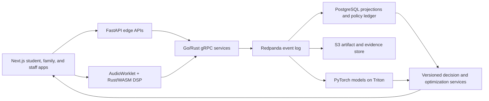

# Proposal 3: The Operating System Around the Two-Hour School

The morning curriculum sits outside this proposal. These seven systems control admission, specialization, peer composition, and the production of AlphaX masterpieces. Together they form one portfolio platform built for 100,000 students rather than a collection of ed-tech features.

## Shared technical spine

Each module should publish typed events into the same platform:



- **Application layer:** Next.js and TypeScript for student, parent, mentor, and operator surfaces; FastAPI for public APIs; Go or Rust for high-throughput services.
- **Data layer:** Protobuf contracts, bidirectional gRPC, Redpanda partitions keyed by student or cohort, PostgreSQL for transactional state, pgvector or Qdrant for artifact embeddings, and S3 for large media.
- **ML and operations:** PyTorch and Hugging Face, Triton Inference Server, Docker, Kubernetes on AWS EKS, Terraform, GitHub Actions, Prometheus, and Grafana.
- **Scale posture:** A workload of 100,000 students can generate tens of millions of small events per day. The event log absorbs bursts, PostgreSQL projections serve product queries, and S3 holds immutable payloads without turning the relational database into a media archive.

## 1. Covenant Ledger: a behavioral family-commitment compiler

### Problem solved

An intake interview rewards persuasive families. A questionnaire rewards families who know the expected answers. Neither reveals whether a household will execute a demanding routine after a missed day, a schedule collision, or a difficult child response. Admissions needs longitudinal evidence of follow-through and a way to enforce the commitments after enrollment.

### Architectural mechanism and stack

Run a 21-day **commitment gauntlet** before the admissions decision. Each family selects real availability windows, completes short daily operating tasks, attends two handoffs, responds to a planned disruption, and writes a recovery plan after one induced miss. The product measures execution against the family's declared plan rather than against a wealthy household's schedule.

The backend treats the contract as a service-level objective:

- An append-only PostgreSQL ledger stores obligation versions, acknowledgements, completion latency, reschedules, recovery actions, and staff overrides under serializable transactions.
- FastAPI receives family actions. Go gRPC workers validate signatures and publish `CommitmentEvent` messages to Redpanda. A hash chain makes later editing visible.
- A PyTorch discrete-time survival model estimates first-90-day withdrawal risk. A hidden-state sequence model separates a recoverable miss from a pattern of avoidance. The model must expose calibration, confidence, and the features used for each estimate.
- A deterministic policy service applies the program's rules: admit, extend the gauntlet, request a human review, or decline. After enrollment, the same ledger drives a graduated recovery workflow before any seat review.
- Grafana tracks calibration error, abstention rate, caregiver-structure slices, and prediction drift. The team trains and deploys the model through the Docker, Kubernetes, GitHub Actions, and Triton path from Matrix sections 5 and 6.

The model should never consume accent, facial expression, income proxies, or a generic personality score. It predicts execution from observed execution. Time-split validation, Brier score, expected calibration error, and subgroup false-decline rates provide a defensible evaluation suite.

### Portfolio proof

This module combines an ACID contract ledger, event sourcing, time-to-event ML, calibrated abstention, and policy-as-code. A live demo can replay a month of household events, explain a risk update, survive duplicate and out-of-order messages, and show that an operator can reproduce the exact rule and model version behind a decision. That is a much stronger systems artifact than a form plus classifier.

## 2. FloorGate: a sequential cognitive-floor and test-integrity network

### Problem solved

A fixed exam wastes candidate time near the extremes, leaks items at scale, and converts measurement noise into hard admissions errors. Remote testing also introduces device latency, item exposure, and replay fraud. The program needs a cognitive floor with an uncertainty band, consistent enforcement, and a record that can withstand an appeal.

### Architectural mechanism and stack

Build a computerized adaptive assessment around multidimensional item-response theory. The engine maintains a posterior over the target cognitive factors and selects the next item by expected information gain. A sequential probability rule ends the test when either condition holds:

```text
P(ability > configured floor | evidence) >= pass threshold
P(ability > configured floor | evidence) <= decline threshold
```

Candidates inside the uncertainty band receive a parallel-form retest or psychometric review. The product does not manufacture precision from a borderline score.

- A Rust/WASM assessment runtime controls monotonic timing, local encryption, offline recovery, and SIMD scoring of visual or auditory sequence items without blocking the browser thread.
- Web Audio and AudioWorklet schedule tone-sequence items against a calibrated local clock. The runtime records stimulus and response timing, while device-quality checks prevent comparisons across unreliable audio paths.
- A Go item service uses gRPC and Protobuf to assemble forms, enforce exposure limits, rotate item families, and stream signed attempt events into Redpanda.
- PostgreSQL stores the item bank, parameter versions, accommodation rules, posterior snapshots, and immutable decisions. Row-level access rules separate psychometric content from ordinary staff access.
- Python, NumPy, and PyTorch fit the response and response-time models. Differential item functioning tests flag items whose behavior changes across approved accessibility and demographic slices.
- Kubernetes serves the scoring model through Triton. Prometheus reports item exposure, posterior convergence, retest disagreement, and tail latency.

The decision service uses a configured psychometric conversion for the program's floor. It never infers ability from voice, webcam behavior, or family commitment. Admissions staff receive the posterior interval, applied rule, accommodations, and appeal path.

### Portfolio proof

FloorGate demonstrates Bayesian/sequential decision systems, psychometrics, browser-level systems work, DSP timing, and distributed test security. The strongest demo runs 100,000 simulated candidates, proves that easy and hard cases stop early, keeps false decisions inside a declared risk budget, and reproduces one candidate's decision from the event log byte for byte.

## 3. DriveScope: a counterfactual passion observatory

### Problem solved

Children report the interests that adults praise, choose activities where they already look competent, and mistake novelty for durable drive. A single survey cannot separate curiosity, status seeking, peer belonging, and willingness to return after failure. Early specialization needs evidence from behavior while preserving student choice.

### Architectural mechanism and stack

Give each student a six-week market of short **probe quests** across production modes: building, investigation, performance, persuasion, visual storytelling, and physical practice. A constrained contextual bandit chooses the next set of offers to maximize information gain. The student still chooses from that set, and an exposure constraint prevents the bandit from narrowing the search too soon.

DriveScope models revealed preference through signals such as voluntary return, unprompted work, artifact revision, recovery after frustration, and requests for a harder constraint. A switching state-space model estimates a posterior over drive dimensions rather than assigning one career label. The posterior includes uncertainty and competing explanations, such as high social affinity with weak solo persistence.

- Next.js presents quest offers, a private evidence timeline, and controls that let the student dispute or hide a signal.
- FastAPI and Redpanda capture offer, choice, work, pause, return, and revision events. PostgreSQL holds consent and experiment assignments; pgvector stores artifact and reflection embeddings.
- PyTorch trains the latent sequence model. A Thompson-sampling service balances information gain, student agency, and minimum domain exposure.
- Optional voice reflections run through an AudioWorklet and a Rust/WASM DSP module. It computes within-student speech rate, pause structure, pitch range, and vocal-energy change, then discards raw audio unless the student saves it. The model uses no universal emotion labels and excludes these features from admissions.
- Hugging Face embeddings encode the content of consented reflections. Offline evaluation uses inverse-propensity scoring and replay so the team can compare bandit policies before deployment.

The product reports a **drive signature**: conditions under which the student returns, the work form that sustains effort, evidence for each inference, and the next experiment that would reduce uncertainty.

### Portfolio proof

This system shows contextual bandits, latent-state modeling, multimodal feature engineering, on-device DSP, and uncertainty-aware UX. The portfolio demo can replay the same student under two exploration policies and show why a survey-based label would have collapsed a mixed drive profile into the wrong specialization.

## 4. Motive MPC: a constrained controller for preserving obsession

### Problem solved

Once a student specializes, a fixed dose can turn obsession into compliance. Staff often notice the decline after missed sessions and weak artifacts appear. A click-maximizing recommender would make the problem worse because attention, output, and durable motivation are different targets.

### Architectural mechanism and stack

Treat motivation maintenance as a partially observed control problem. A temporal PyTorch model estimates a student's short and medium-horizon disengagement hazard from voluntary work starts, revision depth, abandoned branches, recovery time, mentor interactions, and the within-person acoustic features from DriveScope.

A model-predictive controller chooses among bounded operational levers:

- grant a choice window or a self-directed sprint;
- schedule a peer duel, mentor critique, public audience, or recovery block;
- reduce interruption load or change the student's project role.

The objective rewards voluntary re-engagement and artifact progress. It penalizes intervention count, schedule churn, and interruption of long flow sessions. Hard constraints cap prompts, protect rest windows, and bar manipulative streak mechanics.

LangGraph runs the intervention workflow as a typed state machine. One node assembles evidence, one estimates causal uplift for eligible actions, and a policy node checks consent and staff rules. Pydantic state, PostgreSQL persistence, and an immutable action ledger prevent agent loops from changing a schedule without authorization. Staff approve high-impact changes; low-risk actions can run inside a pre-approved envelope.

The team should use randomized micro-trials and within-student crossover designs to learn action effects. Grafana separates model prediction quality from treatment lift, while a shadow policy compares the controller against the current staff policy.

### Portfolio proof

Motive MPC moves beyond recommendation into causal ML, control theory, and stateful agent orchestration. The demo should show the controller declining an action with high predicted engagement because it violates the interruption budget, then choosing a lower-intensity action with better estimated long-term lift. That behavior proves the system optimizes a product goal rather than clicks.

## 5. CohortGraph: a dynamic micro-cohort compiler

### Problem solved

Grouping five or six students by one test score creates hidden mismatches in pace, competitive appetite, schedule, and specialization. Static rosters preserve bad matches because moving one student creates four new holes. At 100,000 students, staff cannot solve the coupled assignment problem by hand.

### Architectural mechanism and stack

Represent students and prior interactions as a temporal graph. A PyTorch edge model estimates pairwise learning lift, challenge reciprocity, withdrawal risk, and pace mismatch. The optimizer then assembles size-five or size-six hyperedges under explicit constraints.

For each candidate cohort, the compiler scores:

```text
pace cohesion + specialization affinity + predicted rivalry lift
+ AlphaX role coverage - schedule conflict - churn cost - safeguarding risk
```

Pace bands remain a hard constraint for the morning model. AlphaX role coverage can add complementary production skills inside that band. Guardian rules, no-pair constraints, time zones, accessibility needs, and a weekly roster-change budget also act as hard constraints.

- A Rust or Go matching service receives typed student-state snapshots over gRPC.
- Python/PyTorch trains graph embeddings and edge-lift models. An integer-programming or min-cost-flow layer converts predictions into auditable assignments.
- The system shards 100,000 students by schedule, pace band, and specialization, solves each region, then runs a boundary-repair pass. Redpanda publishes roster proposals and PostgreSQL commits accepted rosters in one transaction.
- A counterfactual simulator replays historical weeks against candidate policies. Operators can inspect the factors, constraints, and displaced alternatives for each proposed move.
- Kubernetes runs batch solves and a smaller online repair service for absences. Prometheus tracks solve time, infeasible shards, roster churn, and observed versus predicted cohort lift.

### Portfolio proof

CohortGraph joins graph ML with operations research and distributed scheduling. A strong benchmark assigns 100,000 synthetic students in minutes, honors every hard constraint, limits weekly churn, and improves a held-out peer-lift objective against score-only grouping. The explainable solver layer also shows mature judgment about where neural predictions should end and deterministic policy should begin.

## 6. RivalryMix: a real-time acoustic interaction engine

### Problem solved

A cohort can post good aggregate scores while one student dominates, two students disengage, and nobody challenges a weak claim. Staff see the pattern only when they observe the full session. Remote and hybrid cohorts also lose the tempo that makes rivalry productive.

### Architectural mechanism and stack

Build a WebRTC session fabric with a live **interaction mix board**. Each participant's AudioWorklet sends 10-to-20 ms frames into a Rust/WASM ring buffer. SIMD kernels compute voice activity, log-mel energy, pitch tracks, spectral flux, clipping, and noise measures. The client emits compact feature packets; raw audio stays on the call path unless the cohort records the session with consent.

The session service aligns participant clocks and constructs a temporal turn graph from speech starts, overlaps, response latency, talk-time entropy, question-answer pairs, and challenge-response chains. A PyTorch temporal graph model classifies observable session states such as domination, stalled exchange, reciprocal challenge, or fragmented turn-taking. It does not claim to detect emotion, honesty, or personality from a voice.

- WebRTC carries media. A DataChannel or gateway forwards Protobuf feature frames to Rust aggregators over bidirectional gRPC.
- Redpanda partitions events by session. Rust workers maintain hot state in memory and flush summaries to PostgreSQL.
- Hugging Face embeddings add semantic evidence from consented transcripts, such as whether a response addresses the prior claim or repeats it.
- Next.js renders the mix board at 60 FPS. A coach can trigger a rotating challenger, timed cross-examination, silent-member entry, or evidence round.
- Prometheus measures feature-to-screen latency, clock skew, dropped frames, and false session alerts. Kubernetes scales aggregators by concurrent rooms.

At 20,000 possible five-person cohorts, on-device feature extraction keeps central bandwidth and audio retention under control. The system can run a private student view during a session and reserve aggregate analytics for staff review.

### Portfolio proof

RivalryMix is a visible DSP and distributed-systems centerpiece. It combines AudioWorklet scheduling, Rust/WASM SIMD, WebRTC, streaming gRPC, temporal graph ML, and a high-frame-rate interface. The demo can inject packet loss and background noise, keep the board responsive, and show a turn graph that an evaluator can verify against a short recorded test fixture.

## 7. AlphaX Foundry: an evidence-graph build and launch fabric

### Problem solved

Students building startups, apps, documentaries, research, or competition entries need a production system rather than an LMS. Staff must see dependencies and blocked decisions across unlike projects. External judges need proof of authorship and iteration. AI tools add a second problem: a polished artifact can hide whether the student made the key decisions.

### Architectural mechanism and stack

Model each masterpiece as a typed dependency DAG backed by an append-only evidence graph. A project claim, such as “users will pay,” “the service handles 1,000 requests per second,” or “the final mix meets broadcast loudness,” must point to evidence with an author, timestamp, artifact hash, test, and reviewer.

Project adapters turn domain work into the same evidence contract:

- **Software:** commits, architecture decisions, tests, load results, deployments, and incidents.
- **Startup:** interview clips, hypothesis versions, experiment cohorts, conversion data, and pricing decisions.
- **Documentary or audio:** source licenses, edit decisions, stems, transcript revisions, loudness reports, and final renders.
- **Competition work:** practice logs, sensor traces, submitted versions, judge feedback, and rule checks.

The architecture uses Matrix sections 7 through 12 as one coherent system:

- Custom FastMCP servers expose Git, project files, test runners, media metadata, and deployment state through scoped JSON-RPC or SSE tools. Per-project ACLs and token budgets prevent an agent from reading another student's work.
- A LangGraph “studio producer” checks dependency state, requests missing evidence, routes a mentor review, and stops at approval gates. It cannot mark its own generated text as student evidence.
- A RAG service indexes project decisions, mentor feedback, rubrics, and source material in pgvector or Qdrant. Ragas or TruLens scores retrieval precision and citation support on a fixed evaluation set.
- PostgreSQL stores project state and review transactions. S3 stores content-addressed artifacts; Redpanda carries build, review, render, and launch events.
- Documentary teams receive a browser studio built with Rust/WASM DSP: waveform tiles, spectrograms, LUFS measurement, silence and clipping detection, and deterministic local previews. Kubernetes render workers handle final media jobs.
- Llama Guard or NeMo Guardrails protects agent gateways. An adversarial CI job fuzzes MCP permissions, indirect prompt injection, cross-project retrieval, and evidence spoofing before deployment.
- Terraform provisions private EKS workloads, RDS, S3, IAM roles, and network boundaries. GitHub Actions builds containers, runs tests and red-team suites, and performs zero-downtime rollout with Prometheus-driven autoscaling.

The public launch page reads from signed evidence projections. A reviewer can move from a final claim to the experiment, source clip, commit, or test that supports it without receiving access to private working material.

### Portfolio proof

AlphaX Foundry integrates full-stack product engineering, RAG evaluation, agent state machines, MCP security, provenance, media DSP, and cloud infrastructure. The flagship demo should take one project from proposal through failed test, mentor critique, revision, production deployment, and public evidence page. A red-team run should prove that a malicious project document cannot make the agent expose another student's files or certify unsupported work.

## Four-month portfolio cut

Seven production systems would exceed a four-month sprint. Build one shared event platform and ship vertical slices in this order:

| Month | Deliverable | Proof target |
|---|---|---|
| 1 | Protobuf event contracts, Redpanda, PostgreSQL projections, identity/consent, Terraform, CI/CD; Covenant Ledger and FloorGate simulators | Deterministic replay and auditable admission decisions |
| 2 | DriveScope probe marketplace and Motive MPC shadow policy | Offline bandit replay, calibrated latent state, constrained action demo |
| 3 | CohortGraph batch compiler plus RivalryMix live room | 100,000-student solve and sub-150 ms interaction telemetry |
| 4 | AlphaX Foundry evidence graph, MCP tools, RAG evaluation, media DSP, red-team suite | End-to-end masterpiece launch with provenance and security evidence |

The sprint should claim portfolio-grade scale tests and decision reproducibility, not production validation with children. Production use requires validated assessments, accessibility review, informed consent, retention controls, subgroup audits, and a human appeal path. Raw audio should remain ephemeral by default, and no acoustic feature should influence admission or discipline.

