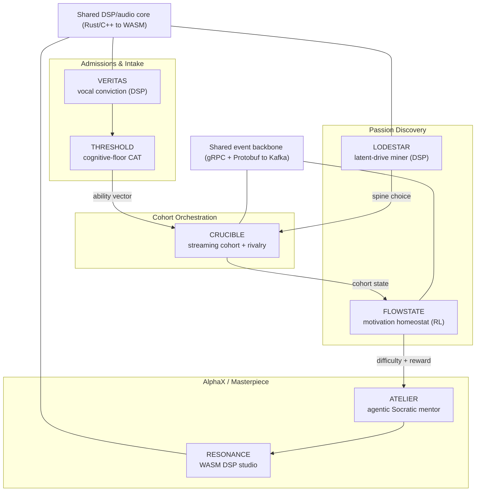

# Non-Core Architecture Proposals — The Levers That Make the Model Scale

**Author role:** Systems Architect & AI Product Manager
**Sprint:** 4-month portfolio-defining build
**Scope:** The *non-core* architecture only. The 2-hour adaptive morning curriculum is assumed solved. We are building the machinery around it — intake, passion discovery, cohort orchestration, and the AlphaX/Masterpiece afternoon block.
**Engineering thesis to showcase:** modern full-stack, applied ML, and DSP/audio engineering, backed by the elite stacks in the Engineering Matrix (referenced inline as `Matrix #n`).

---

## Design lens: mapping the philosophy to engineering levers

The Brainlift argues that pedagogy is a dead lever and that the live levers are **dose, environment totality, peer composition, and cognitive ceiling**. Every proposal below is an engineering instrument on one of those levers, and each one operationalizes at least one Spiky POV.

| Brainlift lever (SPOV) | Non-core area | Engineering instrument |
|---|---|---|
| Select the family (SPOV 1) | Admissions & Intake | `VERITAS` — vocal conviction analyzer |
| Cognitive floor (SPOV 2) | Admissions & Intake | `THRESHOLD` — adaptive floor CAT engine |
| Specialize early / burn breadth (SPOV 4) | Passion Discovery | `LODESTAR` — latent-drive signal miner |
| Friction is the product (SPOV 5) | Passion Discovery | `FLOWSTATE` — motivation homeostat (RL) |
| Homogeneous grouping (SPOV 3) | Cohort Orchestration | `CRUCIBLE` — streaming cohort + rivalry engine |
| Masterpiece / real output | AlphaX Infrastructure | `RESONANCE` — browser-native DSP studio |
| Socratic friction at scale (SPOV 5) | AlphaX Infrastructure | `ATELIER` — agentic Socratic production pipeline |

Three of the seven (`VERITAS`, `LODESTAR`, `RESONANCE`) are DSP/audio-first. The rest are heavy full-stack + applied ML with distributed-systems and MLOps spines. Together they cover 11 of the 12 Matrix tiers.

---

## 1. `VERITAS` — Vocal Conviction & Commitment Analyzer

**Area:** Admissions & Intake Engine · **Operationalizes:** SPOV 1 (select the family)
**One-liner:** A from-scratch DSP pipeline + multimodal Transformer that scores *paralinguistic conviction* in family intake interviews, because self-reported commitment is worthless and every applicant family will say the right words.

### 1. The problem it solves
SPOV 1 is the whole intake thesis: admit the *family*, screen for the fanatical, TV-free, parent-on-the-hook-daily home, and predict "who folds the moment relatives and the school board start howling about a stolen childhood." At 100,000 applicants this cannot be a founder's gut read over a coffee. And the signal we actually want — genuine, durable conviction versus socially-desirable performance — is exactly the signal a questionnaire cannot capture, because the words are trivially gameable. What is *not* trivially gameable is the involuntary paralinguistic layer of speech: pitch dynamics, micro-tremor, and hesitation structure under high-stakes commitment questions.

### 2. Architecture & tech stack
A structured, multi-session async video interview feeds a two-branch model.

- **DSP feature front-end (from scratch, `Matrix #12`).** A Rust/C++ core compiled to WASM via Emscripten, SIMD-optimized, runs the acoustic feature extraction *client-side on the family's device* so raw audio never has to leave the home (privacy-first, and a cleaner consent story). It computes the classic affective-prosodic feature stack rather than calling a library:
  - STFT with Hann windowing → mel-filterbank → MFCCs + deltas
  - F0 / pitch tracking via autocorrelation (YIN/pYIN), voiced/unvoiced gating
  - **Jitter** (cycle-to-cycle F0 perturbation), **shimmer** (amplitude perturbation), **HNR** (harmonics-to-noise ratio) — established vocal-stress and affect markers
  - Energy contour, spectral centroid/flux/tilt, speaking rate via syllable-nucleus detection, and pause-duration distributions
  This is essentially a hand-built eGeMAPS-style descriptor set, streamed as a compact per-frame tensor.
- **Fusion model (`Matrix #6`).** A custom PyTorch Transformer over the framewise acoustic sequence (multi-head self-attention + positional encodings implemented explicitly), fused with a text branch (Whisper transcription → embeddings) to detect *incongruence* — where the semantic content asserts high commitment but the prosody signals stress/evasion on the specific high-stakes items ("what will you tell relatives who say you're stealing his childhood?"). Trained with W&B tracking on loss convergence and calibration.
- **Serving & portal (`Matrix #2`, `#5`).** FastAPI async inference behind a Next.js intake portal; Dockerized model on K8s with liveness/readiness probes and drift monitoring on the acoustic feature distribution (accents, mic hardware, and language drift will move the input manifold and must be watched).
- **Responsible-AI wrapper (`Matrix #11`).** This is a high-stakes, bias-prone signal, so it ships as **decision-support only, human-in-the-loop**, with per-demographic fairness auditing, confidence gating, and an adversarial red-team suite probing for accent/gender bias and coaching attacks. That guardrail layer is not a compliance afterthought; it *is* part of the portfolio story.

### 3. Why it is a standout portfolio piece
Almost nobody ships a hand-rolled, SIMD-optimized DSP feature extractor that cross-compiles to WASM *and* feeds a from-scratch multimodal Transformer *and* wraps the whole thing in a fairness/adversarial harness. It simultaneously proves hardware-level DSP mastery (`#12`), deep-learning fundamentals (`#6`), privacy-first full-stack (`#2`, `#5`), and Responsible-AI maturity (`#11`) — four tiers in one coherent artifact.

**4-month cut:** ship the WASM DSP extractor + a 3-question conviction demo on a labeled proxy dataset (public emotional-speech corpora for the acoustic model, synthetic transcripts for fusion), with a fairness dashboard. Live intake integration is post-sprint.

---

## 2. `THRESHOLD` — Adaptive Cognitive-Floor Assessment Engine

**Area:** Admissions & Intake Engine · **Operationalizes:** SPOV 2 (gate at IQ ~120–125)
**One-liner:** A low-latency Item Response Theory CAT engine that places every applicant against the floor in the fewest items possible, and flags coaching/pre-knowledge from response-time signal analysis, because fanatical families *will* drill the test.

### 1. The problem it solves
SPOV 2 sets a hard, defensible cognitive floor a full SD below the gifted-program line (~120–125, not 145). Enforcing that floor over 100k applicants demands measurement that is (a) precise near the cut score, (b) short enough to be humane and cheap, and (c) robust to the exact failure mode this population guarantees — obsessive coaching and item leakage. A fixed linear test is long, leaks, and wastes precision far from the decision boundary.

### 2. Architecture & tech stack
- **CAT core (`Matrix #4`, `#1`).** A Computerized Adaptive Testing service in Go or Rust for sub-millisecond next-item selection. Ability is estimated with a 2PL/3PL IRT model via Bayesian EAP; the next item is chosen by **maximum Fisher information at the current ability estimate**, concentrating measurement precision exactly at the floor. Sympson–Hetter exposure control and content-balancing constraints protect the item bank. Items, calibrations, and exposure counters live in PostgreSQL with careful indexing and transaction isolation (the bank is a contended, high-value asset — treat it like the Matrix's financial-ledger project).
- **Aberrance / coaching detector (applied ML + light DSP).** Every response carries a latency. Model response times with van der Linden's lognormal RT model and compute person-fit statistics (l_z) plus RT-residual analysis: **pre-knowledge shows up as improbably fast, correct answers on high-difficulty items**. Treat the per-session latency series as a signal — detrend, look for anomalous low-variance "answer-key cadence" versus the natural think-time spectrum of an honest solver. Flag, don't auto-reject.
- **Delivery (`Matrix #4`, `#3`).** gRPC + Protobuf between the test client and the engine for typed, compact, streaming item delivery; Terraform-provisioned multi-AZ infra so a national testing window doesn't fall over.

### 3. Why it is a standout portfolio piece
Psychometrics-grade CAT is *rare* in engineering portfolios and signals genuine quantitative rigor (Fisher information, Bayesian estimation, exposure control). Pairing it with a low-latency Go/Rust gRPC backend (`#4`) and an SQL item bank engineered for concurrency (`#1`) makes it read as a systems project, not a notebook. The RT-based coaching detector is a memorable, defensible anti-abuse story.

**4-month cut:** IRT calibration on a synthetic/opensource item bank, the Fisher-information CAT loop with exposure control, a working gRPC client, and the RT-aberrance flagger on simulated cheaters.

---

## 3. `LODESTAR` — Latent-Drive Passion Discovery Engine

**Area:** Passion Discovery & Specialization · **Operationalizes:** SPOV 4 (specialize early), SPOV 5 (friction reveals drive)
**One-liner:** A multimodal engine that infers a child's *true latent drive* from revealed behavior and involuntary vocal arousal, not from what they (or their parents) claim they love.

### 1. The problem it solves
SPOV 4 commits to brutal early specialization, which makes *choosing the spine* the highest-leverage decision in the child's eight years. Kids do not reliably know their passion, and stated interest is contaminated by parental projection and social desirability. We need to detect authentic drive — and per SPOV 5, authentic drive is best revealed by *willingness to endure friction*, not by a preference survey.

### 2. Architecture & tech stack
During short "exploration sprints" (brief exposures across candidate domains), we mine two orthogonal signals.

- **Revealed-preference behavior model (applied ML).** Per domain, compute a friction-adjusted engagement index from telemetry: voluntary time-on-task *after* the difficulty spikes, self-initiated depth (going past the gate), and return latency (how fast they come back unprompted). This directly encodes the SPOV 5 insight — passion is what you'll suffer for.
- **Involuntary vocal-arousal branch (DSP/audio, `Matrix #12` + `#6`).** During reflection prompts ("tell me what you just built"), a real-time voice pipeline extracts prosodic arousal features (F0 range/variance, energy, speech-rate acceleration, spectral flux) reusing the `VERITAS` WASM DSP core. A PyTorch temporal model regresses arousal/valence (trainable from scratch, or bootstrapped on self-supervised speech embeddings like wav2vec2/HuBERT). Genuine excitement lights up prosody in ways a bored-but-compliant child cannot fake.
- **Fusion & de-biasing.** A multi-task model ranks candidate domains by latent drive, explicitly modeling a **stated-vs-revealed residual** to subtract social-desirability bias. Output is a ranked specialization recommendation with uncertainty, surfaced in a Next.js parent/mentor console.
- **Serving (`Matrix #5`, `#7`).** Dockerized inference on K8s; a small RAG layer (`#7`, Qdrant/HNSW) grounds the domain recommendations in a curated corpus of specialization pathways so the "why this spine" explanation is evidence-linked, not vibes.

### 3. Why it is a standout portfolio piece
"Passion detection" is a phrase everyone uses and nobody engineers. Doing it via *revealed preference under friction* + *involuntary acoustic affect* is a genuinely novel, defensible construct, and it re-uses the DSP core to prove the same audio engineering muscle from a second angle (affective computing). It reads as applied research, not CRUD.

**4-month cut:** the behavioral revealed-preference model on simulated exploration-sprint logs + the vocal-arousal regressor on public speech-emotion data, fused into a ranked recommendation with a de-biasing head.

---

## 4. `FLOWSTATE` — The Motivation Homeostat

**Area:** Passion Discovery & Specialization · **Operationalizes:** SPOV 5 (friction is the product — without killing motivation)
**One-liner:** A reinforcement-learning controller that keeps each student pinned to the edge of ability — enough friction to learn, not enough to break — and governs the decayed-ELO reward economy at 100k-student scale.

### 1. The problem it solves
SPOV 5 is a control problem in disguise. Friction produces durable learning (desirable difficulties), but too much friction produces rage-quit and the program's own guardrail ("optimize for students who thrive at full intensity") must be *measured*, not asserted. Meanwhile the Brainlift's decayed-ELO reward for AI-rescued answers needs a policy that sets it correctly per student per moment. This is homeostasis: hold each learner in the flow channel (challenge ≈ skill) for months.

### 2. Architecture & tech stack
- **The controller (applied ML / RL).** Model each student's latent skill + motivational state; a policy sets next-task difficulty and shapes the ELO reward to hold an empirically-tuned success-rate setpoint (~85%, the desirable-difficulty sweet spot). Start with contextual bandits (Thompson sampling / LinUCB) and graduate to offline RL (Conservative Q-Learning) trained on logged interaction data — safe because we never explore live on children.
- **Demotivation-signature detection.** From interaction telemetry (and optionally the `LODESTAR` vocal-arousal channel), detect the frustration/disengagement manifold and trigger de-escalation — this is the operational form of the "route the ones who don't thrive out" guardrail, done with evidence rather than attrition.
- **Reward-hacking defense (`Matrix #11`).** The decayed-ELO economy is an adversarial game; students will find exploits. A guardrail/anomaly layer watches for gaming the reward substrate and patches the policy.
- **Serving at scale (`Matrix #5` — this is literally the Matrix #5 flagship project).** Real-time policy inference on Triton Inference Server, Kubernetes with HPA tied to Prometheus metrics, GitOps CI/CD via GitHub Actions, and — critically — **policy-drift and reward-distribution monitoring on Grafana**, because a controller that silently drifts will quietly damage thousands of children before a human notices.

### 3. Why it is a standout portfolio piece
It is the Matrix #5 MLOps reference architecture *with real ML teeth* (offline RL + bandits + drift monitoring), applied to a legitimately hard controls problem. "I built a closed-loop RL controller serving 100k users with drift observability and reward-hacking defenses" is a staff-level story.

**4-month cut:** offline-RL/bandit policy trained in simulation against a synthetic student model, deployed as a monitored Triton endpoint on K8s with a live Grafana drift dashboard and a reward-hacking detector.

---

## 5. `CRUCIBLE` — Streaming Cohort Formation & Rivalry Engine

**Area:** Cohort Orchestration · **Operationalizes:** SPOV 3 (homogeneous grouping is the biggest lever)
**One-liner:** A streaming graph-optimization system that continuously re-forms homogeneous cohorts of 5–6 and runs the live rivalry/shared-advancement substrate, because the moment one kid pulls ahead, the cohort's homogeneity — and therefore its engine — rots.

### 1. The problem it solves
SPOV 3 calls peer composition the most suppressed, highest-impact lever in the building and prescribes matched cohorts of 5–6 in direct competition with matched pace. The hard part is that with 100k students moving through a mastery DAG at different speeds, *static grouping decays within weeks*. Cohorts must be re-formed online, under many constraints (ability band, pace vector, schedule, temperament), and the competition inside/between them must stay close enough to motivate rather than crush.

### 2. Architecture & tech stack
- **Event backbone (`Matrix #4`).** Progress/mastery events stream over bi-directional gRPC + Protobuf into Kafka/Redpanda — a real-time telemetry ingestion cluster, exactly the Matrix #4 project.
- **Cohort optimizer (applied ML / combinatorial optimization).** Students are nodes with feature vectors (IRT ability from `THRESHOLD`, pace, DAG position, temperament). A periodic + event-triggered solver computes a balanced k-way partition into groups of 5–6 that **minimizes within-cohort ability variance** subject to schedule/size constraints, plus a deliberate **"rivalry stagger" term** — a small, controlled ability spread that manufactures a pace-setting rabbit and productive rivalry rather than a flat, comfortable group. Formulated as min-cost flow / correlation clustering with an ILP relaxation. A GraphSAGE-style GNN, trained on historical outcomes, predicts *cohort chemistry* (which groupings produced the largest joint velocity gains) and feeds the objective.
- **Rivalry & shared-advancement substrate (`Matrix #4`, `#1`).** A live rating service (Glicko-2 / TrueSkill for skill + uncertainty) powers head-to-head and cohort-level co-op goals where **the group advances together** (the slowest member gates the group — engineered, benevolent peer pressure). Matchmaking keeps contests near a 50% win probability so rivalry motivates. Cohort membership history is stored in PostgreSQL temporal tables with window functions computing streaks and velocity — an auditable record of every regrouping decision.

### 3. Why it is a standout portfolio piece
This is a distributed-systems + optimization + graph-ML triple threat: a Kafka/gRPC streaming backbone (`#4`), a non-trivial constrained optimizer with a GNN in the objective, and temporal SQL modeling (`#1`). "Online, constraint-satisfying re-clustering of 100k nodes with a learned chemistry objective" is a systems-design interview brought to life.

**4-month cut:** the streaming ingestion + the constrained cohort optimizer (with the rivalry-stagger objective) on simulated student streams, plus a Glicko-2 rating service and a regrouping-history SQL schema. GNN chemistry model as a stretch.

---

## 6. `RESONANCE` — Browser-Native Real-Time DSP/Audio Studio

**Area:** AlphaX / Masterpiece Infrastructure · **Operationalizes:** the Masterpiece mandate (documentaries, podcasts, music, apps)
**One-liner:** A from-scratch, SIMD-optimized audio DSP engine in Rust/C++ compiled to WASM, giving 100k students studio-grade real-time production on cheap devices with zero cloud dependency — the Matrix #12 flagship, aimed at the afternoon block.

### 1. The problem it solves
The AlphaX block has students shipping *real* artifacts — documentaries, podcasts, music, media-rich apps. Studio-grade audio tooling is either desktop software (won't scale to 100k on mixed hardware) or cloud DSP (laggy, expensive, and useless offline). The block also demands that students touch *real engineering*, not a toy. We need pro DSP that runs locally, in the browser, at real-time audio rates.

### 2. Architecture & tech stack
- **Native DSP core (`Matrix #12`, verbatim).** A Rust/C++ real-time audio engine, hand-written and SIMD-optimized with explicit memory layouts and cache-aware buffers, implementing the full chain from scratch:
  - FFT/STFT, biquad + FIR/IIR filter banks, a node-based mixer graph
  - **Phase vocoder** for time-stretch and pitch-shift; WSOLA as the low-latency fallback
  - **Spectral-subtraction / Wiener noise reduction** and a de-esser (the documentary/podcast killer feature — clean dialogue from bad field audio)
  - Dynamics (compressor/limiter) and **EBU R128 / LUFS loudness normalization + true-peak metering** so student uploads meet real broadcast/podcast delivery specs
- **Runtime & UI (`Matrix #12`).** Compiled to a WASM binary via Emscripten, driven from a Web Audio `AudioWorklet` on the real-time audio thread via type-safe TypeScript wrappers, inside a reactive Next.js DAW-style UI — real-time processing at 60 FPS with no backend in the hot path.
- **Reuse dividend.** This is the same DSP core that powers `VERITAS` and `LODESTAR`; building it once and cross-cutting it across intake, passion discovery, and the studio is exactly the kind of platform thinking a systems architect should show.

### 3. Why it is a standout portfolio piece
A hand-rolled, SIMD-optimized, WASM real-time audio engine with a *phase vocoder and LUFS-correct loudness pipeline* is elite-differentiation-tier and instantly separates the portfolio from standard full-stack applicants (the Matrix says exactly this about `#12`). It is also the most viscerally *demoable* project in the set: drag in ugly field audio, hear it cleaned and loudness-normalized live in the browser.

**4-month cut:** WASM core with STFT, EQ, compressor/limiter, spectral-subtraction denoise, and LUFS normalization, wired into a minimal Next.js multitrack UI running through an AudioWorklet. Phase-vocoder pitch/time as a stretch feature.

---

## 7. `ATELIER` — Agentic Socratic Masterpiece Production Pipeline

**Area:** AlphaX / Masterpiece Infrastructure · **Operationalizes:** SPOV 5 (Socratic friction, never hand the answer) at masterpiece scale
**One-liner:** A stateful multi-agent system that mentors, researches, and critiques a student's startup/app/documentary — and is architecturally forbidden from doing the work for them.

### 1. The problem it solves
Masterpiece projects need mentorship, research, and production scaffolding that would normally require expert humans per student. But SPOV 5 forbids the default LLM behavior of handing over answers — "make help hurt to reach for," decay the reward for shortcuts. We need an AI collaborator that decomposes work, surfaces resources, and critiques hard, while structurally refusing to produce the deliverable itself.

### 2. Architecture & tech stack
A LangGraph state machine (`Matrix #9`) with role-specialized agents:

- **Producer agent** decomposes the masterpiece into milestones and tracks state across the graph (short/long-term memory persistence).
- **Socratic mentor agent (`Matrix #8`)** — a base open model (Llama/Mistral) **QLoRA-fine-tuned on Socratic-tutoring transcripts** so its *native* behavior is question-asking, not answer-giving. This encodes the friction ethic into the weights, not just the prompt.
- **Research agent (`Matrix #7`)** backed by a RAG service over curated corpora (startup playbooks, documentary craft, engineering docs) — Qdrant with HNSW indexes, semantic chunking, and a Ragas evaluation loop scoring context precision and faithfulness on every answer so the mentorship is grounded, not hallucinated.
- **Supervisor/critic agent** enforces quality thresholds and routes execution backward when a milestone isn't good enough (the graph-based convergence loop the Matrix #9 project describes).
- **Secure tool access via a custom MCP server (`Matrix #10`).** Agents touch the student's project repo/files/build tools through a from-scratch FastMCP server over JSON-RPC/SSE, with runtime ACL evaluation, token-budget validation, and context-window minimization — so an agent can read the student's code to critique it but operates in a scoped, auditable sandbox.
- **Guardrails (`Matrix #11`).** Llama Guard / NeMo Guardrails at the gateway enforce the non-negotiable "Socratic-only, never emit the deliverable" contract and defend against the students' inevitable prompt-injection attempts to jailbreak the mentor into just writing their app. An attacking-agent red-team suite continuously fuzzes that boundary.

### 3. Why it is a standout portfolio piece
It stacks nearly the entire GenAI half of the Matrix — agents (`#9`), fine-tuning (`#8`), evaluated RAG (`#7`), a hand-built MCP server (`#10`), and adversarial guardrails (`#11`) — into one coherent, opinionated system whose *product constraint* (never give the answer) is enforced at four independent layers. That layered enforcement of a pedagogical invariant is a far more sophisticated story than "I built a chatbot."

**4-month cut:** the LangGraph producer/mentor/critic loop + a Ragas-evaluated RAG corpus + a minimal MCP server exposing a sandboxed project directory + a Llama-Guard policy enforcing Socratic-only, with a small red-team script. QLoRA fine-tune of the mentor as the headline ML deliverable.

---

## How the seven compose (systems-architect view)

They are not seven demos; they are one platform with a shared DSP core, a shared event backbone, and a shared identity/telemetry spine.

- **`VERITAS` + `THRESHOLD`** gate intake; `THRESHOLD`'s ability estimate is the feature `CRUCIBLE` groups on.
- **`LODESTAR`** picks the specialization spine that `CRUCIBLE` groups *within*.
- **`FLOWSTATE`** rides the `CRUCIBLE` event bus to hold each cohort member in the flow channel and governs the reward economy that `ATELIER` must respect.
- **`RESONANCE` and `LODESTAR` and `VERITAS` share one DSP core** — build it once, amortize it three ways.

### Portfolio coverage matrix

| Matrix tier | V | T | L | F | C | R | A |
|---|:-:|:-:|:-:|:-:|:-:|:-:|:-:|
| #1 SQL / relational | | ● | | | ● | | |
| #2 Python / async / FastAPI | ● | | | | | | ● |
| #3 Cloud / IaC | | ● | | ● | ● | | |
| #4 gRPC / Protobuf / Kafka | | ● | | | ● | | |
| #5 Containers / K8s / MLOps | ● | | ● | ● | | | |
| #6 DL frameworks / Transformers | ● | | ● | | | | |
| #7 RAG / vector retrieval | | | ● | | | | ● |
| #8 Fine-tuning / LoRA | | | | | | | ● |
| #9 Agentic orchestration | | | | | | | ● |
| #10 MCP infrastructure | | | | | | | ● |
| #11 Adversarial AI / guardrails | ● | | | ● | | | ● |
| #12 WASM / DSP / low-level | ● | | ● | | | ● | |

### Suggested build order for the 4-month sprint
1. **`RESONANCE` DSP core first** (weeks 1–5). It is the highest-differentiation artifact and it unblocks `VERITAS` and `LODESTAR` by giving them the shared feature front-end.
2. **`THRESHOLD` + `CRUCIBLE`** (weeks 4–9, parallelizable). The systems/distributed spine — gRPC/Kafka, IRT, optimization, SQL.
3. **`FLOWSTATE` + `ATELIER`** (weeks 8–14). The ML/GenAI spine, once telemetry and cohorts exist to feed them.
4. **`VERITAS` + `LODESTAR`** (weeks 12–16). The multimodal capstones, reusing the DSP core and the fairness/guardrail harness.

### One honest guardrail note
`VERITAS`, `THRESHOLD`, and `FLOWSTATE` make consequential decisions about children. Every one of them ships as decision-support with a human in the loop, per-demographic fairness auditing, and an adversarial red-team suite. That is both the ethically correct posture and, not coincidentally, one of the most senior-sounding things this portfolio can demonstrate.
