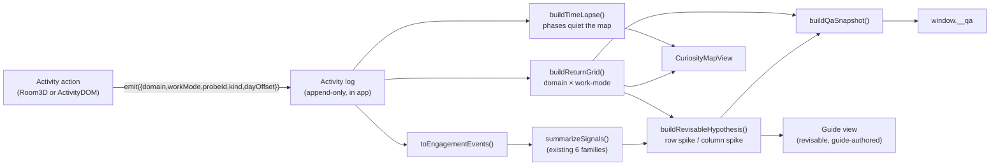

# Interest Lab — Shared Core ("lane 0") — loop-ready build spec

**Date:** 2026-07-21 · **Owner:** David · **Feature:** rebuild of the "Interest Lab" child passion-discovery app.
**Design (read first):** [`2026-07-21-interest-lab-world-design.md`](./2026-07-21-interest-lab-world-design.md).
**Grounding research:** [`../../research/interest-lab-world-precedents.md`](../../research/interest-lab-world-precedents.md),
[`../../research/passionBrainlift.md`](../../research/passionBrainlift.md), and
`gt100k-factory/docs/RESEARCH-visual-ux-qa-harness.md`.
**This spec follows** `gt100k-factory/docs/loop-ready-prd.md` (hard scope fence, ordered phases,
machine-checkable success criteria mapped to tests, golden values).

> **What this is.** The build-ready spec for **lane 0**: the shared core that the three parallel zone
> loops (Music, Code, Art — lanes 1–3) build against. Lane 0 must **land green first**. When it is done,
> the `ZonePlugin` interface in [§3.1](#31-the-frozen-zoneplugin-interface-the-parallel-build-seam) is
> **frozen** and the zone specs lock to it. Nothing in lanes 1–3 may edit a lane-0 file except the single
> registry line in [§10](#10-the-single-merge-point-zone-registry).

---

## 1. One line + scope fence

**One line.** A child wanders a 2D **Curiosity Map** of discovery buildings (one per interest **domain**),
steps into a building to do a real hands-on activity in a **bounded 3D room** (rendered into one persistent
`<Canvas>`), and the core quietly learns an emerging passion from **what they voluntarily return to over
days** — expressed as a **domain × work-mode grid** and a **revisable hypothesis**, never a score or label.

### 1.1 In scope (lane 0 builds ALL of this)

1. **`ZonePlugin` interface** (frozen contract) + the `{domain, workMode, probeId}` **event contract**, so
   3 zones build in parallel with **zero cross-dependencies**.
2. **Signal engine** (extends `@gt100k/interest-lab`): the `domain × work-mode` **return grid**;
   **voluntary-return tracking** with the novelty gate (prompted/rewarded returns tagged + excluded); the
   **"a week later…" synthetic time-lapse**; the **revisable hypothesis** (row = topic spike, column =
   work-mode spike; supporting + disconfirming evidence + visible coverage gaps; never a score/label).
3. **2D Curiosity Map renderer** (real DOM, primary surface) + the **single persistent `<Canvas>` host**
   (contents swap on zone enter/exit — **never** mount/unmount per room).
4. The **`window.__qa` contract** the app exposes (so the upgraded QA gate can read app state).
5. **Accessibility by construction**: the 2D map is real DOM (keyboard + screen-reader) and **primary**;
   every zone ships `ActivityDOM`; parity enforced via `plainViewEquals` / `plainZoneEquals`.
6. Three throwaway **stub zones** + a **seeded end-to-end smoke** (map → stub zone → event → grid →
   hypothesis) that is **green from phase 0**.

### 1.2 Out of scope (non-goals — do NOT build)

- The real Music / Code / Art zone activities, art assets, or 3D scenes (lanes 1–3; lane 0 ships **stubs**).
- The QA-harness code itself (lives in `gt100k-factory`; lane 0 only **exposes `window.__qa`** to the
  shape agreed in [§7](#7-the-windowqa-contract-p0-of-the-qa-harness)).
- Live LLM; live gaussian-splat backdrops; real child data; a live 7/30-day cohort (the **synthetic
  time-lapse** stands in); social / co-presence; the other (non-v1) domains.
- Changing the existing pure-domain contracts of `@gt100k/interest-lab` (we **extend**, never break —
  every existing test in the three packages must stay green; see [SC-CORE-01](#6-success-criteria--tests)).

---

## 2. Decisions already made (do not re-open)

**Stack (pinned, already in-repo).** pnpm `9.15.9` monorepo; TypeScript `~5.6` (`strict`,
`noUncheckedIndexedAccess: true`, `exactOptionalPropertyTypes: false`, `verbatimModuleSyntax: true`,
`moduleResolution: "Bundler"`, `target ES2022`); tests = **Vitest**; lint/format = **Biome**;
app = **Next.js 14** + React 18 + `@react-three/fiber@^8` / `@react-three/drei@^9` /
`@react-three/postprocessing@^2` + `three@^0.169` + `motion@^12`. **Commands** (repo root): `pnpm typecheck`
(`tsc -b`), `pnpm test` (`vitest run`), `pnpm lint` (`biome check passion`), `pnpm build`. Workspaces:
`passion/packages/*`, `passion/adapters/*`, `passion/apps/*`.

**Package layout & one deliberate deviation from the design's §4.** The design assigns the Curiosity-Map
renderer, the Canvas host, and the `ZonePlugin` interface to `interest-lab-view`. But `interest-lab-view`
is, by an **enforced guardrail test**, framework- and GPU-free (no `react` / `three` / `@react-three/*`
import; see `specs/003-interest-lab/contracts/interest-lab-ui.md`). That guardrail is load-bearing — it is
what keeps the signal logic headlessly testable and `plainViewEquals` real. So lane 0 **keeps the guardrail
and splits the work**:

| Package | react/three? | Owns (new in lane 0) |
|---|---|---|
| `@gt100k/interest-lab` (domain) | no | `ActivityEvent`, `ReturnGrid`, `buildReturnGrid`, novelty gate, `toEngagementEvents`, `RevisableHypothesis`, `buildRevisableHypothesis`, `ACTIVITY_GOLDEN_V1`/`ACTIVITY_GOLDEN_WORKMODE_V1` |
| `@gt100k/interest-lab-view` (pure view) | no | `ZoneId`, `MapBuildingView`, `CuriosityMapView` + `buildCuriosityMapView`, `TimeLapseView` + `buildTimeLapse`, `ZoneHostState` + `zoneHostReducer`, `ReturnGridView` + `RevisableHypothesisView` builders, `Qa` shape + `buildQaSnapshot`, `buildZoneActivityModel` + `plainZoneEquals` |
| **`@gt100k/interest-zone-kit`** (NEW, react+three) | **yes** | the **frozen `ZonePlugin` interface**, `RoomProps`, `ActivityEmit`, `createZoneRegistry`, `<CuriosityMap>` (DOM), `<CanvasHost>` (the single persistent `<Canvas>`), `<ZoneRoom>` (tier switch), the three **stub zones** |
| `@gt100k/interest-lab-app` (app) | yes | composition shell; wires `window.__qa`; the seeded end-to-end smoke |

**Rationale for the new `interest-zone-kit` package:** the `ZonePlugin` interface references
`React.FC` (for `Room3D` / `ActivityDOM`), so it cannot live in a react-free package; and zone packages
must import the interface from a **shared** package (a package importing from the *app* would invert the
dependency graph). `interest-zone-kit` is that shared react-aware seam. Zones (lanes 1–3) depend on
`interest-zone-kit` + `interest-lab` (+ their own assets) and **never on each other**.

**v1 zone bindings (used by stubs and goldens; `Domain` stays an open `string`).** Music → `sound_music`,
Code → `symbols_math`, Art → `visual_design`. These reuse the existing catalog vocabulary
(`@gt100k/interest-probe-catalog`). Work-modes reuse the 9 canonical `WORK_MODES`. Each v1 zone exposes
**`build`** (the shared column that makes the row/column signal work) plus two others: Music =
`build`·`perform`·`debug`; Code = `build`·`debug`·`investigate`; Art = `build`·`compose`·`explain`.

**Defaults rule (loop-ready-prd).** *For anything this spec does not specify, choose the simplest correct
option consistent with the existing engine, record it in `.loop/decisions.md`, and continue.* Escalate only
if a choice would invalidate a golden value or an SC.

**Guardrails inherited (must hold for every new type/function).** No `Math.random`; no wall-clock (use the
injected `dayOffset`); **no** `score` / `rank` / `verdict` / `percentile` / `passionScore` / `confidence` /
`price` / `currency` / `outOf` field at any depth of any view/grid/hypothesis type; **no** copy string
matching `/you are (a|an|the) /i`; counts of observed events (`visits`, `voluntaryReturns`, …) are allowed
because they are **observations, not ratings**. `interest-lab` and `interest-lab-view` keep **no** `react` /
`three` / `@react-three/*` import.

---

## 3. The `ZonePlugin` interface + event contract

### 3.1 The frozen `ZonePlugin` interface (the parallel-build seam)

Exported from `@gt100k/interest-zone-kit`. **This is the contract the three zone specs lock to.** Once
lane 0 is green, changing any field here is a breaking change that requires re-freezing with all lane owners.

```ts
import type { FC } from "react";
import type { Domain, Probe } from "@gt100k/interest-lab";
import type { MapBuildingView, ZoneId } from "@gt100k/interest-lab-view";

/** The complete, self-contained definition of one discovery zone. A zone package exports exactly one. */
export interface ZonePlugin {
  /** Stable zone id; v1: "music" | "code" | "art". Also the registry key + QA id prefix. */
  id: ZoneId;

  /** The grid ROW this zone feeds. Must be present in the catalog/domain order (else the map throws). */
  domain: Domain;

  /** Declarative 2D building on the Curiosity Map (label, glyph, preferred cell, the one enter-verb). */
  mapBuilding: MapBuildingView;

  /** Bounded 3D scene, mounted INTO the shared persistent <Canvas>. Fixed camera, <50 draw calls. */
  Room3D: FC<RoomProps>;

  /** Accessible DOM mirror of the SAME actions (the a11y floor + the parity target). */
  ActivityDOM: FC<RoomProps>;

  /** One (domain, workMode) probe per activity action. Each action emits {domain, workMode, probeId}. */
  probes: readonly Probe[];
}
```

**Zero-cross-dependency invariant.** A zone module imports **only** from `@gt100k/interest-zone-kit`,
`@gt100k/interest-lab` (types), its own directory, and shared assets — **never** from another
`interest-zone-*` package, and never from the app. Enforced by [SC-CORE-13](#6-success-criteria--tests)
(a static import-graph test) and CODEOWNERS lanes.

### 3.2 `RoomProps` — everything a room needs, injected

Both `Room3D` and `ActivityDOM` receive the **same** props. This is what makes the two renderings "two
renderings of the same verbs" (parity by construction):

```ts
export type ActivityEmit = (event: ActivityEvent) => void;

export interface RoomProps {
  /** Append-only event sink. Every activity action calls emit() exactly once with a complete ActivityEvent. */
  emit: ActivityEmit;

  /** The zone's own probes (each activity action references one probe by id). */
  probes: readonly Probe[];

  /** The canonical, surface-independent action list BOTH surfaces must render (parity source of truth). */
  actions: readonly ZoneActionModel[];   // = buildZoneActivityModel(plugin).actions

  /** Time-lapse phase: 0 = live first session; 7 = "a week later…"; 30 = "a month later…". */
  dayOffset: number;

  /** Resolved room tier ("room-3d" | "room-3d-lite"); ActivityDOM is used below this (the a11y floor). */
  tier: "room-3d" | "room-3d-lite";

  /** OS/user reduced-motion preference; rooms must honor it (no essential motion). */
  reducedMotion: boolean;
}
```

`ZoneActionModel` (from `buildZoneActivityModel`, [§5.3](#53-parity-plainzoneequals--buildzoneactivitymodel))
is the per-action descriptor `{ actionId, probeId, domain, workMode, kind, label, primary }`. A zone author
writes their room against `actions`; the parity test then guarantees `ActivityDOM` and `Room3D` expose the
same set.

### 3.3 The event contract (`ActivityEvent`) — the heart of the parallel build

Exported from `@gt100k/interest-lab`. **Every activity action in every zone emits exactly this shape.**
Because every event carries `{domain, workMode, probeId}`, return clusters resolve **topic vs work-mode**
automatically in the core — no zone knows anything about the grid.

```ts
import type { InterventionContext, WorkMode } from "@gt100k/interest-lab";

export type ActivityKind =
  | "explore"        // first-encounter doing (novelty); day 0
  | "return"         // came back to a cell after novelty faded (day >= 7)
  | "revise"         // improved own work unprompted        -> UNREQUIRED_REVISION
  | "challenge"      // chose the harder path               -> CHOSEN_CHALLENGE
  | "recover"        // kept going after a flop             -> FAILURE_RECOVERY
  | "author-scope"   // set an own goal / widened scope     -> SELF_AUTHORED_SCOPE
  | "artifact"       // made / tested / explained something -> ARTIFACT_COMPETENCE
  | "assist";        // used help                           -> ASSISTIVE (never lowers/creates signal)

export interface ActivityEvent {
  zoneId: ZoneId;                       // emitting zone (for map attribution + QA)
  probeId: string;                      // the probe this action belongs to
  domain: Domain;                       // grid ROW
  workMode: WorkMode;                   // grid COLUMN
  action: string;                       // zone-defined action id (opaque to the core; provenance/QA only)
  kind: ActivityKind;                   // maps to a signal family via toEngagementEvents()
  dayOffset: number;                    // 0 first session; 7 / 30 = time-lapse phases
  intervention?: InterventionContext;   // present => prompted/rewarded return (EXCLUDED from voluntary)
  assistive?: boolean;                  // help used; the grid ignores these entirely
  withdrawn?: boolean;                  // child withdrew this action; excluded everywhere
}
```

Notes:
- `intervention.source ∈ {"reminder","deadline","nudge","rivalry","reward"}` reuses the existing
  `InterventionContext` — this is how "prompted **and rewarded** returns are tagged and excluded."
- `dayOffset` is the **only** notion of time; it reuses the engine's existing 7/30 horizons. The core reads
  no wall-clock.

### 3.4 Event flow (activity → event → grid → hypothesis)



The two signal-bearing choices from the research — **which building to enter** and **what to wander back
to** — are both observable: the first as a `CuriosityMap` building selection, the second as a `return`-kind
`ActivityEvent` at `dayOffset ≥ 7`.

---

## 4. Signal engine (extends `@gt100k/interest-lab`)

All functions are **pure**, deterministic, and add to the existing engine without changing any existing
symbol. New exports are added to `src/index.ts`.

### 4.1 The `domain × work-mode` return grid

```ts
export interface GridCell {
  domain: Domain;
  workMode: WorkMode;
  visits: number;             // all non-assistive, non-withdrawn activity in this cell (any day)
  noveltyVisits: number;      // dayOffset < noveltyHorizon (first-encounter doing; excluded from returns)
  voluntaryReturns: number;   // dayOffset >= noveltyHorizon AND intervention === undefined
  promptedReturns: number;    // dayOffset >= noveltyHorizon AND intervention !== undefined  (EXCLUDED signal)
  firstSeenDayOffset: number;
  lastSeenDayOffset: number;
}

export interface DomainRow {   // the TOPIC axis (a row = one domain)
  domain: Domain;
  voluntaryReturns: number;    // sum across the row
  workModesTouched: WorkMode[];// work-modes with voluntaryReturns > 0, in WORK_MODES order
}

export interface WorkModeColumn { // the WORK-MODE axis (a column = one work-mode)
  workMode: WorkMode;
  voluntaryReturns: number;    // sum down the column
  domainsTouched: Domain[];    // domains with voluntaryReturns > 0, in domainOrder
}

export interface ReturnGrid {
  cells: GridCell[];           // only cells with visits > 0, sorted (domainOrder, then WORK_MODES order)
  rows: DomainRow[];           // in domainOrder
  columns: WorkModeColumn[];   // in WORK_MODES order
  rowSpike: Domain | null;     // topic spike (may be null)
  columnSpike: WorkMode | null;// work-mode spike (may be null)
  domainOrder: Domain[];       // the order used (echoed for the view layer)
}

export interface ReturnGridConfig {
  noveltyHorizon: number;      // default 7  (a return counts only at/after this dayOffset)
  minAxisReturns: number;      // default 2  (a row/column is a spike candidate at >= this)
  spikeLeadMargin: number;     // default 1  (spike must lead the runner-up by >= this)
  minAxisSpread: number;       // default 2  (topic spike must span >=2 work-modes; work-mode spike >=2 domains)
}
export const DEFAULT_RETURN_GRID_CONFIG: ReturnGridConfig;

export function buildReturnGrid(
  activity: readonly ActivityEvent[],
  opts?: { domainOrder?: readonly Domain[]; config?: Partial<ReturnGridConfig> },
): ReturnGrid;
```

**Algorithm (deterministic; this is the spec):**
1. Drop events where `withdrawn === true` or `assistive === true`.
2. `domainOrder` = `opts.domainOrder` if given, else domains in **first-appearance order** in `activity`.
3. For each remaining event, upsert cell `(domain, workMode)`:
   - `visits += 1`; update `firstSeenDayOffset`/`lastSeenDayOffset`.
   - if `dayOffset < noveltyHorizon` → `noveltyVisits += 1` (**novelty gate**: never a return).
   - else if `intervention === undefined` → `voluntaryReturns += 1`.
   - else → `promptedReturns += 1` (**tagged + excluded** from every downstream signal).
4. `rows` / `columns` aggregate `voluntaryReturns` and the touched-set (only cells with
   `voluntaryReturns > 0`).
5. **`rowSpike`** = the domain `d` maximizing `rows[d].voluntaryReturns` such that
   `value ≥ minAxisReturns` **and** `value − secondHighest ≥ spikeLeadMargin` **and**
   `|workModesTouched(d)| ≥ minAxisSpread`; else `null`. A tie for the max ⇒ lead margin `0` ⇒ `null`.
6. **`columnSpike`** = symmetric over columns with `|domainsTouched| ≥ minAxisSpread`.
7. Sorting: `cells` by `(domainOrder index, WORK_MODES index)`; `rows` by `domainOrder`; `columns` by
   `WORK_MODES`.

### 4.2 Novelty gate + prompted/rewarded exclusion (reuses the existing model)

The novelty gate is encoded in step 3: **day-0 doing is triggered situational interest** (novelty) and
never counts; only a **delayed, unprompted** revisit (`dayOffset ≥ noveltyHorizon`, `intervention`
undefined, not assistive) is a **voluntary return**. Prompted/rewarded returns are counted **separately**
in `promptedReturns` and contribute `0` to every signal — mirroring how the existing engine keeps
`PROMPTED_RETURN` out of `voluntary_return` and how the candidate gate refuses to promote on novelty alone.

### 4.3 `toEngagementEvents` — bridge to the existing six families

So the existing `summarizeSignals` / state-machine / candidate-gate keep working unchanged, project the
activity log onto the existing `EngagementEvent` stream:

```ts
export function toEngagementEvents(
  activity: readonly ActivityEvent[],
  opts?: { learnerRef?: string; noveltyHorizon?: number },
): EngagementEvent[];
```

Mapping (drop `withdrawn`; `id` = deterministic `${zoneId}:${probeId}:${action}:${dayOffset}:${index}`):

| `ActivityEvent`                                             | `EngagementEvent.type` |
|---|---|
| `kind:"return"`, `dayOffset ≥ horizon`, no `intervention`  | `VOLUNTARY_RETURN` |
| `kind:"return"`, `dayOffset ≥ horizon`, has `intervention` | `PROMPTED_RETURN` (carries `interventionContext`) |
| `kind:"revise"`                                            | `UNREQUIRED_REVISION` |
| `kind:"challenge"`                                         | `CHOSEN_CHALLENGE` |
| `kind:"recover"`                                           | `FAILURE_RECOVERY` |
| `kind:"author-scope"`                                      | `SELF_AUTHORED_SCOPE` |
| `kind:"artifact"`                                          | `ARTIFACT_COMPETENCE` |
| `kind:"assist"` (or `assistive:true`)                     | `ASSISTIVE` |
| `kind:"explore"` (novelty)                                 | *(no family event)* |

Fields carried through: `probeId`, `familyId` (= `probeId` unless the probe declares one), `domain`,
`occurredAtDayOffset` = `dayOffset`, `assistive`, `reliability:"high"`, `optionalReflection:false`,
`withdrawn:false`. `summarizeSignals` semantics are preserved (`VOLUNTARY_RETURN` only registers at
`occurredAtDayOffset ∈ {7,30}`), so lane-0 fixtures use only `dayOffset ∈ {0,7,30}`.

### 4.4 The "a week later…" synthetic time-lapse

```ts
export type TimeLapsePhaseId = "first-session" | "a-week-later" | "a-month-later";

export interface TimeLapsePhase {
  id: TimeLapsePhaseId;
  dayOffset: number;                 // 0 | 7 | 30
  label: string;                     // "Right now" | "A week later…" | "A month later…"
  quieted: boolean;                  // false for first-session; true afterwards (NEW banners gone)
  activeCells: { domain: Domain; workMode: WorkMode }[]; // cells with activity in this phase (sorted)
}

export interface TimeLapseView {
  phases: TimeLapsePhase[];          // ascending dayOffset, only phases that have activity
  currentPhaseId: TimeLapsePhaseId;  // the latest phase present
}

export function buildTimeLapse(activity: readonly ActivityEvent[]): TimeLapseView;  // in interest-lab-view
```

`dayOffset` → phase: `0 → first-session` ("Right now"), `7 → a-week-later` ("A week later…"),
`30 → a-month-later` ("A month later…"). This is the honestly-labeled device: after `first-session` the map
**quiets** (`quieted:true`), then reveals what the child drifts back to. It **represents** the construct;
it never fakes a metric.

### 4.5 The revisable hypothesis (row = topic, column = work-mode)

```ts
export interface AxisSpike<A extends Domain | WorkMode, Cross extends Domain | WorkMode> {
  axis: A;
  voluntaryReturns: number;
  spans: Cross[];                    // the crossing axis touched (topic spike -> work-modes; vice-versa)
}

export type HypothesisReading =
  | "topic-leaning"        // a row spikes; the pull is a domain
  | "work-mode-leaning"    // a column spikes; the pull is a kind of work across topics
  | "mixed"                // both a row and a column spike
  | "insufficient";        // neither (not enough return data yet)

export interface RevisableHypothesis {
  reading: HypothesisReading;
  topicSpike: AxisSpike<Domain, WorkMode> | null;
  workModeSpike: AxisSpike<WorkMode, Domain> | null;
  supporting: string[];              // evidence FOR the reading (label-free)
  disconfirming: string[];           // the alternative reading that is NOT ruled out
  coverageGaps: string[];            // visible gaps: offered axes with no return data yet + coverage.gaps
  nextDistinguishingProbe: { domain: Domain; workMode: WorkMode; why: string } | null;
  // NEVER: score / rank / label / confidence / "you are a ...". It is a READ a guide revises.
}

export function buildRevisableHypothesis(
  grid: ReturnGrid,
  coverage: CoverageMatrix,
  offeredCells: readonly { domain: Domain; workMode: WorkMode }[],
): RevisableHypothesis;
```

**Algorithm (deterministic):**
- `reading`: both spikes → `"mixed"`; only `rowSpike` → `"topic-leaning"`; only `columnSpike` →
  `"work-mode-leaning"`; neither → `"insufficient"`.
- `topicSpike` = `rowSpike` ? `{axis:domain, voluntaryReturns:row.total, spans:row.workModesTouched}` : `null`.
  `workModeSpike` symmetric.
- `supporting`:
  - topic-leaning → `["Returned to <domain> across <n> kinds of work (<modes, comma+and>) without prompting."]`
  - work-mode-leaning → `["Returned to <workMode> across <n> topics (<domains, comma+and>) without prompting."]`
  - mixed → both; insufficient → `[]`.
- `disconfirming` (the alternative that is not ruled out):
  - topic-leaning → let `topMode` = the work-mode with the most `voluntaryReturns` inside the spike domain
    (tie → WORK_MODES order). If `topMode` has `columns[topMode].domainsTouched.length === 1`:
    `["'<topMode>' returns so far appear only in <domain> — a work-mode preference across topics is not ruled out."]`; else `[]`.
  - work-mode-leaning → let `topDomain` = the domain with the most `voluntaryReturns` inside the spike
    column (tie → domainOrder). `["'<spikeMode>' returns are strongest in <topDomain> (<k>) — a pull toward the <topDomain> topic is not ruled out."]`.
  - mixed/insufficient → `[]`.
- `coverageGaps` (in this order): for each domain in `domainOrder` that is **offered** but has
  `rows[d].voluntaryReturns === 0` → `"No return data yet for <domain>."`; then for each work-mode in
  `WORK_MODES` that is **offered** but has `columns[w].voluntaryReturns === 0` → `"No return data yet for <workMode>."`; then append `coverage.gaps` verbatim.
- `nextDistinguishingProbe` (always tests the *alternative* hypothesis; must be an **offered** cell):
  - topic-leaning → `workMode = topMode`; `domain` = first in `domainOrder` that is **not** the spike domain
    and where `(domain, topMode) ∈ offeredCells`. `why` = `"Offer <topMode> in another topic to test whether the work-mode travels or the pull is specific to <spikeDomain>."`
  - work-mode-leaning → `domain = topDomain`; `workMode` = first in `WORK_MODES` `≠ spikeMode` where
    `(topDomain, workMode) ∈ offeredCells`. `why` = `"Offer a different kind of work in the strongest topic to test whether the pull is the topic or the making."`
  - if no offered cell qualifies, or reading ∈ {mixed, insufficient} → `null`.

**Revisability (ties to the existing engine).** `buildRevisableHypothesis` is a **shadow read** only. A
guide turns it into an operative `HypothesisRevision` via the existing `authorRevision` / `appendRevision`
(guide-authored, versioned, append-only). The core **never** auto-labels; the child can dispute/withdraw
(existing `childPosition`). This preserves `IL-011` (guide authors the operative revision).

---

## 5. The 2D Curiosity Map + the persistent Canvas host

### 5.1 Curiosity Map view model (pure, `interest-lab-view`) + renderer (DOM, `interest-zone-kit`)

The Curiosity Map is today's `board-2d` **promoted from fallback to the home surface**. It is **real DOM**,
**primary**, and does triple duty (navigation + a11y floor + the return signal is a directly observable
building revisit).

```ts
export type ZoneId = string; // v1: "music" | "code" | "art"

/** Declarative building supplied by a ZonePlugin (the design's "sprite/label/position"). */
export interface MapBuildingView {
  label: string;                     // "Music Studio"
  glyph: string;                     // glyph id (decorative)
  enterVerb: string;                 // the ONE clear verb, World-1-1 style: "Step inside"
  cell: { col: number; row: number };// preferred position on the map grid
  art?: { sprite?: string; hue?: string }; // optional hints; hue else derived from catalog order
}

/** Computed render model = declarative building + live state. */
export interface CuriosityMapBuilding extends MapBuildingView {
  zoneId: ZoneId;
  domain: Domain;
  hue: string;                       // resolveDomainHue(domainOrder, domain) unless art.hue given
  returnState: "new" | "explored" | "voluntary-return" | "prompted-return";
  unfinished: number;                // "your half-built thing is still here" (invites revisit)
  ariaLabel: string;                 // e.g. "Music Studio, discovery zone, 2 unfinished, you came back here"
}

export interface CuriosityMapView {
  buildings: CuriosityMapBuilding[]; // one per registered zone, sorted by (cell.row, cell.col)
  timeLapse: TimeLapseView;
  legend: { returnState: CuriosityMapBuilding["returnState"]; note: string }[];
  domainOrder: Domain[];
}

export function buildCuriosityMapView(
  manifests: readonly { id: ZoneId; domain: Domain; mapBuilding: MapBuildingView }[],
  activity: readonly ActivityEvent[],
  opts: { domainOrder: readonly Domain[] },
): CuriosityMapView;
```

`returnState` per building = the strongest state across its zone's cells in the activity log: any voluntary
return → `"voluntary-return"`; else any prompted return → `"prompted-return"`; else any novelty visit →
`"explored"`; else `"new"`. `unfinished` = count of the zone's probes that were **explored (day-0 novelty)
but have no voluntary return** (the "your half-built thing is still here" cue; a prompted-only return does
not clear it). `hue` from `resolveDomainHue`. Throws if a manifest `domain` is absent from `domainOrder`.

**`<CuriosityMap>` (DOM component, `interest-zone-kit`).** Renders `CuriosityMapView.buildings` as a grid
of **real focusable buttons** (roving-tabindex, `ArrowLeft/Right/Up/Down` moves focus one item at a time —
never a cursor), each labeled with `ariaLabel`, showing `label` + `enterVerb` + `returnState` cue.
Selecting a building calls `onEnterZone(zoneId)`. The time-lapse control renders as a labeled DOM control
("A week later…") that steps `dayOffset`. **This is the primary surface**; it is never `aria-hidden`.

### 5.2 The single persistent `<Canvas>` host

**Non-negotiable:** exactly **one** `<Canvas>` for the whole app; entering/leaving a room **swaps its
children**, never remounts the canvas or its WebGL context.

```ts
// pure state machine (interest-lab-view)
export interface ZoneHostState {
  activeZoneId: ZoneId | null;       // null = overworld (ambient backdrop / idle)
  dayOffset: number;                 // current time-lapse phase
  entered: ZoneId[];                 // history of entered zones (for "explored" cues), append-only, deduped-adjacent
}
export type ZoneHostAction =
  | { type: "enter"; zoneId: ZoneId }
  | { type: "exit" }
  | { type: "set-day"; dayOffset: number };

export function zoneHostReducer(state: ZoneHostState, action: ZoneHostAction): ZoneHostState;
export const INITIAL_ZONE_HOST_STATE: ZoneHostState; // { activeZoneId: null, dayOffset: 0, entered: [] }
```

**`<CanvasHost>` (react, `interest-zone-kit`).** Mounts one `<Canvas frameloop="demand">` (fixed camera,
`AdaptiveDpr` / `PerformanceMonitor`, `<50` draw calls) at app start and keeps it mounted for the app's
lifetime. Inside, `<ZoneRoom>` reads `activeZoneId` and renders:

- `activeZoneId === null` → an ambient overworld backdrop (or nothing) inside the same canvas.
- tier `room-3d` / `room-3d-lite` → `plugin.Room3D` (contents swap; the canvas element is stable).
- below the 3D floor (no WebGL / reduced-motion / `board-2d` tier) → **`plugin.ActivityDOM`** rendered as
  DOM **outside** the canvas (the a11y floor). The map is always DOM regardless of tier.

**Persistence invariant (testable headlessly).** With `@react-three/fiber`'s `Canvas` mocked to a element
that bumps a module-level mount counter, `enter("music") → exit() → enter("art")` keeps the counter at
**1** while `<ZoneRoom>`'s children change. See [SC-CORE-08](#6-success-criteria--tests).

### 5.3 Parity: `plainZoneEquals` + `buildZoneActivityModel`

The a11y floor must preserve the *act of choosing what to do/revisit*, not be a lesser to-do list. Both a
zone's surfaces derive from one canonical model:

```ts
export interface ZoneActionModel {
  actionId: string;                  // stable within the zone
  probeId: string;
  domain: Domain;
  workMode: WorkMode;
  kind: ActivityKind;
  label: string;                     // accessible name + on-screen text
  primary: boolean;                  // exactly one primary action per room (game-feel: one obvious verb)
}
export interface ZoneActivityModel {
  zoneId: ZoneId;
  domain: Domain;
  actions: ZoneActionModel[];        // sorted by actionId
}
export function buildZoneActivityModel(
  manifest: { id: ZoneId; domain: Domain; probes: readonly Probe[] } & {
    actions?: readonly ZoneActionModel[];
  },
): ZoneActivityModel;               // default: one primary action per probe if actions omitted

export function plainZoneEquals(a: ZoneActivityModel, b: ZoneActivityModel): boolean;
```

**Parity obligation for zones (lanes 1–3):** the set of `{actionId, probeId, domain, workMode}` operable
via `ActivityDOM` MUST equal `buildZoneActivityModel(plugin).actions`, and MUST equal `Room3D`'s
interactives reported through `window.__qa.interactives()` when that zone is active. Lane 0 enforces this
for the **stub zones** ([SC-CORE-11](#6-success-criteria--tests)); the zone specs inherit the same test.

---

## 6. Success criteria → tests

Every SC is **headless**, **in-lane**, and **automatic** (a Vitest test the loop runs). The gate =
`pnpm typecheck && pnpm test && pnpm lint` from the repo root; `pnpm build` must also pass. Golden values
are in [§8](#8-golden-values). `manual:` items are operator-verified and **excluded** from the automated DoD.

| SC | Statement | Test file | Golden / assertion |
|---|---|---|---|
| **SC-CORE-01** | Every pre-existing test in `interest-lab`, `interest-lab-view`, `interest-lab-app` still passes (extend, don't break). | (existing suites) | all green |
| **SC-CORE-02** | `buildReturnGrid(ACTIVITY_GOLDEN_V1, {domainOrder:V1_DOMAIN_ORDER})` equals `GRID_GOLDEN_A`. | `interest-lab/test/return-grid.test.ts` | [§8.2](#82-grid-golden-a-topic-leaning) exact |
| **SC-CORE-03** | Novelty gate: day-0 events are `noveltyVisits`, never returns; `intervention`-tagged returns land in `promptedReturns` and contribute 0 to `rows/columns`; `assistive`/`withdrawn` ignored. | `return-grid.test.ts` | derived from §8.2 |
| **SC-CORE-04** | `buildReturnGrid(ACTIVITY_GOLDEN_WORKMODE_V1, …)` equals `GRID_GOLDEN_B` (column spike, no row spike). | `return-grid.test.ts` | [§8.3](#83-grid-golden-b-work-mode-leaning) exact |
| **SC-CORE-05** | `buildRevisableHypothesis` yields `HYP_GOLDEN_A` (topic-leaning), `HYP_GOLDEN_B` (work-mode-leaning), `HYP_GOLDEN_C` (insufficient) for the three fixtures. | `interest-lab/test/revisable-hypothesis.test.ts` | [§8.4](#84-revisable-hypothesis-goldens) exact |
| **SC-CORE-06** | No `score`/`rank`/`verdict`/`percentile`/`passionScore`/`confidence`/`price`/`currency`/`outOf` key at any depth of `ReturnGrid`/`RevisableHypothesis`/all new view types; no new copy matches `/you are (a\|an\|the) /i`. | `interest-lab/test/guardrails.test.ts`, `interest-lab-view/test/guardrails.test.ts` | grep + deep-key scan |
| **SC-CORE-07** | `toEngagementEvents(ACTIVITY_GOLDEN_V1)` → `summarizeSignals` gives `voluntaryReturn {day7:3, day30:1}`, `promptDependence:1`, `familiesPresent:["voluntary_return"]`. | `interest-lab/test/activity-bridge.test.ts` | [§8.5](#85-toengagementevents-golden) |
| **SC-CORE-08** | `zoneHostReducer` transitions are correct; `<CanvasHost>` mounts its `<Canvas>` exactly once across `enter→exit→enter` (mocked Canvas mount counter === 1). | `interest-zone-kit/test/zone-host.test.ts`, `.../canvas-host.test.tsx` | reducer table + counter |
| **SC-CORE-09** | `buildCuriosityMapView(STUB_MANIFESTS, ACTIVITY_GOLDEN_V1, {domainOrder})` equals `MAP_GOLDEN`; unknown domain throws. | `interest-lab-view/test/curiosity-map.test.ts` | [§8.6](#86-curiosity-map-golden) exact |
| **SC-CORE-10** | `<CuriosityMap>` renders one focusable button per building with the golden `ariaLabel`s; arrow keys move focus one item at a time; selecting calls `onEnterZone`; the map root is **not** `aria-hidden`. | `interest-zone-kit/test/curiosity-map-dom.test.tsx` | RTL + roles |
| **SC-CORE-11** | For every stub zone, `ActivityDOM` renders one operable, labeled control per `buildZoneActivityModel(...).actions`, each `emit()`ing the correct `ActivityEvent`; `plainZoneEquals(domActions, model)` holds. | `interest-zone-kit/test/activity-dom-parity.test.tsx` | per-action emit |
| **SC-CORE-12** | `buildTimeLapse(ACTIVITY_GOLDEN_V1)` maps day 0/7/30 → first-session/a-week-later/a-month-later with `quieted` false/true/true and correct `activeCells`. | `interest-lab-view/test/time-lapse.test.ts` | [§8.7](#87-time-lapse-golden) |
| **SC-CORE-13** | Import-graph: no `interest-zone-*` file imports another `interest-zone-*` or the app; `interest-lab`/`interest-lab-view` import no `react`/`three`/`@react-three/*`. | `interest-zone-kit/test/import-graph.test.ts` | static scan |
| **SC-CORE-14** | `window.__qa` snapshot: `buildQaSnapshot` returns `ready:true`, `primarySurface:"curiosity-map"`, `canvas.primary:false`, `canvas.hasDomAlternative:true`; `interactives()` lists the 3 map buildings; `stateHash()` equals the goldens before/after entering a zone (proves the primary action is live). | `interest-lab-view/test/qa-snapshot.test.ts` | [§8.8](#88-windowqa-goldens) |
| **SC-CORE-15** | **Seeded end-to-end smoke** (map → stub zone → event → grid → hypothesis → qa) passes. | `interest-lab-app/test/core-smoke.test.ts` | [§9](#9-the-seeded-end-to-end-smoke) |
| **SC-CORE-16** | `manual:` The child room and map are visually cozy/legible and the primary action is obvious. | operator review on `localhost` | **excluded from automated DoD** |

---

## 7. The `window.__qa` contract (P0 of the QA harness)

Coordinated with `RESEARCH-visual-ux-qa-harness.md` §P0/§P3a. The app sets `window.__qa` on mount from a
pure `buildQaSnapshot`. Because the **primary surface is the DOM map**, the harness's "aria-hidden primary
canvas with no DOM alternative" red-flag must **not** fire — and this contract proves it.

```ts
// interest-lab-view (pure builder + type); the app attaches the live object to window.
export interface QaInteractive {
  id: string;                        // e.g. "map:music" | "action:m_build"
  kind: "map-building" | "map-control" | "activity-action";
  label: string;
  domain?: Domain;
  workMode?: WorkMode;
  screenRect?: { x: number; y: number; w: number; h: number };
}
export interface Qa {
  ready: boolean;
  error: string | null;
  settle(frames?: number): Promise<void>;      // drain demand-frames/animation before capture
  primarySurface: "curiosity-map";             // the DOM map is primary (not the canvas)
  canvas: { present: boolean; ariaHidden: boolean; primary: false; hasDomAlternative: true };
  activeZoneId: ZoneId | null;
  interactives(): QaInteractive[];             // map buildings + controls + (when in a room) actions
  stateHash(): string;                         // canonical JSON of salient state (see below)
  grid(): ReturnGrid;                          // domain × work-mode
  hypothesis(): RevisableHypothesis;
}
export function buildQaSnapshot(input: {
  ready: boolean; error?: string | null;
  host: ZoneHostState; map: CuriosityMapView;
  grid: ReturnGrid; hypothesis: RevisableHypothesis;
  interactives: QaInteractive[];
}): Qa;
```

**`stateHash()` (deterministic, debuggable — a canonical string, not a numeric hash).** Returns
`JSON.stringify({ activeZoneId, cells, reading })` with **no whitespace**, where `cells` is the array of
`[domain, workMode, voluntaryReturns, promptedReturns]` for every cell with `voluntaryReturns > 0 ||
promptedReturns > 0`, sorted by `(domainOrder index, WORK_MODES index)`, and `reading` =
`hypothesis.reading`. Entering a zone or recording a return **must** change this string — that is the
machine-checkable proof the primary action is live ([§8.8](#88-windowqa-goldens)).

**`interactives()`** always includes the map buildings (`kind:"map-building"`) and the time-lapse control
(`kind:"map-control"`); when `activeZoneId !== null` it also includes that zone's actions
(`kind:"activity-action"`) so the harness's raycast round-trip (P3b) can drive the room.

---

## 8. Golden values

All identifiers below are lane-0-owned fixtures. `V1_DOMAIN_ORDER = ["sound_music","symbols_math",
"visual_design"]`. `WORK_MODES` order (existing): `build, investigate, compose, explain, perform, debug,
collaborate, care, persuade`.

### 8.1 Activity fixtures (`ACTIVITY_GOLDEN_V1`, topic-leaning)

`@gt100k/interest-lab` exports these (like the existing `EVENTS_GOLDEN_V1`). Omitted optional fields =
default (`intervention:undefined`, `assistive:false`, `withdrawn:false`). `zoneId`/`action` shown for
completeness.

```ts
// ACTIVITY_GOLDEN_V1 — one child, drifts back to MUSIC across kinds of work (topic spike = sound_music)
[
  {zoneId:"music", probeId:"m_build",   domain:"sound_music",  workMode:"build",   action:"open", kind:"explore", dayOffset:0},
  {zoneId:"music", probeId:"m_perform", domain:"sound_music",  workMode:"perform", action:"open", kind:"explore", dayOffset:0},
  {zoneId:"code",  probeId:"c_build",   domain:"symbols_math", workMode:"build",   action:"open", kind:"explore", dayOffset:0},
  {zoneId:"art",   probeId:"a_build",   domain:"visual_design",workMode:"build",   action:"open", kind:"explore", dayOffset:0},
  {zoneId:"music", probeId:"m_build",   domain:"sound_music",  workMode:"build",   action:"open", kind:"return",  dayOffset:7},
  {zoneId:"music", probeId:"m_perform", domain:"sound_music",  workMode:"perform", action:"open", kind:"return",  dayOffset:7},
  {zoneId:"music", probeId:"m_debug",   domain:"sound_music",  workMode:"debug",   action:"open", kind:"return",  dayOffset:7},
  {zoneId:"code",  probeId:"c_build",   domain:"symbols_math", workMode:"build",   action:"open", kind:"return",  dayOffset:7, intervention:{source:"reminder"}},
  {zoneId:"music", probeId:"m_build",   domain:"sound_music",  workMode:"build",   action:"open", kind:"return",  dayOffset:30},
]
```

`ACTIVITY_GOLDEN_WORKMODE_V1` (work-mode-leaning; column spike = `build`):

```ts
[
  {zoneId:"music", probeId:"m_build",   domain:"sound_music",  workMode:"build",   action:"open", kind:"explore", dayOffset:0},
  {zoneId:"code",  probeId:"c_build",   domain:"symbols_math", workMode:"build",   action:"open", kind:"explore", dayOffset:0},
  {zoneId:"art",   probeId:"a_build",   domain:"visual_design",workMode:"build",   action:"open", kind:"explore", dayOffset:0},
  {zoneId:"music", probeId:"m_perform", domain:"sound_music",  workMode:"perform", action:"open", kind:"explore", dayOffset:0},
  {zoneId:"music", probeId:"m_build",   domain:"sound_music",  workMode:"build",   action:"open", kind:"return",  dayOffset:7},
  {zoneId:"code",  probeId:"c_build",   domain:"symbols_math", workMode:"build",   action:"open", kind:"return",  dayOffset:7},
  {zoneId:"art",   probeId:"a_build",   domain:"visual_design",workMode:"build",   action:"open", kind:"return",  dayOffset:7},
  {zoneId:"code",  probeId:"c_build",   domain:"symbols_math", workMode:"build",   action:"open", kind:"return",  dayOffset:30},
]
```

`ACTIVITY_GOLDEN_INSUFFICIENT_V1` (novelty only; no returns): the 4 day-0 `explore` rows of
`ACTIVITY_GOLDEN_V1` and nothing else.

### 8.2 Grid golden A (topic-leaning)

`GRID_GOLDEN_A = buildReturnGrid(ACTIVITY_GOLDEN_V1, {domainOrder:V1_DOMAIN_ORDER})`:

`cells` (sorted):

| domain | workMode | visits | noveltyVisits | voluntaryReturns | promptedReturns | firstSeen | lastSeen |
|---|---|---|---|---|---|---|---|
| sound_music | build | 3 | 1 | 2 | 0 | 0 | 30 |
| sound_music | perform | 2 | 1 | 1 | 0 | 0 | 7 |
| sound_music | debug | 1 | 0 | 1 | 0 | 7 | 7 |
| symbols_math | build | 2 | 1 | 0 | 1 | 0 | 7 |
| visual_design | build | 1 | 1 | 0 | 0 | 0 | 0 |

`rows`: `sound_music` → `voluntaryReturns:4`, `workModesTouched:["build","perform","debug"]`;
`symbols_math` → `0, []`; `visual_design` → `0, []`.
`columns`: `build` → `voluntaryReturns:2`, `domainsTouched:["sound_music"]`; `perform` → `1,
["sound_music"]`; `debug` → `1, ["sound_music"]`; all others `0, []`.
`rowSpike: "sound_music"` (4 ≥ 2, leads by 4, spans 3 ≥ 2). `columnSpike: null` (`build`=2 but spans 1 < 2).

### 8.3 Grid golden B (work-mode-leaning)

`GRID_GOLDEN_B = buildReturnGrid(ACTIVITY_GOLDEN_WORKMODE_V1, {domainOrder:V1_DOMAIN_ORDER})`:

| domain | workMode | visits | noveltyVisits | voluntaryReturns | promptedReturns | firstSeen | lastSeen |
|---|---|---|---|---|---|---|---|
| sound_music | build | 2 | 1 | 1 | 0 | 0 | 7 |
| sound_music | perform | 1 | 1 | 0 | 0 | 0 | 0 |
| symbols_math | build | 3 | 1 | 2 | 0 | 0 | 30 |
| visual_design | build | 2 | 1 | 1 | 0 | 0 | 7 |

`rows`: `sound_music` → `1, ["build"]`; `symbols_math` → `2, ["build"]`; `visual_design` → `1, ["build"]`.
`columns`: `build` → `4, ["sound_music","symbols_math","visual_design"]`; `perform` → `0, []`.
`rowSpike: null` (max `symbols_math`=2 but spans 1 < 2). `columnSpike: "build"` (4 ≥ 2, spans 3 ≥ 2).

### 8.4 Revisable-hypothesis goldens

Offered cells for both goldens = the 9 stub probes:
`{sound_music:[build,perform,debug], symbols_math:[build,debug,investigate], visual_design:[build,compose,explain]}`.
`coverage` = the `buildLab(STUB_ZONE_CATALOG_V1, …, ZONE_LAB_CONFIG_V1)` matrix, which is **complete**
(`gaps:[]`) — see [§9](#9-the-seeded-end-to-end-smoke).

**`HYP_GOLDEN_A`** (`buildRevisableHypothesis(GRID_GOLDEN_A, coverage, offeredCells)`):

```json
{
  "reading": "topic-leaning",
  "topicSpike": { "axis": "sound_music", "voluntaryReturns": 4, "spans": ["build","perform","debug"] },
  "workModeSpike": null,
  "supporting": ["Returned to sound_music across 3 kinds of work (build, perform, and debug) without prompting."],
  "disconfirming": ["'build' returns so far appear only in sound_music — a work-mode preference across topics is not ruled out."],
  "coverageGaps": [
    "No return data yet for symbols_math.",
    "No return data yet for visual_design.",
    "No return data yet for investigate.",
    "No return data yet for compose.",
    "No return data yet for explain."
  ],
  "nextDistinguishingProbe": {
    "domain": "symbols_math", "workMode": "build",
    "why": "Offer build in another topic to test whether the work-mode travels or the pull is specific to sound_music."
  }
}
```

**`HYP_GOLDEN_B`** (`buildRevisableHypothesis(GRID_GOLDEN_B, coverage, offeredCells)`):

```json
{
  "reading": "work-mode-leaning",
  "topicSpike": null,
  "workModeSpike": { "axis": "build", "voluntaryReturns": 4, "spans": ["sound_music","symbols_math","visual_design"] },
  "supporting": ["Returned to build across 3 topics (sound_music, symbols_math, and visual_design) without prompting."],
  "disconfirming": ["'build' returns are strongest in symbols_math (2) — a pull toward the symbols_math topic is not ruled out."],
  "coverageGaps": [
    "No return data yet for investigate.",
    "No return data yet for compose.",
    "No return data yet for explain.",
    "No return data yet for perform.",
    "No return data yet for debug."
  ],
  "nextDistinguishingProbe": {
    "domain": "symbols_math", "workMode": "investigate",
    "why": "Offer a different kind of work in the strongest topic to test whether the pull is the topic or the making."
  }
}
```

**`HYP_GOLDEN_C`** (`buildRevisableHypothesis(buildReturnGrid(ACTIVITY_GOLDEN_INSUFFICIENT_V1, …), coverage, offeredCells)`):

```json
{
  "reading": "insufficient",
  "topicSpike": null,
  "workModeSpike": null,
  "supporting": [],
  "disconfirming": [],
  "coverageGaps": [
    "No return data yet for sound_music.",
    "No return data yet for symbols_math.",
    "No return data yet for visual_design.",
    "No return data yet for build.",
    "No return data yet for investigate.",
    "No return data yet for compose.",
    "No return data yet for explain.",
    "No return data yet for perform.",
    "No return data yet for debug."
  ],
  "nextDistinguishingProbe": null
}
```

### 8.5 `toEngagementEvents` golden

`summarizeSignals(toEngagementEvents(ACTIVITY_GOLDEN_V1))`:
`voluntaryReturn: {day7: 3, day30: 1}`, `promptDependence: 1`, `contextEffects: ["reminder"]`,
`familiesPresent: ["voluntary_return"]`. (No artifact family ⇒ `evaluateCandidateGate` is **not** eligible;
missing `["<3 signal families (have 1, need 3)","no artifact/competence signal"]` — the hypothesis stays
`EMERGING`; correct: returns alone never promote.)

### 8.6 Curiosity Map golden

`MAP_GOLDEN = buildCuriosityMapView(STUB_MANIFESTS, ACTIVITY_GOLDEN_V1, {domainOrder:V1_DOMAIN_ORDER})`.
`STUB_MANIFESTS` cells: music `{col:0,row:0}`, code `{col:1,row:0}`, art `{col:2,row:0}`. `buildings`
(sorted by `row,col`):

| zoneId | domain | label | hue | returnState | unfinished |
|---|---|---|---|---|---|
| music | sound_music | Music Studio | `#E8825A` | voluntary-return | 0 |
| code | symbols_math | Code Lab | `#5FB98C` | prompted-return | 1 |
| art | visual_design | Art Studio | `#6C8CE8` | explored | 1 |

(`hue` = `HUE_RAMP[domainOrder.indexOf(domain)]`.) `music`: has voluntary returns → `voluntary-return`,
all explored probes were returned to → `unfinished:0`. `code`: only a prompted return → `prompted-return`,
`c_build` explored+prompted but no *voluntary* return → `unfinished:1`. `art`: `a_build` explored day-0,
never returned → `explored`, `unfinished:1`. `ariaLabel` format:
`"<label>, discovery zone, <unfinished> unfinished, <returnState phrase>"` where the phrase is
`new→"new"`, `explored→"you've been here"`, `voluntary-return→"you came back here"`,
`prompted-return→"you came back after a reminder"`. `timeLapse` = [§8.7]; `domainOrder` echoed.

### 8.7 Time-lapse golden

`buildTimeLapse(ACTIVITY_GOLDEN_V1).phases`:

| id | dayOffset | label | quieted | activeCells |
|---|---|---|---|---|
| first-session | 0 | Right now | false | (sound_music,build),(sound_music,perform),(symbols_math,build),(visual_design,build) |
| a-week-later | 7 | A week later… | true | (sound_music,build),(sound_music,perform),(sound_music,debug),(symbols_math,build) |
| a-month-later | 30 | A month later… | true | (sound_music,build) |

`currentPhaseId: "a-month-later"`. (`activeCells` sorted by `(domainOrder, WORK_MODES)`.)

### 8.8 `window.__qa` goldens

For the smoke seed (stub zones + `ACTIVITY_GOLDEN_V1`, host entered `"music"`):

- Before any enter/activity (`INITIAL_ZONE_HOST_STATE`, empty grid):
  `stateHash() === '{"activeZoneId":null,"cells":[],"reading":"insufficient"}'`.
- After `enter("music")` + applying `ACTIVITY_GOLDEN_V1`:
  `stateHash() === '{"activeZoneId":"music","cells":[["sound_music","build",2,0],["sound_music","perform",1,0],["sound_music","debug",1,0],["symbols_math","build",0,1]],"reading":"topic-leaning"}'`.
- The two strings differ ⇒ the primary action (entering a building / recording a return) is provably live.
- `primarySurface === "curiosity-map"`, `canvas.primary === false`, `canvas.hasDomAlternative === true`,
  `interactives()` contains exactly `map:music`, `map:code`, `map:art` (kind `"map-building"`) plus
  `control:time-lapse` (kind `"map-control"`) plus, since a zone is active, the music actions.

---

## 9. The seeded end-to-end smoke

`interest-lab-app/test/core-smoke.test.ts` — **green from phase 0** (stubs make it compile and pass; later
phases replace stub internals and tighten assertions to the §8 goldens). It exercises the whole chain:

```
1. registry = createZoneRegistry([musicStub, codeStub, artStub])
     assert registry.ids == ["music","code","art"]
2. catalog = STUB_ZONE_CATALOG_V1  (9 probes; see below)
   lab = buildLab("smoke-learner", catalog, {metPrereqs:[],engagedDomains:[]}, ZONE_LAB_CONFIG_V1)
     assert lab.offers.length == 9 && lab.coverage.complete === true
3. map = buildCuriosityMapView(registry.manifests, [], {domainOrder:V1_DOMAIN_ORDER})
     assert map.buildings.length == 3 && every returnState == "new" && every ariaLabel is nonempty
4. host = zoneHostReducer(INITIAL_ZONE_HOST_STATE, {type:"enter", zoneId:"music"})
     assert host.activeZoneId == "music"
5. log = [...ACTIVITY_GOLDEN_V1]                 // as if emitted by the room
   grid = buildReturnGrid(log, {domainOrder:V1_DOMAIN_ORDER})
     assert grid == GRID_GOLDEN_A
6. hyp = buildRevisableHypothesis(grid, lab.coverage, offeredCellsFrom(lab))
     assert hyp == HYP_GOLDEN_A                  // reading "topic-leaning"
7. qa = buildQaSnapshot({ready:true, host, map: buildCuriosityMapView(registry.manifests, log, {domainOrder:V1_DOMAIN_ORDER}), grid, hyp, interactives})
     assert qa.ready && qa.primarySurface=="curiosity-map" && qa.canvas.primary===false
     assert qa.stateHash() == STATEHASH_GOLDEN_AFTER
```

**`STUB_ZONE_CATALOG_V1`** (`ProbeFamily[]`, one family per probe, all `safetyClass:"cleared"`, no
prerequisites; attributes chosen so `buildLab` coverage is complete):

| probeId (=familyId) | domain | workMode | difficulty | social | audience |
|---|---|---|---|---|---|
| m_build | sound_music | build | foundational | solo | no_audience |
| m_perform | sound_music | perform | stretch | group | audience |
| m_debug | sound_music | debug | stretch | solo | no_audience |
| c_build | symbols_math | build | foundational | solo | no_audience |
| c_debug | symbols_math | debug | stretch | solo | no_audience |
| c_investigate | symbols_math | investigate | foundational | solo | no_audience |
| a_build | visual_design | build | foundational | solo | no_audience |
| a_compose | visual_design | compose | foundational | group | audience |
| a_explain | visual_design | explain | foundational | group | audience |

**`ZONE_LAB_CONFIG_V1`** = `{ cohort:"interest-lab-v1", probeCountTarget:9, probeCountRange:{min:9,max:9},
horizonWeeks:{min:8,max:12}, minDomains:3, minWorkModes:6, explorationFloor:0, seed:42 }`. With these,
`selectEligibleFamilyVariants` returns all 9 (family-id sorted: `a_build, a_compose, a_explain, c_build,
c_debug, c_investigate, m_build, m_debug, m_perform`); `9 ≤ limit 9` ⇒ no greedy trim; coverage:
domains 3 ✓, work-modes 6 ✓, solo+group ✓, foundational+stretch ✓, audience+no_audience ✓ ⇒ `complete:true`.

Each **stub zone** (`interest-zone-kit/src/stubs/`) implements `ZonePlugin` minimally: `mapBuilding`
(label/glyph/enterVerb/cell per §8.6), `probes` (its 3 rows above), a trivial `Room3D` (a labeled mesh per
action calling `emit`) and `ActivityDOM` (a labeled `<button>` per action calling `emit`). Stubs are
deleted when lanes 1–3 land; the smoke then points at the real zones.

---

## 10. The single merge point (zone registry)

The **only** shared-root file a zone loop edits is the app's registry array (the modern equivalent of the
old `tsconfig references` merge point):

```ts
// passion/apps/interest-lab/app/zones.ts   — the ONE expected merge conflict point
import { musicZone } from "@gt100k/interest-zone-music";
import { codeZone }  from "@gt100k/interest-zone-code";
import { artZone }   from "@gt100k/interest-zone-art";
export const ZONES = [musicZone, codeZone, artZone];   // registered via createZoneRegistry(ZONES)
```

`createZoneRegistry(plugins)` (kit) validates unique ids, unique domains, and that every `probes[].domain`
matches `plugin.domain`; it exposes `{ ids, manifests, byId(id), catalog() }` where `catalog()` folds all
zones' `probes` into the `ProbeFamily[]` used by `buildLab`. Until lanes land, `ZONES = STUB_ZONES`.

---

## 11. Phased build path

Each phase ends green (`typecheck + test + lint + build`). Phase 0 makes the smoke pass; later phases
replace stub internals and tighten assertions to the §8 goldens.

- **P0 — Scaffolding + green smoke.** Create `@gt100k/interest-zone-kit` (package.json, tsconfig, add to
  workspace + root `tsconfig.json` references). Add `ZonePlugin`/`RoomProps`/`ActivityEmit` types (kit),
  `ZoneId`/`MapBuildingView` (view), `ActivityEvent`/`ActivityKind` (domain). Add **stub zones** +
  `STUB_ZONE_CATALOG_V1` + `createZoneRegistry`. Add **placeholder** `buildReturnGrid` /
  `buildRevisableHypothesis` / `buildCuriosityMapView` / `zoneHostReducer` / `buildQaSnapshot` returning
  correctly-shaped values. Write `core-smoke.test.ts` with shape-level assertions. **Gate green.**
  *(SC-CORE-15 shape-level, SC-CORE-01, SC-CORE-13.)*
- **P1 — Return grid + novelty gate + bridge.** Implement `buildReturnGrid`, `DEFAULT_RETURN_GRID_CONFIG`,
  `toEngagementEvents`, and the `ACTIVITY_GOLDEN_*` fixtures. *(SC-CORE-02/03/04/07.)*
- **P2 — Revisable hypothesis.** Implement `buildRevisableHypothesis` + guardrails (no score/label).
  *(SC-CORE-05/06.)*
- **P3 — Time-lapse + Curiosity Map view model.** Implement `buildTimeLapse`, `buildCuriosityMapView`.
  *(SC-CORE-09/12.)*
- **P4 — Canvas host + map DOM renderer.** Implement `zoneHostReducer`, `<CanvasHost>` (single persistent
  `<Canvas>`), `<ZoneRoom>` (tier switch), `<CuriosityMap>` DOM. *(SC-CORE-08/10.)*
- **P5 — `window.__qa`.** Implement `buildQaSnapshot` + `stateHash`; wire `window.__qa` in the app.
  *(SC-CORE-14.)*
- **P6 — Parity + a11y.** Implement `buildZoneActivityModel` / `plainZoneEquals`; wire stub
  `ActivityDOM`/`Room3D` to the shared action model; assert per-action emit + parity + keyboard nav.
  *(SC-CORE-11, and tighten SC-CORE-10.)*
- **P7 — Integrate + tighten smoke.** Compose map + `<CanvasHost>` + registry in the app; tighten
  `core-smoke.test.ts` to the exact §8 goldens; run `pnpm build`. *(SC-CORE-15 full.)*

**Freeze point.** After P7 green, the `ZonePlugin` interface ([§3.1](#31-the-frozen-zoneplugin-interface-the-parallel-build-seam)),
`RoomProps` ([§3.2](#32-roomprops--everything-a-room-needs-injected)), and `ActivityEvent`
([§3.3](#33-the-event-contract-activityevent--the-heart-of-the-parallel-build)) are **frozen**; the zone
specs (lanes 1–3) lock to them.

---

## 12. Seed data / fixtures (all in-repo, no external fetch)

`ACTIVITY_GOLDEN_V1`, `ACTIVITY_GOLDEN_WORKMODE_V1`, `ACTIVITY_GOLDEN_INSUFFICIENT_V1` (domain package);
`STUB_ZONE_CATALOG_V1`, `STUB_ZONES`, `STUB_MANIFESTS`, `ZONE_LAB_CONFIG_V1` (kit). No `.env` needed;
`next build` requires no secrets. The app already provides `.env`-free synthetic seeding
(`buildSyntheticInterestLabSeed`); lane 0 adds an activity-log seed = `ACTIVITY_GOLDEN_V1` so the guide
view renders a populated grid + hypothesis in the running app.

---

## 13. Reporting deliverable — the frozen `ZonePlugin` (for the zone specs)

The finalized interface the three zone loops build against is [§3.1](#31-the-frozen-zoneplugin-interface-the-parallel-build-seam),
with `RoomProps` [§3.2], the `{domain, workMode, probeId}` `ActivityEvent` contract [§3.3], and the parity
obligation [§5.3]. A zone package: exports one `ZonePlugin`; owns only its own directory; imports only
`@gt100k/interest-zone-kit` + `@gt100k/interest-lab` + its assets; and is registered via the single line in
[§10](#10-the-single-merge-point-zone-registry).
