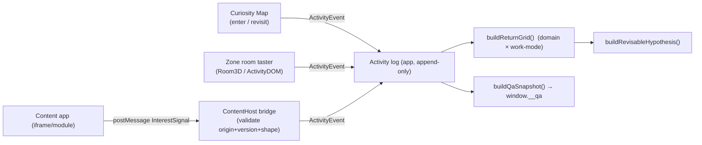

# Interest Lab — World Visual Bar (LAAS-level) + Content-Embedding Architecture

**Date:** 2026-07-21 · **Owner:** David · **Scope:** the *look* of the whole Discovery World (2D Curiosity
Map + bounded 3D zones) **and** the architecture that embeds per-domain, Brilliant-style content apps into
each zone. **Extends (does not replace):**
[`2026-07-21-interest-lab-world-design.md`](./2026-07-21-interest-lab-world-design.md),
[`2026-07-21-interest-lab-core-spec.md`](./2026-07-21-interest-lab-core-spec.md), and the three zone specs
([music](./2026-07-21-zone-music-design-v2.md) · [code](./2026-07-21-zone-code-design-v2.md) ·
[art](./2026-07-21-zone-art-design-v2.md)).
**Depth model:** [LAAS / `PROJECT_LAAS_v2.md`](https://github.com/Braffolk/fable5-world-demo/blob/main/PROJECT_LAAS_v2.md)
— reference frames, hard floors, banned outcomes, a reference-delta loop, and an anchored self-score.
**Grounding research:** [`stylizedWorldAssetPipeline.md`](../../research/stylizedWorldAssetPipeline.md),
[`interest-lab-hybrid-vs-full-3d.md`](../../research/interest-lab-hybrid-vs-full-3d.md),
[`interest-lab-world-precedents.md`](../../research/interest-lab-world-precedents.md),
[`passionBrainlift.md`](../../research/passionBrainlift.md), and
`gt100k-factory/docs/RESEARCH-visual-ux-qa-harness.md`.

---

## 0. TL;DR — what this doc decides

1. **The product is two layers.** (1) A **Discovery World** — a beautiful **2D Curiosity Map** (DOM,
   primary, accessible, the return-signal surface) + **bounded 3D zone rooms** (one persistent `<Canvas>`).
   The world is the **doorway + the interest signal**. (2) Per-domain **content apps** (Brilliant-style
   deep hands-on courses, e.g. [`blazing-audio-alpha.web.app`](https://blazing-audio-alpha.web.app/)) —
   the **deep learning**, launched *from* a zone.
2. **The visual bar is LAAS-deep but the target is inverted.** LAAS chases UE5 photoreal maximalism; we
   chase **cohesive, warm, hand-crafted stylized coziness that survives a school Chromebook**. Same
   discipline (reference frames, hard floors, banned outcomes, reference-delta loop, self-score); opposite
   ceiling. The reference set is **A Short Hike · Alba · Animal Crossing: New Horizons · Monument Valley ·
   Studio-Ghibli storybook · Stardew Valley · Chrome Music Lab** — every screen is judged 1-second-glance
   against them ([§A1](#a1-the-bar--reference-frames)).
3. **The art pack must pivot.** The in-repo tokens (`SCENE3D`, `PALETTE`) still encode the v1
   **midnight-cosmos** look (`bg #181026`, night-purple ambient). This is a **banned outcome** now. We keep
   the token *shapes* and `HUE_RAMP` (no code contract breaks) and swap the *values* to a **golden-hour,
   cozy-interior** pack ([§A4](#a4-the-3d-rooms--lighting-recipe-palette-atmosphere)).
4. **Content embedding = one contract, two backends.** Default v1: **sandboxed `<iframe>` of a
   separately-deployed content app** + a tiny **`@gt100k/interest-signal-client`** SDK speaking a frozen
   **postMessage `InterestSignal` protocol** (which *is* the core spec's `ActivityEvent`). Owned content we
   want maximally integrated can instead ship as an **in-repo lazy module** behind the *same* contract. The
   world stays the signal aggregator; the content app is a signal source. Reconciled with
   `@gt100k/interest-zone-kit` by adding an **optional** `ZonePlugin.content` + `<ContentHost>` + a content
   registry line — nothing existing breaks ([Part B](#part-b--content-embedding-architecture)).

---

# PART A — THE WORLD VISUAL BAR (LAAS-deep)

> **Theme + palette note (read together).** This Part A sets the *visual bar*; the concrete, locked theme
> that realizes it is **Emberwood** — a warm golden-hour hamlet of log cabins in a forest **clearing** (a
> central **Lodge + hearth** "you are here" plus the Sounding / Tinker / Atelier cabins). The canonical
> palette tokens (the warm `SCENE3D` pack, `MAP_COLOR_SCRIPT`, `CABIN`, `HUE_RAMP`) live in
> [`2026-07-21-world-art-direction-cozy-cabin.md`](./2026-07-21-world-art-direction-cozy-cabin.md) §3, and
> the concrete 2D surface in [`2026-07-21-world-clearing-and-map.md`](./2026-07-21-world-clearing-and-map.md).
> The hexes below have been **reconciled to the bible's canonical values**; where any framing or token here
> ever diverges, **the bible + clearing spec win.**

## A1. The bar (reference frames)

> The visual target is **best-in-class cozy stylized games and storybook illustration** — not "pretty good
> for a browser," and **not** a tech demo. Reference frames live in `passion/apps/interest-lab/reference/`
> (author them up front). Every phase is judged **against those images**, at a 1-second glance, on a
> Chromebook screen.

**Reference set (author one still from each; they anchor the delta loop):**

| Ref | What we steal from it |
|---|---|
| **A Short Hike** | warm golden-hour palette; soft low-poly cohesion; a small legible island you *read* instantly; gentle life |
| **Alba: A Wildlife Adventure** | Mediterranean warmth; readable stylized buildings; sunlit calm; ambient creatures |
| **Animal Crossing: New Horizons** | cozy inhabited world; rounded friendly forms; time-of-day warmth; wayfinding by building identity |
| **Monument Valley** | clean isometric geometry; flat confident color blocking; depth without clutter (the *map's* geometry language) |
| **Studio-Ghibli storybook** | painterly warmth; light as a felt thing; "a place you want to be" |
| **Stardew Valley** | cozy top-down legibility; each structure obviously *what it is*; homey clutter that reads, never noise |
| **Chrome Music Lab / Google Arts explorables** | one clear verb per surface; interactive warmth; "the thing on screen *is* the activity" |

**The inversion of LAAS (state it plainly so nobody builds the wrong thing):** LAAS's floors are *geometry
floors* (≥5M triangles, volumetric clouds, meshlet culling). **Ours are cohesion, light, legibility, and
motion floors under a hard draw-call *ceiling*.** On this hardware, beauty is **lighting + palette +
cohesion + composition**, not polygon count (the asset-pipeline core bet). A screen that is *dense* but
*incoherent, gray-lit, or illegible* is a **failed screen**, exactly as a flat 2010 terrain is a failed
LAAS screen.

**Two surfaces, two aesthetics that must feel like one place:**

- **The 2D Curiosity Map** — real **DOM** (SVG/CSS + baked sprites + `motion@^12`), **zero WebGL**. Primary,
  accessible, the return-signal surface. Reads like a **cozy isometric picture-book hamlet clearing** ([§A3](#a3-the-2d-curiosity-map--exactly-whats-on-screen)).
- **The bounded 3D rooms** — one persistent `<Canvas frameloop="demand">`, contents swap on enter/exit.
  Reads like a **warm, lived-in little cabin studio at golden hour** ([§A4](#a4-the-3d-rooms--lighting-recipe-palette-atmosphere)).

The bridge between them is **identity continuity**: the same building (same silhouette, same hue, same sign
glyph) that you see baked on the map is the room you step *into* ([§A5](#a5-transitions-map--room)).

## A2. The six pillars (adapted from LAAS, enforced)

Every requirement below serves one pillar; resolve any uncovered decision in favor of the relevant pillar.

- **A. Cohesion over geometry.** Mixed CC0 kits (Kenney + Quaternius + KayKit) must read as **one authored
  world**: one locked palette, one HDRI, one shading model, everything tinted to target. *Rule: sample any
  surface's hue — it must land in the locked palette (§A4). Untinted default-material gray is a fail.*
- **B. Warm light, no dead shadows.** Golden-hour key + **cool skylight fill**, so shadowed areas read a
  soft blue-violet from the sky, never muddy gray or black (LAAS Pillar B, adapted to cozy). *Rule: sample
  any shadowed pixel — if it is desaturated gray, lighting has failed.*
- **C. Nothing is sterile — the place is inhabited.** Every room has cozy dressing (a rug, a plant, a lamp,
  a mug, a sleeping cat, dust motes in a sunbeam, a half-finished thing on a shelf). The map has trees,
  lanterns, a pond, a bird, a wandering cat. *Rule: an empty-feeling room or a bare map is a fail — it must
  feel one-second-ago lived in.*
- **D. Legibility holds (our "distance holds").** One clear verb per screen; a domain reads as its domain in
  **≤1 second**; wayfinding ("you are here", labels, back-to-map) is always present (Quest-Atlantis /
  Dead-Space lessons). *Rule: a stranger glancing for one second can name the domain and the primary action,
  or the screen fails.*
- **E. Art direction / color script.** A per-surface, per-time color script exists and is enforced (warm
  golden-hour split: warm lit surfaces vs cool-tinted shade). Restrained saturation; value structure (calm
  mids, one focal glow). Camera framings are **composed**, fixed, never found.
- **F. The world breathes.** Ambient motion everywhere it's cheap: `<Float>` on hero props, foliage sway, a
  looping playhead, dust motes, a bird arc, a lantern flicker. A frozen frame should feel one second from
  motion. **Reduced-motion is honored absolutely** (instant, no essential motion).

## A3. The 2D Curiosity Map — exactly what's on screen

**The shot.** A **cozy isometric picture-book clearing** in a golden-hour forest, lit by a low raking sun.
A central **Lodge with a lit stone hearth** ("you are here") anchors it; a soft dirt **path** (`#D8B888`)
winds out to the cabins; a little **pond** (`#8FC7CE` with one warm sun-glint) sits off to one side;
**rounded pines, a few lanterns, tufts of grass, a wandering cat and an occasional bird** dress the space.
Along the path sit the **domain buildings — one cabin per domain**, each an unmistakable little workshop.
Long, soft, **blue-violet** shadows (`#5E5880`) stretch off everything (never gray/black). The sky is a
warm cream-to-peach vertical gradient (`#FCEAC2 → #F4B074`). It looks like a place a child wants to walk
around in at the end of a good day.

**Layout (drives, and is driven by, `MapBuildingView.cell`).** Buildings sit on a gentle isometric grid;
`buildCuriosityMapView` sorts by `(cell.row, cell.col)`. v1 = three cabins along the winding path: the
**Sounding Cabin** (Music) `(0,0)`, the **Tinker Workshop** (Code) `(1,0)`, the **Atelier Cabin** (Art)
`(2,0)`. The composition is designed to **grow**: new domains extend the hamlet (more path, a second
cluster, a footbridge over the stream) without a redesign — the clearing has visible "room to grow."

**How each zone reads as its own domain (Pillar D — the whole point).** Each building is distinguished on
**four independent channels** so it's legible even to a color-blind child at a glance:

| Cabin (domain) | Domain hue (`HUE_RAMP`) | Silhouette / roof | Sign glyph | Signature dressing |
|---|---|---|---|---|
| **The Sounding Cabin** (Music, `sound_music`) | terracotta `#E8825A` | snug log cabin w/ a **gramophone-horn cupola** + stone chimney | ♪ note on an iron bracket | the warmest amber window; notes drifting up with the chimney smoke |
| **The Tinker Workshop** (Code, `symbols_math`) | sage-green `#5FB98C` | a **greenhouse-workshop** (glass gable roof, gear-sprout weathervane) | a cog sprouting a leaf | potted sprouts, a lantern, a wind-up bot on the porch |
| **The Atelier Cabin** (Art, `visual_design`) | periwinkle `#6C8CE8` | gable cabin w/ a **north-light skylight** + an easel on the porch | a paintbrush + frame | a hanging painting, a paint-splash doormat, the cool dusk-lit window |

**Art style + how it's actually built (Chromebook-safe, accessible, coder-buildable).** The map is **DOM,
not a canvas**. Achieve the "3D-looking" cozy clearing by **baking**, offline, an isometric ortho render of
each building **from the same CC0 kit through the same warm art pack** used by the rooms → export to
`webp/png` sprite (+ a lit ground/pond/path plate). Compose in DOM: layered ``/SVG for
sky→ground→shadows→buildings→foliage→light-motes, with `motion@^12` for parallax + idle motion. This gives
**baked-illustration quality with real DOM semantics** and identity-continuity with the rooms (same
buildings, same light), at ~0 GPU cost. (Vector/CSS-only is the fallback if baking is deferred.)

- **Each building is a real focusable `<button>`** (roving-tabindex; `ArrowLeft/Right/Up/Down` moves focus
  one building at a time — never a steered cursor). Label + one enter-verb + return-cue are DOM text, not
  baked into the sprite. This is the accessibility floor **and** the primary surface — never `aria-hidden`.

**Wayfinding (legible for 8–14, per the precedents memo).**

- **Label + one verb** under each building: "**Music Studio** · *Step inside*" (World-1-1 clarity, one verb) — the
  `label` is the plain **craft name** (the button text + `ariaLabel` prefix; core §8.6); the evocative cabin name
  ("The Sounding Cabin") rides on the cabin's **sign** and in prose, never the button.
- **"You are here"** never ambiguous: the map is home; a soft footprint/marker shows last-entered building.
- **Return-glow (the signal, made visible but NOT gamified):** a building the child came back to *unprompted*
  gets a gentle warm halo (`voluntary-return`); a prompted return gets a cooler, quieter cue
  (`prompted-return`); a first visit shows a fading "new" shimmer (`explored`). **No number, streak, star,
  or score ever sits on a building** (guardrail; passion brainlift Insight 5).
- **"Your half-built thing is still here"** — an `unfinished` building shows a single soft glint at its
  window (opt-in invite to revisit, never a countdown).
- **The time-lapse control** ("Right now → A week later… → A month later…") is a labeled DOM control on the
  map; stepping it **visibly quiets** the clearing (the "new" shimmers fade, the light lowers a notch toward
  dusk, the fireflies come out) then asks what the child drifts back to — the honest synthetic-return device,
  on screen.

**Map color script (concrete).**

```
# canonical MAP_COLOR_SCRIPT — see art bible §3.4 (single source; values reconciled)
skyTop #FCEAC2   skyLow #F4B074          (warm cream → peach, golden hour)
ground-lit #C9B583   ground-shade #8E8A5E   grassTuft #9FB56A
path #D8B888   pathPlank #B98A5E   pond #8FC7CE (+ #FFD8A0 glint)
soft shadow #5E5880 @ 22–34% alpha        (blue-violet, NEVER gray/black — Pillar B)
building hues = HUE_RAMP (music #E8825A · code #5FB98C · art #6C8CE8)
accents: lantern #FFD166 · window #FFC08A · spark/hearth #FF9E5E   (MAP_COLOR_SCRIPT / PALETTE)
```

## A4. The 3D rooms — lighting recipe, palette, atmosphere

**The pivot (this is a required change).** The shipped tokens encode the v1 midnight look
(`SCENE3D.bgHex/fogHex = #181026`, `ambientHex #3A2E5C` night-purple). That is now a **banned outcome**
([§A7](#a7-banned-outcomes--instant-fail)). Keep the **`Scene3DView` shape and `HUE_RAMP` unchanged** (no
code contract breaks; the map goldens `#E8825A/#5FB98C/#6C8CE8` stay valid) and **swap the values** to a
**golden-hour cozy-interior** pack. Add the pack as the new `SCENE3D` (and note it may be exposed as a named
`SCENE3D_WARM` if the night pack must linger behind a flag for a transition).

**The warm art pack (concrete `Scene3DView` values):**

```ts
const SCENE3D = {                          // canonical warm pack — single source: art bible §3.2
  bgHex:  "#E6D2A2",   // golden-hour forest haze past the window   (was #181026)
  fogHex: "#E0C79A",   // warm honey fog, palette-matched            (was #181026)
  fogNear: 14, fogFar: 46,                 // unchanged: bounded room depth
  ambientHex: "#52402E", ambientIntensity: 0.38,   // low warm cocoa ambient (was night-purple)
  hemiSkyHex:    "#A9C2E8",   // COOL dusk-blue skylight  → shadows tint blue-violet (Pillar B)
  hemiGroundHex: "#C67B48",   // WARM rust/wood + firelight floor bounce
  hemiIntensity: 0.52,
  keyHex: "#FFD8A3", keyIntensity: 1.2, keyPos: [6,8,5],  // low RAKING golden-hour sun = long soft shadows
  toneMapping: "ACESFilmic", exposure: 1.05,
  markerEmissiveHex: "#FF9E5E", markerEmissiveRest: 0.35, markerEmissivePulse: 0.5, // spark glow, kept
  bloomPeak: 1.4,
};
```

**Lighting recipe (asset-pipeline §4, one authored setup fed to every zone loop).**

1. **One self-hosted CC0 HDRI** (warm interior / golden window, Poly Haven 1–2K) via drei `<Environment>` —
   the single source of ambient + reflections, so every mixed-kit prop is lit identically (Pillar A).
2. **One key `directionalLight`** = `keyHex/keyIntensity/keyPos` — a **low, warm, raking** window sun (long
   soft shadows, the golden-hour read).
3. **Cool hemisphere/ambient fill** (`hemiSkyHex` blue over `hemiGroundHex` warm) so **no shadow goes dead**
   — the cozy analog of LAAS's no-black-shadows law (Pillar B).
4. **Frozen shadows only:** `<ContactShadows frames={1}>` grounding the hero prop + `<BakeShadows>`
   elsewhere; **≤1 shadow-caster**, never per-frame (Chromebook tax).
5. **Palette-matched fog** (`fogHex`) ties disparate kit pieces into one atmosphere and hides the far clip
   (asset-pipeline §4.6) — used for cohesion, **never** to hide draw distance.
6. **One shading model** across all assets (flat PBR *or* toon) tinted to the palette; the per-zone **domain
   hue carries from the map** into the room's accent lighting + sign, so identity is continuous.
7. **Post (shared `EffectComposer`, renderer `NoToneMapping`):** `Bloom(mipmapBlur, luminanceThreshold ~1.0)`
   for the emissive glow (the playhead, the goal, the "it's alive" light) + `Vignette` + `ToneMapping(ACES)`;
   **SMAA not MSAA**. 2–3 passes, no more.

**What a room looks like on screen (the Sounding Cabin — Music, concretely).** The Canvas swaps to a **warm
firelit cabin studio**, fixed camera framing a low console head-on (fov ~40–42, `CAMERA3D` orbit clamps). A **golden shaft**
from a window rakes across the desk; **dust motes** drift in it (`<Sparkles>`, sparse). A **pad grid**
(one `InstancedMesh`, 1 draw call) sits center; lit pads **breathe** with `emissiveIntensity` and a
**luminous playhead** sweeps in time. A **shelf of glowing little cassettes** (the saved-loops artifact)
lines the wall; a **sleeping cat** and a plant dress the corner. Long soft blue-violet shadows ground
everything. **One obvious primary verb** ("tap a pad"). It looks like Chrome Music Lab crossed with a cozy
A-Short-Hike interior — warm, alive, and unmistakably a *music* room.

**Camera:** fixed and **composed** (dark-ish framed foreground → lit subject → warm hazy background — the
LAAS value structure, cozy version); no free-fly, no orbit-that-loses-you; reduced-motion → instant framing.

## A5. Transitions (map ↔ room)

- **Doorway metaphor with identity continuity.** Selecting a building reads as *walking through its door*:
  the building's **hue + sign glyph carry** from the map tile into the room's light + signage, so the child
  never loses "where am I / how do I get back."
- **DOM → Canvas crossfade on the zone hue.** The map (DOM) fades under a brief zone-colored doorway wipe;
  the room (Canvas) fades up **once ready**. The constant across the cut is the domain hue → felt continuity.
- **Persist one Canvas; preload under the doorway.** Kick off the (small) room GLB load as the doorway
  animation plays; reveal the room only when ready (Mario-Party "lightweight assets + no hitch"). **Never
  remount the Canvas** — contents swap (the single hard rule from the hybrid research; core spec SC-CORE-08).
- **Cover the warm-up.** The ~1 doorway beat hides Canvas/first-frame warm-up; `frameloop="demand"` means an
  idle room burns ~0 thermal budget.
- **Always a persistent, obvious "← Back to the map."** Never trapped; keyboard-first; the map is home.
- **Reduced-motion = instant cut**, no exceptions.

## A6. Chromebook floors + ceilings (hard numbers — pass or the screen fails)

| Budget | Room (3D) | Map (DOM) |
|---|---|---|
| **Draw calls / frame** | **≤ 50** (hard cap 80) | n/a (DOM) |
| Visible triangles | ≤ ~300–500k | n/a |
| Pixel ratio (`dpr`) | ≤ 1.5 | device |
| Shadow-casters | ≤ 1 (frozen) | baked into sprite |
| Post passes | 2–3 (Bloom+Vignette+ACES) | CSS only |
| Textures | props 256–512²; hero ≤1024²; KTX2 | baked sprites webp, sized to grid |
| Frame rate | 60 target / **≥30 sustained** on iGPU under 10-min load | 60 (DOM) |
| Initial download | GLBs KB–low-MB (Kenney-scale), Meshopt+KTX2 | sprites lazy per-zone |
| Motion when idle | `frameloop="demand"` → ~0 GPU | idle loop cheap/paused offscreen |

**Per-room must-haves (all required, none optional):** one obvious primary verb · one HDRI · warm key + cool
fill (no dead shadow) · palette fog on · ≥1 piece of ambient motion · ≥3 cozy dressing elements · a
`<50`-draw-call budget met · `window.__qa` present and the primary action provably live.

## A7. Banned outcomes — instant fail

Adapted from LAAS §9 + the v1 post-mortem + the passion guardrails. Any one of these fails the screen:

- **The v1 failure, in any form:** a large **`aria-hidden` canvas as the primary surface with no DOM peer**;
  **dead/decorative interactives** (a click/tap that changes nothing — proven by a `stateHash()` that
  doesn't move); a **"pretty door in front of a quiz/form"** (the activity is not the mechanic).
- **Dead lighting:** gray or black shadows; flat, ambient-only rooms; blown-out or muddy exposure.
- **Incoherence:** mixed CC0 kits at different scales/palettes, **untinted**; visible default
  `MeshStandardMaterial` gray; visible texture tiling; `MeshBasicMaterial` in a room.
- **The v1 aesthetic:** **midnight / outer-space / moody** palettes (the shipped `#181026` pack). The world
  is **warm, cozy, daytime**. Moody is a fail.
- **Illegibility:** a building you can't identify as its domain in 1 second; a room with no obvious primary
  action; **tutorial-text walls** (teach by affordance, World-1-1).
- **Chromebook slideshow:** >50 draw calls, `dpr>1.5`, per-frame shadows, unbounded/streamed world assets,
  or sustained <30fps.
- **Camera crimes:** free-fly / orbit-that-loses-you; **remounting the `<Canvas>` per room**; fog used to
  hide the far clip.
- **Signal crimes (guardrails):** any **streak / point / XP / score / countdown / FOMO** on a building, an
  artifact, or on returning; any **fixed label** ("you are a musician"); celebrating a **prompted** return.
- **Accessibility crimes:** an accessible path that is a **lesser flat menu** instead of a true peer that
  preserves *choosing what to revisit* (Surveyor); color-only state; essential motion under reduced-motion.

## A8. Self-score rubric (anchored to the references)

Per row: **10** = passes a one-second glance beside A Short Hike / Alba / Chrome Music Lab at 1080p on a
Chromebook; **7** = clearly synthetic but the *same class* of image; **4** = decent hobby demo; **2** =
2010 tech demo / a pile of default-material CC0 assets. **Score every phase; for each row write "what
raises this +2"; implement the two cheapest before proceeding** (the LAAS loop).

Rows: **map cohesion & warmth · building legibility (domain-at-a-glance) · room coziness & dressing · light
transport (warm key + cool fill, no dead shadow) · palette / color-script discipline · primary-action
obviousness · ambient motion & life · map↔room transition polish · accessibility parity · Chromebook perf.**

## A9. Verification battery (scripted; reuses `window.__qa` + the VLM grader)

Run at every phase close (integrates the QA-harness upgrades already specified in the core spec + factory
research):

1. **Reference-delta loop (mandatory).** Render the closest shot, place it beside the matching reference,
   write `DELTA.md`: the **ten most significant differences**, ranked. **Fix the top three. Re-render.**
   Only then does the phase close.
2. **Shadow-color test.** Sample N shadowed pixels (room + map); chroma must show warm/cool tint (blue-violet
   from skylight), **never desaturated gray** (Pillar B).
3. **Cohesion / palette test.** Sample surface hues across a scene; each must land within the locked palette
   (Pillar A) — catches untinted kit-pile gray model-free.
4. **Primary-action-live test.** For every room + map building: raycast/pointer round-trip → assert
   `window.__qa.stateHash()` **changes** (core spec SC-CORE-14; a dead primary action **hard-fails**).
5. **Legibility VLM rubric.** Reference-free binary checks on a screenshot (+ before/after pair for
   interactions): *is the domain nameable in 1s? is the primary action obvious? does every interactive thing
   do something?* — pinned model, N epochs + majority vote, deterministic pixel/DOM pre-filters in front.
6. **Perf HUD check.** Draw calls, fps p95, dpr, shadow-casters vs the [§A6](#a6-chromebook-floors--ceilings-hard-numbers-pass-or-the-screen-fails) floors, on a real low-end
   device under sustained load (throttling only shows after minutes).
7. **Contact sheet.** Map (golden hour, a return-glow present) · each room's hero framing · a map↔room
   transition still · the reduced-motion/`board-2d` a11y floor of one zone.

## A10. Final acceptance — the two-frame test (ours)

Produce two frames and place each beside its reference:

1. **The Curiosity Map at golden hour** — three distinct, instantly-legible cabins along a warm path, a
   pond, trees, a cat, long blue-violet shadows, and a gentle **return-glow** on one building. *(Ref: A
   Short Hike / Alba.)*
2. **A cabin interior (the Sounding Cabin — Music)** — a warm window shaft with dust motes, a **glowing pad grid mid-beat**
   with a sweeping playhead, a shelf of saved loops, a sleeping cat, and **one obvious primary verb**.
   *(Ref: Chrome Music Lab × A-Short-Hike interior.)*

If a viewer's eye snags within one second on a **category error** — dead/gray shadows, default-material gray,
an incoherent kit-pile, a building whose domain is unclear, no obvious action, or a moody/night palette —
**the task is not done. Iterate.** Then, and only then, the operator free-explores on `localhost` for the
final human sign-off (SC-CORE-16).

---

# PART B — CONTENT-EMBEDDING ARCHITECTURE

## B1. The two layers — where the content app sits

The world and the content apps are **different jobs**, and conflating them is what to avoid:

| | **World zone room** (`ZonePlugin.Room3D` / `ActivityDOM`) | **Content app** (e.g. Blazing Audio) |
|---|---|---|
| Role | The **doorway + the interest signal** | The **deep learning** |
| Depth | A short, cozy, always-sounds-good **taster** (the Groovebox, the Garden Board, the Storybox) | A full Brilliant-style **course** (many hands-on lessons) |
| Lives in | the world (one persistent `<Canvas>` / DOM) | its own app (own stack, own deploy) |
| Signal it gives | *which zone entered, which taster work-modes touched, whether they came back* | *depth, in-course voluntary return, artifacts, work-modes at depth* |
| Always available? | **Yes** — it's the floor (and the a11y floor) | Optional / launched when the child goes deeper |

**The flow:** child wanders the **map** → steps into a **zone room** (bounded 3D taster; emits
`{domain, workMode}` signal) → sees a clear **"go deeper" affordance** (a door / a desk / a "big project"
portal) → the zone **launches the per-domain content app** full-surface → the content app teaches deeply and
**emits the same signal** back → child exits to the world; the map records the visit and (later, unprompted)
the **voluntary return**. The world is the **doorway + signal aggregator**; the content app is a **signal
source that speaks the world's contract**.

## B2. Decision — embedded module (route) vs iframe vs separate deployment

**Constraints that decide it:**

- The content apps **already exist as separate deployments** with their own stack + auth (Blazing Audio is a
  Firebase SPA with email/Google login). Forcing them into our Next.js app is a rewrite.
- The whole point is **parallel buildability**: 1 world team + N content-app teams, independent cadences.
- **WebGL context budget** (~8–16/page, no sharing): the world's persistent `<Canvas>` and a content app
  that has its own canvas must **not** both be live-and-resident at once.
- **Accessibility + children's-data**: content apps must meet WCAG 2.2 AA and must not put an account/PII
  wall in front of a child launched from the world.

| Option | Isolation | Parallel-build | A11y integration | Perf / WebGL | Signal wiring | Verdict |
|---|---|---|---|---|---|---|
| **In-repo lazy module/route** | low (shared bundle) | low (content teams on our stack) | **best** (one DOM, one focus tree) | shares our context; must cooperate | direct event bus | **Owned-content optimization** |
| **`<iframe>` of a separate deployment** | **high** (crash/perf/WebGL contained) | **best** (any stack, own deploy) | good *with* a focus contract | separate context; world Canvas suspended | postMessage bridge | **v1 DEFAULT** |
| **Pop-out / new tab** | highest | best | **poor** (loses the world; back-nav hostile) | separate | fragile | Rejected (breaks the doorway) |

**Verdict:** ship **one Content Module Contract with two backends**. Default v1 = **sandboxed `<iframe>` of
the separately-deployed content app** + the signal SDK. Content **we own and want maximally integrated** may
implement the *same* contract as an **in-repo lazy module** (`next/dynamic`, `ssr:false`) later, with zero
change to the world or the signal engine. Both look identical to the world (`ContentLaunch`), the guide, and
the QA harness.

## B3. The Content Module Contract (extends `ZonePlugin` + `@gt100k/interest-zone-kit`)

Add **one optional field** to the frozen `ZonePlugin` (backward-compatible — zones without deep content are
unaffected; the core spec's `ZonePlugin` stays valid):

```ts
// @gt100k/interest-zone-kit  (react/three-aware seam; already the home of ZonePlugin, CanvasHost, ZoneRoom)
export interface ZonePlugin {
  /* …existing: id, domain, mapBuilding, Room3D, ActivityDOM, probes … (unchanged, still frozen) */
  content?: ContentModule;          // NEW, OPTIONAL: the deep per-domain course
}

export type ContentModule =
  | { kind: "iframe";  src: string;               // separate deployment (v1 default)
      title: string; allow?: string;              // iframe `allow` (e.g. autoplay for audio courses)
      probeMap: ContentProbeMap; }
  | { kind: "module"; load: () => Promise<{ default: React.FC<ContentModuleProps> }>; // in-repo lazy route
      title: string; probeMap: ContentProbeMap; };

/** How a content app's own lesson ids resolve to grid cells, so the world can attribute its signal. */
export interface ContentProbeMap {
  domain: Domain;                                  // must equal ZonePlugin.domain
  /** contentAction/lessonId → { workMode, probeId } — the zone author owns this map. */
  resolve: (contentAction: string) => { workMode: WorkMode; probeId: string } | null;
}
```

**`<ContentHost>` (new, in the kit).** A single component that:

1. **Suspends (does not destroy) the world `<Canvas>`** when a content app is foregrounded — hide it +
   `frameloop` off, so its WebGL context/thermal budget is freed for the content app's own canvas; restore
   on exit. (Never remount — same rule as `ZoneRoom`.)
2. Mounts the content: `kind:"iframe"` → a **sandboxed** `<iframe sandbox="allow-scripts allow-same-origin
   allow-forms" allow=…>` in a full-surface content area; `kind:"module"` → the lazy React component. Either
   way it's wrapped in **persistent world chrome** (a "← Back to the world" bar + the zone hue/sign, so
   identity continuity holds — [§A5](#a5-transitions-map--room)).
3. Runs the **signal bridge** ([§B4](#b4-the-interest-signal-protocol--the-frozen-cross-boundary-seam)) and
   the **focus/a11y handoff** ([§B6](#b6-accessibility-across-the-boundary)).

**The single merge point (mirrors the core spec §10).** A content app is wired by **one registry line** —
either inline on the plugin, or (for iframe apps owned by other teams) a `content-registry.ts` array the
world app composes. This is the *only* shared-root file a content-app team touches — the same "one expected
merge conflict point" discipline as `app/zones.ts`.

```ts
// passion/apps/interest-lab/app/content-registry.ts   — the ONE content merge point
export const CONTENT: Record<ZoneId, ContentModule> = {
  music: { kind: "iframe", src: "https://blazing-audio-alpha.web.app/embed",
           title: "Blazing Audio", allow: "autoplay",
           probeMap: audioContentProbeMap },
  // code, art added by their teams, same shape
};
```

## B4. The interest-signal protocol — the frozen cross-boundary seam

**One schema, imported by both sides, versioned, tiny.** The content app emits **the core spec's
`ActivityEvent`** — nothing new to learn — wrapped in a small envelope over `postMessage`. Ship it as
`@gt100k/interest-signal-protocol` (pure types + validators, **zero runtime deps**, no react/three) so both
the kit and the content-app SDK depend on it.

```ts
// @gt100k/interest-signal-protocol  (framework-free, importable anywhere)
export const SIGNAL_PROTOCOL_VERSION = "1";

/** World → content, on launch (the handshake). NO PII — learnerRef is an opaque token. */
export interface ContentLaunchContext {
  v: "1";
  learnerRef: string;        // opaque, PII-free (the world is the identity layer — no account wall)
  launchToken: string;       // short-lived signed token authorizing embedded/no-signup mode
  domain: Domain;
  dayOffset: number;         // time-lapse phase (0 | 7 | 30) — the ONLY notion of time (core spec §3.3)
  seed: number;              // determinism for QA
  reducedMotion: boolean;
  tier: "full" | "lite";     // perf budget hint
  returnVisit: boolean;      // world already knows if this is a revisit
}

/** Content → world: exactly the core spec ActivityEvent, wrapped + validated. */
export interface InterestSignalMessage {
  v: "1";
  type: "interest-signal";
  event: ActivityEvent;      // { zoneId, probeId, domain, workMode, action, kind, dayOffset, intervention?, assistive?, withdrawn? }
}

/** Content → world: lifecycle (readiness, exit, and the QA snapshot passthrough). */
export interface ContentLifecycleMessage {
  v: "1";
  type: "ready" | "exit" | "qa";
  qa?: unknown;              // the content app's own window.__qa snapshot (for the harness, §B6)
}
```

**The SDK the content apps drop in — `@gt100k/interest-signal-client`.** ~1 file, no deps, **stack-agnostic**
(so Blazing Audio stays Firebase/whatever). It: reads the launch context, exposes `emit(event)` and
`exit()`, does `origin`-checked `postMessage`, and no-ops gracefully when run standalone (so the content app
still runs on its own domain for its own team's dev/QA).

```ts
// in the content app (any framework):
import { connectInterestSignal } from "@gt100k/interest-signal-client";
const signal = connectInterestSignal({ expectOrigin: "https://interest-lab.gt100k…" });
// signal.context -> ContentLaunchContext | null (null when standalone)
signal.emit({ zoneId: "music", probeId: "audio.filters.hpf", domain: "sound_music",
              workMode: "investigate", action: "solved-filter-puzzle",
              kind: "artifact", dayOffset: signal.context?.dayOffset ?? 0 });
```

**Why this shape:** the content app never imports the engine, the kit, or react-three (dependency graph stays
clean, like the zone zero-cross-dependency invariant); it only needs the **protocol + client**. The world
validates every inbound message (version + origin + shape) and drops malformed ones — the content app is
**untrusted input** by construction.

## B5. Signal capture across BOTH world and content app

The construct is unchanged — a **`domain × work-mode` return grid** fed by `ActivityEvent`s, with the
**novelty gate** and **prompted-return exclusion**, producing the **revisable hypothesis**. Now events
arrive from **two sources**, both normalized into the same log:

- **World-observed events (the doorway signal).** Entering a building, touching taster work-modes, opening
  the content app (a `content-open` action), and — critically — the **map building revisit** at
  `dayOffset ≥ 7` (`kind:"return"`). The world emits these directly (as today).
- **Content-app-emitted events (the depth signal).** The course emits `ActivityEvent`s via the SDK:
  `explore` (novelty, day 0), `artifact` (finished a hands-on lesson), `revise`/`challenge`/`recover`/
  `author-scope`, and — the gold signal — a **voluntary `return`** *inside the course* at `dayOffset ≥ 7`
  with no `intervention`. The content app maps its own lesson ids → `{workMode, probeId}` via its
  `ContentProbeMap`, so the world attributes each event to the right grid cell **without the world knowing
  anything about the course internals**.



- **Voluntary return is captured at two depths and both count the same way:** a *building* revisit (world)
  and a *course* revisit (content). Both are just `kind:"return"`, `dayOffset ≥ 7`, `intervention===undefined`
  → `voluntaryReturns++` in the cell. Prompted/rewarded returns from *either* layer carry `intervention` and
  are excluded identically (core spec §4.2). **The row-vs-column read is strengthened**, because the content
  app is where deep work-modes actually get exercised (a child who *investigates* deeply in Blazing Audio
  **and** in a code course lights the `investigate` column across domains — the exact disambiguation the
  precedents memo wants).
- **Guardrails travel across the boundary unchanged:** the content app must send `assistive:true` for help,
  must never send a `score`/`rank`/label (the world's guardrail scan still runs on the *grid/hypothesis*,
  which never ingest such fields), and its returns are novelty-gated by the world, not self-declared as
  signal. The content app **cannot** promote a hypothesis — it only contributes evidence; the guide still
  authors the operative revision (IL-011).

## B6. Accessibility across the boundary

- **The content app ships its own WCAG 2.2 AA** (it's a full app): keyboard, screen-reader, reduced-motion
  (honored via the launch `reducedMotion` flag), color-independent state. This is a **conformance gate** to
  be listed in the registry ([§B7](#b7-parallel-buildable-world-team-vs-n-content-app-teams)).
- **Focus handoff.** On launch, `<ContentHost>` moves focus into the content region and announces the context
  change; on exit, focus returns to the building the child launched from. A **persistent, never-trapped
  "← Back to the world"** control lives in the parent chrome (keyboard-reachable even if the iframe misbehaves).
- **Embedded, no-account launch (children's-data).** Content apps must support an **embedded mode** driven by
  `ContentLaunchContext` (opaque `learnerRef` + short-lived `launchToken`) that **bypasses any signup/login
  wall** and collects **no PII** — the world is the identity layer. (Blazing Audio's email/Google wall is
  suppressed under an embedded launch.)
- **The world's own a11y floor is untouched.** The **map is always DOM** (the navigation + a11y floor), and
  each zone's **`ActivityDOM` taster** remains the first-class accessible peer of `Room3D`. If a content app
  is unavailable, fails conformance, or WebGL/network is absent, the zone **gracefully degrades**: the
  "go deeper" affordance points at the zone's own `ActivityDOM`/lite activity, and **the signal still flows**
  (the world event source never depends on the content app). No child hits a dead end.
- **QA across the frame (reuses the harness).** The content app exposes **its own `window.__qa`** (the LAAS
  `__laas`/core-spec `window.__qa` pattern: `ready`, `error`, `settle()`, `stateHash()`, `interactives()`);
  the world's harness drives it *through* the frame via the `type:"qa"` lifecycle message, so the
  primary-action-live test, pointer/raycast round-trip, and VLM legibility rubric run **inside the content
  app too**. A content app with a dead primary interaction fails the gate exactly as a dead room does.

## B7. Parallel-buildable (world team vs N content-app teams)

The same "frozen seam + single merge point" philosophy that lets 3 zone loops run at once now lets **1 world
team + N content-app teams** run at once:

| Lane | Owns | Depends on (only) | Deploys |
|---|---|---|---|
| **World / core** | `interest-lab-app`, `interest-zone-kit` (map, `CanvasHost`, `ZoneRoom`, **`ContentHost`**, signal engine), `interest-signal-protocol` | its own packages | the world (Next.js) |
| **Zone loops 1–3** (existing) | `interest-zone-{music,code,art}` (taster `Room3D`/`ActivityDOM`/`probes` + the zone's `ContentProbeMap`) | `interest-zone-kit` + `interest-lab` (types) | with the world |
| **Content-app teams 1–N** | each their own repo/app (e.g. `blazing-audio`) | **only** `@gt100k/interest-signal-protocol` + `@gt100k/interest-signal-client` (+ the frozen protocol version) | **their own host, own cadence** (Firebase, etc.) |

- **Frozen seam:** once `SIGNAL_PROTOCOL_VERSION` + `ContentLaunchContext` + `ActivityEvent` are green, they
  freeze; content teams build against the version and never touch world code.
- **Single merge point:** a content app integrates via **one line** in `content-registry.ts` (URL + title +
  `probeMap` + conformance flags). CODEOWNERS gives each content team its own repo; the registry line is the
  one shared touch.
- **Stack-agnostic:** content teams keep their own stack, auth, and pipeline. They must only (a) speak the
  protocol via the client SDK, (b) support the embedded no-account launch, (c) expose `window.__qa`, and
  (d) pass the a11y conformance gate. That's the entire contract.

## B8. Reconciliation — what changes, what doesn't

**Unchanged (all frozen contracts hold):** the `ZonePlugin` core fields, `RoomProps`, the `ActivityEvent`
shape, `buildReturnGrid` / `buildRevisableHypothesis` / the novelty + prompted gates, the `window.__qa`
shape, the single-persistent-`<Canvas>` rule, the DOM-map-is-primary rule, and every guardrail (no
score/rank/label; help never lowers; prompted return recessed). The core spec's lane-0 build is **not**
invalidated.

**Added (all additive/optional):**

| New | Package | Notes |
|---|---|---|
| `ZonePlugin.content?` + `ContentModule` + `ContentProbeMap` | `interest-zone-kit` | optional field; zones without deep content unaffected |
| `<ContentHost>` (suspend-canvas + mount + bridge + focus) | `interest-zone-kit` | mirrors `CanvasHost`/`ZoneRoom` discipline |
| `interest-signal-protocol` (types + validators) | **new**, framework-free | the frozen cross-boundary schema; `ActivityEvent` re-exported |
| `interest-signal-client` (the drop-in SDK) | **new**, zero-dep | what content apps import; no react/three |
| `content-registry.ts` | `interest-lab-app` | the one content merge point |
| Warm art pack values | `interest-lab-view` (`art.ts`/`scene.ts`) | value swap only; `Scene3DView`/`HUE_RAMP` shapes unchanged (§A4) |

**Naming nit to reconcile with the design:** the shipped `RenderTier` literals are `quest-world-3d*`; the
world redesign speaks of `room-3d*`. Alias/rename in a follow-up (view-layer only) — cosmetic, out of this
doc's critical path.

## B9. Build order + freeze points

Runs **after** core lane-0 is green; parallel with the zone loops.

1. **Warm art pack (P-A0).** Swap `SCENE3D`/`PALETTE` values to the golden-hour pack; author the reference
   frames; stand up the reference-delta tool + shadow-color/cohesion tests. *(Gate: [§A9](#a9-verification-battery-scripted-reuses-windowqa--the-vlm-grader) 1–3 on a stub room + the map.)*
2. **Curiosity Map to bar (P-A1).** Bake the iso building sprites through the pack; build the DOM map
   (buttons, wayfinding, return-glow, time-lapse). *(Gate: two-frame test frame 1; SC-CORE-09/10.)*
3. **One room to bar (P-A2).** Take one zone taster to the full lighting recipe + coziness + transition.
   *(Gate: two-frame test frame 2; primary-action-live; perf floors.)*
4. **Signal seam (P-B0).** Ship `interest-signal-protocol` + `interest-signal-client`; **freeze**
   `SIGNAL_PROTOCOL_VERSION` + `ContentLaunchContext`. *(Gate: a stub content page emits an `ActivityEvent`
   that lands in `buildReturnGrid` via the bridge; origin/version validation tested.)*
5. **ContentHost (P-B1).** `ZonePlugin.content?`, `<ContentHost>` (suspend-canvas + iframe mount + bridge +
   focus handoff + back-to-world chrome) + `content-registry.ts`. *(Gate: launch a stub content iframe from a
   zone; world Canvas suspends/restores; focus in/out; QA passthrough works.)*
6. **First real content app (P-B2).** Wire one deployed content app (Blazing Audio → `music`) in embedded
   no-account mode; run the a11y conformance gate + the QA harness through the frame. *(Gate: [§B6](#b6-accessibility-across-the-boundary)
   conformance; voluntary-return-inside-content lands on the correct grid cell.)*

**Freeze after P-B2:** the Content Module Contract (`ContentModule`, `ContentLaunchContext`,
`InterestSignalMessage`, `SIGNAL_PROTOCOL_VERSION`) is frozen; content-app teams lock to it.

---

## Appendix — open decisions (record in `.loop/decisions.md`, escalate only if a golden/SC breaks)

- **`launchToken` mechanics** (issuer, TTL, signing) — pick the simplest correct option for synthetic v1
  (an opaque per-session token; no real auth backend yet).
- **iframe vs module for `code`/`art`** — default iframe; switch to in-repo module only if a team wants max
  a11y/perf integration and will build on our stack.
- **Map baking cadence** — bake sprites in CI from the CC0 kit + warm pack, or hand-place vector fallback if
  baking is deferred; either way the map stays DOM.
- **Night pack retirement** — delete `#181026` values, or keep them as `SCENE3D_NIGHT` behind a flag during
  the transition (default must be warm).
