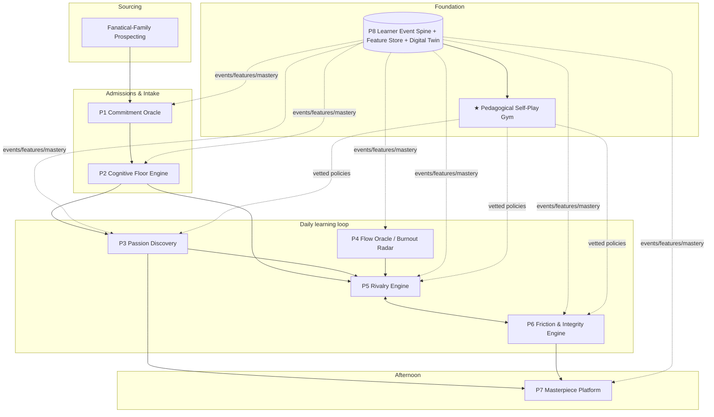

# gt100k — The Non-Core Architecture

### Portfolio-defining engineering projects to move 100,000 8th-graders to MIT-level readiness

*A systems-architecture + AI-product proposal. Scope: the **non-core levers** — everything except the already-solved morning academic core. Every proposal names real algorithms/papers and maps to the [Engineering Skills & Project Matrix](impactful.md) by number `[n]`. Grounded in the five spiky positions of the [Brainlift](gtBrainlift.md).*

---

## 0. How to read this

The Brainlift's thesis is that **pedagogy is a solved, dead lever** and the binding constraints are *dose, environment totality, peer composition, and cognitive ceiling*. That is a profound reframe: it means **the product is not a tutor — the product is the machine around the tutor.** The morning core is a function that consumes a prepared child and emits AP-5s. Everything that decides *which* child, in *which* home, in *which* cohort, chasing *which* obsession, under *how much* friction, judged by *what* evaluator — that is the uncaptured engineering, and it is where the elite systems work lives.

This document proposes **8 flagship systems + 1 moonshot + an extended arsenal**, organized against the four named non-core areas plus the two cross-cutting layers (friction/integrity and the data backbone) that the four require to exist.

| # | Flagship system | Non-core area | Headline novelty | Heaviest Matrix stacks |
|---|---|---|---|---|
| **P1** | **The Commitment Oracle** | Admissions / family | Competing-risks survival + faking-resistant psychometrics + **zero-knowledge screen-free home attestation** | `6 1 2 12 11 4` |
| **P2** | **The Cognitive Floor Engine** | Admissions / ceiling | Dual-objective CAT that **classifies at the floor, then generates items harder than the bank** to rank an uncapped tail | `2 4 6 8 9 12` |
| **P3** | **The Passion Discovery Engine** | Passion / specialization | A **behavioral language model of a child** + IRL + optimal-stopping specialization timer with a **provable anti-foreclosure guarantee** | `6 4 7 9 10 8` |
| **P4** | **The Flow Oracle & Burnout Radar** | Motivation / guardrail | Sensor-free **affect-*dynamics*** + overjustification-safe RL difficulty + edge-rPPG burnout radar + conformal route-out | `6 4 12 5 3 1` |
| **P5** | **The Rivalry Engine** | Cohort orchestration | Streaming re-cohorting (CP-SAT + GNN chemistry) + Elo-MMR rating, engineered **against the Carrell–Sacerdote–West backfire** | `4 1 5 2 12 6` |
| **P6** | **The Friction & Integrity Engine** | SPOV5 (friction) | An **answer-blind tutor** (leakage impossible by construction) + a **reward proven un-gameable** via potential-based shaping | `11 9 10 6 7 8` |
| **P7** | **The Masterpiece Platform** | AlphaX / afternoon | Minor-safe microVM Forge + **proof-of-process authenticity ledger** + comparative-judgment eval at 100k scale | `3 5 10 11 12 7` |
| **P8** | **The Learner Event Spine** | Platform backbone | A **decision-provenance event log** (logs propensities up front) + bitemporal point-in-time feature store + OPE-validated digital twin | `4 5 1 2 3 6` |
| **★** | **The Pedagogical Self-Play Gym** | Moonshot | AlphaZero-for-pedagogy: train tutoring policies against 100k calibrated cognitive twins, deploy only HCPI-vetted ones | `6 8 9 5 4 1 3` |

**Design invariants** (non-negotiable constraints threaded through every system, not bolted on): (1) these are **100,000 minors** → privacy-by-architecture (edge compute, federation, differential privacy, ZK proofs) is a hard requirement; (2) any child-affecting decision must be **calibrated + uncertainty-quantified + human-in-the-loop + appealable** (conformal prediction, SHAP, contestability endpoints); (3) every optimized metric **will be Goodharted** by fanatical families and adversarial 13-year-olds → design under strategic classification and mechanism-design assumptions.

---

## 1. Framing: the five SPOVs as engineering specs

| Brainlift SPOV | The buried operational problem | The system that owns it |
|---|---|---|
| **1 — Select the family, not the child** | 8-year commitment is a *time-to-event* problem with adversarial self-report and unverifiable home conditions | **P1 Commitment Oracle** |
| **2 — The cognitive floor is real (and has no ceiling)** | Confidently *classify* at IQ ~120–125 for 100k, while *ranking* a right tail that standard tests ceiling out on | **P2 Cognitive Floor Engine** |
| **3 — Homogeneous grouping is the biggest lever** | Continuously re-form 5–6-person rivalrous cohorts across 100k as everyone advances at different rates | **P5 Rivalry Engine** |
| **4 — Specialize brutally early, burn breadth** | Decide *when/what* to specialize from behavior, without foreclosing a truer latent drive | **P3 Passion Discovery Engine** |
| **5 — Friction is the product; make help hurt** | A tutor that *refuses answers* and a reward that makes shortcutting mathematically worthless — un-jailbreakable by kids | **P6 Friction & Integrity Engine** |
| **Guardrail — optimize for those who thrive; route the rest out** | Detect breakage early and humanely; never off-ramp on a noisy point estimate | **P4 Flow Oracle & Burnout Radar** |
| *(implicit)* — all of the above need one substrate | Longitudinal, leakage-free, ethically-experimentable data over 8 years | **P8 Learner Event Spine** |
| *(implicit)* — afternoon Masterpiece block | Run real, shippable builds for 100k minors and grade the ungradeable | **P7 Masterpiece Platform** |

---

## 2. System map

Everything writes to and reads from **P8**. The **Gym** trains policies offline against twins built from P8 and ships only proven-safe policies back into the live loop.

---

# FLAGSHIP PROJECTS

Each flagship is scoped as a portfolio-defining build with a suggested **4-month MVP slice** (what one strong engineer could ship as an end-to-end vertical).

---

## P1 — The Commitment Oracle
### Admissions & Intake · *"Select the family, not the child" made computable*

**1 — The problem it solves.** SPOV1 converts admissions from a point-in-time aptitude screen into an **8-year longitudinal inference problem about a household**. Three sub-problems fall out: (a) predict *time-to-fold* under a binding contract (not a year-1 yes/no); (b) measure grit/fanaticism through *adversarial* self-report — families want in and will fake conscientiousness; (c) verify home conditions (screen-free, parent-on-the-hook) **without surveilling minors**. And per SPOV3, folds are *contagious* — one family quitting raises hazard for the other four in its cohort.

**2 — The mechanism & stack.**
- **Attrition as competing-risks survival, not churn classification.** Model exits — *voluntary withdrawal / guardrail route-out / relocation / disqualifying breach* — as competing risks with **DeepHit** (Lee et al., AAAI 2018) and **Dynamic-DeepHit** for time-varying daily covariates, with **Cox** and **Random Survival Forests** as interpretable baselines, evaluated on the **time-dependent (Antolini) C-index** and **Integrated Brier Score**. Cohort contagion enters as a **shared-frailty / multilevel hazard** term. `[6][1][2][5]`
- **Faking-resistant fanaticism psychometrics.** Replace Likert grit scales with **multidimensional forced-choice (ipsative) blocks** scored by the **Thurstonian IRT model** (Brown & Maydeu-Olivares 2011), plus **van der Linden's lognormal response-time model** to flag *coached* answering (too-fast persona-consistent responses), plus the **Overclaiming Technique** (Paulhus 2003 — seed nonexistent items, score \(d'\)) as an objective faking suppressor. Estimated as a bespoke probabilistic model in **Pyro/NumPyro on PyTorch**. `[6][2][8][1]`
- **A "fold-under-pressure" *causal* forecaster.** "Who quits when a relative calls this child abuse" is a treatment-effect question, not a correlation. Estimate CATE with **Causal Survival Forests** and **X-/DR-learners** (EconML), evaluated by **Qini/AUUC**, using documented pressure-shock natural experiments for identification. `[1][2][5]`
- **Zero-knowledge screen-free home attestation (the standout).** Do *not* stream home audio/video. Run **on-device acoustic content recognition** (landmark-hash fingerprinting à la Shazam + an STFT/mel pipeline) in **Rust/C++ → WASM with SIMD**, evaluate the compliance predicate locally, and emit a **zk-SNARK** (Groth16 via Circom/snarkjs) proving "no TV-audio over the rolling window" **without revealing the signal** — bound to a **hardware root of trust** (TEE remote attestation, RFC 9334; Play Integrity / App Attest) to defeat spoofing. `[12][11][4][3]`
- **A tamper-evident continuation-contract ledger** (Merkle/Certificate-Transparency-style, Trillian) with a **LangGraph** monitor that reads risk via a **least-privilege MCP** surface and is hardened against prompt-injection from untrusted parent messages (Llama Guard / NeMo). `[1][9][10][11]`

**3 — Why it's a standout portfolio piece.** Competing-risks *deep survival with time-varying covariates* is a niche most ML engineers never touch — it proves you pose problems as time-to-event with censoring, not reflexive binary classification. Thurstonian-IRT-from-scratch is graduate psychometrics. And "prove a fact about a home without seeing the home" fuses **edge DSP + TEE attestation + zero-knowledge proofs** — four normally-siloed specialties in one privacy-preserving pipeline. Almost nobody can credibly build that.

**4-month MVP slice.** Synthetic-cohort DeepHit competing-risks model + Antolini/IBS eval dashboard, the Thurstonian-IRT battery with overclaiming foils, and a *working* WASM on-device TV-audio detector emitting a Groth16 proof verified server-side. (Skip the full ledger; stub the agent.)

---

## P2 — The Cognitive Floor Engine
### Admissions & Intake · *"The floor is real, the ceiling is not"*

**1 — The problem it solves.** SPOV2 makes two claims that fight normal testing. For 95% of applicants we don't need a precise IQ — we need a **confident binary at the ~120–125 floor** (a full SD below gifted cutoffs), cheaply, for 100k at-home sessions, coaching- and cheat-resistant. But SPOV2 *also* says ability never saturates — so for the right tail we need to **rank kids the way commercial IQ tests can't**, because they ceiling out near 145–160 exactly where SPOV3 cohorting needs resolution. And an IQ gate is legally radioactive: every item and the cut must survive bias audits.

**2 — The mechanism & stack.**
- **A dual-objective adaptive test.** *Regime A (floor):* a **Sequential Probability Ratio Test** with an indifference region reaches ADMIT / ROUTE-OUT / VERIFY in far fewer items than precision estimation (Wald; Eggen 1999). *Regime B (tail):* once ADMIT is certain, flip to maximum-information estimation using **Kullback–Leibler item selection** (robust in the extremes, Chang & Ying 1996), **Warm's Weighted Likelihood** (kills tail bias), and a **4PL** upper asymptote so one slip doesn't sink a gifted child — and **synthesize items harder than anything in the live bank on demand** to defeat the ceiling. `[2][4]`
- **A self-refilling generative item foundry.** Symbolic **automatic item generation** for figural matrices (Sandia/IMak/matRiks; the cognitive radicals *are* the difficulty), plus a **QLoRA**-tuned LLM writer for verbal/quant items, plus **pre-calibration without pretesting** via the **Linear Logistic Test Model** and LLM-feature→gradient-boosting difficulty predictors, plus an **online Elo→MML calibration cascade** (with the Urnings variance-inflation fix). HNSW novelty checks guarantee non-repetition so the bank can't be memorized or leaked. `[6][8][9][7][11]`
- **Response time as ability signal, not exhaust.** Fit **van der Linden's hierarchical speed–accuracy model** and apply **effort-moderated IRT** (Wise & DeMars) so a bored rapid-guesser isn't falsely routed out (the expensive error). Amortized variational inference (VIBO) scales it to 100k. `[6][4][2]`
- **An integrity mesh + fairness CI/CD.** On-device gaze/keystroke proctoring (WebGazer/OpenFace-class) fused with **psychometric aberrance indices** (person-fit \(l_z\), copying \(\omega\)-index, RT-based preknowledge) — the forensic layer typical proctoring vendors lack. Every generated item passes automated **DIF gates** (Mantel–Haenszel, SIBTEST, IRT-LR) and **alignment-method invariance** + **Stocking–Lord linking** to a normed anchor, so "120–125" is externally defensible, shipped like software. `[12][6][5][9]`
- **A zero-latency WASM client** running provisional θ locally with encrypted item prefetch and WebGL-rendered (non-scrapeable) matrices, all item access through a **governed MCP** surface. `[12][10][4]`

**3 — Why it's a standout portfolio piece.** Switching a live optimizer between **decision-theoretic classification (SPRT)** and **generative on-demand tail extension** is genuinely novel test theory; exposure control + hundreds of content constraints via a shadow-test MIP is elite operations research. Pre-calibrating items from their generative radicals (no pretest) is production psychometrics only Duolingo-class orgs ship. The whole thing reads as computational-psychometrics-meets-MLOps — a rare combination.

> **Non-obvious upgrade to steal:** don't gate on folk-IQ at all — set a **decision-theoretic cutscore** on \(P(\text{SAT 1570+/AP-5 by 14} \mid \theta, \text{learning-rate})\) via Taylor–Russell utility on historical cohorts. That makes "the floor is real" *empirical* and formally justifies "no ceiling" (expected output is monotone in ability → never threshold the top). Add a short **dynamic-assessment / learning-rate** module (measure the *slope* of improvement under standardized hints) — arguably the truest predictor for an acceleration school and a fairness hedge against one-shot bias.

**4-month MVP slice.** SPRT classification-CAT + KL/4PL tail estimation on a simulated IRT population, a symbolic matrix generator with LLTM pre-calibration, and a DIF release-gate notebook. WASM client optional.

---

## P3 — The Passion Discovery Engine
### Passion & Specialization · *Recover latent drive from behavior; specialize without foreclosing*

**1 — The problem it solves.** SPOV4 demands brutally early specialization, but the central failure mode is **foreclosing on a mirage** — an 8-year-old's self-report is unreliable, and an engagement spike can be genuine drive, a novelty high, or teacher/parent-pleasing. This is not a "recommender." It is a **sequential-decision + causal-inference** problem whose object of study is the child's hidden utility function over an 8-year attention budget, with the hardest sub-question being *when the option value of exploring drops below the value of committing.*

**2 — The mechanism & stack.**
- **A Behavioral Passion Language Model (BPLM) — "a GPT of the student."** Tokenize the lifelong event stream into **semantic IDs via RQ-VAE (TIGER**, Rajput et al., NeurIPS 2023) so an unseen domain shares code-prefixes with neighbors (cold-start priors on how a child will react *before they try it*), and train a generative-recommender backbone (**HSTU**, Zhai et al., ICML 2024) built for non-stationary high-cardinality streams. The vocabulary is **intrinsic-motivation events** — self-initiated returns, voluntary difficulty escalation, unprompted 11pm sessions, effort past the assignment. The model's own surprisal \(-\log p(e_t)\) is a per-moment curiosity meter. Per-cohort **LoRA** adapters personalize cheaply. `[6][4][1][7][8][12]`
- **Revealed-preference Inverse RL.** Treat the child as a boundedly-rational agent whose *discretionary* choices maximize a hidden reward; recover it with **MaxEnt IRL** (Ziebart 2008) / **AIRL**. The recovered weight vector *is* the passion vector. Crucially, include **adversarial nuisance features** (novelty, being-observed, path-of-least-resistance) — if reward loads on those, the "passion" is an artifact. Grounded in economic revealed-preference theory (GARP/Afriat consistency as a "is this child even revealing stable preferences yet?" diagnostic). `[6][2][1]`
- **A restless contextual bandit for the Masterpiece block.** Interest satiates and revives, so compose **rotting bandits** (Levine 2017) + **recovering bandits** (Pike-Burke 2019) + **restless/Whittle-index** scheduling to compute each dormant interest's "option value" and decide *when to re-probe it* — anti-foreclosure by construction. Reward is a composite of intrinsic-motivation signals (never task completion), including a **Random Network Distillation** novelty term repurposed to *measure the human*. `[2][6][4][1][5]`
- **A causal "drive vs. novelty" discriminator** with a signature trick: for every new domain, co-introduce a **novelty-matched decoy** of low substantive depth; the CATE *difference* (real − decoy), combined with an interest-**survival half-life**, identifies drive net of novelty. `[6][2][1]`
- **An optimal-stopping specialization timer.** Frame "when to burn breadth" as a **Gittins-index** problem over a deep-kernel-GP model of mastery-velocity, with an explicit, auditable **foreclosure-risk penalty** — commit only when half-life is long, causal lift is real, *and* \(\Pr(\exists \text{ better unfound passion})\) has collapsed. `[6][2][1]`
- **A Seldonian offline-RL meta-policy** (CQL/IQL/Decision-Transformer) over the 8-year POMDP, deployed only if **high-confidence off-policy evaluation** proves improvement, subject to a *provable* **anti-foreclosure constraint**: \(\Pr(\pi \text{ forecloses any interest before evidence thresholds met}) \le \delta\). Delivered through a **LangGraph mentor** over a **RAG evidence dossier** (Ragas-checked) behind **guardrails**, exposed via **MCP** so students/parents/auditors can *contest* any decision. `[6][9][10][11][7][8][3][5]`

**3 — Why it's a standout portfolio piece.** It's the 2024 generative-recommender frontier (HSTU + TIGER) rebuilt as a *foundation model of a human's motivation*; it connects inverse RL to economic revealed preference; it composes three non-stationary bandit families with a hand-designed intrinsic-motivation reward; and it turns "don't ruin a kid's future" from a slogan into a **checked mathematical invariant**. The single narrative — *"I built a governed system that infers a child's latent drive from behavior and decides when to specialize, with a guarantee it can't foreclose their future"* — is stronger than any single model.

**4-month MVP slice.** BPLM (a SASRec/HSTU-lite trunk on synthetic life-logs) emitting a passion vector + surprisal, the novelty-decoy CATE discriminator, and the Gittins stopping timer with its foreclosure penalty visualized. Stub the full offline-RL policy; ship the Seldonian constraint as an evaluator.

---

## P4 — The Flow Oracle & Burnout Radar
### Motivation Guardrail · *Maintain drive at brutal intensity without killing it — and detect breakage humanely*

**1 — The problem it solves.** SPOV5 wants *productive struggle*; SPOV3 wants *rivalry*. But the strongest result in this space — the **overjustification effect** (Deci, Koestner & Ryan 1999; worse for children) — says performance-contingent extrinsic rewards *undermine* intrinsic motivation. A naive rivalry-and-rating economy is therefore a machine for manufacturing amotivation. Worse, **friction and breakage look identical in the logs** (both produce errors, latency, help requests). And the guardrail ("route the rest out") is a life-altering, false-positive-intolerant decision that must never fire on a noisy point estimate.

**2 — The mechanism & stack.**
- **A Flow Oracle keyed on affect *dynamics*, not levels.** The discriminator between productive and destructive struggle is the *transition*, per Baker/D'Mello: confusion→resolution is good; confusion→frustration→**boredom** (persistent, self-reinforcing) is breakage. Train a **Transformer over the interaction stream from scratch** with a *transition head* predicting the next affective state, fused with a live **DKT/BKT** skill estimate and IRT item difficulty to compute a **flow coordinate** (challenge − skill), targeting the empirically-optimal **~85% success band** (Wilson et al., *Nat. Comms.* 2019). `[6][4][1][5][2]`
- **An overjustification-safe RL difficulty controller.** A constrained MDP picks next-item difficulty and *friction level* to hold each student in the flow band. The key guardrail: admit any "the kid finished / feels good now" bonus **only in potential-based form** (Ng, Harada & Russell 1999), which *provably* leaves the optimal (mastery-maximizing) policy invariant — the RL analog of "keep rewards informational, not controlling." A Lagrangian constraint caps cumulative anxiety exposure. Learned **offline (CQL)** with **doubly-robust OPE** before any rollout. `[6][4][5][9][1]`
- **A privacy-preserving digital-phenotyping burnout radar.** Passive circadian/sleep-rhythm proxies + keystroke drift + optional physiology: **HRV/EDA** and **webcam rPPG** (Contrast-Phys, *unsupervised* — no labeled PPG) run **on-device in Rust/WASM/SIMD so raw video never egresses**; only derived HRV features leave, improved via **federated learning + DP-SGD**. Each child is their **own control**: **Bayesian Online Changepoint Detection** (Adams & MacKay 2007) + CUSUM catch the high performer quietly breaking, whom population thresholds miss. `[12][6][4][1][5][3]`
- **A humane route-out as competing-risks survival.** **Dynamic-DeepHit** with time-varying covariates, but the competing risks are reframed as **thriving / better-fit alternative track / genuine distress** — route-out becomes *matching*, not elimination. A **conformal-prediction** lower bound (never a point estimate) gates the workflow; **SHAP** explanations accompany every flag; a human board decides. `[6][1][2][5][3]`

**3 — Why it's a standout portfolio piece.** Using **potential-based reward shaping as a correctness proof against overjustification** is a genuinely non-obvious cross-disciplinary move (RL theory ↔ motivation psychology). Contactless **edge rPPG in WASM + federated/DP + per-individual Bayesian changepoint** is a systems-and-ethics triple-threat few can show end-to-end. And competing-risks survival with conformal guarantees + human-in-the-loop is textbook responsible ML for high-stakes decisions — reframing "elimination" as "matching" signals rare product maturity.

> **Counter-engineer what SPOV3/SPOV5 destroy:** rivalry can gut the SDT *relatedness* need and breed performance-avoidance. Cheap, high-value levers: genuine **autonomy** (choice over path/order/pace), cooperative sub-teams / near-peer mentoring, and modeling **goal orientation** (mastery vs. performance) as a first-class breakage signal. And instrument **sleep/circadian health** — likely the single highest-value, log-invisible burnout predictor.

**4-month MVP slice.** The affect-dynamics transition model + flow-coordinate dashboard, the potential-based-shaping difficulty controller in a gym sim (showing policy invariance empirically), and per-student BOCPD burnout alarms on synthetic engagement series. rPPG as a standalone WASM demo.

---

## P5 — The Rivalry Engine
### Cohort Orchestration · *Continuously re-form 5–6-person rivalrous cohorts across 100k*

**1 — The problem it solves.** SPOV3 calls homogeneous grouping "the engine." But students advance at different rates, so cohorts must be **continuously re-formed** as people speed up or stall — an online constrained-clustering + assignment problem at 100k scale, under many constraints (ability band, pace *velocity*, spine/specialization, schedule, anti-collusion). And there's a landmine: the **Carrell–Sacerdote–West (2013)** result that *optimally* engineered peer groups can **backfire** when students self-segregate within the group — so naive homogeneity is not enough; the objective must be *productive rivalry*, empirically validated.

**2 — The mechanism & stack.**
- **Rating that matches on level *and* velocity.** A **dual layer**: an **online multivariate IRT / Elo-as-IRT** ability estimate per knowledge-component (student-vs-item), wrapped in **Glicko-2** state (rating deviation + volatility so fast-improving juniors self-adjust), and **Elo-MMR** (Ebtekar & Liu, WWW 2021) / **TrueSkill2** for the multiplayer cohort ranking. Elo-MMR is chosen for being *Massive* (parallel), *Monotonic* (proven incentive-compatibility — leaned on in P6), and *Robust* (one bad day can't crater morale). A **latent-growth** term matches on trajectory, not just current level. `[1][2][4][5][6]`
- **Making 100k tractable.** **Constraint-induced sharding** + **HNSW** candidate generation prune the O(n²) blowup, then cohort formation is posed as **size-constrained clique / set-partitioning** solved with **CP-SAT + branch-and-price**, warm-started by **METIS/KaHIP** balanced graph partitioning and **Louvain/Leiden** community detection. Multi-objective trade-offs (homogeneity vs. rivalry-diversity vs. schedule) via **NSGA-II**, with **hedonic-game stability** as an acceptance check so no student strictly prefers another cohort. `[1][2][4]`
- **A causally-validated GNN chemistry model.** A graph neural net over the interaction graph predicts **cohort chemistry / peer-effect lift**, but — because of the Carrell backfire — it is validated with **switchback / cluster-randomized experiments** (handling Manski's reflection problem), not just observational fit. `[6][1][4]`
- **Event-driven re-cohorting.** A **Kafka/Redpanda** loop triggers **incremental min-cost-flow** re-assignment when a student crosses a mastery/ELO threshold, with **hysteresis** (don't thrash) and **Social-Golfer rotation** for anti-collusion / fresh rivalries. Served over **gRPC**, state in Postgres, deployed on K8s with match-quality dashboards; hot kernels in **Rust/SIMD**. `[4][1][5][2][12]`

**3 — Why it's a standout portfolio piece.** It's a real **distributed-systems + combinatorial-optimization** system: streaming re-clustering, CP-SAT/branch-and-price, min-cost flow, and a GNN whose predictions are *causally* validated against a famous published backfire. Turning "rivalry" into a matchmaking-quality objective (TrueSkill draw-probability) with anti-sandbagging detection shows ML-systems + product judgment together — and the Rust/WASM deterministic rating kernel is a rare systems flex.

**4-month MVP slice.** The dual-layer rating (Elo-MMR + per-KC Elo-IRT) live over a Kafka stream, CP-SAT cohort formation on 10k synthetic students with a Pareto front, and an event-triggered incremental re-cohorting loop with hysteresis. GNN chemistry as an offline experiment.

---

## P6 — The Friction & Integrity Engine
### SPOV5 · *A tutor that refuses answers, and a reward that makes shortcutting worthless*

**1 — The problem it solves.** SPOV5 inverts the tutoring objective: *maximize productive struggle*, refuse the answer, run Socratic dialogue, and apply a **decayed reward** to anyone who shortcuts via AI. This creates four adversarial control problems: (a) a helpful LLM's default behavior *is* the failure mode — a motivated 8th-grader will jailbreak any tutor that holds the answer in-context; (b) the second-screen problem (paste into ChatGPT on a phone); (c) a naive penalty is trivially gamed (hint-farming, timing rescues); (d) push friction past the productive band and you manufacture learned helplessness.

**2 — The mechanism & stack.**
- **An answer-blind tutor — leakage impossible by construction.** Split into two trust domains that never share the key: an **answer-blind Tutor plane** and a network-segmented **Grader plane**. They talk *only* through **least-privilege MCP** (FastMCP/JSON-RPC) whose tool manifest contains `submit_attempt`, `request_hint_budget`, `get_worked_analogy` — and **no `get_answer` tool exists in scope**. The grader returns only `{correct, misconception_tags, proximity}` computed via embedding+NLI equivalence, so even a *fully jailbroken* tutor has no answer to leak, and token-budgeted calls prevent answer-space enumeration. RAG is **answer-blind** (returns pedagogy for *other* items, Ragas-gated). `[10][11][7][6][2][3]`
- **Productive failure compiled into a state machine.** A **LangGraph** Socratic gate where there is *literally no edge* from "enter" to any instructional node until ≥N genuine attempts and T seconds of struggle are logged (Kapur productive failure; Bjork desirable difficulties). Each hint rung is a transition with deliberate latency and a lower reward ceiling — "make help hurt" as graph topology. Hint content is bounded by **NeMo Colang rails** so an L1 nudge is *architecturally incapable* of containing the solution. Item scheduling via **FSRS-6** + interleaving. `[9][11][1][4]`
- **A reward proven un-gameable (the crown jewel).** Model the learner as an RL agent whose true reward is durable mastery (measured only by spaced, *proctored* retrieval). Shape with **potential-based reward shaping** \(F=\gamma\Phi(s')-\Phi(s)\), \(\Phi=\) knowledge-tracing mastery estimate. Ng–Harada–Russell prove this is the *only* form that leaves the optimal policy invariant, and it telescopes over any loop → **hint-farming nets exactly zero**. After an AI rescue, true mastery barely moves, so \(\Phi(s')\approx\Phi(s)\) and reward → 0 **automatically** — the principled version of "decayed reward," with a game-theoretic sketch that shortcutting is a **strictly dominated strategy**. Confidence is elicited with a **strictly proper scoring rule** (Brier/log) to close the self-report side-channel. `[6][1][4][11]`
- **Defense-in-depth + a live student red-team loop.** Treat every child utterance as untrusted: **Spotlighting** (Microsoft) for injection defense, **Llama Guard 4** for the 14-hazard minor-safety taxonomy, and a bespoke **"answer-leakage classifier"** (the Anthropic Constitutional-Classifiers recipe, redefining "harm" as revealing the solution). Harvest real student jailbreak attempts nightly → LoRA-retrain the classifier; a CI gate (**PyRIT/garak**, GCG, many-shot, Crescendo) blocks deploys that regress leak-rate. `[11][8][6][5]`
- **Cognitive-offloading detection — as corroboration, never verdict.** On-device **Rust/WASM/SIMD** keystroke/paste/latency + **stylometry drift** (Writeprints) features; AI-text detectors (DetectGPT/Binoculars) explicitly **advisory only** (documented bias against ESL writers) — a risk score routes to a human with due process. `[12][6][4][5]`

**3 — Why it's a standout portfolio piece.** This is **security-by-architecture**: solving an LLM-safety problem with information-flow design + MCP ACLs instead of hoping a prompt holds — exactly the OWASP-LLM competency employers can't hire for. Compiling pedagogy into a *verifiable state machine*, re-purposing the constitutional-classifier recipe for **answer-leakage**, and a **proof-backed** claim that shortcutting is mathematically worthless (connecting RL theory, memory models, and product incentives) are each nameable, original contributions.

> **The honest strategic reframe** (say it out loud, it's what makes the design credible): you cannot win the second-screen arms race on-device. You win on **incentives (the PBRS proof) + un-gameable proctored-retrieval ground truth** — if XP only accrues from unassisted retrieval, the second-screen problem largely dissolves. Telemetry is secondary corroboration, never the basis for an accusation.

**4-month MVP slice.** The two-plane answer-blind tutor over MCP (with a red-team harness proving no leakage under jailbreak), the LangGraph Socratic gate with Colang-bounded hints, and the PBRS reward with a written domination proof + a notebook showing hint-farming yields ≈0.

---

## P7 — The Masterpiece Platform
### AlphaX / Afternoon · *Let 100k minors ship real work, and grade the ungradeable*

**1 — The problem it solves.** The afternoon block breaks every LMS assumption: output is **open-ended, real, and shippable**, users are **minors under deliberate friction**, and a "masterpiece" gates advancement — so the incentive to have an LLM or older sibling do it is enormous. Four hard problems: (a) run untrusted code/builds for 100k minors with a *hardware* trust boundary; (b) prove authenticity when AI-detectors are provably unreliable; (c) mentor at scale without *doing the work*; (d) grade a documentary, a Rust game, and a research paper consistently, defensibly, at 100k.

**2 — The mechanism & stack.**
- **The Forge: minor-safe ephemeral build fabric.** Per-student **Firecracker microVMs** (hardware-virtualized, ~125ms boot) via **Kata** on EKS, with the innermost untrusted step double-wrapped in **gVisor**; toolchains pinned with **Nix flakes** (reproducibility is also an anti-cheat + anti-"works on my machine" signal); warm-pool snapshot/restore for the 3pm stampede; **OPA/Gatekeeper** + **Cilium** default-deny egress. The novel piece: a **capability-scoped egress broker exposed as an MCP server** — minors get *tools* (`fetch_package`, `call_allowlisted_api`), not sockets, so minor-to-stranger contact and data-exfil are *structurally impossible* and every dependency is provenance-logged. `[3][5][10][11][12][2]`
- **The Authenticity Ledger: proof-of-*process*, not AI-detection.** Stop trying to prove the *absence* of AI; prove the *presence* of authentic human process. Every editor/terminal/git action is a **Protobuf event over Kafka**, folded into a per-project **Merkle hash chain** (tamper-evident), with an edit-dynamics model scoring paste-burst ratio and stylometric drift. At publish, mint **C2PA Content Credentials** binding artifact→Merkle root→student VC; detectors stay advisory. `[4][1][6][11][7]`
- **Comparative-judgment evaluation at 100k.** Humans (and LLMs) are far better at *"which is better?"* than *"score 0–100,"* so scale **Adaptive Comparative Judgment** (Thurstone → Bradley-Terry) with **TrueSkill-style adaptive pairing + Swiss matchmaking** to collapse O(n²) → ~O(n log n). LLM judges are **bias-hardened** (position-swap + **CalibraEval**, **G-Eval** rubric decomposition, a **panel across model families** for self-preference), **human-anchored weekly**, and — critically — every grade ships a **conformal Elo interval**: *if the band straddles a mastery gate, auto-escalate to a human.* Gating is never decided by an over-confident model. `[6][7][5][1][11][2]`
- **A Socratic critic swarm + mentor attention market.** LangGraph supervisor + specialist critics under a **Constitutional "no-solution" constitution** and an **answer-leakage guardrail**, reaching the repo through **read-only scoped MCP**; a **productive-friction contextual bandit** titrates hint specificity to *downstream learning*, not satisfaction. Scarce elite human minutes are allocated by an **uplift model** (marginal benefit of a human *now* vs. letting the AI tier continue) over min-cost-flow / Gale-Shapley matching. `[9][10][11][6][8]`
- **A remix-lineage graph.** Reframe plagiarism as **lineage + centrality**: structural (Dolos/Tree-sitter + winnowing), near-dup (MinHash/LSH), and semantic (UniXcoder) similarity build a "git-of-ideas" DAG where *attributed* remixing is **rewarded** and unattributed similarity **+ a process gap in the ledger** triggers review. `[7][1][4][6][12]`

**3 — Why it's a standout portfolio piece.** "I ran arbitrary code for 100k minors with a hardware trust boundary and structurally-impossible exfiltration" is a systems-design interview in one sentence. **Proof-of-process over AI-detection** is a research-grade inversion built on event sourcing + Merkle + C2PA. Scaling **comparative judgment to 100k with bias-hardened panels and conformal gating** is publishable psychometrics-meets-ML. Each is the kind of thing FAANG/lab infra teams actually hire for.

> **The ultimate rubric:** wire the Forge to *real* deploy targets (app-store sandbox, preview URL, preprint, film-festival submission). "Did strangers use it / cite it / watch it?" is a harder-to-game quality signal than any judge — instrument real-world telemetry as an evaluation feature.

**4-month MVP slice.** Firecracker+Nix Forge with the MCP egress broker, the Kafka+Merkle authenticity ledger with a paste/stylometry anomaly score, and an ACJ pipeline (Bradley-Terry + adaptive pairing + G-Eval panel + conformal gate) on a corpus of sample projects.

---

## P8 — The Learner Event Spine & Digital-Twin Backbone
### Foundation · *The substrate every other system stands on*

**1 — The problem it solves.** Six ML products consume the same primitives (who the learner is, what they did, what they know, what happened next). Without a shared substrate you get training/serving skew ×6, six definitions of "mastery," and six leakage bugs. Two things make it brutally hard: **longitudinality** — the ultimate label ("MIT-ready at 14") arrives *years* after the decisions that caused it, so you can't wait for it and can't train on features that "saw the future" — and **ethics** — you cannot A/B a high-friction curriculum on real 12-year-olds to see if it backfires.

**2 — The mechanism & stack.**
- **A decision-provenance event log.** One append-only, `student_id`-keyed log on **Redpanda** (thread-per-core, no GC, sub-5ms p99) ingested via a **Go/Rust gRPC** gateway with **exactly-once** semantics. Events use **xAPI/Caliper** semantics but **Protobuf** serialization under a schema registry with `buf breaking` CI gates. The novel move: **every model-driven event carries the decision's propensity \(\pi(a|x)\) and model version at decision time** — logging propensities *up front* is what later makes unbiased **off-policy evaluation** possible; retrofitting it is impossible. **Bitemporal** (`event_time` vs `ingest_time`) so late/corrected events replay without corrupting history. `[4][1][3][5]`
- **A point-in-time-correct feature store.** **Feast/Tecton** with one streaming-SQL definition (**RisingWave/Flink**) feeding both online (Redis, sub-10ms) and offline (**Iceberg** time-travel) planes → skew eliminated by construction. Training rows built with **AS-OF joins** (features as of decision time, never after), with temporal-integrity **CI gates** that assert no feature timestamp > label time — and the ability to **reconstruct feature state as of a decision 3 years ago** for years-delayed labels. `[1][4][2][3]`
- **A two-speed mastery service on Triton.** Fast **AKT/SAINT+** (ONNX/TensorRT, p99<10ms) for prediction, reconciled with interpretable **BKT/PFA** for parents and cold-start; **calibrated** probabilities by design (they feed label-free monitoring). `[6][5][4][1][12]`
- **An OPE-validated digital twin + ethics-aware experimentation.** A generative learner population (KT + response models) validated against logs via **DR/MRDR** *before* trusting it to extrapolate; offline RL (**CQL**) proposes policies gated by **High-Confidence OPE** before any child is exposed. Live experiments use **CUPED** (8-year pre-period → 30–70% variance cut → *half the children exposed for half as long*), **synthetic control** for campus rollouts, and an **always-valid (mSPRT) experiment controller** that auto-rolls-back the instant a subgroup guardrail trips. `[6][2][12][5][1]`
- **Label-latency-aware monitoring.** Because true labels are years away, the *primary* health signal is **label-free performance estimation** (NannyML CBPE/DLE) + drift (ADWIN/PSI), wired into GitOps retraining (MLflow/Argo/KServe). `[5][2][3][1]`

**3 — Why it's a standout portfolio piece.** Logging **propensities + bitemporal provenance up front** is the one decision that separates "we have logs" from "we have a causal-inference-ready substrate" — staff/principal reviewers recognize it instantly. Point-in-time correctness with **replay-as-of-any-past-decision under years-delayed labels** is the hardest correctness problem in applied ML. A monitoring loop whose north star is **accuracy estimated with zero labels** answers the question every reviewer asks: *"how do you know it works before you know if the kid got into MIT?"*

**4-month MVP slice.** The Redpanda event spine with the propensity-logging Protobuf envelope, a Feast point-in-time feature store with temporal-integrity CI tests, and a small digital twin validated by doubly-robust OPE with an HCPI deployment gate.

---

# ★ THE MOONSHOT — The Pedagogical Self-Play Gym
### *Stop experimenting on children. Experiment on their twins.*

Build a **calibrated cognitive digital twin** of each of the 100,000 learners — a knowledge-tracing sequence model (BKT→DKT→AKT lineage) fused with P4's physiological state and P2's item-response history, framed as a **POMDP** where latent cognition is hidden — and validate twins by held-out trajectory prediction against real students. Then expose the twin population as a **Gymnasium** environment and train a curriculum/tutoring/cohorting/friction **policy** against it with a **MuZero-style learned-model planner** or **Dreamer** world-model rollouts, trained safely offline with **CQL**. This is exactly the direction the 2025–2026 literature is validating (PPO curriculum tutors over prerequisite graphs; PedagogicalRL, EMNLP 2025; surrogate-environment RL).

**The payoff: compress a decade of pedagogical A/B testing into simulation.** Discover superhuman sequencing/friction/specialization policies *in silico*, then deploy only HCPI-vetted ones to real children under human oversight (via P8's gate). The twins triple as (a) the privacy-preserving synthetic-data generator for the data fabric, (b) the simulated examinees that pre-calibrate P2's item foundry, and (c) the counterfactual engine behind P1/P4's uplift and route-out. It is **self-play for curriculum** — the single highest-leverage, most audacious asset the program could own. `[6][8][9][5][4][1][3]`

---

# EXTENDED ARSENAL
### High-leverage levers beyond the four named areas (compact treatments)

The brief invited anything that helps the 100k→MIT goal. These are the strongest additions; each is a real, buildable system.

### A1 — The Fanatical-Family Prospecting Engine *(top-of-funnel for SPOV1)*
Admissions can only pick from who *applies*, but the qualifying set (IQ≥120 **and** fanatical **and** screen-free **and** contract-willing) is ~1-in-thousands of households — seating 100k is a **continental retrieval-and-ranking** problem nobody else owns. **Positive-Unlabeled learning** (Elkan-Noto → PUe/NIPW) over **sampling-bias-corrected two-tower** embeddings + **HNSW** lookalike ANN, **X-learner uplift** to spend budget only on *persuadable* families, and a **PostGIS Gaussian-process demand surface** over proxy signals (olympiad/robotics-club/homeschool-coop density). *Why elite:* FAANG-growth-infra (recsys + causal + geospatial) with an unusual, defensible objective. `[1][2][3][5][6][7]`

### A2 — The Household Operating System *(family-as-a-system, post-selection)*
The home is the largest uncontrolled variable and nobody instruments the **parent** — the actual actuator of SPOV1/SPOV5. A **LangGraph** family-success graph driven by **Just-In-Time Adaptive Intervention** decisioning via a **mixed-effects contextual bandit** (RoME, NeurIPS 2024) that pools across households while modeling per-family random effects; an LLM writes the nudge, guardrailed because it discusses a minor with a stressed adult; **on-device TV-audio detection** (YAMNet-class) emits only a boolean. *Why elite:* rigorous behavioral RL (regret bounds) on a novel actuator + edge-ML privacy. `[9][2][10][11][12][1]`

### A3 — The Self-Calibrating Practice-Item Foundry *(mastery supply)*
Mastery-gating 100k kids **burns items faster than humans can write them**, and any reused item leaks. **Automatic item generation** from item-models with a **QLoRA** writer, **zero-exposure calibration** via **SMART** (DPO-aligned simulated-student LLMs → fit 2PL/3PL IRT, EMNLP 2025) + text-embedding→IRT priors, **KAQG** knowledge-graph difficulty control, and RAG/Ragas + DIF QC. Structurally protects P6's integrity engine by making fresh items effectively infinite. *Why elite:* psychometrics + LLMs + MLOps fused into a factory with a hard correctness contract. `[6][7][8][11][4][5][2]`

### A4 — The Chronobiological Scheduler *(biology as a controllable variable)*
Schools fight adolescent circadian biology and lose; to compress a decade you must schedule learning/retrieval against each child's neurobiology. **FSRS-6** spaced-retrieval-as-a-service (benchmarked vs. DASH/HLR/ACT-R/Ebisu, optionally an RL controller over the memory model) + a **two-process circadian model** from wearable sleep/HRV to place high-load blocks at each child's alertness peak + cognitive-load-aware difficulty throttling closing the loop with A3. *Why elite:* SOTA SRS + chronobiology + streaming systems, quantitatively defensible. `[4][2][1][6][5][3]`

### A5 — The Zero-Knowledge Learner Data Fabric *(existential risk → moat)*
100k minors' longitudinal cognitive/physiological data is the crown-jewel training asset **and** the worst liability. Reframe compliance as architecture: **federated learning** (FedAvg) + **Secure Aggregation** (Flower SecAgg+) so models train in-home; **DP-SGD** (Opacus, Rényi-DP accounting); **edge QLoRA adapters** run fully offline in-browser via **WebLLM/ONNX-Runtime-Web over WASM-SIMD+WebGPU** (also solves low-connectivity global homes); **CRDTs** for offline sync; PII vault + row-level security + **OPA** policy-as-code. *Why elite:* a senior privacy-engineering portfolio in one system that converts a cost center into a technical moat. `[6][8][11][12][1][3]`

### A6 — The Portable Mastery Passport *(the interface to MIT)*
A proprietary transcript is worthless to an admissions officer and captive to the institution; the child should **own** a tamper-evident, portable record. Model the learner genome as a competency graph (**1EdTech CASE**), issue each mastery event as a **W3C Verifiable Credential 2.0 / Open Badges 3.0** in a **Comprehensive Learner Record**, held under a **DID**, with **BBS+ selective disclosure** ("prove SAT-equiv ≥1570 in domain X" without revealing the full record) and **C2PA** provenance on AlphaX artifacts, verifiable by universities over **MCP**. *Why elite:* applied ZK cryptography on live interoperability standards. `[12][10][1][2][3]`

### A7 — The Human-Capital Underwriting Engine *(economic model + humane route-out)*
If the model is outcomes-financed (ISA/income-share), someone must **price each trajectory** — and the same engine turns "route-out" from a blunt cut into a calibrated decision. **DeepSurv/DeepHit** time-to-milestone + **X-learner uplift** (invest coaching where it *causally* moves the trajectory) + a "thriving" classifier that **abstains under uncertainty** (conformal) with **equalized-odds** constraints and mandatory human-in-the-loop + RAG-generated, guardrailed explanations. *Why elite:* quant-grade survival + causal + fair-abstention applied to human-capital finance. `[6][7][11][1][2][5]`

---

# CROSS-CUTTING: Ethics, safety & legality as first-class architecture

Not a disclaimer section — a set of *engineering* requirements that recur in every system above and are themselves portfolio-grade:

- **Privacy-by-architecture for minors** (FERPA/COPPA/GDPR-K, Illinois BIPA for biometrics): edge feature extraction, federated learning + secure aggregation, DP-SGD, PII vaulting, crypto-shredding on an append-only log, consent-as-data flowing through the event spine.
- **Calibration + abstention over point estimates**: conformal prediction anywhere a decision touches a child; "we don't know yet" is a valid, safe output.
- **Fairness under a legally-hot gate**: DIF/measurement-invariance auditing, adverse-impact (four-fifths) monitoring, subgroup HTE guardrails, detector-fairness audits (documented ESL bias), no sanction on any detector alone — encoded as a *tested invariant*, not a guideline.
- **Strategic-classification / Goodhart hardening**: prefer features costly to game (behavioral traces, ZK-attested facts) over cheap self-report; rotate metrics; re-estimate under the distribution shift our own deployment induces (performative prediction).
- **Contestability as a feature**: every specialization/route-out/underwriting decision ships with SHAP + a RAG evidence dossier and an appeal endpoint.

---

# 4-month sprint sequencing

Because P8 is the substrate, a realistic multi-builder sprint sequences roughly:

```mermaid
gantt
    dateFormat  X
    axisFormat  M%s
    section Foundation
    P8 Event Spine + Feature Store + Twin        :0, 4
    section Intake (parallel)
    P1 Commitment Oracle                         :0, 3
    P2 Cognitive Floor Engine                    :1, 4
    section Learning loop (parallel)
    P6 Friction & Integrity Engine               :0, 3
    P5 Rivalry Engine                            :1, 4
    P3 Passion Discovery Engine                  :1, 4
    P4 Flow Oracle & Burnout Radar               :2, 4
    section Afternoon
    P7 Masterpiece Platform                      :1, 4
    section Capstone
    Self-Play Gym (on top of P8 twin)            :3, 4
```

**Best solo capstones (maximal "wow" per engineer-month):** **P6** (answer-blind tutor + provable reward — a security *and* RL story), **P1's ZK home attestation** (edge DSP + TEE + zk-SNARK), **P2's dual-objective CAT** (novel test theory), or **P3's specialization timer with the anti-foreclosure guarantee** (RL + optimal stopping + ethics). **P8** is the highest-value *team* project and unlocks everything else, including the moonshot.

---

# Engineering Matrix coverage

Every one of the 12 stacks is exercised, most of them many times over.

| Matrix stack | Where it shows up (flagships + arsenal) |
|---|---|
| **1** SQL / relational | P1, P2, P4, P5, P6, P7, **P8**, A1–A7 |
| **2** Python core (async/FastAPI) | P1, P2, P3, P4, P5, P6, P7, P8, A1–A7 |
| **3** Cloud + IaC (Terraform) | P1, P4, P7, **P8**, A1, A5, A6, ★ |
| **4** gRPC / Protobuf / Kafka | P1, P2, P4, **P5**, P6, **P7**, **P8**, A3, ★ |
| **5** Docker/K8s/CI-CD/Triton/Grafana | P2, P4, **P5**, P6, **P7**, **P8**, A3, ★ |
| **6** PyTorch / DL from scratch | **P1, P2, P3, P4**, P5, P6, P7, P8, A1, A3–A7, ★ |
| **7** RAG / vector retrieval | P1?, **P2, P3**, P6, **P7**, A3, A7 |
| **8** PEFT / LoRA / QLoRA | P1, **P2**, P3, P6, A3, A5, ★ |
| **9** Agentic workflows (LangGraph) | P1, P2, **P3**, P4, **P6, P7**, A2, ★ |
| **10** MCP infrastructure | P1, P2, **P3, P6, P7**, A2, A6 |
| **11** Adversarial AI security / guardrails | **P1**, P2, P3, **P6, P7**, A2, A3, A5, A7 |
| **12** WASM / low-level (C++/Rust/SIMD) | **P1**, P2, P3, **P4**, P5, P7, A2, A5, A6 |

---

# Consolidated references (real, grouped)

**Educational evidence base (from the Brainlift + extensions).** Polderman et al. 2015 (heritability); Deary et al. 2007; Schmidt & Hunter 1998; Robertson et al. 2010 & Lubinski/Benbow SMPY (no threshold); Macnamara et al. 2014; Ericsson & Kintsch 1995; Steenbergen-Hu et al. 2016 (grouping/acceleration); **Carrell, Sacerdote & West 2013** (optimal-peer-group backfire); Soderstrom & Bjork 2015; Kapur 2008 (productive failure); Bernstein/Lubinski/Benbow 2021; LearnLM RCT 2025; Kosmyna et al. 2025 (cognitive debt); Bloom 1984 (2-sigma); Deci, Koestner & Ryan 1999 (overjustification); Csikszentmihalyi (flow); Wilson et al. 2019 (85% rule); Baker/D'Mello (affect dynamics); Beck & Gong 2013 (wheel-spinning).

**Survival / causal / uplift.** Cox 1972; DeepSurv (Katzman 2018); DeepHit & Dynamic-DeepHit (Lee 2018/2019); Fine-Gray 1999; Random Survival Forests (Ishwaran 2008); Antolini C-index; Integrated Brier Score (Graf 1999); Causal Survival Forests (Cui 2023); X-/R-/DR-learners (Künzel 2019; Nie & Wager 2021; Kennedy 2023); Causal Forests / GRF (Wager & Athey 2018); CausalImpact/BSTS (Brodersen 2015); CUPED (Deng 2013); Synthetic Control (Abadie 2010); Double ML (Chernozhukov 2018); Qini/AUUC; Manski 1993 (reflection); VanderWeele & Ding 2017 (E-values); EconML/DoWhy/CausalML.

**Psychometrics / knowledge tracing.** Rasch/Birnbaum IRT; Samejima GRM; 4PL (Barton & Lord 1981; Magis 2013); Thurstonian IRT (Brown & Maydeu-Olivares 2011); Grit-S (Duckworth & Quinn 2009); Overclaiming (Paulhus 2003); van der Linden lognormal RT (2006) & hierarchical model (2007); CAT (Wald SPRT; Eggen 1999; Chang & Ying 1996/1999 KL + α-stratification; Sympson-Hetter; shadow-test, van der Linden & Reese 1998); AIG (Carpenter/Just/Shell 1990; Sandia; IMak; matRiks; Gierl & Lai 2013; LLTM, Fischer 1973); SMART (EMNLP 2025); KAQG (2505.07618); online calibration (Urnings, Bolsinova 2022); DIF (Mantel-Haenszel; SIBTEST; IRT-LR); alignment (Asparouhov & Muthén 2014); linking (Stocking-Lord; Kolen & Brennan 2014); BKT (Corbett & Anderson 1994); PFA/AFM (Pavlik 2009); DKT (Piech 2015); DKVMN (Zhang 2017); SAKT (2019); SAINT+ (Shin 2021); AKT (Ghosh 2020); Elo-for-learning (Pelánek 2016); pyKT/pyBKT.

**Ranking / bandits / RL / mechanism design.** Elo; Glicko-2 (Glickman); TrueSkill/TrueSkill2 (Herbrich 2007; Minka 2018); **Elo-MMR** (Ebtekar & Liu, WWW 2021); Bradley-Terry / Plackett-Luce; LinUCB (Li 2010); NeuralUCB (Zhou 2020); Thompson sampling; rotting bandits (Levine 2017); recovering bandits (Pike-Burke 2019); restless/Whittle (1988; UCWhittle 2023); RoME (NeurIPS 2024); JITAI (Nahum-Shani 2018); MaxEnt IRL (Ziebart 2008); AIRL (Fu 2018); GARP/Afriat; RND (Burda 2019); ICM (Pathak 2017); Gittins index (1979); GP-UCB (Srinivas 2010); Deep Kernel Learning (Wilson 2016); **potential-based reward shaping** (Ng, Harada & Russell 1999; Dynamic PBRS, Devlin & Kudenko 2012); proper scoring rules (Gneiting & Raftery 2007); Bayesian Truth Serum (Prelec 2004); CQL (Kumar 2020); IQL (Kostrikov 2022); Decision Transformer (Chen 2021); doubly-robust/MRDR/MAGIC OPE (Dudík 2011; Farajtabar 2018; Jiang & Li 2016); **HCOPE/Seldonian** (Thomas 2015; Science 2019); MuZero (Schrittwieser 2020); Dreamer/world models (Ha & Schmidhuber; Hafner); Gymnasium.

**Optimization / systems / MLOps.** METIS/KaHIP; Louvain/Leiden; OR-Tools CP-SAT; branch-and-price / column generation; min-cost flow; Gale-Shapley; hedonic games; NSGA-II; Kafka/Redpanda; Buf schema registry; xAPI (IEEE 9274.1.1) / Caliper; Lambda vs Kappa (Marz; Kreps); Feast/Tecton (point-in-time joins); Apache Iceberg; RisingWave/Flink/Materialize; NVIDIA Triton/TensorRT/ONNX; KServe/Argo/MLflow; NannyML (CBPE/DLE); ADWIN (Bifet 2007); Evidently/River; Prometheus/Grafana/OpenTelemetry; Terraform/EKS/Karpenter/KEDA; HNSW (Malkov & Yashunin 2018); Qdrant/pgvector; Kleppmann (DDIA).

**Generative recsys / agents / RAG / eval.** HSTU (Zhai, ICML 2024); TIGER/RQ-VAE (Rajput, NeurIPS 2023); SASRec/BERT4Rec; two-tower (Yi 2019); LangGraph/CrewAI; Reflexion (Shinn 2023); Constitutional AI (Bai 2022); MCP/FastMCP (JSON-RPC, SSE, OAuth 2.1/PKCE, RFC 8707/9334); G-Eval (Liu 2023); CalibraEval (ACL 2025); Adaptive Comparative Judgment (Thurstone 1927; Pollitt 2012); Chatbot Arena/LMArena; conformal Elo/SoftElo; Ragas/TruLens.

**Security / crypto / provenance / integrity.** OWASP LLM Top 10 (2025); Llama Guard 4; NeMo Guardrails (Colang); Constitutional Classifiers (Anthropic 2501.18837); Spotlighting (Hines 2024); PyRIT/garak; GCG (Zou 2023); many-shot (Anil 2024); Crescendo (Russinovich 2024); Groth16 (Groth 2016) & zk-STARKs/Bulletproofs; zk remote attestation (zRA, NDSS 2024); RATS (RFC 9334); Play Integrity / App Attest; Shazam ACR (Wang 2003); Merkle/Certificate Transparency (RFC 6962; Trillian); C2PA / SynthID; Firecracker (Agache, NSDI 2020); gVisor; Kata; Nix; OPA/Gatekeeper; Cilium; Dolos + winnowing (Schleimer 2003); MinHash/LSH (Broder); UniXcoder/GraphCodeBERT; DetectGPT (Mitchell 2023) / Binoculars (Hans 2024) *(advisory only; ESL bias, Liang 2023)*; Writeprints (Abbasi & Chen); FedAvg (McMahan 2017); SecAgg (Bonawitz 2017); DP-SGD (Abadi 2016); Rényi-DP (Mironov 2017); Flower/Opacus; CRDTs (Shapiro 2011); W3C VC 2.0 / DID / Open Badges 3.0 / CLR (1EdTech); BBS+ signatures.

**Affect / physiology / scheduling.** SDT (Ryan & Deci 2000); control-value theory (Pekrun 2006); rPPG (POS, Wang 2017; DeepPhys 2018; Contrast-Phys 2022/2024; rPPG-Toolbox, NeurIPS 2023); HRV/EDA (NeuroKit2; cvxEDA, Greco 2016); digital phenotyping (Onnela & Rauch 2016; Beiwe); BOCPD (Adams & MacKay 2007); CUSUM (Page 1954); FSRS-6; DASH (Lindsey 2014); Half-Life Regression (Settles & Meeder 2016); two-process model (Borbély 1982); MCTQ (Roenneberg); conformal prediction (Angelopoulos & Bates 2021); SHAP (Lundberg & Lee 2017).

---

*Deliverable prepared as an architecture + product brainstorm. Every mechanism is grounded in real, named techniques and mapped to the [Engineering Matrix](impactful.md); the whole system is engineered around the five spiky positions of the [Brainlift](gtBrainlift.md). Reference documents read: `impactful.md`, `gtBrainlift.md` only.*
