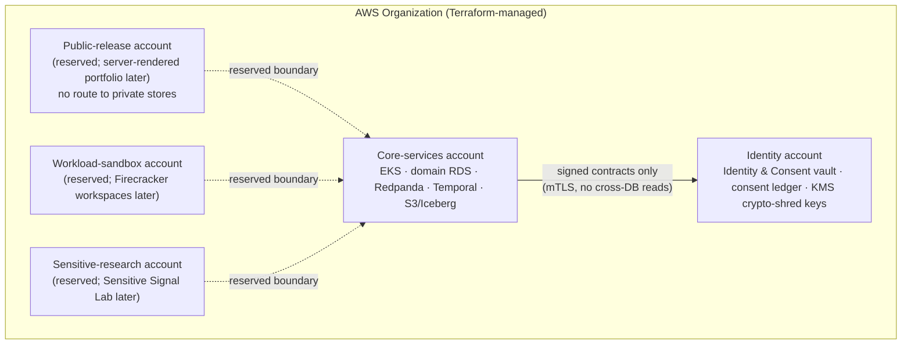
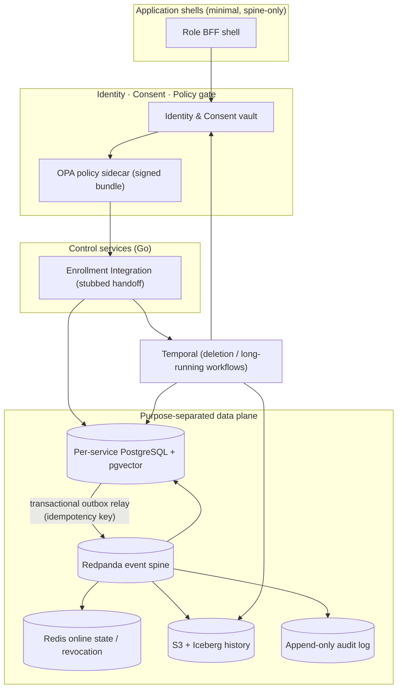
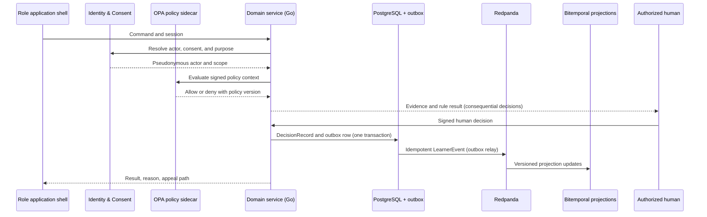
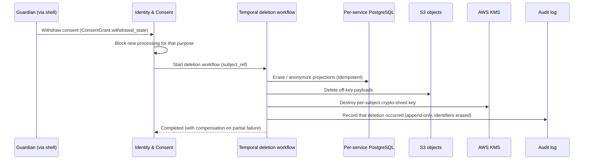

# GT100K Platform Foundation Spine

## Feature Product Requirements Document (Baby PRD #1)

| Field | Value |
|---|---|
| Product | GT100K |
| Feature | Platform Foundation Spine — the signed event + consent + policy + audit substrate and its AWS runtime |
| Document type | Feature ("baby") PRD, scoped from the canonical [`PRD.md`](PRD.md) |
| Parent PRD | [`PRD.md`](PRD.md) v1.8 (§26 architecture, §27 boundaries, §28 contracts, §30 reliability/security, §32.1 Month 1) |
| Document status | Draft for review |
| Version | 1.0 |
| Date | 2026-07-20 |
| Build window | Month 1 — spine lands **Weeks 1–2**; Weeks 3–4 build the first substrate consumers on top of it |
| Hosting | **AWS (committed).** All platform hosting runs on AWS. This is not an open decision (§4, parent §26.6). |
| Depends on | Nothing internal — this is the first thing built; everything else depends on it (parent §32.1) |
| Out of scope | Family OS, Student Compass, Foundry, Cohorts, EvidenceGraph, and the in-house Phase-1 Academic Mastery OS (all later; §3.2) |

## 0. Change log

| Version | Date | Summary |
|---|---|---|
| 1.0 | 2026-07-20 | Initial feature PRD extracted from [`PRD.md`](PRD.md) v1.8 §32.1 (Month 1 Weeks 1–2 "trustworthy end-to-end foundation"). Defines the platform spine — versioned contracts, identity/consent/assent, purpose authorization, signed OPA policy, Redpanda event spine + transactional outbox, per-service PostgreSQL, S3, Temporal deletion, CI/CD, and telemetry — and the **AWS hosting model** that all of it runs on. |

---

## 1. Summary

**In one sentence.** The Platform Foundation Spine is the signed, versioned **event + consent + policy + audit substrate** — running entirely on AWS — through which every consequential GT100K action must pass, so that from day one each action is traceable to the consent that permitted it, the policy that allowed it, the evidence behind it, the software version that produced it, and the authorized person accountable for it.

**Why this is the first feature.** The parent PRD is explicit: *"The team implements `LearnerEvent`, consent, decision, override, appeal, and audit contracts first because all later work depends on them"* (parent §32.1). Mastery, tutoring, passion discovery, cohorts, projects, evidence, credentials, and governance are all built as domain services that emit these contracts onto this spine and read policy from it. If the spine is wrong, every feature above it inherits the defect. It is therefore built first, alone, and proven with a construction gate before any user-facing app is layered on.

**What it is not.** This feature builds no learner-facing screens beyond the minimum application shells needed to exercise the spine. It does not build the academic engine (Phase 0 partner integration is Weeks 3–4; the in-house Phase-1 engine is Month 3), the tutor, cohorts, the Foundry, or credentials. It establishes the ground those stand on.

---

## 2. Relationship to the canonical PRD

This is **feature PRD #1** in a series of baby PRDs decomposed from [`PRD.md`](PRD.md). It restates only what a builder needs to construct the spine and links back to the canonical document for full rationale. Where this document and `PRD.md` disagree on a rights/governance matter, [`GOVERNANCE.md`](GOVERNANCE.md) and `PRD.md` win; this document carries software/engineering scope only.

| This document, section | Canonical source |
|---|---|
| §4 AWS hosting model | parent §26 (tech stack), §26.2 (account isolation), §26.6 (**Cloud = AWS, committed**), §30 (multi-AZ, DR) |
| §5 Architecture overview | parent §26 system map, §27 service boundaries |
| §6 Monorepo & delivery layout | parent §26.4 |
| §7 Versioned contracts | parent §28 |
| §8 Command data flow | parent §27 |
| §9 Event spine & outbox | parent §26, §27 |
| §10 Identity, consent, assent, authorization | parent §27 (Identity & Consent boundary), §28 contracts |
| §11 Policy-as-code (OPA) | parent §26, §27, §29 → [`GOVERNANCE.md`](GOVERNANCE.md) |
| §12 Data plane | parent §26 data plane, §27 |
| §13 Deletion & retention | parent §28 (`ConsentGrant` withdrawal), §30, §32.1 gate |
| §14 Reliability, security, operations | parent §30 |
| §15 CI/CD & release rings | parent §26.4 |
| §16 Observability | parent §26, §30 |
| §17 Acceptance / construction gate | parent §32.1 construction gate (spine-scoped subset) |

---

## 3. Scope

### 3.1 In scope

- **Monorepo and delivery layout** — the repository skeleton and per-ecosystem lockfiles (§6).
- **Versioned public contracts** — the common envelope header plus `LearnerEvent`, `ConsentGrant`, `AssentRecord`, `DecisionRecord`, `OverrideRecord`, `Appeal`, and the append-only **audit log**, generated from one registry with Buf compatibility enforcement (§7).
- **Identity & Consent vault** — legal-identity crosswalk, guardian authority, child assent, consent purposes, retention clocks, account recovery, and revocation (§10).
- **Role and purpose authorization** — pseudonymous actor resolution and per-purpose scoping at the edge (§10).
- **Policy-as-code** — signed OPA/Rego bundles evaluated by a local sidecar on every command (§11).
- **Event spine** — Redpanda plus the transactional-outbox pattern and idempotent, at-least-once consumers (§9).
- **Data plane** — per-service PostgreSQL (transactional records, bitemporal projections, decision ledgers), Redis for revocation/session/low-latency reads, and S3 for encrypted artifacts and history (§12).
- **Deletion & retention** — a Temporal workflow that executes consent-withdrawal deletion across all spine stores (§13).
- **CI/CD** — GitHub Actions (test + sign), Argo CD (deploy), OpenFeature (release rings) (§15).
- **Telemetry** — OpenTelemetry, Prometheus, Grafana wired from the first service (§16).
- **AWS runtime** — EKS, RDS + pgvector, S3, KMS, CloudFront, and isolated per-purpose AWS accounts, all provisioned by Terraform (§4).
- **Application shells** — the minimal Next.js/TypeScript shells needed to drive the spine end-to-end (not feature UIs).
- **Stubbed enrollment handoff** — a stub of the admissions team's Track A / Track B eligibility contract, sufficient to provision a synthetic fixture learner (parent §3.5, §32.1).

### 3.2 Out of scope (built later)

- Family OS onboarding, Student Compass, Guide & Mentor Console, Operations & Governance Console, Public Portfolio (later Month 1 → Month 3).
- The Phase-0 partner academic engine integration (Weeks 3–4, a *consumer* of this spine, specified separately).
- The Phase-1 in-house Academic Mastery OS, answer-blind tutor, grader, help receipts, Practice-Item Foundry (Month 3; parent §12, §32.3).
- Passion/Interest Lab, Motivation dose ledger, Cohorts, Foundry workspaces, EvidenceGraph, Reality Gateway, credentials (Month 2–3).
- LiveKit/WebRTC media, Triton/vLLM model serving, Flink/Feast feature store (later; the AWS **account and region policy** in §4 still governs them when they arrive).
- The admissions pipeline itself — owned and built by the admissions team ([`ADMISSIONS_PRD.md`](ADMISSIONS_PRD.md)); this feature integrates only against a stub of their eligibility contract.

### 3.3 Non-goals

- No live child data. All fixtures are synthetic (parent §3.2, §32.4).
- No GraphQL schema in the four-month build (parent §26.1).
- No first-party C++ (parent §26.3).
- No autonomous consequential decision: every `DecisionRecord` requires a named human (§7, §8).

---

## 4. AWS hosting model ★

> **This section is deliberately prominent.** GT100K hosting is committed to AWS. There is no secondary cloud, no "cloud-agnostic" abstraction layer, and no open hosting decision for platform services. Every runtime, datastore, key, and network boundary described in this PRD is an AWS construct, defined in Terraform. This restates and hardens parent §26.6.

### 4.1 Commitment statement

**Cloud = AWS (committed).** All GT100K platform hosting runs on AWS (parent §26.6). This applies to the foundation spine and to every feature built on top of it. Self-hosting a managed dependency, or introducing a second cloud, is out of scope for the four-month build and would change Month 1 staffing; any such change requires an Architecture Decision Record and product-ownership sign-off, not an in-lane choice.

### 4.2 AWS runtime services

| Concern | AWS service | Notes |
|---|---|---|
| Container orchestration / compute | **Amazon EKS** (Kubernetes) | All Go/Rust/Python services and relays run as EKS workloads. Compute model is Kubernetes, not Lambda or ECS/Fargate. |
| Relational data + vectors | **Amazon RDS for PostgreSQL** (+ **pgvector**) | Per-service databases; transactional records, bitemporal projections, decision ledgers. Point-in-time recovery on (§14). |
| Object storage / history | **Amazon S3** | Encrypted artifacts, Iceberg history tables, contract-registry snapshots. |
| Key management / encryption | **AWS KMS** | Envelope encryption for S3 objects, RDS storage, and per-subject crypto-shred keys used by deletion (§13). |
| Edge / content delivery | **Amazon CloudFront** | Fronts the application shells and (later) the separate-account public portfolio. |
| Identity & access (infra) | **AWS IAM** | Least-privilege roles; short-lived workload identity via IRSA / EKS Pod Identity. Not to be confused with the product Identity & Consent vault (§10). |
| Networking | **Amazon VPC** | Default-deny security groups and network policy; private subnets for data stores; no public route to identity or (future) sandbox stores. |
| Infrastructure as code | **Terraform** | Sole IaC tool. Every account, VPC, cluster, database, bucket, key, and role is Terraform-defined; no console-created production resource. |

**No AWS service is assumed beyond this table for the spine.** In particular the spine does **not** use Cognito (the product uses its own Identity & Consent vault with passkeys/MFA, §10), Lambda, ECS/Fargate, or DynamoDB.

### 4.3 Account isolation model

Trust boundaries are enforced by **separate AWS accounts**, not merely by namespaces or IAM policies within one account (parent §26.2). The spine provisions the accounts it needs now and reserves the rest so later features inherit the boundary rather than retrofit it.



- **Provisioned by the spine:** Core-services and Identity accounts.
- **Reserved (created empty, boundary + Terraform state established):** Public-release, Workload-sandbox, and Sensitive-research accounts, so later features (§3.2) land inside an existing boundary. The public runtime is designed to have **no network route to identity stores or student workspaces** (parent §26.1, §30).
- Cross-account access is **signed-contract and narrow-API only**. No service reads another service's database, and no service reads across an account boundary except through a published contract over mTLS.

### 4.4 Infrastructure as code

Terraform is the only way production infrastructure comes into existence. The monorepo `infra/` directory (§6) holds account bootstrap, VPC/network, EKS, RDS, S3/KMS, Redpanda/Temporal wiring, and IAM. State is remote and locked. A reviewer can read `infra/` and know the exact AWS footprint; there is no undocumented drift.

### 4.5 Managed third-party runtimes

**Redpanda** (event spine) and **Temporal** (workflows) run as **managed services in US regions under child-data processing agreements** (parent §26.6). They are consumed behind owned contracts (parent §26.2) so a provider change does not ripple into domain code. LiveKit, Flink/Feast, and Triton/vLLM are later features but are bound by the same US-region + child-data-DPA rule when they arrive.

### 4.6 Multi-AZ and disaster recovery

- Services deploy across **three availability zones** (parent §30).
- **RDS uses point-in-time recovery and tested cross-region snapshots** (parent §30).
- Redpanda replicates across zones; Temporal activities are idempotent with compensation.
- Before any Wave 1 rollout, SRE approves and tests system-specific **RTO/RPO** targets for identity/consent, decision ledgers, and Redpanda; a store cannot go to enrollment with an unset target (parent §30). The spine ships the DR *mechanisms*; target sign-off is a gate, not a later add-on.

### 4.7 What is deliberately not on this AWS boundary

The **admissions pipeline** ([`ADMISSIONS_PRD.md`](ADMISSIONS_PRD.md)) is owned by a separate team and runs on its **own, different stack (Next.js + Supabase)**. That is intentional and does not weaken the AWS commitment: GT100K's platform never hosts admissions, and the two systems meet only at the enrollment-handoff contract (§10.4, parent §3.5). Nothing in *this* platform runs off AWS.

### 4.8 Region, residency, and cost posture

- **US regions only.** All spine data and managed runtimes live in US AWS regions under child-data processing agreements (§4.5, parent §26.6). No spine data leaves the US region boundary; cross-region use is limited to **tested RDS snapshots for disaster recovery** (§4.6), which stay within US regions.
- **Data residency** is a policy input, not an afterthought: the `ConsentGrant.jurisdiction` field (§7.2) and the region a store lives in must agree, and OPA denies processing when they do not (§11).
- **Cost ownership.** Each deployable owns its SLO and, by extension, its cost envelope; the Operations dashboards (§14.3) surface spend from the first service so cost-per-learner (parent §2.6 Operations scorecard) is measurable rather than reconstructed later. Managed Redpanda/Temporal cost is tracked against the child-data DPA contracts (§4.5).

---

## 5. Architecture overview

The spine is the middle of the parent system map: role applications enter through the **identity, consent, and policy gate**; the gate routes to **deterministic control services**; control services emit **immutable domain events**; the event spine fans out to **purpose-separated stores** (parent §26 system map).



Each service owns exactly one decision domain and its authoritative tables; other services consume published contracts or a narrow API and cannot read another service's database (parent §27). For the spine, the only fully-owned domain is **Identity & Consent**, plus the **Enrollment Integration** boundary running against a stub.

---

## 6. Monorepo and delivery layout

The web-first monorepo uses these top-level directories (parent §26.4):

`apps/` · `packages/` · `services/` · `model-services/` · `crates/` · `proto/` · `policies/` · `workflows/` · `infra/` · `runbooks/` · `test-scenarios/`

- **Schema compatibility:** **Buf** owns Protobuf compatibility and rejects breaking changes (§7).
- **Per-ecosystem locks:** Cargo (Rust), Go workspaces (Go), and **uv** (Python) each lock their own ecosystem; **pnpm** workspaces + Turborepo for TypeScript.
- **Delivery:** GitHub Actions tests and signs artifacts; Argo CD deploys them; OpenFeature controls release rings **without bypassing consent or policy** (§15).
- **Per-deployable ownership (parent §26.2):** each deployable owns its database credentials, migrations, outbox, SLO, on-call owner, and contract namespace.

Language ownership for the spine (parent §26.2): **Go** owns Identity & Consent, the enrollment-handoff integration, event relays, and the outbox; **Rust** is reserved for the capability gateway and deterministic verifiers (later features); **Python/FastAPI** is not needed by the spine.

---

## 7. Versioned public contracts

All public contracts use Protobuf and JSON representations generated from **one registry**. Producers add fields under new tags and preserve old readers through a published deprecation window; **Buf rejects breaking changes** (parent §28).

### 7.1 Common envelope header

Every contract carries a common header:

`contract_id`, `schema_version`, `tenant_id`, `actor_ref`, `occurred_at`, `recorded_at`, `correlation_id`, `causation_id`, `consent_purpose`, `policy_version`, optional `model_version`, and `evidence_refs`.

This header is what makes every action traceable (§1): `consent_purpose` binds the action to the consent that permitted it, `policy_version` to the policy that allowed it, `evidence_refs` to its evidence, `schema_version`/`model_version` to the software that produced it, and the `DecisionRecord.authorized_human` (§7.2) to the person accountable.

### 7.2 Foundation contract set

These are the contracts implemented **first** (parent §32.1). Fields and invariants are reproduced from parent §28.

| Contract | Required fields | Invariants |
|---|---|---|
| `LearnerEvent` | `event_type`, pseudonymous `learner_ref`, event and ingest time, source, session/cohort/project context, payload schema, intervention source, action propensity, feature-view version, evidence references. | The producer signs the envelope. Event time and ingest time remain distinct. The producer logs propensity before the outcome. Consumers treat the event as immutable and idempotent. |
| `ConsentGrant` | `subject_ref`, guardian authority, purpose, data categories, processors, jurisdiction, effective and expiry time, collection method, document hash, withdrawal state. | A service may use data only for an active matching purpose. Withdrawal blocks new processing and starts the applicable deletion workflow (§13). |
| `AssentRecord` | `child_ref`, age band, plain-language notice version, choices shown, response, facilitator, timestamp, renewal date. | Guardian consent cannot substitute for child assent where the product can honor a refusal. Staff record dissent and stop optional collection. |
| `DecisionRecord` | `decision_type`, subject, candidates considered, outcome, reason codes, evidence snapshot, uncertainty, policy and model versions, authorized human, effective time. | Consequential records require a named human and a policy result. Records remain append-only and replayable. **A model output cannot fill `authorized_human`.** |
| `OverrideRecord` | target decision, prior outcome, new outcome, authorized role, rationale, evidence, expiry or review date. | Four-eyes approval applies to admissions, public exposure, safeguarding, and credential revocation. An override creates a new record and preserves the original. |
| `Appeal` | appellant role, target decision, grounds, submitted evidence, requested remedy, status, independent reviewer, deadlines, resolution. | The reviewer cannot be the original decision owner. Filing an appeal cannot reduce access or trigger retaliation. The system records late and reopened cases. |
| Audit log | append-only record of every consequential action with its full envelope header, actor, policy result, and outcome. | Append-only and tamper-evident. Tenant-scoped. Every `DecisionRecord`, `OverrideRecord`, consent change, and deletion writes an audit entry. Supports decision replay with the evidence, policy, and (if any) model version available at that time. |

### 7.3 Handoff contract (stubbed)

The spine consumes — but does not build — the admissions team's **Track A / Track B eligibility determination** (parent §3.5, §8.4). Until their interface exists, the spine runs against a **stub** producing a synthetic eligible-learner roster, accommodation profile, and eligibility-evidence reference (parent §32.1). The stub honors the same contract shape so cutover to the real interface is a configuration change, not a rewrite.

### 7.4 Contract registry mechanics

- **Single registry.** All contracts live under `proto/` and generate both Protobuf and JSON representations; no service hand-writes a wire type (§6).
- **Compatibility.** Buf runs in CI and **rejects breaking changes** (parent §28). New fields take new tags; removed or renamed fields are forbidden within a deprecation window.
- **Deprecation window.** A producer that intends to retire a field publishes the deprecation, keeps old readers working through the window, and only then removes the field. The window length is a published contract-registry policy, not a per-service choice.
- **Signing.** The producer signs the envelope (`LearnerEvent` invariant, §7.2); consumers verify the signature before accepting an event.
- **Illustrative envelope** (JSON representation, synthetic values):

```json
{
  "contract_id": "01J...ULID",
  "schema_version": "learner_event/2",
  "tenant_id": "gt100k",
  "actor_ref": "actor_pseudo_7c1f",
  "occurred_at": "2026-07-20T14:03:11Z",
  "recorded_at": "2026-07-20T14:03:11.402Z",
  "correlation_id": "01J...",
  "causation_id": "01J...",
  "consent_purpose": "onboarding.schedule",
  "policy_version": "opa-bundle/2026-07-20a",
  "model_version": null,
  "evidence_refs": ["s3://.../fixture/consent-receipt#sha256:..."]
}
```

The header is identical across every contract; a reader that understands the header can route, dedupe, and audit any event without parsing its payload.

---

## 8. Service boundaries and command data flow

A command follows a fixed path (parent §27). This path is the spine; every later feature reuses it verbatim.



1. The **edge** verifies the session and resolves a **pseudonymous actor reference**.
2. The **consent service** confirms the declared purpose is active and matching.
3. The **local OPA sidecar** evaluates the **signed policy bundle** and returns allow/deny with a policy version.
4. The **domain service** writes state and an **outbox row in one PostgreSQL transaction**.
5. An **outbox relay** publishes the event to Redpanda with an **idempotency key**.
6. **Consumers** update their own bitemporal projections; at-least-once delivery is acceptable because each consumer **rejects a duplicate `contract_id`** and preserves the first valid result.

Boundaries owned in the spine (parent §27 table):

| Boundary | Owned state and responsibility |
|---|---|
| Identity & Consent | Legal-identity crosswalk, guardian authority, child assent, consent purposes, retention clocks, account recovery, and revocation. |
| Enrollment Integration *(stubbed handoff, §7.3)* | Consumes the admissions team's Track A / Track B eligibility determination: eligible-learner provisioning, accommodation-profile intake, and eligibility-evidence reference. The pipeline itself is the admissions team's boundary (parent §3.4). |

---

## 9. Event spine and outbox

- **Redpanda** carries immutable domain events (parent §26). Managed, US region, child-data DPA (§4.5).
- **Transactional outbox:** the domain service writes business state and an outbox row atomically in PostgreSQL; a relay publishes to Redpanda with an idempotency key (§8). This removes dual-write races between the database and the event log.
- **Idempotent consumers:** consumers dedupe on `contract_id` and keep the first valid result; delivery is at-least-once.
- **Durability target:** 99.99 percent acknowledged-event durability; the spine sustains **10,000 events per second with no acknowledged loss** (parent §30). The Month 1 gate exercises a scaled-down synthetic version of this.
- **Failure handling:** consumers use dead-letter topics with replay tools (parent §30).

---

## 10. Identity, consent, assent, and authorization

### 10.1 Identity & Consent vault
Owns the legal-identity crosswalk, guardian authority, child assent, consent purposes, retention clocks, account recovery, and revocation (parent §27). Runs in the **Identity AWS account** (§4.3). Downstream services never receive legal identity — only a **pseudonymous actor reference** and the purpose scope (parent §27).

### 10.2 Consent and assent
`ConsentGrant` and `AssentRecord` (§7.2) are first-class. A service may use data **only for an active matching purpose**. **Guardian consent cannot substitute for child assent** where the product can honor a refusal; staff record dissent and stop optional collection.

### 10.3 Authorization
Role and purpose authorization happens at the edge: the session resolves to a pseudonymous actor, and the declared purpose is confirmed against active consent before OPA is consulted (§8). Revocation lists live in Redis for low-latency checks (§12).

### 10.4 Enrollment handoff (stub)
Consumes the eligibility contract (§7.3). Identity, consent scope, accommodation profile, and an eligibility-evidence *reference* (never raw responses, artifacts, or CogAT items) transfer into the platform so they are not re-collected (parent §3.5). Runs against a stub until the admissions interface is available.

---

## 11. Policy-as-code (OPA)

- Policy is expressed in **Rego** and shipped as **signed OPA bundles** (parent §26, §32.1).
- A **local OPA sidecar** evaluates the signed bundle on every command and returns allow/deny **with the policy version**, which is recorded in the envelope header and audit log (§7, §8).
- Rights/consent/decision-authority policy content lives in [`GOVERNANCE.md`](GOVERNANCE.md) (parent §29 was extracted there); this feature builds the **enforcement mechanism**, not the rights themselves.
- OpenFeature release rings **cannot bypass consent or policy** (parent §26.4).

---

## 12. Data plane

Purpose-separated stores (parent §26, §27), each on AWS (§4):

| Store | Role | AWS |
|---|---|---|
| PostgreSQL (per service) | Transactional records, **bitemporal projections**, pgvector indexes, decision ledgers. A correction creates a **new bitemporal interval**, never an in-place edit. | RDS + pgvector |
| Redis | Revocation lists, session state, low-latency reads. | ElastiCache / managed Redis |
| S3 + Iceberg | Encrypted artifacts and history tables. | S3 (KMS-encrypted) |
| Append-only audit log | Tamper-evident record of consequential actions (§7.2). | RDS / S3, tenant-scoped |

No service reads another service's database (parent §27). Cross-service reads go through published contracts or a narrow API.

---

## 13. Deletion and retention

- **Consent withdrawal** blocks new processing and **starts the applicable deletion workflow** (`ConsentGrant` invariant, §7.2).
- Deletion runs as a **Temporal workflow** with idempotent activities and compensation (parent §30). It removes the subject across **all spine stores** — Identity vault, per-service PostgreSQL projections, Redis, S3 objects, and event-derived state — and records the deletion in the audit log.
- Where an event log is append-only, deletion uses **per-subject crypto-shred** (destroying the KMS key for that subject's payloads) plus off-graph identifier erasure, consistent with the parent's erasure approach (parent §19.2, §28). The append-only audit entry that the deletion *happened* is preserved.
- The Month 1 gate includes an **automated deletion test** that removes a synthetic fixture learner across every spine store (§17, parent §32.1).



**Erasure triad.** On-graph state is anonymized, off-graph identifiers are erased, and append-only payloads are rendered unreadable by destroying the subject's KMS key (parent §19.2 D5/D6). The audit fact that deletion happened survives; the subject's data does not. Partial failures trigger Temporal compensation and re-run, so deletion is eventually complete and idempotent.

---

## 14. Reliability, security, and operations baseline

The spine ships the reliability and security substrate that later features inherit (parent §30).

### 14.1 Reliability targets (spine-relevant subset)
- 99.9 percent monthly availability for authenticated applications and control APIs.
- 99.99 percent acknowledged-event durability; event spine 10,000 events/s with no acknowledged loss.
- Domain command APIs target **p95 below 300 ms**.
- Three availability zones; RDS point-in-time recovery + tested cross-region snapshots; Redpanda cross-zone replication; Temporal idempotent activities + compensation; dead-letter topics with replay (parent §30).
- SRE-approved, tested **RTO/RPO** for identity/consent, decision ledgers, and Redpanda before Wave 1 (§4.6).

### 14.2 Security baseline
- **Passkeys or phishing-resistant MFA** for staff; **short-lived workload identity**; **mTLS** between services; **least-privilege IAM**; **default-deny networks** (parent §30).
- **Signed images, SBOMs, admission control, secret rotation, and tenant-scoped audit** (parent §30).
- The public runtime (reserved account, §4.3) has **no network route** to student workspaces or identity stores.
- Firecracker/gVisor isolation of untrusted builds is a later-feature concern (Foundry); the **sandbox account boundary** is reserved now so it lands inside an existing trust boundary (§4.3).

### 14.3 Operations
- Dashboards from day one cover **consent failures, policy denies, queue depth, event lag,** and **revocation propagation** (subset of parent §30 dashboard set relevant to the spine).
- Runbooks live in `runbooks/` (§6).

### 14.4 Threat model (spine-relevant subset)

The parent red-team list (parent §30) is broad; the spine must withstand the subset that targets the substrate itself:

| Threat | Spine defense |
|---|---|
| **Replay** — re-submitting a captured event | Idempotent consumers dedupe on `contract_id`; signed envelopes; distinct event/ingest time (§7, §9). |
| **Cross-tenant access** — reading another tenant's data | `tenant_id` in every header; tenant-scoped audit; per-service DB with no cross-DB reads; account isolation (§4.3, §7). |
| **Authority forgery** — a model or unauthorized actor finalizing a decision | `authorized_human` cannot be model-filled; four-eyes on override classes; OPA policy result required (§7.2, §11). |
| **Policy bypass** — shipping a feature flag that skips consent/policy | OpenFeature rings cannot bypass consent or policy; OPA sidecar is on the command path, not optional (§11, §15). |
| **Deletion evasion** — data surviving a withdrawal | Cross-store automated deletion test; crypto-shred for append-only stores (§13, §17). |
| **Secret / key exposure** | KMS-managed keys, secret rotation, short-lived workload identity, signed images + SBOMs (§14.2). |

Models and detectors may produce review signals but **cannot be used as proof** of cheating, intent, emotion, or truth (parent §30) — the spine records signals as advisory, never as a consequential decision input.

---

## 15. CI/CD and release rings

- **GitHub Actions** tests and **signs** artifacts (parent §26.4).
- **Argo CD** (and Argo Rollouts for later features) deploys signed artifacts to EKS.
- **OpenFeature** controls release rings; rings **cannot bypass consent or policy** (§11).
- Engineers write unit, contract, component, migration, and security tests with each change — those tests **define done code** (parent §32).

---

## 16. Observability

**OpenTelemetry, Prometheus, and Grafana** are wired from the first service (parent §26). Traces carry the envelope `correlation_id`/`causation_id` so a command can be followed edge → consent → OPA → outbox → Redpanda → projection. MLflow (model lineage) is not needed by the spine and arrives with the model plane later.

---

## 17. Acceptance criteria — construction gate

This is a **spine-scoped subset** of the parent Month 1 construction gate (parent §32.1); it drops the parts that require Family OS, Student Compass, and Foundry, which are not built in this feature.

A run passes when, for a **synthetic fixture learner**:

1. **Provisioning.** The fixture arrives through the **stubbed enrollment handoff** — eligible-learner roster and accommodation profile consumed from the admissions contract stub (§7.3, §10.4).
2. **Consent lifecycle.** A guardian can **grant and withdraw** consent, and a child **assent** is recorded; a service refuses to process data lacking an active matching purpose (§10).
3. **Traceability.** Every consequential action produces a **signed, idempotent `LearnerEvent`** whose envelope traces to `consent_purpose`, `policy_version`, `evidence_refs`, `schema_version` (software version), and the responsible actor (§7, §8).
4. **Human authority.** A `DecisionRecord` **cannot be finalized** without a named `authorized_human` and a policy result; a model output cannot fill that field (§7.2).
5. **Policy enforcement.** The OPA sidecar **denies** a command whose purpose has no active consent, and the deny is recorded with its policy version (§11).
6. **Deletion.** Consent withdrawal triggers the Temporal deletion workflow; an **automated deletion test removes the fixture learner across all spine stores** (Identity, PostgreSQL, Redis, S3, event-derived state), with the audit entry that deletion occurred preserved (§13).
7. **Event durability.** A scaled-down synthetic load run shows the outbox → Redpanda → projection path with **no acknowledged loss** and duplicate `contract_id`s rejected (§9).
8. **AWS provenance.** All of the above runs on infrastructure **provisioned by Terraform across the isolated AWS accounts** (Core + Identity provisioned; Public/Sandbox/Sensitive boundaries reserved) (§4). No production resource exists outside Terraform.

Developers can **trace each consequential action** to consent, policy, evidence, software version, and authorized person, and **replay** any decision with the evidence/policy available at that time (parent §27, §32.1).

---

## 18. Test strategy

- **Contract tests** — Buf compatibility gate on every contract change; round-trip Protobuf ↔ JSON; header-completeness assertions (§7).
- **Migration tests** — every schema change ships with a tested forward migration (§6).
- **Component tests** — the command path (§8) exercised end-to-end against ephemeral PostgreSQL/Redpanda/Temporal.
- **Security tests** — mTLS enforcement, default-deny network, OPA deny paths, `authorized_human` cannot be model-filled (§14.2).
- **Deletion test** — automated cross-store erasure of a fixture learner (§13, §17).
- **DR drills** — RTO/RPO restore exercises signed off by SRE before Wave 1 (§4.6, §14.1).

---

## 19. Dependencies, assumptions, and risks

### 19.1 Dependencies
- **AWS Organization** with permission to create the account set (§4.3).
- Managed **Redpanda** and **Temporal** in US regions with child-data DPAs (§4.5).
- The admissions team's **eligibility contract shape** — consumed via stub until their interface ships (§7.3).

### 19.2 Assumptions
- All Month 1 data is **synthetic**; no live child data crosses any boundary (§3.3).
- The admissions team's **Prohibited Eligibility Inputs** hold across the handoff, so no household-income or protected-attribute data enters the platform (parent §3.5).

### 19.3 Risks
| Risk | Mitigation |
|---|---|
| Admissions contract drifts from the stub | Stub mirrors the agreed contract shape; cutover is config, not rewrite (§7.3). Confirm shape with admissions team early. |
| Dual-write races (DB vs. event log) | Transactional outbox + idempotent consumers (§9). |
| Deletion misses a store | Automated cross-store deletion test in the gate; append-only stores use crypto-shred (§13, §17). |
| Account-boundary retrofit later | Reserve Public/Sandbox/Sensitive accounts now so later features land inside an existing boundary (§4.3). |
| RTO/RPO unset at enrollment | Hard gate: SRE sign-off required before Wave 1 (§4.6). |

---

## 20. Build sequence (Month 1, Weeks 1–2)

The spine is built in dependency order so each step can be exercised as soon as it lands. This mirrors the parent's "implement the contracts first" instruction (parent §32.1).

| Order | Work | Unblocks |
|---|---|---|
| 1 | **Terraform bootstrap** — AWS Organization, Core + Identity accounts, VPC, EKS, RDS, S3, KMS, IAM (§4). | Every runtime below. |
| 2 | **Contract registry** — `proto/` skeleton, common envelope header, Buf CI gate, Protobuf/JSON generation (§7). | All services and events. |
| 3 | **Foundation contracts** — `LearnerEvent`, `ConsentGrant`, `AssentRecord`, `DecisionRecord`, `OverrideRecord`, `Appeal`, audit log (§7.2). | Consent, decisions, audit. |
| 4 | **Identity & Consent vault** — actor crosswalk, guardian authority, assent, purposes, retention clocks, revocation (§10). | Actor resolution + purpose checks. |
| 5 | **OPA sidecar + signed bundles** — Rego enforcement on the command path (§11). | Allow/deny with policy version. |
| 6 | **Event spine** — Redpanda + transactional outbox relay + idempotent consumers (§9). | Immutable event history + projections. |
| 7 | **Data plane** — per-service PostgreSQL (bitemporal), Redis, S3/Iceberg (§12). | Durable state + projections. |
| 8 | **Temporal deletion workflow** — cross-store erasure + crypto-shred (§13). | Withdrawal → deletion. |
| 9 | **CI/CD + telemetry** — GitHub Actions sign, Argo CD deploy, OpenFeature rings, OTel/Prometheus/Grafana (§15, §16). | Repeatable, observable delivery. |
| 10 | **Stubbed enrollment handoff** — synthetic eligible-learner provisioning against the admissions contract shape (§7.3, §10.4). | Construction-gate fixture. |
| 11 | **Construction gate run** — the acceptance criteria in §17. | Sign-off to build consumers (Weeks 3–4). |

Steps 1–3 are the literal "first because all later work depends on them" (parent §32.1). Weeks 3–4 consumers (partner-engine integration, Student Compass shell, Foundry skeleton) are specified in their own baby PRDs and are out of scope here (§3.2).

## 21. Definition of Done

Per [`AGENTS.md`](../../AGENTS.md), this feature is done when:

- The **construction gate (§17)** passes end-to-end on AWS infrastructure provisioned entirely by Terraform.
- Every contract change passed the **Buf compatibility gate**; unit, contract, component, migration, and security tests are green (§18, parent §32).
- **No live child data** exists anywhere; all fixtures are synthetic (§3.3).
- The **AWS hosting model (§4)** is realized: Core + Identity accounts provisioned, Public/Sandbox/Sensitive boundaries reserved, managed Redpanda/Temporal in US regions under child-data DPAs, RDS PITR + tested cross-region snapshots, SRE-signed RTO/RPO for identity/consent, decision ledgers, and Redpanda.
- Docs updated: this PRD reconciled with any deltas, `runbooks/` populated for the spine, cross-references to [`PRD.md`](PRD.md) accurate.
- CI green; reviewed (human or cross-model); Conventional Commit; PR references its issue (`Closes #<id>`).

## 22. Glossary and cross-reference index

- **Spine** — the event + consent + policy + audit substrate defined by this PRD.
- **Outbox** — transactional-outbox pattern; atomic state + event write, relayed to Redpanda (§9).
- **Bitemporal** — records keep both event time and record time; corrections add a new interval (§12).
- **Crypto-shred** — deletion by destroying a subject's encryption key (§13).
- **Pseudonymous actor reference** — the non-identifying handle downstream services receive instead of legal identity (§10).
- **Construction gate** — the acceptance run that proves the spine works end-to-end (§17).

**Canonical cross-references:** parent §26 (architecture/tech stack, **§26.6 Cloud = AWS committed**), §27 (service boundaries + command path), §28 (versioned contracts), §30 (reliability/security/ops), §32.1 (Month 1 foundation + construction gate). Rights/consent/governance content: [`GOVERNANCE.md`](GOVERNANCE.md). Admissions boundary: [`ADMISSIONS_PRD.md`](ADMISSIONS_PRD.md), parent §3.4–§3.5.
