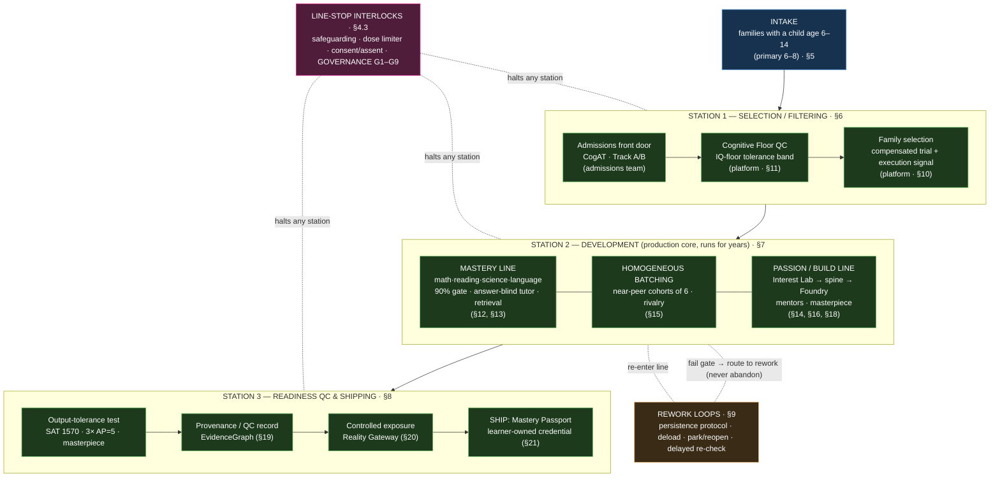

# GT100K — The Readiness Factory

## Deterministic Student Pipeline — Product Requirements Document

| Field | Value |
|---|---|
| Product | GT100K (pipeline framing) |
| Document status | Standalone reframe of the program operating model |
| Version | 1.1 |
| Date | 2026-07-20 |
| Companion documents | `PRD.md` v1.13 (detailed program spec), `GOVERNANCE.md` (rights/consent/authority, G1–G9), `gtBrainlift.md` (originating thesis, SPOV 1–5) |
| Initial market | United States, English-first |
| Intake ages | 6 through 14 (primary intake 6 to 8) |
| Line output | A learner-owned, verifiable Mastery Passport backed by an evidence trail |
| Rated throughput | 100,000 enrolled learners |
| Output tolerance (age 14) | SAT ≥ 1570; AP Calculus BC, AP Physics C, AP English Literature all scored 5; ≥ 1 defended masterpiece; demonstrated learning autonomy |

---

## 0. How to read this document

This **standalone** PRD re-presents the entire GT100K program as a **deterministic manufacturing line** engineered to take in students and produce MIT-level readiness. It reads on its own; where a mechanism needs full engineering or rights detail, it points to `PRD.md` or `GOVERNANCE.md` without requiring you to read them first.

Three source documents sit underneath it:

- **`gtBrainlift.md`** — the originating thesis and five spiky points of view (SPOV 1–5): the *why*.
- **`PRD.md` v1.7** — the full program operating system, section by section: the *what*, in engineering detail.
- **`GOVERNANCE.md`** (G1–G9) — the rights, consent, safety, and decision-authority invariants. Here they are the **plant safety system** (§4.3): hard interlocks that stop the line and can never be traded for throughput.

A crosswalk from every factory term to its `PRD.md` section and SPOV is in §14.

**One caution up front.** The industrial voice describes the *process* — deterministic and reproducible by design — never the *outcome* as guaranteed. A factory that reliably applies a fixed process is not one that promises a fixed result. The distinction is load-bearing and stated formally in §2.3.

---

## 1. The Factory Thesis

Better pedagogy is a solved problem. Direct instruction, worked examples, mastery gating, and step-based tutoring all work, all replicate, and are buildable by any competent team. Tuning the teaching *method* polishes something already finished. So this program takes a proven mastery engine off the shelf and spends every saved hour on the constraints that actually bind elite outcomes: **dose, environment totality, peer composition, and the raw cognitive ceiling** (`gtBrainlift.md`).

Each constraint is manipulable, yet normally left untouched at the intensity elite results demand. This document's bet: they can be manipulated **deterministically** — arranged into a fixed, instrumented, reproducible production line — rather than left to the accident of which family a gifted child is born into.

The line has three stations:

1. **Selection (filtering).** Choose who enters: the right cognitive floor and, above all, the right *family* — the environment that will run the dose for eight years (SPOV 1, SPOV 2).
2. **Development.** Run the dose: mastery-gated academics on a narrow early-specialized spine, in homogeneous peer batches, under engineered friction, with the answer withheld (SPOV 3, SPOV 4, SPOV 5).
3. **Readiness assessment.** Verify and ship: prove the age-14 tolerances against independent evidence, provenance every claim, and hand the learner a portable credential they own.

Between and inside the stations are **rework loops** (repair, deload, re-explore, delayed re-check) and **line-stop interlocks** (the safety and rights system). A unit that fails a gate is routed to rework; it is **never abandoned** (§9).

---

## 2. What "deterministic" means here

### 2.1 Process determinism, not outcome determinism

"Deterministic pipeline" is a claim about **control and process**, not about a promised child. Concretely, the line is deterministic in these senses:

- **Fixed stations and fixed gates.** Every unit passes through the same stations in the same order, and each station has an explicit, versioned acceptance rule (a QC gate). No unit skips a gate.
- **Rules-engine + named-human authority.** Every consequential decision is made by a deterministic policy service applying an approved rule, or by a named human, or both. Statistical models only estimate, rank, or render; they do not decide (`PRD.md` §4.1, §25).
- **Reproducibility / replay.** Any past decision can be reconstructed with the exact evidence, policy version, and model version in force at the time. The line keeps a signed, versioned event for every state change.
- **Mastery gating.** A skill node unlocks only on ≥ 90% performance on an independent, unassisted check. Passing is defined by the gate, not by seat time or engagement (`PRD.md` §12).

### 2.2 What is *not* deterministic

The **yield** is not. Human development is not a stamping press. The line reliably *applies* the intervention; whether a given unit reaches the age-14 tolerance depends on the child, and the program will need years of outcome data to characterize its true yield.

### 2.3 The yield-honesty clause

This document, its credentials, and its metrics never claim that the line *causes* age-14 MIT readiness, and never present a leading indicator as the finished outcome. "MIT-level readiness" is an **internal operational tolerance only** — never external branding, never an affiliation claim, never a statement of a child's worth. Public-facing language uses neutral terms such as "elite academic preparation" (`PRD.md` §2.5, §3.3; `GOVERNANCE.md` G1). The synthetic beta can validate that the *line runs* — capacity, safety, measurement quality, leading indicators — but cannot validate that it *produces the output* (§12, `PRD.md` §33).

---

## 3. The line at a glance

**Reading the line.** An enrolled family (with an eligible child) enters Station 1, filtered on cognitive floor and — the higher-leverage filter — family fidelity. Selected units enter Station 2, the production core: not a conveyor but a **long-running loop** of up to eight years, two parallel lines (academic mastery and passion/build) feeding each other, worked in homogeneous near-peer batches. Units that fail an in-line gate route to a rework loop, get repaired, and re-enter. Station 3 is final QC and shipping: it tests the age-14 output tolerances against independent evidence, provenances the whole build, exposes the work through controlled rings, and ships a credential the learner owns. Overlaying everything is the plant safety system, whose interlocks halt any station regardless of throughput.

---

## 4. Plant-wide invariants

These hold at every station. They are the equivalent of a plant's electrical code and safety system: not optional, not tunable for output.

### 4.1 The control plane is deterministic; models are instruments

Authority lives in deterministic services and named people. Statistical models estimate state, rank safe options, or render an action a rules engine already selected. **A model cannot admit a child, remove a child, raise pressure, deny help, publish work, or issue a credential** (`PRD.md` §25; `GOVERNANCE.md` G3 §8.1). During the beta, irreversible or identity-defining learned models run in **shadow** only; reversible, fast-feedback models may act inside a bounded, guide-vetoable, one-click-revertible envelope (`PRD.md` §8.5). This makes the line auditable and replayable — the process determinism of §2.1.

### 4.2 Evidence classes gate authority, not build speed

Every mechanism on the line carries an evidence class (`PRD.md` §5): **E1/E2** (strong/adequate evidence — may run in production with monitoring), **E3** (plausible — shadow or reversible pilot), **R** (research bet — no production authority; separate consent), **G** (rights/safety — enforced as policy regardless of measured lift), **ENG** (engineering control — validated by test/load/security). Software can be *built* in a month; it cannot be *granted authority* over a child without valid data, psychometric review, safety review, and subgroup evidence. Velocity never buys authority.

### 4.3 The safety system: line-stop interlocks (GOVERNANCE G1–G9)

The rights and safety rules are the plant's **interlocks**. Any one of them halts the relevant station immediately, ahead of throughput:

- **Child assent and veto** over identity-linked specialization and public exposure; refusal of optional sensors, display, or a project never lowers standing (`GOVERNANCE.md` G3 §8.2).
- **Safeguarding override** — bullying, distress, injury, abuse concern, sleep loss, or acute risk bypasses every optimization and every rework timer and triggers immediate deload (`GOVERNANCE.md` G4; `PRD.md` §14.8).
- **No abandonment** — no automated rejection, no automated exit, no irrevocable contract; humane routing with real alternatives is always offered (§9; `GOVERNANCE.md` G3 §8.4).
- **No surveillance** — no ambient home audio, video, biometric, location, or behavioral sensing, ever; sensitive-signal work is school-only, separately consented, shadow-only, and never a selection input (`GOVERNANCE.md` G5, G7; `PRD.md` §10.2).
- **Human authority** over admission, intensity, specialization, safeguarding, discipline, public release, and route transitions (`GOVERNANCE.md` G2, G3).
- **Strict human review before any child-facing exposure** of any surface, content, model behavior, or release — mandatory regardless of build velocity (`PRD.md` §25).

The heavy industrial framing stops at these interlocks. They are described in the manufacturing register (line-stop, tolerance, interlock) but their *content* is verbatim-faithful to `GOVERNANCE.md`; the register never softens them.

### 4.4 Rated throughput and no-caste operation

The line is engineered for a rated throughput of **100,000 enrolled learners** with school-bell-correlated load (`PRD.md` §22, §30). Batching (§7.3) groups units by pace and level for productive rivalry, but the line produces **no permanent social hierarchy**: standings are gain-based and sprint-reset, fixed-ability caste ranks are prohibited, and any unit can hide its standing without penalty (`PRD.md` §15, §23; `GOVERNANCE.md` G6).

### 4.5 The unit of production is the family, not the child

The most important design consequence of SPOV 1: the line does not process an isolated child but a **household running an environment**. Selection screens the family (§6.3); development supplies a feasible operating plan and recovers it from disruption (§7.7); the family holds veto and consent throughout. A merely able child in a fanatical, supported home outperforms a gifted child in a lukewarm one — so the family is what the line is actually tuned around.

---

## 5. Intake

**What enters the line.** A family with a child aged 6 to 14 who has cleared the admissions front door. The line is tuned for maximum runway, so **primary intake is ages 6 to 8**; since the program ends at age 14, a unit entering at 12 or 13 has a compressed runway and is placed on an **individualized target horizon** rather than the full age-14 tolerance (§9.3; `PRD.md` §2.5).

**Top of funnel (not built by this line).** Recruitment and outreach — sourcing qualified, consented families — are owned by a **separate recruitment/outreach team**, neither the admissions team nor this platform (`PRD.md` §3.4, §10); that team feeds the intake gate. It may optimize delivery and language fit but may never predict child ability, scrape minors, buy household-vulnerability data, or target protected-class proxies. Every source carries campaign, eligibility, and conversion metadata for audit, and a decline suppresses further contact.

**What is explicitly *not* screened as a commitment proxy.** Wealth, accent, employment type, family structure, personality profile, or access to private household surveillance (`PRD.md` §10; `GOVERNANCE.md` G1). The intake gate measures declared availability and *recovery behavior*, not affluence or a perfect record.

---

## 6. Station 1 — Selection / Filtering

**Purpose.** Admit families who can run the eight-year dose, and route everyone else humanely. Two things are filtered: a cognitive floor (necessary) and family fidelity (the higher-leverage filter). Neither is a statement about a child's worth.

**Ownership (marked, per design).** The admission *decision* is owned and built by a **separate admissions team**; the Cognitive Floor Engine, the compensated family trial, and the family-execution signal are **this platform's**, and run as post-eligibility onboarding — they inform placement and support, they do **not** gate admission (`PRD.md` §3.4). The stage is described end-to-end for coherence, with the ownership boundary marked at each sub-station.

### 6.1 Sub-station 1a — Admissions front door *(admissions team)*

CogAT is administered **outside** the product; results are imported and a configured rules engine routes each applicant to **Track A** (the existing gifted cutoff) or **Track B** (a below-cutoff talent pathway with an anchored Talent Evidence Snapshot and independent blind rubric review). The output is a `qualifies` / `does not currently qualify` / `pending correction` eligibility determination with reason codes, rule version, and audit history (`PRD.md` §3.4, §8.4; `GOVERNANCE.md` G3 §8.4). Prohibited eligibility inputs (income, ZIP, school/recommender prestige, paid enrichment, awards, disability/accommodation use, referral source, demographic identity) are excluded by design, matching this platform's non-discrimination rules.

**Handoff into the line.** At the enrollment handoff (`PRD.md` §3.5), the line consumes verified identity + consent scope, the eligible-learner roster + start plan, the approved accommodation profile, and a reference to the eligibility-evidence record. It does **not** re-collect these and does **not** ingest raw application, CogAT items, or Snapshot artifacts.

### 6.2 Sub-station 1b — Cognitive Floor QC *(platform, `PRD.md` §11)*

This is the **cognitive tolerance band** (SPOV 2). The Cognitive Floor Engine estimates whether current evidence supports the accelerated path: it measures baseline reasoning, learning rate after a short instruction, near and far transfer, delayed retention, and speed-accuracy tradeoff. It is adaptive (Bayesian IRT with a boundary-focused CAT/SPRT policy), accommodation-aware, and delivered through a Rust/WASM client with monotonic timing and exposure control.

- **Tolerance.** The brainlift's hypothesized floor sits near an IQ-equivalent **120–125** — deliberately about a full standard deviation below the 130–145 line gifted programs draw, on the thesis that a totalizing home plus over-drilled retrieval converts that headroom into elite output (SPOV 2). The psychometric board must **validate, remap, raise, or reject** that band against licensed instruments and a representative sample before it governs anything (`PRD.md` §33.1).
- **Gate output (advisory only).** `CLEAR` (evidence clears the boundary at the required confidence), `INCONCLUSIVE` (needs a parallel form, delayed check, or review), or `BELOW_THRESHOLD` (below boundary after verification). Confidence bands: `CLEAR` at `P(g ≥ floor) ≥ .95`, `BELOW_THRESHOLD` at `≤ .05`, else `INCONCLUSIVE`.
- **No-abandonment rule at this gate.** `BELOW_THRESHOLD` carries **no deficiency claim and is never an admission, rejection, or exit**. Its only effect is to trigger added placement support, scaffolding, and diagnostics for an already-admitted learner. The floor never becomes a public IQ label, and tail estimates stay construct-specific distributions.

### 6.3 Sub-station 1c — Family selection *(platform, `PRD.md` §10)*

The higher-leverage filter (SPOV 1): does the household run the environment? Filtered on **behavior**, not affect or affluence.

- **Compensated trial (21–28 days, beta-only, provisional).** The family experiences the real schedule, parent handoffs, a *planned disruption*, a missed obligation, recovery planning, and a support request. The gate measures follow-through against the family's *own declared availability*, honest escalation, and **recovery after disruption**. Perfect attendance is explicitly not the target — recovery is.
- **Household Schedule Compiler.** A CP-SAT solver tests a weekly plan against illness, outages, shift changes, and caregiver conflicts; a second solve finds the least-cost **support package** that restores feasibility. Staff review before any unmet obligation is recorded as evidence. **A resource barrier is never counted as low commitment until the approved support has been offered.**
- **Family-execution signal (advisory).** An interpretable model may estimate withdrawal or support need. Once locally validated for calibration and subgroup fairness it runs **Advisory** to guides for support and retention only — never an admissions input, never the sole basis for a decision, never an automated exit (`PRD.md` §10.1 RF-04).
- **Renewable, not irrevocable.** Participation uses a renewable agreement reviewed at intervals; families can pause or leave without financial penalty. **The binding eight-year contract and any home surveillance/audio attestation are rejected** — these are the legally radioactive core of the brainlift's vision, not its intensity, and the line does not cross them (`PRD.md` §10; `PRD-review.md` Lever 4; `GOVERNANCE.md` G1).

### 6.4 Station 1 acceptance & tolerances

- A 100,000-candidate synthetic run completes the readiness solve within budget, stops clear cases before the item cap, and holds declared false-decision risk inside the configured band (`PRD.md` §11.1).
- **Subgroup false-exclusion gap ≤ 3 points; no unresolved material-DIF item;** any breach freezes the affected form (`PRD.md` §33.1). This is the equity interlock on Station 1 — the station where "max defensible" and "defensible" diverge fastest (`PRD-review.md` Q7).
- Every gate result is replayable from signed events and versioned parameters; a borderline unit receives `INCONCLUSIVE`, never a forced binary.
- No automated rejection anywhere in the station; every non-select routes to a humane alternative (§9).

---

## 7. Station 2 — Development (the production core)

**Purpose.** Run the dose. This station is not a conveyor; it is a **long-running loop** operating up to eight years, structured as two parallel lines that feed each other, worked in homogeneous near-peer batches, under engineered friction. It implements SPOV 3 (grouping), SPOV 4 (early specialization), and SPOV 5 (friction).

### 7.1 Takt — the daily cycle

The default weekday has a fixed rhythm (`PRD.md` §6.1): a morning **academic mastery block** (raised from TimeBack's 2-hour, 120-XP baseline to a **3–4 hour / higher-XP** target for gifted learners) and an afternoon **passion/specialization block** (2–4 hours by age and plan), plus protected recovery, movement, and a daily reflection/evidence step. Science bridges the two: prerequisites are mastered in the morning line and applied in the afternoon line.

### 7.2 Line A — Academic Mastery *(`PRD.md` §12, §13)*

The morning line. Core academics ride **Alpha's TimeBack** engine (inherited, not rebuilt): four sections — math, reading, science, language — with spaced retrieval and a ~90% mastery gate, accelerated for gifted learners. This is the "proven mastery engine off the shelf" the thesis depends on.

- **Station QC = the 90% independent gate.** A node unlocks only on ≥ 90% performance on an **independent, unassisted** check; high-impact nodes may additionally require multiple item families, an explanation, or transfer evidence. Supported success never counts as independent proof — a `HelpReceipt` follows the work so it cannot be laundered into mastery credit (`PRD.md` §12.2).
- **Friction is the product (SPOV 5).** The **Answer-Blind Socratic Tutor** (§13) helps a child think without ever seeing or revealing the answer; a separate grader owns the answer keys in a different trust domain. The tutor is available while *learning* a topic and **disabled during mastery quizzes**. It requires an attempt before a content hint.
- **Independence reward (non-punitive, potential-based).** On top of mastery credit, a visible reward tracks the mastery-estimate gain from the child's *unassisted* work. Unaided success earns a full reward; an attempt right after an AI rescue moves the estimate ~0 and so earns ~0 — shortcutting is worthless by construction, **without any penalty for asking**. Asking for help never lowers access, mastery credit, or standing; accessibility/safety help is always exempt. This is the defensible form of the brainlift's "make help hurt to reach for" (`PRD.md` §13; `PRD-review.md` Lever 1).
- **Narrow spine, retrieval as rework (SPOV 4).** The competency graph runs two required spines — a quantitative spine (number sense → algebra → geometry → probability/statistics → precalculus → calculus → modeling) and a verbal spine (decoding → comprehension → vocabulary → composition → argument → research → rhetoric → literature). FSRS-style scheduling sends **later retrieval checks** back through the line so automaticity does not rot into gaps — a deliberate recirculation, not a defect (§9). An additive **advanced enrichment track** (olympiad math, competition science) extends the right tail without gating core progression.
- **Two-phase delivery.** *Phase 0*: build the rest of the product on the partner engine's block, treating its ~90% gate as advisory. *Phase 1*: replace it with the in-house interpretable-KT engine (PFA/BKT/IKT) that carries the answer-blind tutor, help receipts, independence reward, and the per-skill DIF/reading-ability fairness audit, at a hard scheduled cutover (`PRD.md` §12, §32).

### 7.3 Batching — homogeneous near-peer cohorts *(`PRD.md` §15)*

The afternoon and much of the social load run in **stable cohorts of six** matched on age, schedule, safeguarding, and level-plus-velocity calipers. This is SPOV 3 operationalized: matched pace and direct near-peer rivalry generate a pressure no one-on-one tutor can fake, while removing the drag of a mixed-ability room.

- **Batching is the engine, bounded by interlocks.** Contests stay near-peer via private TrueSkill/Glicko-style matchmaking so rivalry motivates rather than demoralizes. Visible standings rank **velocity / mastery-gain / effort**, reset every sprint. **Fixed-ability caste ranks, public tier names, and any standing derived from a protected attribute are prohibited**; any child can hide their standing without penalty; per-pod **belonging** is a monitored rollback gate — if visible rivalry depresses belonging, it auto-reverts to private (`PRD.md` §15; `GOVERNANCE.md` G6).
- **Face-to-face is primary.** Every digital surface (cohort rooms, Arena, RivalryMix on WebRTC/LiveKit) exists to enrich in-person work, never to replace it. Remote/cross-school collaboration supplements the in-person base and collects only functionally-submitted work — no ambient sensing (`PRD.md` §15, §15.1).

### 7.4 Line B — Passion / Build *(`PRD.md` §14, §16, §18)*

The afternoon line. It converts mastery into ambitious, self-owned work — and, critically, into a *durable reason to return* after adult pressure ends. Acceleration without durable interest produces a test-taker who stops when the pressure stops; this line is the countermeasure.

- **Interest Lab (intake for the passion line).** 18–24 micro-probes over 8–12 weeks across ≥ 6 domains and ≥ 6 work modes. The line looks for **voluntary, unprompted return after novelty, praise, and obligation fade** — measured at 7 and 30 days — not a five-star rating. Prompted return carries its intervention context and is not counted as a passion signal (`PRD.md` §14.4).
- **Mutable `InterestHypothesis`, not a label.** A versioned evidence record with competing explanations, coverage gaps, uncertainty, and the child's own position. It steers planning; it never defines the child. The interface says "current evidence suggests," never "you are an audio person" (`PRD.md` §14.5).
- **Specialization Planner (SPOV 4, bounded).** Turns a validated interest into a project spine with age-scaled allocation (primary spine / adjacent depth / wildcard exploration). It **never reduces** the mastery block, sleep, movement, family time, or recovery, always retains a wildcard/exit path, and every allocation change requires child assent (`PRD.md` §14.7). Early depth is the bet, breadth cheap to bolt on later; the wildcard floor and assent are the interlocks that keep "specialize brutally early" from becoming foreclosure.
- **Masterpiece Foundry + Mentor Mesh.** Professional tools in isolated, capability-gated (Firecracker) workspaces; durable milestone workflows; a resource broker for compute/equipment/expert minutes. The **primary mentor is always a human**; the agent mesh is strictly assistive and answer-leakage-firewalled, and a human is always reachable (`PRD.md` §16, §18).

### 7.5 Gamification — the reward layer (first-class)

Gamification is a **first-class subsystem of the line, not decoration** (`PRD.md` §1, and the "Motivation limiter + gamification" node in the §7 system map). Its design rule inverts the ed-tech default: the score rewards the *learning mechanism*, never time-in-app. In factory terms it is the line's **incentive controller**, tuned so the *rewarded* path is the *hard* path — how SPOV 5 ("friction is the product") is made to feel good instead of punishing.

Every mechanic reinforces the mechanism:

- **The independence reward is the score.** The headline currency is the potential-based independence reward (§7.2): points accrue from the mastery-estimate gain of *unassisted* work, so the score literally measures learning. An attempt right after an AI rescue pays ≈ 0 — shortcutting is worthless — while asking for help never costs points, access, or standing.
- **Predict-then-reveal.** Committing a prediction before an outcome is shown earns reward, operationalizing productive failure and desirable difficulty (SPOV 5).
- **Spaced-retrieval strength.** Streak and "strength" meters track FSRS retrieval health, so the game rewards durable retention rather than cramming.
- **Co-op & near-peer competition.** Cooperative missions plus sprint-reset, gain-based cohort standings (§7.3) turn the homogeneous batch into the motivational engine (SPOV 3) — rivalry between matched peers, not a caste ladder.
- **Milestone quest-trees.** The competency graph and project ladders render as quest-trees; unlocking a node is a quest gated by the 90% mastery check, so progression is bought with real mastery, never with XP grinding.
- **Experience, not just economy.** How a win and a failure *feel* is designed, not left to the economy. Error is framed as information, never as loss; praise attaches to process (the unassisted attempt, the recovery, the revision), never to fixed ability; the salient celebration is the independent unlock and the productive-struggle event, never time-in-app or completion; and the surface uses no loss-framed streaks and no engagement-timed notifications (`PRD.md` §14.12).
- **Staged by age.** The same economy is rendered in three age-band vocabularies on the §14.7 bands. The raw mastery-delta number is never the headline currency for ages 6–8 (the program's primary intake); personal-progress display is the default at every age and cross-child comparison is opt-in, defaulting off for the youngest band (`PRD.md` §14.13).

**Inherited substrate.** GT100K inherits Alpha's TimeBack XP/mastery gamification (1 focused minute = 1 XP) but **re-points the reward** from minutes-in-app to independence and mastery-delta (`PRD.md` §12, v1.5 note). Reconciling TimeBack's engagement-optimized extrinsic rewards with this deliberate-difficulty design is an explicit pre-cutover governance item.

**Interlocks on the reward layer** (the game can never override the safety system):

- Every machine-generated pressure mechanic (deadlines, rivalry callouts, nudges) still spends a `MotivationDoseToken` under the §7.6 caps; a passively-visible standing the child opted into does not draw the budget, and turning it off never lowers standing.
- No fixed-ability caste ranks and no standing derived from a protected attribute; cross-cohort standings are near-peer-band, anonymized, show no bottom-rank position, and are opt-in (default off); turning a standing off is always penalty-free (§4.4, `PRD.md` §15).
- Extrinsic rewards can undermine intrinsic motivation when experienced as controlling (Deci, Koestner & Ryan, 1999), so the reward is bound to competence/mastery signals, metered by dose tokens, and gated by a monitored per-pod **belonging** index that auto-reverts a mechanic if it depresses belonging.

### 7.6 In-line safety interlocks *(the dose limiter)*

Every machine-generated pressure action — a deadline, rivalry escalation, active public comparison, help refusal, or parent nudge — spends a short-lived **`MotivationDoseToken`** under a guide veto. Hard caps: **≤ 2 pressure tokens/day, ≤ 6 per 7 days, ≤ 1 parent nudge/day, none in a 10-hour protected rest window** (`PRD.md` §14.8, §33.1). Accessibility and safety help sit outside the dose economy entirely. This is the throttle that keeps "max intensity" from becoming "unbounded intensity."

### 7.7 Family operations on the line

The Family OS keeps the household unit running: schedule repair, support discovery, renewal preparation, plain-language decision explanations. It **may not** diagnose, shame, score parental devotion, or recommend more intensity; a pressure-bearing parent nudge needs a dose token; muting coaching never changes the child's standing (`PRD.md` §10.3).

### 7.8 Station 2 acceptance & tolerances

- A synthetic learner can receive a reversible interest hypothesis, accept or reject a specialization, join a cohort of six, complete a project milestone, disclose help, receive review, and challenge the evidence — and staff can revert the cohort, restore help, revoke an agent capability, and replay the whole path (`PRD.md` §32.2).
- Mastery: calibration holds; a transfer-critical claim survives a delayed check and a changed-context task; **per-skill false-lockout gap ≤ 5 points, any skill DIF gap ≤ 10 points freezes the gate** (`PRD.md` §12.1).
- Tutor: full-solution leakage **< 1%** across ≥ 10,000 adversarial conversations; three content hints before a human-help offer; near-zero independence reward after an AI rescue with access/credit/standing unchanged (`PRD.md` §13.1, §33.1).
- Cohort: 100k-learner compile inside SLO with zero hard-constraint breaches; weekly churn ≤ 10%; belonging held in band or rivalry auto-reverts to private (`PRD.md` §15.2, §33.1).

---

## 8. Station 3 — Readiness QC & shipping

**Purpose.** Verify the output against tolerance, provenance the whole build, expose it under control, and ship a credential the learner owns.

### 8.1 Output tolerance (the age-14 spec) *(`PRD.md` §2.5)*

A unit meets tolerance when the line holds current, **independently verified** evidence across six dimensions:

| Dimension | Age-14 tolerance | Evidence |
|---|---|---|
| Standardized readiness | SAT ≥ 1570 | Official/approved secure administration |
| Advanced mathematics | AP Calculus BC = 5 | Official AP result + internal transfer tasks |
| Calculus-based science | AP Physics C = 5 | Official AP result + experiment/modeling evidence |
| Advanced verbal analysis | AP English Literature = 5 | Official AP result + timed and revised writing |
| Independent construction | ≥ 1 multi-cycle masterpiece | EvidenceGraph packet + live defense + external outcome |
| Learning autonomy | Can plan, recover, seek bounded help, explain decisions | Longitudinal mastery + project evidence |

Before official tests are age-appropriate, the line reads **in-process gauges** (leading indicators): mastery retention, far transfer, reasoning speed, writing quality, project complexity, revision quality, independent planning, recovery after failure. Per the yield-honesty clause (§2.3), **a leading indicator is never converted into a claim that the output has been achieved.**

### 8.2 Provenance / QC record — EvidenceGraph *(`PRD.md` §19)*

Every artifact, attempt, transformation, assist, and review is a node in a content-addressed evidence DAG (a domain extension of W3C PROV), with per-milestone `EvidencePacket`s serialized as Workflow-Run RO-Crate. Integrity is **anchor-conditional**: Merkle roots are attested (in-toto) and anchored in an append-only transparency log; SHA-1/MD5 are forbidden; C2PA is export-only, never the integrity layer. Erasure is reconciled with append-only provenance via **crypto-shredding** off-graph payloads. **Humans issue every final grade and every non-deterministic judgment**; model output is admissible only as cited supporting evidence, never as the grade itself (`PRD.md` §19, §19.1). Deterministic checks (builds, tests, verifiers) may be automated; open-ended work uses anchored rubrics and de-biased comparative judgment, with model panels shadow-only until calibrated.

### 8.3 Controlled exposure — Reality Gateway *(`PRD.md` §20)*

Finished work reaches real audiences through **exposure rings**: hermetic simulation → cohort review → family review → opt-in school panel → bounded external sandbox → public release. A unit may stop before any ring. Each release binds an `ExposureLease` fixing audience, contact, data, traffic, spend, geography, and duration; a named human approves any external or public ring; emergency revocation reaches enforcement points within 5 s at p99; the public runtime has no route into a student workspace.

### 8.4 Ship — the Mastery Passport *(`PRD.md` §21)*

The shipped unit is a **learner-owned, standards-based credential** (1EdTech CASE, Open Badges 3.0 / CLR, W3C Verifiable Credentials) with selective disclosure. A third-party verifier can validate signatures, status, competency mappings, and selected evidence without a GT100K account. The Passport attests to competencies and defended work — **never to passion, career identity, an IQ label, admissions scores, family-risk estimates, or wellbeing data.** The learner selects disclosures and can revoke audience access where law and credential rules permit. This — not a test score alone — is the line's product.

### 8.5 Station 3 acceptance & tolerances

- EvidenceGraph achieves 99.99% durability for acknowledged attestations; ≥ 95% of hermetic jobs reproduce inside tolerance; tampering, replay, and poisoned artifacts fail the security suite (`PRD.md` §19.1).
- **Pre-live gate:** external transparency-log inclusion/consistency proofs verify for 100% of sampled milestone roots; a per-subject crypto-shred renders payloads unrecoverable while retained packets still verify; comparative-judgment budget validated against reviewer capacity (`PRD.md` §19.2, §33.1).
- A learner can export credentials in interoperable formats free of charge; revocation of audience access does not falsify an issued credential.

---

## 9. Rework, the no-abandonment commitment & yield

The defining ethic of this line: **it repairs and re-routes; it never abandons a child.** A child who does not pass a gate enters a repair loop or, if the program is no longer the right fit, moves to a humane alternative — never an automated exit, never framed as a defect in the child.

### 9.1 The rework loops (recirculation is designed, not exceptional)

| Loop | Trigger | Action | Source |
|---|---|---|---|
| **Persistence protocol (14-day)** | Child asks to stop; voluntary return falls; prompt dependence rises; recovery slows; conflict repeats; distress on the weekly pulse | Listen/screen → freeze escalation → repair *one* context at a time (task, mentor, cohort, difficulty, role, equipment, schedule, critique) → review | `PRD.md` §14.8 |
| **Park / reopen a spine** | Persistent dissent, or 4–6 weeks of low voluntary return across two context repairs | Mark the hypothesis `CONTESTED`/`PARKED`, protect transferable work, reopen the Interest Lab | `PRD.md` §14.8, §14.10 |
| **Delayed unassisted re-check** | Substantial help was given on a node | Schedule a fresh unassisted item later; mastery credit only from the independent pass | `PRD.md` §12.2, §13 |
| **Retrieval recirculation** | FSRS schedule due | Route a mastered node back for a spaced retrieval check to hold automaticity | `PRD.md` §12 |
| **Safety deload (emergency)** | Sleep loss, broad distress, injury, self-harm/abuse concern, acute risk | Bypass all timers; stop pressure-bearing features; restore help; follow safeguarding protocol; involve professionals | `GOVERNANCE.md` G4; `PRD.md` §14.8 |

One change at a time keeps rework evidence interpretable — standard practice for diagnosing a production line, applied to a child with the child's account recorded *first*.

### 9.2 No-abandonment commitment

- **No automated rejection or exit** anywhere on the line; **no irrevocable contract**; **no home surveillance** (`GOVERNANCE.md` G1, G3 §8.4).
- A non-select at Station 1 or a park/withdraw in Station 2 yields a **humane transition record and real route recommendations** to alternative excellent schooling.
- The program holds intensity at the level its full-runway learners thrive under rather than diluting it (`gtBrainlift.md` DOK 3). For a child that intensity does not suit, the humane response is a different setting, not a lower standard imposed on everyone: with the family and the learner-plan panel, the child transitions to a reduced-intensity plan, a partner program, or other excellent schooling, keeping earned credentials and project work (`GOVERNANCE.md` §8.4). Leaving the line is never an automated decision and never a statement that the child fell short.

### 9.3 Yield

- Yield is **measured, not guaranteed** (§2.3), and it is measured **on an intent-to-treat basis: the denominator is every child ever enrolled, not only those still on the line at 14.** A child who transitions to other schooling before age 14 is counted as not having reached the age-14 tolerance and is never dropped from the count. A per-protocol figure (learners still active at 14) may be shown only alongside the intent-to-treat figure, never instead of it, so selection and attrition stay visible (`PRD.md` §2.6). The line reports coverage and uncertainty against this denominator, never a promised future score.
- **Late entrants** (compressed runway) are placed on an **individualized target horizon** agreed with the learner and the learner-plan panel; not reaching the full age-14 tolerance in reduced time is expected by design and is never treated as a failure of the child (`PRD.md` §2.5).

---

## 10. Machines, instruments & the digital twin

This section is the bill of materials: **where every engine, service, and machine-learning model sits on the line, and how much authority each has.** As the core of the build, it is specified here rather than left to `PRD.md` §25–§30 (which stays authoritative for engineering detail).

Everything the program builds falls into one of three classes, which determines what it may do:

- **Machines (deterministic services).** The line's PLCs — they *actuate*: unlock a node, issue a dose token, commit a cohort, sign a credential. Authority sits with a rules engine and named humans (`PRD.md` §25, §27).
- **Instruments (ML models).** The sensors, gauges, and inspection heads — they *estimate state, rank options, render a hint, or flag*. An instrument informs a machine or an operator; it does not pull a lever on its own, except within the tightly bounded rung below.
- **The digital twin (GT-Twin & Self-Play Gym).** An offline simulation rig where process changes are tested against synthetic populations *before* touching a live line. It has **no production write credential**, ever (`PRD.md` §31).

This is the same rule as `PRD.md` §4.1/§25, stated as a shop-floor layout.

### 10.1 The model-authority ladder

Every instrument sits on exactly one rung, gated by its evidence class (`PRD.md` §5) and promoted only on **reversibility + feedback latency**, never on stakes alone or on build speed (§4.2; `PRD.md` §8.5).

| Rung | Shop-floor analogue | What it may do | Instruments on this rung |
|---|---|---|---|
| **Shadow** | Read-only gauge on a test harness | Log an estimate; be compared to the human decision; touch nothing live | Admissions-risk, learned cognitive-readiness, peer-effect causal-uplift, `InterestHypothesis` state changes, comparative-judgment panels, conformal-interval triage |
| **Advisory** | Gauge the operator reads before deciding | Be shown to a named human who decides | Family-execution signal (`PRD.md` §10.1); Cognitive-Floor readiness result (a psychometrician owns the cut, `PRD.md` §11) |
| **Bounded automation** | Closed-loop controller *inside hard mechanical stops* | Actuate, but only reversibly, within rules-engine caps, with guide veto + one-click revert | Passion-probe bandit; cohort *repair* within the churn budget; difficulty/friction MPC within dose caps; FSRS retrieval scheduling; mentor-attention allocation |
| **Never (human-only)** | Safety-critical control — stays manual | — | No model admits or removes a child, raises pressure, denies help, publishes work, or issues a credential; RL / digital-twin policies get no production authority |

### 10.2 Bill of materials by station

| Where | Machines (deterministic services) | Instruments (ML models) & their rung |
|---|---|---|
| **Station 1 — Selection** | Cognitive Floor Engine (Rust/WASM client + item service, CAT/SPRT stop policy); Household Schedule Compiler (CP-SAT); Family OS; enrollment-handoff integration. *Admissions surfaces are the admissions team's machine.* | Multidimensional Bayesian IRT → readiness posterior (**advisory**); IRT item calibration (offline/field-test, applied via **governance-gated versioned releases**, never a live change to the decision rule); family-execution model (**advisory**); any learned readiness model (**shadow**). *No model issues the admission.* |
| **Station 2 — Development** | TimeBack Integration Layer (anti-corruption → `AcademicSignalEvent`); Academic Mastery OS (90% gate, Practice-Item Foundry, FSRS); Answer-Blind Tutor **+ isolated grader**; Specialization Planner; Cohort Compiler (HNSW + CP-SAT) / Arena / RivalryMix; Motivation Rate Limiter (dose ledger + token gateway); Masterpiece Foundry (Temporal + Firecracker + CP-SAT broker); Mentor Mesh; gamification/reward service (§7.5); Resonance (stretch). | Interpretable KT — PFA/BKT/IKT — gating baseline (deep KT stays **shadow** challenger); contextual bandit for probe selection (**bounded automation**); Bayesian `InterestHypothesis` state + novelty/return models (**shadow**); motivation MPC (**bounded automation** within caps); TrueSkill/Glicko matchmaking; peer-effect causal-uplift (**shadow**); tutor stack = QLoRA-tuned open model + solution-leakage classifier + misconception RAG; Mentor Mesh evaluated RAG. |
| **Station 3 — Readiness QC & ship** | EvidenceGraph (content-addressed DAG, WASI verifiers, in-toto + transparency-log anchoring); Reality Gateway (`ExposureLease` + OPA); Passport issuer (Verifiable Credentials). | Comparative-judgment model panels + conformal-interval triage (**shadow** until calibrated). *Humans issue every final grade; model output is only cited supporting evidence.* |
| **Cross-cutting** | Go inference broker (enforces purpose / provider / version / token budget / authority level / kill switch on every model call); Triton/vLLM serving; KEDA autoscale; Feast/Flink features; MLflow lineage. | GT-Twin simulators + Self-Play Gym: off-policy evaluation, causal replay, doubly-robust bounds — **research-only**, no production authority. |

### 10.3 The plant spine (control, model & data planes)

- **Control plane (deterministic).** Each service owns one decision domain and its authoritative tables; services communicate via published contracts, never by reading another service's database (`PRD.md` §27).
- **Model plane (instruments only).** Models return estimate + uncertainty + version through the inference broker; a decision service applies policy and records the authorized human (`PRD.md` §26, §8.5).
- **Data plane (purpose-separated).** Seven purpose- and encryption-separated domains; cross-purpose reads are denied even with technical access (`PRD.md` §4.8, §29 → `GOVERNANCE.md` G7).
- **Spine & runtime.** Redpanda event spine, Temporal workflows, OPA/Rego policy-as-code, PostgreSQL/pgvector, on **AWS** (EKS, RDS, S3, KMS, CloudFront, isolated workload accounts; Terraform IaC) (`PRD.md` §26).
- **Versioned contracts.** Every state change is a signed, versioned event carrying consent purpose, policy version, and evidence references — the substrate that makes the process determinism of §2.1 auditable and replayable (`PRD.md` §28).

---

## 11. Instrumentation & process control

The line is run to **tolerances**: every throughput metric is paired with a guardrail so no station can optimize its local number by harming the child (`PRD.md` §2.6). The Release Threshold Registry (`PRD.md` §33.1) is the master tolerance sheet: each threshold carries an ID, owner, value, population, window, evidence class, and rollback action; CI rejects a policy bundle referencing an absent or expired threshold.

| Station / system | Key process tolerance | Paired guardrail | Fail action |
|---|---|---|---|
| S1 Cognitive floor | `CLEAR` at `P(g≥floor) ≥ .95` | Subgroup false-exclusion gap ≤ 3 pts; humane `BELOW_THRESHOLD` | Stop the affected form |
| S1 Family trial | Recovery + honest escalation | Support offered before any commitment concern | Support-first repair |
| S2 Mastery gate | 90% independent unlock; calibration | False-lockout gap ≤ 5 pts; DIF gap ≤ 10 pts | Freeze the gate |
| S2 Tutor integrity | Leakage < 1% / 10k adversarial convos | Help always available; accessibility exempt | Block & restore |
| S2 Dose limiter | ≤ 2 pressure tokens/day; 10-hr rest | Veto + emergency deload revoke tokens | Revoke, restore help, notify guide |
| S2 Rivalry | Gain-based, sprint-reset, near-peer-band, anonymized, opt-in standings | Per-pod belonging in band; turn-off honored | Auto-revert to private |
| S3 EvidenceGraph | 99.99% attestation durability; ≥95% reproduce | External inclusion proofs; crypto-shred verified | Block credential issuance |
| Plant | ≥ 99.9% availability; p95 command < 300 ms | 99% safeguarding alerts ack ≤ 15 min | Hold enrollment (wave gate) |

These are **signed starting policies, not scientific constants** — an owner may tighten them; material relaxation requires governance review, subgroup replay, and a new policy version.

---

## 12. Commissioning the line (build plan)

The line is commissioned in four months (`PRD.md` §32); the roadmap plans around a 50× AI-native velocity hypothesis for *build*, but velocity never grants child-facing authority (§4.2).

| Phase | Manufacturing analogue | What is stood up |
|---|---|---|
| **Month 1** | Foundations + one thin end-to-end run | Monorepo, identity/consent, contract/event spine, enrollment-handoff integration (stubbed), partner-engine academic block (Phase 0), first isolated workspace |
| **Month 2** | Add the production lines | Passion/Interest Lab, motivation dose ledger, cohort compiler + rooms, Foundry adapters, Mentor Mesh, EvidenceGraph ingest |
| **Month 3** | Final assembly + finish | Phase-1 in-house Academic Mastery OS + fairness audit, Reality Gateway rings, credentials/Passport, GT-Twin, ops/governance console — **feature-complete release candidate** |
| **Month 4** | **Factory acceptance test** | Integrated testing, accessibility/legal/psychometric/privacy/security review, chaos/DR, 100k-learner load, and a gated beta at 1,000 / 2,500 / 5,000 **synthetic** learners |

**Critical commissioning rule.** The Month 4 beta runs on **synthetic, simulated learners, not live children** — a factory acceptance test exercising the full operational, safeguarding, consent, and support machinery end-to-end. Live enrollment is out of scope here and gated behind the admissions pipeline going live plus privacy/legal sign-off (`PRD.md` §32.4). Wave promotion is a release decision: any sentinel event, failed threshold, or unresolved blocker **pauses promotion**; the line cannot waive a gate to hit a number by a date.

---

## 13. Line-failure modes & controls

Condensed from `PRD.md` §34.

| Failure mode | Control |
|---|---|
| Selection creates false exclusion or wealth bias | Compensated trials, support-package optimization, accommodations, DIF audits, uncertainty outcomes, retests, human review, appeals; freeze the policy when subgroup error exceeds band |
| Early specialization forecloses options | Balanced exploration, wildcard floor, uncertainty, expiry, child rejection, quarterly renewal, evidence for *and against* every hypothesis |
| Rivalry damages motivation/safety | Dose tokens, private matchmaking, sprint-reset gain-based standings, cooperative missions, non-harm constraints, churn caps, belonging monitor, immediate deload |
| Friction becomes neglect/punishment | Guaranteed help path, accessibility exempt, transparent hint caps, later-learning verification, leakage + frustration audits |
| Gamification drifts to engagement-maxxing or extrinsic control | Reward tied to mastery-delta not time-in-app; independence reward is potential-based (asking costs nothing); dose tokens meter every pressure mechanic; no caste ranks; belonging index auto-reverts a harmful mechanic (§7.5) |
| A model overreaches its authority | Authority ladder (shadow/advisory/bounded/never, §10.1); inference broker enforces authority level + kill switch per call; irreversible/identity-defining decisions stay human; one-click revert on every automated action |
| Sensitive signals enable surveillance/pseudoscience | Separate consent, local processing, source deletion, jurisdiction gates, shadow-only, subgroup audits, ban on truth/cheating/diagnosis/single-signal decisions |
| Agent tools or student code cross tenants | microVM isolation, scoped MCP capabilities, short-lived identity, default-deny egress, signed images, quotas, red teams, public-runtime separation |
| Provenance over-trusted / C2PA misused | Anchor Merkle roots in a monitored external transparency log; forbid SHA-1/MD5; C2PA export-only; fail closed and block issuance when anchoring is unavailable |
| Immutable provenance blocks erasure | Off-graph encrypted payloads, per-subject keys, crypto-shred with keyref tombstones; full erasure workflow validated before live PII |
| Build speed hides operational debt | Contract ownership + continuous tests during build; Month 4 for integrated SLO/restore/deletion/security/load validation; freeze growth on a sentinel threshold |

---

## 14. Crosswalk — factory terms ↔ program spec

### 14.1 The five SPOVs mapped to stations

| SPOV (`gtBrainlift.md`) | Station / mechanism | This doc |
|---|---|---|
| **SPOV 1** — Select the family, not the child | S1 family selection (compensated trial, execution signal, family = unit of production) | §4.5, §6.3 |
| **SPOV 2** — Real cognitive floor, ~120–125 | S1 Cognitive Floor QC tolerance band | §6.2 |
| **SPOV 3** — Homogeneous grouping is the biggest lever | S2 near-peer batches of six + bounded rivalry | §7.3 |
| **SPOV 4** — Specialize brutally early, burn breadth | S2 narrow spine + Specialization Planner (with wildcard/assent interlocks) | §7.2, §7.4 |
| **SPOV 5** — Friction is the product | S2 answer-blind tutor + potential-based independence reward | §7.2 |

### 14.2 Factory vocabulary ↔ program term

| Factory term (this doc) | Program term / spec |
|---|---|
| Intake | Enrolled family + child; enrollment handoff (`PRD.md` §3.5, §5) |
| Station 1 / filtering | Selection: admissions front door + Cognitive Floor + family trial (`PRD.md` §3.4, §10, §11) |
| Station 2 / production core | Development: Academic Mastery OS, Passion/Specialization, Cohorts, Foundry, Mentor Mesh (`PRD.md` §12–§18) |
| Station 3 / QC & shipping | Readiness: age-14 tolerance, EvidenceGraph, Reality Gateway, Passport (`PRD.md` §2.5, §19–§21) |
| QC gate / station tolerance | Mastery gate, floor boundary, Release Threshold Registry (`PRD.md` §12, §11, §33.1) |
| Rework loop / recirculation | Persistence protocol, park/reopen, delayed re-check, retrieval schedule (`PRD.md` §12, §14.8) |
| Line-stop interlock | Safeguarding override, dose limiter, assent/consent, GOVERNANCE G1–G9 |
| No-abandonment commitment | No automated rejection/exit, humane routing, individualized horizon (`PRD.md` §2.5, §10; `GOVERNANCE.md` G3 §8.4) |
| Yield | Measured leading indicators + age-14 outcome on an intent-to-treat denominator (all children ever enrolled, routed-out counted as non-attainment); never a guarantee (`PRD.md` §2.5, §2.6, §33) |
| Rated throughput | 100,000-learner scale target (`PRD.md` §22, §30) |
| Plant systems / MES | Control plane, model plane, data plane, event spine (`PRD.md` §25–§30) |
| Machines / instruments / digital twin | Deterministic services / ML models / GT-Twin + Self-Play Gym (§10; `PRD.md` §25, §26, §31) |
| Incentive controller / the score | Gamification + potential-based independence reward (§7.5; `PRD.md` §1, §13) |
| Commissioning / acceptance test | Four-month build + synthetic Month-4 beta (`PRD.md` §32) |

---

*This document reframes GT100K as a deterministic student pipeline. It is authoritative for the pipeline framing and the station model; for full engineering and rights detail it defers to `PRD.md` v1.7 and `GOVERNANCE.md`. Where the industrial register meets a rights or safety rule, the rule wins — the metaphor describes the line, never the child.*
