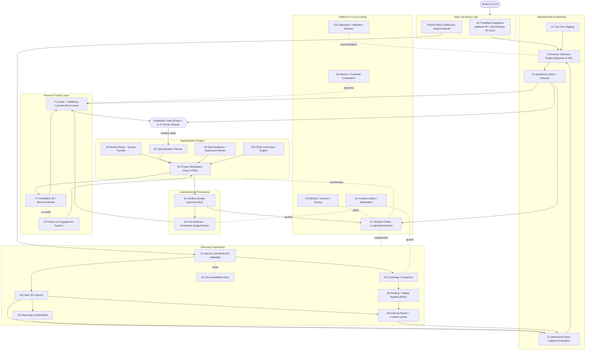

# PassionApps — Every Software Endeavor for the Full PassionLab

**Status:** v2 · updated 2026-07-23
**Purpose:** The complete build map. Every software artifact required to stand up the full PassionLab (Discovery + Specialization), what each is, how it fits, and **its current build status** — plus a flow diagram.
**Companions:** `DISCOVERY-APP-PRD.md`, `SPECIALIZATION-PIPELINE-PRD.md`, and the research memos in `docs/research/passion-pipeline/`.

> Legend: **✅ done** (built + merged to `main`, gate-green) · **🟡 partial** (a slice merged; more to build) · **⬜ todo** (not started). Delivery is tagged with its spec (`specs/NNN-…`).

---

## 0. Status log (2026-07-23)

**Repo gate on `main`:** `pnpm exec tsc -b` exit 0 · `pnpm test` (`vitest run`, repo root) **552 tests / 126 files green**.

**Built + merged so far** (all reconstruct-and-run verified before merge):

| Artifact | Status | Delivered by | What's left / notes |
|---|---|---|---|
| **C2** Two-Axis Tagging | ✅ done | `specs/009-two-axis-tagging` (+`tagger-stub`/`tagger-tfy`) | taxonomy + afforded/engaged resolver + validity harness + TFY auto-tagger |
| **C3** Interest Inference | ✅ done | `specs/011-interest-inference` | Beta-Bernoulli belief engine; ML-tuning deferred until longitudinal labels accrue (G5) |
| **C1** Behavioral Event Capture (Signal Firewall) | ✅ done (engine) | `specs/012-signal-pipeline` | the Interaction→ActionEvent→CellEvent derivation engine is done; the **UI that emits raw `Interaction`s is game-side** (teammate) |
| **C4** Hypothesis Store + Lifecycle | ✅ done | `specs/013-hypothesis-store` | versioned hypotheses + lifecycle + Phase 2→3 gate (det. checks + human sign-off) + console view-model |
| **G1** Student Profile + Discovery Orchestrator | ✅ done | `specs/014-student-profile` (+ `@gt100k/profile-store-fs`) | per-kid profile + append-only interaction log + a pure, idempotent full-replay `runCycle` wiring **012→011→013**; gates derived from the log; JSON-file-per-kid persistence. **The guide console now renders GENUINELY-DERIVED reads** (no more hand-built seed). Real TimeBack priors now fed by **G2 (020)**; consent/erasure (G3) later |
| **E2** Assessment / Oral Defense | ✅ done (engine) | `specs/010-socratic-defense` (+`tutor-stub`/`tutor-tfy`) | LLM-conducts + deterministic scaffold + evidence record; sampling cadence + UI integration still to wire |
| **F1** Guide + Wellbeing **Console (guide part)** | 🟡 partial | `specs/013` app `@gt100k/guide-console` (redesigned; fed by 014 + 016 + 018) | guide console shipped + redesigned (Workbench layout, child switcher + search, level rings, plain-language tooltips + Key), fed by the **014 orchestrator** (real derived reads), and now carries the **wellbeing/escalation panel (F2/016)** + the **specialization "Plan" panel (D1/018)**; a consolidation + visual polish pass across the panels + the of-record grade ownership tie-in remain |
| **F2** Push/Back-off + Burnout Monitor | ✅ done (engine) | `specs/016-wellbeing` (`@gt100k/wellbeing`) | pure two-knob engine (challenge PUSH/HOLD/SCAFFOLD × pressure AUTONOMY_UP/STEADY + back-off/rest/escalate) implementing the §6.2 table + 9 guardrails (devaluation weighted highest; push only from strength; missingness → human; counter-cyclical autonomy; never gamify; no child-facing label; behavioral-only), a deriver over the 014 log/013 store, and the guide-console panel; **guide surface functional, polish pending** |
| **G6** Guardrails — Program Metrics + Compliance | ✅ done | `specs/017-guardrails` (`@gt100k/guardrails`) | headless "honesty layer" over the merged discovery spine — program metrics (lifecycle funnel, coverage, calibration, reopen rates) + compliance checks GC1–GC6 (no scalar score, prompted≠voluntary, no auto-promotion, no demote-on-silence, no gamification, human-owned promotion) + a CLI report; aggregate, never kid-facing |
| **A6 + B1 + B2** Concierge + Child-Safe RAG + Curated Library | ✅ done | `specs/015-concierge-rag` (`@gt100k/concierge` + `@gt100k/concierge-live` + `apps/concierge`) | 10-stage defense-in-depth pipeline (curated-first → allowlist-biased retrieval → per-doc filter + injection spotlighting → grounded cite-or-refuse → output moderation → age-tier readability → async cache→vet→promote), typed ports with deterministic stubs (CI/LOOP_QA) + opt-in TFY/Wikipedia real adapters; the **curated library is domain×mode-tagged**, so it seeds discovery and grounds the D1 planner's briefs |
| **D1** Specialization Planner | ✅ done (engine) | `specs/018-specialization-planner` (`@gt100k/specialization-planner` + `@gt100k/planner-live` + guide-console Plan panel) | pure four-stage ascent engine (Ignition→Foundations→Authorship→Signature, **readiness-gated not age**), bounded/​capped DP, mandatory rest, mentor relay, PCDE focus, `derivePlanInputs` over 013/014/016, briefs grounded on the 015 curated library (deterministic stub + opt-in TFY), and a guide-console "Plan" panel; **system proposes, human disposes**; surface polish pending |
| **F3** Family Co-Engagement | ✅ done (engine) | `specs/019-family-coengagement` (`@gt100k/family` + `apps/family`) | pure `assessFamily` engine (warm-demanding coaching posture, counter-cyclical autonomy on rising stakes, door-opening asks, family-driven-pressure watch → guide re-coaching), a deriver over 013/014/016, and a new guide-coaching + family-preview surface; no affect detection, no gamification, no automated parent message; surface polish pending |
| **G2** TimeBack Integration | ✅ done | `specs/020-timeback-integration` (`@gt100k/timeback` + `@gt100k/timeback-live`) | subject→cabin crosswalk + `toDomainPriors` mapper (mastery → aptitude tilt, free-choice XP → discretionary tilt), light two-block handoff, `withPriors` hook, deterministic fake data source + opt-in live adapter scaffold (no real API yet); **prior only, never a gate** (standing no-gate test) |
| **E1** EvidenceGraph | 🟡 partial (**teammate**) | `specs/002-evidence-graph` (MVP) | core DAG + human-owned grades shipped; **D1–D6 pre-production gates** (transparency log, crypto-shred erasure, comparative-judgment, conformal, export provenance, signing) remain — **owned by teammate** — see `hardening/evidencegraph-productionization.md` |
| **A2** Cabin 3D Interiors | 🟡 partial | `apps/tinker-cabin` (game-side MVP) | one photoreal cabin + realism-loop harness; the rest of the world is the teammate's track |
| **A4** Taste Apps + Embedding SDK | 🟡 partial | intern apps exist | the embedding SDK + measurable-panel standard is not built |

**In flight (🔨):** nothing — 018 (D1), 019 (F3), and 020 (G2) all merged. Next up is a guide-console consolidation + polish pass (fold hypotheses + wellbeing + Plan + Family into one operator cockpit; iterate live).

**Not started (⬜):** A1 world · A3 asset pipeline · A5 accessibility mirror · D2 project workspace · D3 mentor relay · D4 audience broker · D5 PCDE curriculum · G3 consent/privacy · G4 safety/moderation · G5 calibration harness.

**Wiring gap — RESOLVED (014 + 020):** the discovery engines are wired end-to-end (`Interaction`s → 012 → 011 → 013 through the per-kid **G1** orchestrator), the console renders the derived read, and **real priors now flow from TimeBack (G2/020)** as a soft, never-gating starting hint. The remaining real input is the game-side `Interaction` emitter (C1 UI, teammate).

**Division of labor:** teammate owns the game/visual track (A1/A2/A3, world QA harness) **and E1 EvidenceGraph productionization**; we own the engines + RAG + ML + everything else (B, C, D1, F, G).

---

## 1. Artifacts

### Group A — Discovery Experience (client)

- **A1. Interest Lab World** *(net-new)* — The 2D walkable overworld the child's avatar moves through to find and revisit cabins. It is the primary navigation surface and where two signal-bearing choices happen: which cabin to approach and which to wander back to. *Fits:* the front door of Discovery; emits navigation/return events to A-measurement.
- **A2. Cabin 3D Interiors** *(net-new)* — Bounded, hyper-real 3D showrooms of gadgets, rendered on a **single persistent canvas whose contents swap** on enter/exit. *Fits:* the "doing" layer; hosts gadgets that launch the three-layer interaction.
- **A3. Cabin Content & Asset Pipeline** *(net-new)* — Tooling + assets to author the ~8 cabins and their gadgets with equal polish and clear affordances. *Fits:* produces the content A2 renders; the constraint "equal polish across cabins" lives here.
- **A4. Taste Apps + Embedding SDK** *(exists, partial)* — The intern Brilliant-style interactive modules, plus a standard for embedding them as measurable panels (Gather.town "walk up, press X" pattern). *Fits:* the on-platform "first taste" layer; the richest source of behavioral signal; a compounding asset.
- **A5. 2D Accessibility Mirror** *(net-new)* — A DOM/list rendering of the same cabins/gadgets/return-state at 1:1 parity (`plainViewEquals`) for keyboard/screen-reader users. *Fits:* accessibility peer to A1/A2, not a downgrade.

### Group B — Concierge

- **B1. Concierge Companion** *(✅ done — `specs/015-concierge-rag`)* — A single persistent, context-aware AI companion, summoned on demand, age/capability-adaptive, that converts a stated niche into 1–few testable probes. *Fits:* the porous escape valve for the long tail; its chat is never scored.
- **B2. Routing + Safety Pipeline** *(✅ done — `specs/015-concierge-rag`)* — Curated-library-first routing, plus open-web retrieval via RAG through safety/quality harnesses, with an age-appropriateness gate + caching/promotion + provenance/audit. *Fits:* powers B1 and A6; the 10-stage defense-in-depth pipeline shipped (stubs in CI + opt-in TFY/Wikipedia live adapters).
- **A6. External Resource Router + Curated Library** *(✅ done — `specs/015-concierge-rag`)* — The vetted resource catalog + metadata that the "deep dive" layer and concierge route to; compounds over time. *Fits:* Layer 3 of the cabin interaction; shares the vetting pipeline with B2.

### Group C — Measurement & Inference

- **C1. Behavioral Event Capture** *(net-new)* — Instruments the six active-construction signal families per `(domain × work-mode)` cell, with novelty and voluntary-vs-prompted flags; passive metrics kept as low-weight context only. *Fits:* the feature layer feeding C3.
- **C2. Two-Axis Tagging System** *(net-new)* — The domain × work-mode taxonomy + tooling (manual + auto-tagging) to tag every gadget, taste app, and external resource. *Fits:* without valid tags the whole signal is corrupt; a hidden critical dependency.
- **C3. Interest Inference Engine** *(net-new)* — The transparent Bayesian model: env/aptitude priors → trajectory updates → low-rank factorization (topic vs work-mode) → calibrated uncertainty + supporting/disconfirming reasons; principled now, ML-tuned as outcomes accrue. *Fits:* turns events into the ranked hypothesis; never emits a scalar/label.
- **C4. Hypothesis Store + Lifecycle Engine** *(net-new)* — Versioned, revisable hypotheses with states `EXPLORING→EMERGING→CANDIDATE→ACTIVE` + `PARKED/CONTESTED/REOPENED`. *Fits:* the durable output of Discovery; consumed by the gate and the guide console.

### Group D — Specialization Engine

- **D1. Specialization Planner** *(✅ done, engine — `specs/018-specialization-planner`)* — Living, adaptive, project-first plan generator: spike + aptitude + access + stage + history → a staged sequence of Type III projects with embedded bounded practice; LLM-generated + curated/RAG-grounded + human-reviewed; continuously replans against progress/return/burnout. *Fits:* the engine that drives the ascent.
- **D2. Project Workspace (Type III PBL)** *(net-new)* — Where kids do authentic real-audience projects; captures the working process. *Fits:* the recurring unit of the spine; feeds the EvidenceGraph.
- **D3. Mentor Relay + Access-Transfer System** *(net-new)* — Tracks the warm→technical→expert→master relay, engineered handoffs, and "access transferred" as a deliverable; routes AI + family + thin expert + near-peer roles. *Fits:* operationalizes the mentor spine in the software-first model.
- **D4. Real-Audience / Submission Broker** *(net-new)* — Competition calendars, publishing pipelines, community connections, marketplace submission. *Fits:* supplies real audiences at scale so "ambition scales by audience, not hours."
- **D5. PCDE Curriculum Engine** *(net-new)* — Stage-sequenced psychosocial-skill scaffolds embedded in projects, coached and assessed via the EvidenceGraph. *Fits:* builds the actual rate-limiter (psychosocial skills).

### Group E — Assessment & Provenance

- **E1. EvidenceGraph** *(exists, MVP; D1–D6 pre-production)* — Content-addressed process DAG with human-owned grades and neutral declared-AI-help nodes. Pre-live gates: transparency log, crypto-shred erasure, comparative-judgment, conformal calibration, export provenance, attestation signing. *Fits:* the "prove the spike" pillar; wraps every project. *v1 build:* `docs/decisions/evidencegraph-v1-design.md` — one graph per project (packets removed), standalone product.
- **E2. Assessment / Oral Defense System** *(net-new)* — AI-conducted, sampled, multi-touchpoint, anxiety-safe, age-adapted Socratic defense + the **readiness-staged** process rubric; human owns the grade. *Fits:* verifies authorship + understanding structurally (never a detector).

### Group F — Human & Family Layer

- **F1. Guide + Wellbeing Console** *(net-new)* — The thin professional layer's tool: per-kid evidence (separated families, supporting vs disconfirming, coverage gaps, next probe), lifecycle actions (promote/park), autonomy sign-offs, wellbeing/missingness escalations, defense grade ownership. *Fits:* where "the system proposes, the human disposes."
- **F2. Push/Back-off + Burnout Monitor** *(net-new)* — The behavioral signal→action engine (two knobs; PUSH/HOLD/SCAFFOLD/BACK-OFF/REST); quiet-devaluation detection; escalation to F1. *Fits:* keeps the ascent healthy; enforces the 9 burnout guardrails.
- **F3. Family Co-Engagement System** *(✅ done, engine — `specs/019-family-coengagement`)* — Warm prompts, structured shared activities/showcases, door-opening asks; family coaching toward warm-demanding; monitoring for family-driven pressure with guide re-coaching. *v1 build:* a pure `assessFamily` engine (child discovery + wellbeing state → a warm-demanding coaching posture — autonomy support × structure, **non-contingent** warmth, counter-cyclical on rising stakes — + door-opening asks + shared-activity ideas + a family-driven-pressure watch on the named obsessive-tip antecedents), a `deriveFamilySignals` deriver over 013/014/016, and a new `apps/family` guide-coaching console + family preview. **System proposes, human disposes**; no affect detection, no gamification, no automated parent message. *Fits:* the environment amplifier, safely.

### Group G — Platform & Cross-Cutting

- **G1. Student Profile / Longitudinal Record** *(net-new)* — The unified per-kid state across Discovery, Specialization, and academics (the shared PassionLab state, above the canvas). *Fits:* the spine every other artifact reads/writes.
- **G2. TimeBack Integration** *(✅ done — `specs/020-timeback-integration`)* — Pulls aptitude tilt + discretionary-XP prior; orchestrates the two-block daily loop. *Fits:* connects academics to the passion signal (prior only, never gate).
- **G3. Identity / Consent / Privacy Layer** *(net-new; pre-live gate)* — COPPA, consent scope, retention, parental access, and erasure. *Fits:* gates any live child; the erasure-on-append-only problem is unsolved.
- **G4. Content Safety / Moderation Service** *(net-new)* — Shared child-safety moderation across concierge, resources, and defense. *Fits:* one safety spine for all child-facing generation/retrieval.
- **G5. Calibration / Validation Harness** *(net-new)* — Tunes thresholds and validates the inference model as longitudinal outcomes accrue; tracks spike persistence (the ground-truth labels). *Fits:* the answer to "how do we know the measurement works?" — a first-class response to weak-point #1.
- **G6. Metrics / Analytics / Guardrail-Compliance** *(✅ done — `specs/017-guardrails`)* — Program-level dashboards (never kid-facing) + automated guardrail checks (no scalar-score leakage, no prompted returns counted, novelty discounted). *Fits:* measures whether the pipeline works and stays honest.

---

## 2. How it all fits together

---

## 3. Build-sequencing notes

- **Done (discovery spine + honesty/safety + specialization/family/priors engines):** C2 (009) · C1 (012) · C3 (011) · C4 (013) · E2 (010) · **G1 + orchestrator (014)** · F1-guide (013 app, redesigned + fed by 014/016/018) · **F2 wellbeing engine + panel (016)** · **G6 guardrails/metrics + compliance (017)** · **A6 + B1 + B2 concierge + child-safe RAG + curated library (015)** · **D1 specialization planner engine + Plan panel (018)** · **F3 family co-engagement engine + surface (019)** · **G2 TimeBack priors (020)** · E1-MVP (002, teammate). The engines are wired end-to-end and the console reads genuinely-derived data with real TimeBack priors.
- **Next up (in order):**
  1. **Guide-console consolidation + visual polish** — fold hypotheses + wellbeing (016) + Plan (018) + Family (019) into one coherent operator cockpit; iterate live.
  2. **Specialization lane (rest):** D2 project workspace → D3 mentor/D4 audience → D5 PCDE.
  3. **Pre-live gates:** E1 D1–D6 productionization (teammate), G3 consent/erasure, G4 safety-at-scale, G5 calibration (once outcome data accrues).
- **Original critical path (for reference):** A1 → A2/A3 → A4 → C2 → C1 → C3 → C4 → F1 (+ G1, G2). Concierge (B1/B2) and the external router (A6) can follow once the bounded loop reads signal.
- **Highest-risk / longest-lead:** B2 (child-safe open-web RAG), C3 + G5 (inference with no launch labels), E1 D1–D6 (all pre-production), G3 (erasure on append-only child data — a hard pre-live gate).
- **Pre-live gates (block any live child):** G3 erasure/consent, E1 provenance productionization, G4 safety at child scale. **Erasure sequencing:** E1 **D2 (erasure data model) must precede D1 (external anchoring)** — never anchor un-erasable child PII into a third party.
- **Compounding assets:** A4 taste apps and A6 curated library grow over time; prioritize coverage where behavioral signal matters most (a direct answer to the "data-starved external resources" weak point).

## 4. Hardening mini-specs

The four highest-risk areas have dedicated mini-specs in [`hardening/`](./hardening/):

- `human-scaling.md` — audit-only default + two human-owned carve-outs (wellbeing/safety, of-record grades); uncertainty-based routing; anti-rubber-stamp UX (weak point #4).
- `child-safe-rag.md` — live open-web behind a staged defense-in-depth harness, uniform across ages; async vet→promote (weak point #3).
- `measurement-validity.md` — the leaner validity program: behavior + light kid/family check-in, "not sure yet" default, bank long-term outcome data now (weak point #1).
- `evidencegraph-productionization.md` — three-layer erasure architecture (digests-over-ciphertext / per-child-encrypted payloads / deletable identity map), the "never hash plaintext PII" invariant, D1–D6 sequencing (weak point #6).
- `remaining-weakpoints.md` — per-spike quiet periods (#2), select-intense-then-convert + light backstop (#5), "nothing sticks" = exposure/diagnosis not a verdict (#7), speed-in-the-start/patience-in-the-commitment (#8).
