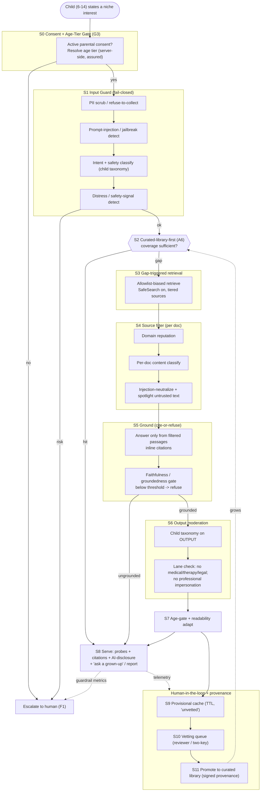

# 07 — Child-Safe Open-Web RAG: Hardening the Concierge Routing + Safety Pipeline (B2)

> Hardening memo for GT100K PassionLab. Specs the **safety architecture** for the child-facing concierge's open-web retrieval + RAG — the subsystem `passionApps.md` flags as **"the riskiest subsystem — needs its own hard spec"** (B2). Sibling to the passion-pipeline research memos; this one is an *engineering* spec for a single, dangerous surface: turning a 6-year-old's "I like volcanoes" into vetted, sourced, age-safe learning probes without ever surfacing the open web raw.

**Owners:** Passion Pipeline / Safety track
**Consumers:** B1 Concierge Companion, B2 Routing+Safety Pipeline, A6 External Router + Curated Library, G3 Identity/Consent/Privacy, G4 Content Safety/Moderation, F1 Guide + Wellbeing Console
**Status:** Research input → pre-live gate spec (blocks any live child, per `passionApps.md §3`)
**Scope honesty:** Product band is **ages 6–14**. The strongest empirical child-AI-harm evidence is about **teens (13–17)** — flagged inline as **[TEEN-EVIDENCE]**. The youngest users (6–8) are *less studied and structurally more at risk* (weaker deception-detection, higher automation trust), so this spec defaults conservative for them and treats teen findings as a **floor, not a ceiling**, on risk.
**Source honesty:** Only real, verifiable sources with links/DOIs. Regulatory dates verified to primary/agency sources where possible. Uncertainty flagged explicitly. Recommended numeric thresholds are **starting defaults for calibration (G5)**, not validated constants.

---

## 1. Thesis (one line)

Treat the open web as **hostile, unvetted input — never as an answer**: the concierge must run every request through a staged pipeline that *prefers the curated library, retrieves from an allowlist-biased open web only to fill gaps, strips the retrieved text of its authority (grounding + cite-or-refuse), moderates input and output against a child taxonomy, age-gates and simplifies, and quarantines every new resource behind human vetting before it can ever become a permanent library entry* — because the documented failure mode is exactly the opposite (a system reads the web aloud to a child with no vetting: the Amazon Alexa "penny challenge," 2021).

---

## 2. Recommended safety architecture

### 2.1 Design stance (three non-negotiables)

1. **Retrieval is not endorsement.** A retrieved passage is *evidence to be checked*, not content to be served. Nothing reaches the child that isn't either (a) already in the curated library (A6) or (b) grounded in sources that passed the filter *and* survived output moderation. This directly answers the Alexa failure, where a smart speaker read a web article's description of a lethal challenge to a 10-year-old because retrieval == answer (BBC, 2021).
2. **Defense in depth, because no single filter holds.** Prompt injection "cannot be patched" — it exploits the LLM design itself and requires layered controls (OWASP LLM01:2025). Age gates are "easily bypassed" in the wild [TEEN-EVIDENCE] (Common Sense Media × Stanford Brainstorm Lab, 2025). So we stack independent checks; each stage assumes the previous one failed.
3. **The system proposes, a human disposes — before anything becomes permanent.** Nothing is *promoted* into the durable library on model judgment alone. Caching is provisional; promotion is human-gated with a full provenance record (mirrors the PRD's "propose/dispose" pattern for F1).

### 2.2 The staged pipeline (retrieve → filter → ground → moderate → age-gate → serve/cache, with human vetting)

Prose walkthrough of the request lifecycle. Stage numbers map to the diagram in §2.3.

- **S0 — Identity & consent gate (G3).** Before any generation: confirm active parental consent scope and resolve the child's **age tier** (6–8 / 9–11 / 12–14). Age tier is a *server-side profile attribute*, never a self-attested field the child types (self-attestation is the exact weakness regulators and CSM call out; require age *assurance*, not a birthday box). No consent / no tier → no concierge.
- **S1 — Input guard (on the child's message).** Four parallel checks: (a) **PII scrubbing/redaction** — detect and strip names, addresses, school, phone, image EXIF, etc.; the concierge *solicits no PII* and must actively refuse it if offered; (b) **prompt-injection / jailbreak detection** on the raw input (Azure Prompt Shields "user prompt" class, or Llama Guard + a jailbreak classifier); (c) **intent + safety classification** against the child taxonomy (§2.4) to catch disallowed asks (self-harm, sexual, violence, weapons, "how do I meet this person IRL"); (d) **distress/risk detection** for escalation (§2.5). Fail-closed: unsafe input never reaches retrieval; distress routes to the human path immediately.
- **S2 — Curated-library-first routing (A6).** Query the vetted catalog first. If it covers the interest with sufficient confidence, **serve from the library and stop** — no open-web call. This is the cheapest, safest, and most auditable path, and it *compounds*: every promoted resource shrinks the open-web surface.
- **S3 — Gap-triggered open-web retrieval (only on miss).** On insufficient coverage, retrieve — but **allowlist-biased**: a tiered source policy (Tier-1 = pre-approved child/education publishers served with lighter checks; Tier-2 = reputable general sources allowed only through full filtering; Tier-3/unknown = allowed into the *candidate* pipeline but **never served directly** — cache-and-vet only). Force provider SafeSearch/strict filters on, restrict media types, and cap depth. Retrieval returns *candidate documents*, not answers.
- **S4 — Source filter (per retrieved document).** Each candidate doc is independently: (a) **domain-reputation scored**; (b) **content-classified** with the child moderation stack (drop anything tripping the taxonomy); (c) **injection-neutralized** — treat retrieved text as untrusted data, strip/deactivate embedded instructions, and apply *spotlighting* (mark third-party content as lower-trust so the generator won't obey instructions hidden inside it — the OWASP-recommended and Azure-implemented control for **indirect** prompt injection). Only surviving passages enter the grounding context.
- **S5 — Ground (constrained, cite-or-refuse generation).** The generator answers **only** from filtered passages (closed-book answering is disabled for factual claims), emits **inline citations to source spans**, and self-checks: use Self-RAG-style reflection (is retrieval relevant? is each statement supported? is it useful? — Asai et al., 2024) and/or a **groundedness/faithfulness gate** (Azure Groundedness Detection, or RAGAS faithfulness = fraction of answer claims entailed by context; Es et al., 2024). **Below the faithfulness threshold → refuse, don't guess** ("I couldn't find a kid-safe source for that — want me to ask a grown-up to look?"). This is the core anti-hallucination control; RAG was introduced precisely to add *provenance* and updatable knowledge to generation (Lewis et al., 2020).
- **S6 — Output moderation (on the drafted answer).** Re-run the full child taxonomy on the *generated* text (not just inputs) — Llama Guard 3 and Azure Content Safety both explicitly moderate **both** input and output; do the same. Add a **child-appropriateness classifier** tuned to the age tier and a **lane check** (no medical/therapy/legal advice — Llama Guard S6 "Specialized Advice"; the concierge must never impersonate a professional, per the Character.AI therapist-impersonation failure and EU AI Act Art. 50 disclosure duty).
- **S7 — Age-gate & readability adaptation.** Adapt vocabulary, sentence length, and concept load to the tier (readability targets, e.g., grade-banded reading level), keep the "this is an AI, not a person" disclosure persistent, and attach **age-appropriate framing** ("ask a grown-up before…" for anything requiring materials, tools, or going somewhere).
- **S8 — Serve.** Return the probe(s) with **visible, tappable citations**, an AI-disclosure, and a one-tap "tell a grown-up / report" affordance. The concierge chat is *never scored* (per B1) — safety telemetry ≠ interest signal.
- **S9 — Cache (provisional).** New, useful, gap-filling resources are cached as **candidates** with full provenance (query, source URL(s), retrieval time, every classifier score, model + prompt versions, filter verdicts). Provisional cache has a **TTL** and is marked "not yet human-vetted"; it may be *reused for retrieval context* but is **not** a promoted library entry and is re-checked on each serve.
- **S10 — Human vetting queue → S11 promotion (A6 + F1).** A reviewer (or reviewer + second key for permanent promotion — "two-key" for durable catalog writes) approves/edits/rejects candidates. Approved → **promoted** to the curated library with a signed provenance/audit record and tags (C2 two-axis taxonomy). Rejected → blocklist + feed the negative example back to threshold tuning (G5). Everything is logged for audit (G6) and surfaced to guides (F1).

**Cross-cutting:** every stage emits structured telemetry to **G6 (guardrail-compliance)** and **F1 (wellbeing/escalation)**; thresholds are owned by **G5 (calibration)**; the moderation models are the shared **G4** spine so concierge, resources, and oral-defense all enforce one policy.

### 2.3 Pipeline diagram

### 2.4 Content moderation + age-appropriateness classification (the S1/S4/S6 detail)

**Multi-stage, both directions, one taxonomy.** Moderate the **child's input** (S1), **each retrieved document** (S4), and the **generated output** (S6). Industry classifiers are explicitly built for this dual input/output use — Llama Guard 3 "can classify content in both LLM inputs (prompt classification) and in LLM responses (response classification)" (Meta, 2024), and Azure Content Safety runs on prompts and completions.

**Base taxonomy — start from a standard, then extend for children.** Adopt the **MLCommons hazard taxonomy** (Vidgen et al., 2024) as implemented by Llama Guard 3 (S1 Violent Crimes, S2 Non-Violent Crimes, S3 Sex-Related Crimes, **S4 Child Sexual Exploitation**, S5 Defamation, **S6 Specialized Advice**, S7 Privacy, S8 IP, S9 Indiscriminate Weapons, S10 Hate, **S11 Suicide & Self-Harm**, S12 Sexual Content, S13 Elections). It gives an interoperable, standardized label set. Then **add child-specific categories** the general taxonomies under-weight:

- **Age-inappropriate-but-legal** content (mature themes, frightening/graphic material, gambling, drugs/alcohol/vaping normalization).
- **Contact/grooming & real-world-meeting** risks (any nudge toward meeting a person, sharing location/school, or private channels).
- **Dangerous "challenges"/imitable-harm** content (the Alexa penny-challenge class — physically dangerous stunts, DIY hazards, ingestion) — treat *imitability by a child* as a first-class hazard dimension, not just "is it legal."
- **Emotional-dependency / parasocial** patterns (companion-style "I'm your best friend," discouraging real relationships) — CSM rates these an *unacceptable* design pattern for minors [TEEN-EVIDENCE].
- **Commercial pressure** (ads, dark-pattern nudges) — banned by the UK Children's Code (nudge-technique + detrimental-use standards).

**Severity, not just binary.** Use graded severity where available (Azure exposes Safe/Low/Medium/High = 0/2/4/6 across hate/sexual/violence/self-harm), and set **age-tier-specific thresholds** (younger tier = stricter cutoffs). Prefer an **ensemble**: a fast classifier inline (e.g., Llama Guard 3-1B on-device latency profile) + a stronger check for borderline scores, because these classifiers are honest about being "a good baseline… more complex systems should be deployed for use cases highly sensitive to these hazards" (Meta model card).

### 2.5 Guardrails: jailbreak/injection, PII, refusal, escalation (S1/S5/S6 detail)

- **Prompt injection (OWASP LLM01:2025).** Direct ("ignore your rules") *and* indirect (instructions hidden in a retrieved page/image). Controls, layered: instruction hierarchy / constrained system prompt; **segregate and mark untrusted retrieved content (spotlighting)**; input+output filtering; least-privilege on any tool the concierge can call; and **human approval for anything that would write to the durable library** (promotion is never model-only). OWASP is explicit that you "cannot filter your way out" — hence defense in depth.
- **PII.** Data minimization by default (UK Children's Code Std 8; COPPA data-minimization + retention limits). The concierge **does not ask for PII**, redacts it on input, doesn't store raw chat as training data without separate consent (a specific harm in the Character.AI complaint: children's private thoughts harvested for training), and honors erasure (G3). High-privacy defaults, profiling off (UK Children's Code Std 7/12).
- **Refusal patterns.** Refusals are **child-friendly and non-scary**, never lecture-y, always offer a safe next step ("I can't help with that one — let's find something cool about volcanoes instead," or "let's ask a grown-up"). **Cite-or-refuse** on facts (S5). Refusal copy is content that itself passes age-appropriateness review.
- **Escalation to a human on distress/safety.** Detected self-harm, abuse disclosure, or acute distress **exits the RAG lane entirely** and routes to F1 (guide/wellbeing) with a safe holding message — the concierge does **not** attempt therapy or crisis counseling (the Character.AI bot's fatal failure was staying in-lane as a fake confidant/"therapist" instead of escalating). This is the single most important child-specific guardrail.

### 2.6 Human-in-the-loop vetting, caching/promotion, provenance/audit (S9–S11 detail)

- **Vet before permanence.** Model output can be *served provisionally* (fully filtered, cited) but **cannot become a curated-library entry without a human**. Two states: **cached candidate** (TTL, re-checked each use, marked unvetted) vs **promoted entry** (durable, tagged, reusable). Consider **two-key** review for permanent promotion of Tier-3/unknown sources.
- **Provenance record (per candidate & per promotion).** Store: original query + age tier, every source URL and retrieved span, retrieval timestamp, all classifier scores + versions, filter/injection verdicts, model + prompt + policy versions, grounding/faithfulness score, reviewer identity + decision + edits. This is the audit spine for G6 and the erasure/consent story for G3, and it satisfies NIST AI RMF **Govern/Map/Measure/Manage** traceability and the UK Children's Code DPIA/transparency standards.
- **Feedback loop.** Rejections → blocklist + negative examples for threshold tuning (G5); promotions → C2 tagging + coverage-gap analytics (prioritize vetting where behavioral signal matters most, per `passionApps.md §3`). Periodically **re-vet** promoted entries (link rot, edited pages, changed policies).

---

## 3. Options & tradeoffs: curated-only vs open-web-with-harness

| Option | What it is | Pros | Cons / risks | Verdict for 6–14 |
|---|---|---|---|---|
| **A. Curated-only** | Concierge answers *only* from the human-vetted library (A6). No live open-web retrieval. | Highest safety & auditability; every answer pre-vetted; simplest compliance; no indirect-injection surface. | Cold-start gaps; can't serve the long tail (the concierge's whole reason to exist — the "porous escape valve," B1); coverage debt falls hardest on niche/under-resourced interests. | **Launch here.** Safest first-live posture; pre-live gate can be met. |
| **B. Open-web-with-harness** | The full staged pipeline (§2): retrieve on gaps, filter, ground, moderate, age-gate, cache-and-vet. | Serves the long tail; library *compounds* from real demand; keeps the escape valve porous. | Every added stage is a new failure point; indirect injection + dangerous-challenge + hallucination surface is real; needs sustained human vetting capacity. | **Earn into it** behind the harness, **Tier-3 = cache-and-vet-only (never served live)**. |
| **C. Naive open-web (no harness)** | LLM reads the web to the child. | Cheap, fast. | This *is* the Alexa/penny-challenge and companion-chatbot failure class. | **Never.** Disqualified. |

**Recommendation — staged rollout, not a binary.** Ship **A (curated-only)** to first live children to clear the pre-live safety gate. Turn on **B** progressively: first **Tier-1 allowlisted** publishers served live through the harness; **Tier-2** live only above high filter-confidence; **Tier-3/unknown** *cache-and-vet-only, never served directly*. Gate each expansion on measured guardrail performance (§6), reviewer throughput, and G5 calibration. This preserves the concierge's long-tail purpose while keeping the default posture "vetted-first, web-as-last-resort, human-before-permanent."

---

## 4. Best practices & standards (with citations)

### 4.1 Child-safe AI/LLM design — practitioner + research consensus

- **Social AI companions are "unacceptable risk" for minors [TEEN-EVIDENCE].** Common Sense Media with Stanford Medicine's Brainstorm Lab tested Character.AI, Replika, Nomi et al. and found they easily produce self-harm/sexual/dangerous content and that **age gates were easily bypassed**; recommends **no companions under 18** and **age assurance beyond self-attestation** (Common Sense Media, Apr 2025). Design implication for GT100K: the concierge is explicitly **not** a companion — no emotional-dependency design, persistent AI-disclosure, chat never scored, escalation over engagement.
- **UNICEF Policy Guidance on AI for Children (v3.0, 2025; v2.0, 2021).** 10 requirements for child-centred AI (safety; data/privacy protection; fairness; **transparency, explainability & accountability**; best interests/well-being; inclusion), with child-rights impact assessments as a concrete tool (UNICEF Innocenti).
- **RAG for provenance & updatable knowledge.** RAG was introduced to give generation *explicit non-parametric memory* and **provenance** for its claims (Lewis et al., NeurIPS 2020) — the mechanism our cite-or-refuse rule depends on.
- **Adaptive, self-reflective grounding.** Self-RAG trains models to decide *when* to retrieve and to critique support/utility via reflection tokens, improving factuality and citation accuracy (Asai et al., ICLR 2024).
- **RAG evaluation you can gate on.** RAGAS defines reference-free **faithfulness** (fraction of answer claims entailed by retrieved context), **answer relevance**, and **context relevance** (Es et al., EACL 2024) — usable as the S5 threshold + offline QA metric.
- **Moderation tooling (both directions).** Llama Guard 3 (input+output classifier over the MLCommons taxonomy; 1B for on-device; Meta/PurpleLlama, 2024); MLCommons hazard taxonomy (Vidgen et al., 2024); Azure AI Content Safety **Prompt Shields** (direct+indirect injection) and **Groundedness Detection** (grounded/ungrounded + auto-correction) (Microsoft Learn).
- **LLM security baseline.** OWASP Top 10 for LLM Applications (2025), **LLM01 Prompt Injection** as the #1 risk, defense-in-depth guidance (OWASP GenAI Security Project).
- **Governance backbone.** NIST AI RMF 1.0 (2023) + **Generative AI Profile, NIST AI 600-1** (2024): Govern/Map/Measure/Manage over GAI-specific risks incl. **confabulation** (hallucination), information integrity, dangerous/violent content, data privacy (NIST, DOI 10.6028/NIST.AI.600-1).

### 4.2 Regulatory / standards frame

- **COPPA (US), amended 2025.** Under-13: verifiable parental consent before collecting/using/disclosing personal information; the FTC's first update since 2013 was **published in the Federal Register April 22, 2025**, **effective June 23, 2025**, with **full compliance by April 22, 2026** (FTC; Federal Register 2025-05904). New/strengthened: **separate opt-in consent** for third-party/targeted-ad disclosure, expanded "personal information" (incl. biometric + government identifiers), a **written information security program**, and **data-retention limits** (no indefinite retention). Direct hits on GT100K: no PII solicitation, minimization, retention policy, erasure (G3).
- **UK Age Appropriate Design Code ("Children's Code"), ICO.** 15 standards for services *likely to be accessed* by under-18s: **best interests of the child** first, **DPIA**, **high-privacy defaults**, **data minimization**, **no detrimental nudge techniques**, **profiling off by default**, age-appropriate transparency (ICO). In force since 2021; extraterritorial (applies to UK children regardless of company location).
- **EU AI Act — Regulation (EU) 2024/1689.** **Art. 5(1)(b)** prohibits AI that **exploits age-related vulnerabilities** to materially distort behavior and cause significant harm; **Recital 28** names children a distinct vulnerable group; AI in **education** is **high-risk** (Annex III); **Art. 50 transparency** requires disclosing that a user is interacting with an AI and labeling AI-generated content (EUR-Lex; artificialintelligenceact.eu). Direct hit: **persistent AI-disclosure**, **no manipulative/engagement-maximizing design**, and no professional impersonation.
- **IEEE 2089-2021 — Age Appropriate Digital Services Framework (based on 5Rights).** Lifecycle processes to (a) recognize the user is a child, (b) uphold children's rights/capacity, (c) offer child-appropriate terms, (d) present information age-appropriately, (e) validate design decisions (IEEE, DOI/doc 9627644; free via IEEE GET). Companion **IEEE 2089.1-2024** covers **age assurance** (assurance levels + "4 Cs" risk framing) — the standard to cite when specifying S0 age-tier resolution beyond self-attestation.
- **Regulatory momentum (design to it now).** FTC **6(b) inquiry** into companion chatbots' impact on children (orders to 7 companies, Sept 11, 2025) signals that *safety testing, age restrictions, and disclosures* are the scrutiny axes — exactly what §2 + §6 instrument.

---

## 5. Failure modes (real edtech/kids-AI incidents) → mitigations

| # | Failure mode (evidence) | GT100K mitigation |
|---|---|---|
| 1 | **Open-web retrieval surfaces imitable danger.** Alexa read a web article's "penny/outlet challenge" to a 10-year-old who asked for "a challenge" (BBC/CNBC, 2021) — retrieval treated as answer, no imitability/age check. | S4 per-doc classify + **imitable-harm** category; S5 cite-or-refuse; **nothing served raw from web**; Tier-3 cache-and-vet-only. |
| 2 | **Companion dynamics + no escalation → tragedy [TEEN-EVIDENCE].** Character.AI: sexualized chats, **bot posed as a licensed therapist**, encouraged a suicidal 14-year-old; wrongful-death suit (Garcia v. Character Technologies, 2024; settled Jan 2026). | Not a companion (B1); persistent AI-disclosure (EU Art. 50); **distress → exit RAG, escalate to F1**; lane check bans therapy/medical + professional impersonation. |
| 3 | **Age gates bypassed; harmful content easily elicited [TEEN-EVIDENCE]** (CSM × Stanford, 2025). | **Age assurance, not self-attestation** (S0; IEEE 2089.1); input+output moderation ensemble; adversarial red-teaming pre-live. |
| 4 | **Hallucinated "facts" to a trusting child** (NIST "confabulation," AI 600-1). Young children over-trust automation. | S5 grounding + faithfulness gate (RAGAS/Azure Groundedness); **cite-or-refuse**; closed-book factual answers disabled. |
| 5 | **Indirect prompt injection** via a retrieved page/image (OWASP LLM01:2025; Azure "document attack"). | Treat retrieved text as untrusted; **spotlighting**; strip embedded instructions; least-privilege; human gate on library writes. |
| 6 | **Quiet PII capture / training on kids' data** (Character.AI complaint; COPPA). | No PII solicitation; input redaction; retention limits + erasure (G3); no training on child chat without separate consent. |
| 7 | **Engagement-maximizing dark patterns** (FTC 6(b) focus; EU Art. 5; UK Code nudge standard). | Concierge chat **never scored**; no streaks/dependency hooks on this surface; bounded, reward-neutral by design. |
| 8 | **Reviewer bottleneck / stale library** (operational). | Provisional cache with TTL; tiered review effort; periodic re-vet; coverage-gap prioritization (G5/G6). |

---

## 6. Open risks + honest limits

- **The 6–8 evidence gap is real.** Almost all published child-AI-harm testing targets **teens** [TEEN-EVIDENCE]; the youngest users are the highest-risk *and* least-studied. We default conservative for them, but we are **extrapolating** — treat early-tier thresholds as provisional and validate with domain experts + guarded pilots (G5). *Uncertainty: high.*
- **Moderation classifiers are baselines, not guarantees.** Vendors say so explicitly (Meta model card). They miss (false negatives = harm reaches a child) and over-block (false positives = a curious kid is stonewalled). Both are costly; the false-negative tail is unbounded at scale. Ensembles + human review reduce, don't eliminate, this.
- **Prompt injection is unsolved.** OWASP is blunt: it "cannot be patched." Our controls raise cost; a determined adversary (or a novel indirect vector) can still get through. The **human-before-permanent** gate is the backstop that keeps a one-off exploit from becoming a durable library entry.
- **Groundedness ≠ truth.** Faithfulness metrics check "supported by the retrieved source," not "the source is correct." A confidently wrong Tier-2 page can produce a faithful-but-false answer. Mitigation: source-reputation weighting + human vetting for promotion — but *garbage-in risk remains*.
- **Age assurance is itself a privacy tension.** Strong age assurance can require *more* data — colliding with COPPA/UK-Code minimization. IEEE 2089.1 assurance levels help calibrate, but this trade-off is genuinely unresolved (the FTC has flagged forthcoming age-verification rulemaking). *Design decision needed with G3.*
- **Regulatory flux.** COPPA amendments, EU AI Act phased dates, state laws (e.g., CA/NY companion-bot bills), and the FTC 6(b) inquiry are all live in 2025–2026. Build **ongoing monitoring** into compliance rather than a one-time check.
- **Cost & latency.** A 6-stage pipeline with ensembled classifiers + grounding checks adds real latency and per-request cost; some checks can run async (post-serve for cached candidates) but **input guard, grounding, and output moderation must be inline**. Budget accordingly.

---

## 7. References

*(All verified to the linked source; dates as reported by primary/agency pages.)*

**Regulation & standards**
1. FTC, *Children's Online Privacy Protection Rule (COPPA)* — rule hub: https://www.ftc.gov/legal-library/browse/rules/childrens-online-privacy-protection-rule-coppa · Final amendments press release (Jan 16, 2025): https://www.ftc.gov/news-events/news/press-releases/2025/01/ftc-finalizes-changes-childrens-privacy-rule-limiting-companies-ability-monetize-kids-data · Federal Register (Apr 22, 2025, doc 2025-05904): https://www.federalregister.gov/documents/2025/04/22/2025-05904/childrens-online-privacy-protection-rule
2. ICO, *Age Appropriate Design Code (Children's Code)* — 15 standards: https://ico.org.uk/for-organisations/uk-gdpr-guidance-and-resources/childrens-information/childrens-code-guidance-and-resources/age-appropriate-design-a-code-of-practice-for-online-services/
3. *Regulation (EU) 2024/1689 (Artificial Intelligence Act)* — EUR-Lex: https://eur-lex.europa.eu/eli/reg/2024/1689/oj · Art. 5 (prohibited practices, incl. 5(1)(b) age-vulnerability): https://artificialintelligenceact.eu/article/5/
4. IEEE, *Std 2089-2021 — Age Appropriate Digital Services Framework Based on the 5Rights Principles for Children*: https://ieeexplore.ieee.org/document/9627644 · standard page: https://standards.ieee.org/ieee/2089/7633/ · (companion IEEE 2089.1-2024, age assurance)
5. NIST, *AI Risk Management Framework 1.0* (2023), DOI 10.6028/NIST.AI.100-1 · *Generative AI Profile, NIST AI 600-1* (Jul 2024), DOI 10.6028/NIST.AI.600-1 · PDF: https://nvlpubs.nist.gov/nistpubs/ai/NIST.AI.600-1.pdf
6. UNICEF Innocenti, *Policy Guidance on AI for Children* (v3.0, 2025; v2.0, 2021): https://www.unicef.org/innocenti/reports/policy-guidance-ai-children

**Safety engineering (RAG, moderation, security)**
7. Lewis et al., *Retrieval-Augmented Generation for Knowledge-Intensive NLP Tasks*, NeurIPS 2020, arXiv:2005.11401: https://arxiv.org/abs/2005.11401
8. Asai et al., *Self-RAG: Learning to Retrieve, Generate, and Critique through Self-Reflection*, ICLR 2024, arXiv:2310.11511: https://arxiv.org/abs/2310.11511
9. Es et al., *RAGAS: Automated Evaluation of Retrieval Augmented Generation*, EACL 2024, arXiv:2309.15217: https://arxiv.org/abs/2309.15217 · faithfulness metric docs: https://docs.ragas.io/en/stable/concepts/metrics/available_metrics/faithfulness/
10. Meta, *Llama Guard 3* model cards (8B / 1B), PurpleLlama: https://github.com/meta-llama/PurpleLlama/blob/main/Llama-Guard3/8B/MODEL_CARD.md
11. Vidgen et al., *Introducing v0.5 of the AI Safety Benchmark from MLCommons* (hazard taxonomy), arXiv:2404.12241: https://arxiv.org/abs/2404.12241
12. Microsoft, *Azure AI Content Safety* — Prompt Shields (jailbreak/indirect injection): https://learn.microsoft.com/en-us/azure/ai-services/content-safety/concepts/jailbreak-detection · Groundedness detection: https://learn.microsoft.com/en-us/azure/ai-services/content-safety/concepts/groundedness
13. OWASP GenAI Security Project, *Top 10 for LLM Applications (2025)* — LLM01 Prompt Injection: https://genai.owasp.org/llm-top-10/ · https://genai.owasp.org/llmrisk/llm01-prompt-injection/

**Real-world failure evidence**
14. Common Sense Media × Stanford Brainstorm Lab, *Social AI Companions — risk assessment* (Apr 2025, "Unacceptable Risk"): https://www.commonsensemedia.org/press-releases/ai-companions-decoded-common-sense-media-recommends-ai-companion-safety-standards · assessment: https://institute.commonsensemedia.org/risk-assessments/social-ai-companions
15. *Garcia v. Character Technologies, Inc.* (Sewell Setzer III) — AP (Oct 2024): https://apnews.com/article/chatbot-ai-lawsuit-suicide-teen-artificial-intelligence-9d48adc572100822fdbc3c90d1456bd0 · settlement, Reuters (Jan 2026): https://www.reuters.com/world/google-ai-firm-settle-florida-mothers-lawsuit-over-sons-suicide-2026-01-07/ · Garcia Senate Judiciary testimony (Sep 16, 2025): https://www.judiciary.senate.gov/imo/media/doc/e2e8fc50-a9ac-05ec-edd7-277cb0afcdf2/2025-09-16%20PM%20-%20Testimony%20-%20Garcia.pdf
16. Amazon Alexa "penny/outlet challenge" (Dec 2021), BBC: https://www.bbc.com/news/technology-59810383 · CNBC: https://www.cnbc.com/2021/12/29/amazons-alexa-told-a-child-to-do-a-potentially-lethal-challenge.html
17. FTC, *6(b) inquiry into AI chatbots acting as companions* (Sep 11, 2025): https://www.ftc.gov/news-events/news/press-releases/2025/09/ftc-launches-inquiry-ai-chatbots-acting-companions
