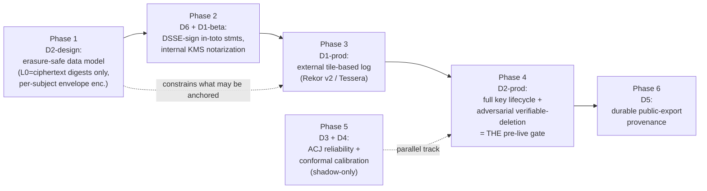

# 08 — EvidenceGraph Productionization: Child-Data Erasure on an Append-Only Store, and the D1–D6 Pre-Live Plan

> Implementation-focused hardening memo for GT100K PassionLab. Takes the shipped, synthetic-only MVP (`passion/packages/evidence-graph`, ports/adapters, six explicitly-deferred gates) to a design that can hold **live child data**. Centers on **D2** — reconciling a tamper-evident, content-addressed DAG with the **right to erasure for children** — and gives a staged productionization plan for **D1–D6**.

**Owners:** EvidenceGraph / Platform hardening track
**Status:** Research input to PRD §19 / §19.2 (D1–D6), `GOVERNANCE.md` G7 (privacy zones) and G9 (safeguarding legal hold), and the Release Threshold Registry (§33.1). Consumes the shipped domain in `passion/packages/evidence-graph`.
**Grounding:** Anchored in the actual code (`src/model.ts`, `src/merkle.ts`, `src/attestation.ts`, `src/ports.ts`; `adapters/evidence-deferred`; archived `archive/foundation-spine/workflows/deletion/*.go`) and the PRD's existing §19 erasure design.
**Source honesty:** Only real, verifiable sources are cited, with DOIs/links. Preprints and non-independently-verified items are flagged inline as **[PREPRINT]** / **[UNVERIFIED]**. Legal statements are engineering-grade summaries, **not legal advice**.

---

## 1. Thesis (one line)

Do not try to delete from the immutable graph — make the immutable graph **hold nothing that is personal in the first place** (only high-entropy digests of *off-graph, per-child-encrypted* payloads), so that erasure is achieved by **crypto-shredding the child's key + hard-deleting off-graph identifiers**, leaving every Merkle root, attestation, and transparency-log proof still verifiable; treat crypto-shredding as a *supplement to* real deletion, never a *substitute for* it.

---

## 2. The recommended erasure architecture (concrete)

### 2.1 The one non-negotiable build rule

> **On-graph, you may store only content-address digests computed over high-entropy, per-subject-encrypted material (ciphertext + random salt/IV). Never content-address plaintext PII, and never store a hash of a low-entropy human-meaningful field on the DAG.**

Why this is the whole ballgame: a SHA-256 of a child's name, grade, or date of birth **is itself personal data**. It is a stable identifier and it is *verifiable* — an adversary who guesses the value can confirm it against the hash (a "hash-is-a-commitment" / dictionary attack), and low-entropy fields are trivially enumerable. The EDPB says exactly this: it is "not advisable to register personal data" on an immutable structure "in clear text, encrypted or hashed" form (EDPB Guidelines 02/2025, §5.2) [EDPB]. If plaintext PII is ever hashed onto the DAG, that digest cannot be erased without breaking the chain, and the entire scheme fails. So the digest that content-addresses a node **must** be taken over ciphertext (which is high-entropy and, post-key-destruction, indistinguishable from random) plus a random salt — never over the plaintext.

**Code delta this forces (today's MVP is not yet erasure-safe):** in `src/model.ts`, `EvidenceNode.payload: Record<string, unknown>` is content-addressed directly (`id = Hasher.hash(canonicalize(content))`, `src/graph.ts` / `src/canonicalize.ts`). For live data, `payload` must carry only an **off-graph ciphertext reference + the ciphertext digest + the per-subject key reference**, not human-readable fields. The node id then commits to ciphertext, not to a child.

### 2.2 Three layers, only one of them immutable

| Layer | Contents | Mutability | Erasure mechanism |
| --- | --- | --- | --- |
| **L0 — Evidence DAG (on-graph)** | Content-address digests (over L1 ciphertext), node/edge taxonomy, **pseudonymous** actor refs (opaque random ids), coarsened timestamps, per-milestone Merkle roots, in-toto attestations, transparency-log inclusion proofs. | **Append-only / immutable.** | *Never mutated.* Rendered anonymous **by construction** once L1/L2 are gone (EDPB "anonymous by design"). |
| **L1 — Encrypted payload store (off-graph)** | The real artifacts, text, media, human-meaningful fields — each encrypted under a **per-record DEK** wrapped by a **per-subject KEK**. | Append-mostly; ciphertext may persist. | **Crypto-shred:** destroy the per-subject KEK → all that child's ciphertext (primary + backups + replicas) becomes undecipherable. |
| **L2 — Identity map + derived stores** | pseudonym→legal-identity map, derived features, vector embeddings, search indexes, caches. | **Fully mutable / deletable.** | **Hard delete** (the "off-graph identifier erasure" of the EDPB three-part pattern). |

This is the EDPB's own recommended shape: keep personal data **off-chain**, put **only references / cryptographic proofs** on the immutable structure, so that "once the off-chain data is deleted, the proof alone can't be used to identify anyone" (EDPB Guidelines 02/2025; summary Rec. 16) [EDPB]. It is also the "anchor-only" locus in the cryptographic-erasure systematization (SoK, IACR ePrint 2026/1109) [SOK-CE] **[PREPRINT]**.

### 2.3 Key-management architecture (three-tier envelope encryption)

```
per-record DEK        →  encrypts one L1 payload (AES-256-GCM, random IV)
per-SUBJECT KEK       →  wraps all of one child's DEKs        ← THE CRYPTO-SHRED UNIT
per-ZONE root key     →  in FIPS 140-3 HSM/KMS, wraps KEKs
```

- **Granularity = per subject (per child), not per group.** Per-group keys cut key-count overhead but *couple children's erasability* — you cannot shred one child without orphaning the others in the group. For child data the correct unit is **one KEK per child** (aligns with `GOVERNANCE.md` G7: "Envelope encryption assigns per-subject or per-project data keys"). Per-*project* sub-keys are acceptable **under** the per-subject KEK for finer-grained project export/erase.
- **KEK never leaves the HSM/KMS in plaintext.** Destruction = KMS scheduled key-version destruction. NIST SP 800-88 Rev. 1 §2.6 recognizes this as **Cryptographic Erase (CE)**, a Purge-level sanitization: "sanitization of the target data is reduced to sanitization of the encryption key(s)" [NIST-88]. Use **FIPS 140-validated** modules so the reduction actually holds (NIST-88 requires this for assurance).
- **All key copies must die.** NIST-88 §2.6.1 and Rev. 2 (Sept 2025) are explicit: CE only works if *every* copy of the key — versions, wrapping keys, backups, escrow — is destroyed, and if encryption was in force *from first write* [NIST-88]. Therefore: **no plaintext KEK in backups**, and backups store **ciphertext only**.
- **Destruction is not instantaneous.** Cloud KMS enforces a scheduled-destruction window (AWS KMS: 7–30 days; GCP Cloud KMS: 24 h–30 d). This is a safety feature but must be **disclosed** and must fit COPPA's "without undue delay." Document the window in the privacy policy.

### 2.4 The erasure operation (per child; on COPPA parental-deletion / GDPR Art. 17)

This maps directly onto the archived Temporal workflow (`archive/foundation-spine/workflows/deletion/`), which already sequences `ErasePostgres → DeleteS3Objects → ClearRedis → CryptoShred → RecordDeletionAudit` idempotently. Production version:

1. **Verify + authorize** the request (parent/guardian identity, scope, legal basis). Apply **legal-hold check first** (§2.6).
2. **L2 hard-delete:** purge the identity→pseudonym map, derived features, vector indexes, search stores, caches. This alone severs *indirect* re-identification (EDPB's required second prong).
3. **L1 crypto-shred:** schedule destruction of the child's KEK (all versions) in KMS. After the window elapses, all L1 ciphertext for that child — everywhere it was replicated — is unrecoverable.
4. **L0 untouched:** because L0 only ever held ciphertext digests + pseudonymous refs, no mutation is needed; the DAG is now anonymous-by-construction.
5. **Append an ErasureTombstone** (append-only audit fact): `{subjectKeyRef, requestId, legalBasis, requestedAt, kmsDestroyAt, purgedStores[]}`. This is the productionized form of the `ErasureTombstoneStub` in `src/ports.ts` and the archived `RecordDeletionAudit` activity. It records *that* erasure happened without re-introducing PII.

### 2.5 What "verifiable deletion" actually proves

The **deletion certificate** is an assertion about **keys and reachability**, not about bytes:

- **KMS key-destruction attestation** (signed event that KEK version(s) reached `DESTROYED`).
- **Purge manifest** for every L2 store touched.
- **Integrity-preservation proof:** every retained `EvidencePacket` still passes verification — Merkle root re-derives (`merkleRoot`, `src/merkle.ts`), the in-toto subject digest still binds (`src/attestation.ts`), and the transparency-log inclusion proof still holds (D1).
- **Adversarial tests (the D2 gate):** (a) post-shred decryption attempt **must fail**; (b) re-identification attempt from *only* retained L0 data **must fail**; (c) restore-from-backup **must not** resurrect a readable payload or a live key.

The SoK formalizes precisely this move: it defines a **Destruction-IND** security notion and argues its **equivalence to the EDPB "render unrecoverable" criterion**, under a *key-lifecycle adversary* parameterized by HSM side-channel leakage, custody-committee coercion, and an algorithmic-break horizon (SoK, IACR ePrint 2026/1109) [SOK-CE] **[PREPRINT]**. That vocabulary is exactly what the D2 "formal argument" required by PRD §19.2 should adopt.

### 2.6 The legal-hold carve-out (do not skip)

`GOVERNANCE.md` G9 makes the **safeguarding data zone** deliberately **exempt from routine crypto-shred** and firewalled from all other zones. So the erasure workflow must:
- consult a **legal-hold / retention-conflict resolver** *before* step 2, and **suspend** erasure of any record under statutory hold (mandatory-reporting evidence, active safeguarding case);
- keep safeguarding keys in a **separate key hierarchy** that the standard shred path cannot reach.
This is the SoK's open problem of **"erasure under multi-regime retention conflict"** [SOK-CE] — there is no clean automated answer; it must be a human-owned policy decision with an auditable record.

### 2.7 What crypto-shredding does **NOT** guarantee (honest limits)

- **It is not physical deletion.** Ciphertext remains and keeps consuming storage; you rely on (a) no surviving key copy, (b) the cipher staying unbroken, (c) the HSM not being side-channeled. (Crypto-shredding limits, NIST-88 §2.6.1; general treatment [WIKI-CS].)
- **Encrypted-but-retained data is still personal data** under GDPR (it is pseudonymized, not anonymized). EDPB is explicit that **technical impossibility is not a legal excuse** and that neither a technical choice nor consent can restrict data-subject rights (EDPB Rec. 16) [EDPB]. Hence crypto-shred is a **supplement**, always paired with real L2 deletion + minimization (matches PRD §19).
- **Harvest-now-decrypt-later.** An adversary can copy ciphertext today and decrypt after a future cryptanalytic or quantum break. Mitigate with crypto-agility (periodic re-encryption of *live* data under fresh keys/algorithms) and by treating the confidentiality guarantee as having a **finite horizon**, not "forever" (SoK "algorithmic-break horizon"; open problem "post-quantum equivalence") [SOK-CE].
- **Verification is of key-destruction, not data-destruction.** Regulators accept "render unrecoverable" as erasure, but it is an *equivalence argument*, not a physical shredding of the bytes.
- **The digest trap (restated).** All of the above collapses if any plaintext PII was ever content-addressed onto L0. §2.1 is load-bearing.

---

## 3. Regulatory basis — what regulators actually accept

### 3.1 EDPB Guidelines 02/2025 (immutability vs. the right to erasure)

The EDPB's *Guidelines 02/2025 on processing of personal data through blockchain technologies* (v1 adopted 8 Apr 2025; v2.0 adopted 7 Jul 2026) are the most developed regulatory thinking on the append-only-vs-erasure conflict. Although GT100K's DAG is not a blockchain, it is content-addressed and hash-linked, so the guidance transfers. Key positions [EDPB]:
- **Erasure must be complied with "by design"** (§5.2); design for it *before* first write.
- **Do not put personal data on the immutable structure in any form** — "clear text, encrypted or hashed" — because all three are hard/impossible to erase; store personal data **off-chain** and keep only **references / cryptographic proofs** on-chain.
- On an erasure request, on-structure data must be **effectively anonymous**: no *direct* identifier on-structure **and** any *off-structure* data enabling *indirect* identification must be erased.
- **Technical impossibility is not a justification** (Rec. 16); consent cannot waive the right either.

**Implication for GT100K:** our L0-holds-only-ciphertext-digests design is not merely *compatible* with the EDPB view — it is the exact posture the EDPB recommends. The one place we must be strict is §2.1 (never hash plaintext onto L0), because the EDPB explicitly distrusts on-structure hashes.

### 3.2 COPPA (the operative US regime; subjects are children under 13)

- The COPPA Rule (16 CFR Part 312) gives parents the right to **review**, **delete**, and **stop further collection** of a child's personal information (§312.6) [COPPA-FR].
- The **2025 amendments** (FTC final rule 16 Jan 2025; published 90 FR, 22 Apr 2025; effective 23 Jun 2025; compliance deadline 22 Apr 2026) add **data-minimization + retention limits**: information may be kept only "as long as reasonably necessary," **indefinite retention is prohibited**, and operators must maintain a **written data-retention policy** (purpose, business need, deletion timeframe) published in the notice (§312.10) [COPPA-FTC][COPPA-FR].

**Implication:** the erasure workflow (§2.4) satisfies the deletion right; the **retention policy** must be authored and the L0 tombstone's `kmsDestroyAt` must be inside a "without undue delay" SLA (`GOVERNANCE.md` G3 §8.7 already targets "completion within the legal deadline"). FERPA and state biometric/student-privacy law layer on top per `GOVERNANCE.md` G7 but do not change the architecture.

---

## 4. D1–D6 productionization plan + sequencing

### 4.1 Dependency insight that drives the order

**D2 (erasure) is the *prerequisite* for D1 (external anchoring), not a parallel workstream.** If you anchor a Merkle root that commits to plaintext PII into an external, genuinely-immutable, publicly-mirrored transparency log (e.g. public-good Rekor), you have created **un-erasable child PII inside a third party** — a catastrophic, irreversible failure. So the erasure-safe data model (§2.1–2.2) must land **before** anything is anchored externally. Signing (D6) and assessment (D3/D4) are comparatively independent.



### 4.2 Gate-by-gate

| Gate | Beta (now) | Production target | Key refs |
| --- | --- | --- | --- |
| **D1 Transparency-log anchoring** | `StubTransparencyLog` returns `stub:true` (non-prod). | Anchor per-milestone Merkle roots as **DSSE entries in an externally verifiable tile-based log** — **Rekor v2** (Trillian-**Tessera**, C2SP `tlog-tiles`, GA Oct 2025) or self-hosted Tessera; persist the **inclusion proof** with the packet on upload; run **consistency proofs + witnessing** (split-view detection) at 100k scale. | [RFC6962][REKOR2][TESSERA] |
| **D2 Verifiable erasure** | `StubErasureService` returns `stub:true` tombstone. | The §2 architecture: erasure-safe L0, per-subject envelope keys, L2 hard-delete cascade, KEK crypto-shred, deletion certificate, **adversarial deletion testing**, formal Destruction-IND ≈ "render unrecoverable" argument. **The central pre-live gate.** | [EDPB][NIST-88][SOK-CE] |
| **D3 Comparative-judgment reliability** | No interface. | Adopt Thurstonian/Bradley–Terry ACJ; **budget ≈ 30–40 comparisons per artifact**; **report de-biased reliability (split-halves / all-play-all), never the inflated adaptive SSR**; validate inter-rater reliability + reviewer-capacity at scale before any live-grade influence. | [THUR][VERH19][CROMP21][BRM25] |
| **D4 Conformal calibration** | No interface. | Split-conformal on held-out **human-graded** work → distribution-free coverage (e.g. 90%); use interval width to **route** uncertain artifacts to more review; **group-conditional (Mondrian)** conformal across age band / accommodation for fairness; **shadow-only** until coverage validated; never sets a grade. | [ANGB21][VOVK05] |
| **D5 Durable public-export provenance** | No interface. | C2PA **Durable Content Credentials** triad — signed manifest (hard binding) + **invisible watermark + fingerprint** (soft bindings) — so provenance survives metadata stripping / re-encode. **Export convenience only; never the integrity layer** (manifests are strippable; soft bindings are inexact/attackable). | [C2PA-DUR][C2PA-SPEC] |
| **D6 Attestation signing** | `buildAttestation` emits an **unsigned** in-toto Statement (`src/attestation.ts`); verifier checks structure only. | **DSSE-sign** the Statement; keyless via **Sigstore** (Fulcio short-lived certs + OIDC) or KMS-backed keys; define the named **AI-assistance predicate** (already stubbed as `https://gt100k.dev/attestations/evidence/v1`) bound to artifact content digests; attestor key hierarchy + rotation. | [INTOTO][SLSA][REKOR2] |

### 4.3 The MVP is already on-standard where it counts

- `src/merkle.ts` implements the **RFC 6962** construction (`leaf = H(0x00‖digest)`, `interior = H(0x01‖L‖R)`, odd promotion) [RFC6962] — the same scheme Certificate Transparency / Trillian / Rekor use, so external verifiers need no bespoke re-implementation. **Caveat:** the repo **sorts leaves by digest bytes** for order-independence, whereas RFC 6962 preserves *input order*; an off-the-shelf RFC-6962 verifier recomputing our *per-packet* root must be told we sort first. (This does not affect anchoring the root itself into Rekor, which treats our root as an opaque entry.)
- `src/attestation.ts` already emits the correct **in-toto Statement v1** shape (`_type: https://in-toto.io/Statement/v1`, `subject[].digest.sha256`, `predicateType`, `predicate`) [INTOTO][SLSA] — D6 is "add a signature + Rekor entry," not a redesign.

---

## 5. Cited standards & evidence (real links / DOIs)

**Erasure & legal**
- **[EDPB]** EDPB, *Guidelines 02/2025 on processing of personal data through blockchain technologies* (v1 08 Apr 2025; v2.0 adopted 07 Jul 2026), §5.2 (right to erasure), Annex A Rec. 16. v2 PDF: https://www.edpb.europa.eu/system/files/2026-07/edpb_guidelines_202502_blockchain_v2_en.pdf · v1 PDF: https://www.edpb.europa.eu/system/files/2025-04/edpb_guidelines_202502_blockchain_en.pdf · plain-language summary: https://www.edpb.europa.eu/system/files/2025-05/edpb-summary-022025-blockchains_en.pdf
- **[COPPA-FTC]** FTC, "FTC Finalizes Changes to Children's Privacy Rule…" (16 Jan 2025): https://www.ftc.gov/news-events/news/press-releases/2025/01/ftc-finalizes-changes-childrens-privacy-rule-limiting-companies-ability-monetize-kids-data
- **[COPPA-FR]** COPPA Rule final amendments, *Federal Register* 90 FR (22 Apr 2025), 16 CFR Part 312 (§312.6 parental deletion; §312.10 retention): https://www.govinfo.gov/content/pkg/FR-2025-04-22/html/2025-05904.htm
- **[NIST-88]** NIST SP 800-88 Rev. 1, *Guidelines for Media Sanitization* (2014), §2.6 / §2.6.1 Cryptographic Erase. DOI: https://doi.org/10.6028/NIST.SP.800-88r1 · PDF: https://nvlpubs.nist.gov/nistpubs/specialpublications/nist.sp.800-88r1.pdf (Rev. 2, Sept 2025, defers technique detail to IEEE 2883-2022 and strengthens CE key-management/validation requirements.)
- **[SOK-CE]** "SoK: Cryptographic Erasure on Public Ledgers: Application-Layer Architectures, Key-Lifecycle Adversaries, and GDPR Art. 17 Equivalence," IACR Cryptology ePrint Archive 2026/1109: https://eprint.iacr.org/2026/1109 — **[PREPRINT]** (ePrint, not peer-reviewed; use for framing/vocabulary, cite cautiously).
- **[WIKI-CS]** Crypto-shredding (definition + limits), Wikipedia: https://en.wikipedia.org/wiki/Crypto-shredding — tertiary; corroborated by [NIST-88].

**Transparency log & attestation**
- **[RFC6962]** B. Laurie, A. Langley, E. Kasper, *Certificate Transparency*, RFC 6962 (2013): https://www.rfc-editor.org/rfc/rfc6962 (updated by RFC 9162, CT v2.0: https://www.rfc-editor.org/rfc/rfc9162).
- **[REKOR2]** Sigstore, "Rekor v2 GA — Cheaper to run, simpler to maintain" (Oct 2025): https://blog.sigstore.dev/rekor-v2-ga/ · repo: https://github.com/sigstore/rekor-tiles
- **[TESSERA]** transparency.dev, tile-based logs / Trillian-Tessera: https://transparency.dev/articles/tile-based-logs/ · https://github.com/transparency-dev/tessera
- **[INTOTO]** S. Torres-Arias, H. Afzali, T. K. Kuppusamy, R. Curtmola, J. Cappos, "in-toto: Providing farm-to-table security guarantees for bits and bytes," *28th USENIX Security Symposium* (2019), pp. 1393–1410: https://www.usenix.org/conference/usenixsecurity19/presentation/torres-arias · attestation framework: https://github.com/in-toto/attestation
- **[SLSA]** SLSA Provenance v1 predicate (in-toto predicate type `https://slsa.dev/provenance/v1`): https://slsa.dev/provenance/v1

**Assessment (D3) & calibration (D4)**
- **[THUR]** L. L. Thurstone, "A law of comparative judgment," *Psychological Review* 34(4), 273–286 (1927). DOI: https://doi.org/10.1037/h0070288 (the Thurstonian foundation of ACJ; Bradley–Terry is its logistic cousin).
- **[VERH19]** S. Verhavert, R. Bouwer, V. Donche, S. De Maeyer, "A meta-analysis on the reliability of comparative judgement," *Assessment in Education: Principles, Policy & Practice* 26(5), 541–562 (2019). DOI: https://doi.org/10.1080/0969594X.2019.1602027 (49 studies; **≈14 comparisons/representation for SSR .70, ≈37 for .90**).
- **[CROMP21]** "On the Bias and Stability of the Results of Comparative Judgment," *Frontiers in Education* 6:788202 (2021). DOI: https://doi.org/10.3389/feduc.2021.788202 (recommends **≈41 comparisons/item**; documents SSR overestimation under adaptivity / heterogeneous rater models / low item variance; reports the **Bramley & Vitello** adaptive-inflation result).
- **[BRM25]** "Comparative judgement as a research tool: a meta-analysis of application and reliability," *Behavior Research Methods* (2025). DOI: https://doi.org/10.3758/s13428-025-02744-w (advocates transparent **split-halves reliability** over SSR).
- **[ANGB21]** A. N. Angelopoulos, S. Bates, "A Gentle Introduction to Conformal Prediction and Distribution-Free Uncertainty Quantification," arXiv:2107.07511 (2021): https://arxiv.org/abs/2107.07511 · also *Foundations and Trends in ML*, DOI: https://doi.org/10.1561/2200000101
- **[VOVK05]** V. Vovk, A. Gammerman, G. Shafer, *Algorithmic Learning in a Random World*, Springer (2005). DOI: https://doi.org/10.1007/b106715 (foundational conformal-prediction text).

**Export (D5)**
- **[C2PA-DUR]** Content Authenticity Initiative, "Durable Content Credentials" (soft bindings: watermark + fingerprint): https://contentauthenticity.org/blog/durable-content-credentials
- **[C2PA-SPEC]** C2PA Technical Specification 2.4, §2.3.13 (soft binding) / §2.4.1 (Durable Content Credential) + Security Considerations: https://spec.c2pa.org/specifications/specifications/2.4/specs/C2PA_Specification.html
- **[UNVERIFIED]** PRD [SEC-01] cites "Sherman et al., 'Why the C2PA Specifications Fall Short'" — **not independently verified in this pass**; the strippable-manifest limit is instead supported here by the official C2PA spec/FAQ, which state manifests can be removed and soft bindings are inexact.

---

## 6. Open risks & honest limits

1. **The digest trap is a permanent, easy-to-violate invariant.** Any future feature that content-addresses a human-readable field re-introduces un-erasable PII onto L0. **Mitigation:** a CI guardrail (like the existing `guardrails.test.ts` pattern in `evidence-explorer-view`) that statically forbids plaintext-bearing fields in on-graph node content; encode "L0 payload = {ciphertextRef, ciphertextDigest, keyRef} only" in the type system.
2. **External anchoring is irreversible by design.** Once a root is in a public, mirrored log it cannot be unpublished. If §2.1 is ever violated *and* that root is anchored, erasure is impossible. **Mitigation:** anchor only after the D2 data-model gate passes; consider a **GT100K-operated** Tessera log (still externally verifiable, but you control witnesses) rather than the public-good Rekor for child-linked roots.
3. **Crypto-shred confidentiality has a finite horizon** (harvest-now-decrypt-later, quantum). **Mitigation:** crypto-agility + periodic re-encryption of live data; state the horizon honestly; track the SoK "post-quantum equivalence" open problem [SOK-CE].
4. **Retention conflict is unsolved in the general case.** Safeguarding legal holds (G9), COPPA "business need" retention, and the erasure right can collide. **Mitigation:** human-owned legal-hold resolver (§2.6); never auto-shred a held record.
5. **D3 reviewer capacity may not exist at 100k scale.** ~40 comparisons/artifact × cohort size can exceed human-reviewer supply (PRD §19.2 D3 flags this). **Mitigation:** model panels *suggest* comparisons and conformal triage *routes* the uncertain ones — but a **named human owns every grade** (constitution; PRD §19.1); no learned model sets a grade. This is a governance limit, not just an engineering one.
6. **Conformal coverage is marginal and assumes exchangeability.** New cohorts / project types break the guarantee, and marginal coverage can hide subgroup under-coverage. **Mitigation:** group-conditional (Mondrian) conformal across age band / accommodation; monitor coverage drift; keep D4 shadow-only until validated on held-out human grades [ANGB21].
7. **`StubTransparencyLog` / `StubErasureService` are honest seams, but they are load-bearing placeholders.** They must never silently ship to a live path. **Mitigation:** the adapters are already labeled NON-PRODUCTION; add a runtime refusal (fail-closed) if a stub adapter is wired in a build that carries a "live-child" capability flag.

---

## 7. Concrete next actions (smallest safe steps)

1. **Type-harden L0 (D2-design):** change `EvidenceNode.payload` to an off-graph-reference shape; add the guardrail test forbidding plaintext on-graph. *(Prereq for everything.)*
2. **Stand up per-subject envelope encryption + KMS** with a scheduled-destruction path; port the archived Temporal deletion workflow to production adapters behind `ErasureService`.
3. **Sign attestations (D6):** wrap `buildAttestation` output in DSSE + KMS/Sigstore; add signature verification to the `Verifier`.
4. **Anchor internally (D1-beta) → externally (D1-prod):** KMS-notarize roots now; move to Tessera/Rekor v2 once step 1 is enforced.
5. **Write the deletion certificate + adversarial test suite (D2 gate):** the formal "erasure preserves DAG/attestation/inclusion verifiability" argument required by PRD §19.2.
6. **Parallel assessment track (D3/D4):** implement de-biased reliability reporting + split-conformal calibration, shadow-only.

> **Bottom line:** the append-only-vs-erasure conflict is not solved by deleting from the graph; it is *dissolved* by never letting anything personal onto the graph, then crypto-shredding the off-graph key — with real off-graph deletion and an honest, finite-horizon confidentiality claim beside it.
