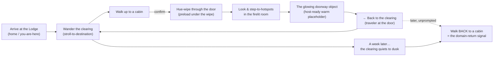

# Interest Lab — World Game-Flow, Movement & Controls: **Wandering Emberwood**

**Date:** 2026-07-21 · **Owner:** David · **Scope:** the *concrete, buildable* game — how a child (8–14)
**moves, looks, arrives, enters, explores, and returns** across **Emberwood** (the cozy log-cabin hamlet):
the traversal model on the 2D Curiosity Map, the look/step model inside a 3D cabin, the moment-to-moment
loop, the map↔cabin transitions, wayfinding, the "real-game" juice, and the **fully accessible peer** for
every one of these. This is **Lane G** (game-flow + movement + world aliveness) from the reconciliation.

**Reads first / builds on:**
[`2026-07-21-world-art-direction-cozy-cabin.md`](./2026-07-21-world-art-direction-cozy-cabin.md) (Emberwood:
the Lodge/hearth hub + per-domain cabins; palette; `MAP_COLOR_SCRIPT`; the clearing shot),
[`2026-07-21-world-visual-and-content-architecture.md`](./2026-07-21-world-visual-and-content-architecture.md)
(2D-DOM-map-primary + bounded 3D rooms; the transition contract §A5; the Chromebook floors §A6),
[`2026-07-21-interest-lab-world-design.md`](./2026-07-21-interest-lab-world-design.md) (hybrid architecture),
and [`2026-07-21-interest-lab-reconciliation.md`](./2026-07-21-interest-lab-reconciliation.md) (**§7 the
v1 SCOPE**, **§4 the seam**, canonical domain keys).
**Grounding research:** [`interest-lab-hybrid-vs-full-3d.md`](../../research/interest-lab-hybrid-vs-full-3d.md)
(the map is the legible medium; **never remount the Canvas**; don't over-rail; keep player-facing wayfinding),
and [`passionBrainlift.md`](../../research/passionBrainlift.md) (Insight 5 — **never gamify the
voluntary-return signal**; SPOV 1 — **never label**).
**Frozen contracts it must NOT break:** the `ZonePlugin` / `RoomProps` / `ActivityEvent` interfaces
(core-spec §3), the `CuriosityMapView` **focusable-button** map (core-spec §5.1, SC-CORE-10), the
**single persistent `<Canvas>`** rule (core-spec §5.2, SC-CORE-08), `Scene3DView` + `Camera3DView` +
`HUE_RAMP` shapes, and the `window.__qa` contract (core-spec §7). This doc is a **behavior + additive-token
layer** on top; it swaps no shipped shape.
**Depth model = LAAS** (reference frames, hard floors, an explicit banned-outcomes list, an
anchored self-score, and a mandatory reference-delta loop) — judged against *real games that stroll*, not
against "fine for a menu."

---

## 0. TL;DR — what this doc decides

1. **The world is a real game you stroll, not a menu you click.** The child guides a small **traveler**
   (their avatar) around the Emberwood **clearing** by **stroll-to-destination**: **click/tap a cabin (or a
   spot) → the traveler walks the path there → the door opens.** There is **no free-roam WASD camera**
   (rejected, [§3.1](#31-decision-stroll-to-destination-not-free-roam)); the traveler **path-follows** a
   baked clearing graph, so the world feels alive and explorable while staying legible and Chromebook-cheap
   (pure DOM, ~0 GPU).
2. **The accessible peer is the spine; the avatar is the joy.** The **roving-tabindex `<button>` per cabin**
   (the frozen `<CuriosityMap>`) is the source of truth for *what you can go to and enter*. Pointer/touch
   drives the traveler; keyboard/switch/controller step focus cabin-to-cabin and the traveler **echoes the
   focus** by walking to it. Same discrete outcome, two beautiful renderings — parity by construction, never
   a lesser menu.
3. **Inside a cabin you don't drive — you look and step.** A **fixed, composed camera** (the shipped
   `CAMERA3D`) with a **gentle clamped look-around** (its built-in orbit clamps) and **step-to-hotspots**
   (tap a prop → the camera eases to it via `focusLerp`/`focusFillDistance`). No free-fly, no
   orbit-that-loses-you. Reduced-motion → instant cuts.
4. **The loop is a felt arc, not a flowchart.** *Arrive at the Lodge (home / "you are here") → wander the
   clearing → walk up to a cabin → **hue-wipe through the door** (Canvas preloads under the wipe) → look
   around a warm firelit room → find the **glowing doorway object** (a **host-ready warm placeholder** while
   learning content is deferred) → step back to the clearing → drift to another → **come back, unprompted,
   over days** → the honestly-labeled **"a week later…"** time-lapse quiets the clearing to dusk and asks
   what you drift back to* ([§5](#5-the-moment-to-moment-game-loop-the-beat-sheet)).
5. **It's a real game with zero learning content and zero signal-gamification.** Curiosities pull you around
   (a wandering cat you can follow, fireflies, lanterns that light as you pass, a footbridge, the hearth you
   warm at, empty lots that hint the hamlet will grow); the world *reacts* to you; every input is instantly
   responsive. **None of it is scored.** No points, streaks, XP, countdowns, or FOMO — ever, and **never**
   on entering or returning ([§8](#8-what-makes-it-a-real-game-not-a-menu)).
6. **Signal at the world level = the coarse domain-return row.** *Which cabin you enter* and *which cabin you
   voluntarily walk back to after novelty fades* is the whole v1 signal (the grid **row**). The fine
   **work-mode column** waits for the content behind each doorway ([§9](#9-signal-at-the-world-level-the-coarse-domain-return-row)).

**Scope reminder (reconciliation §7):** Lane G builds **only the explorable game**. The learning content is
**deferred**; every doorway is **host-ready with a warm placeholder**. The world must be a smooth,
delightful, complete game *on its own*, tonight, with no content behind any door.

---

## 1. Pillars for game-feel (LAAS, translated to movement) — enforced

Every rule below serves one pillar; resolve any uncovered choice in favor of the relevant pillar. These sit
*under* the art bible's six pillars (cohesion/light/lived-in/legibility/color-script/breath) and govern
**motion, control, and flow** specifically.

- **G1. The peer is the spine, the avatar is the joy.** Everything the traveler can *do* (go to a cabin,
  enter, come back) is first a **real, labeled, focusable control**; the walking avatar is a delightful
  *rendering* of that same discrete choice, never a separate, privileged path. *Test: unplug the mouse — the
  entire game is playable by keyboard alone, and the set of enter-able places is identical.*
- **G2. Legible traversal — you always know where you are and how to get home.** The **Lodge is home** and
  always visible/reachable; a persistent **"← Back to the clearing"** exists in every room; the whole
  clearing reads at a glance (small world, fixed cozy framing). *Test: at any moment, a stranger can point to
  "you are here" and to "the way back" in under one second.*
- **G3. Movement is invitation, never a track.** The child chooses where to wander and what to revisit; the
  game **never** conveyor-belts them (the Duolingo-path lesson) and **never** rewards a return. Free choice
  of destination *is* the signal we measure — railing it destroys the measurement. *Test: no forced path, no
  "do this next" gate, no reward/point/streak on any move or return.*
- **G4. Instant, honest response.** Every input produces feedback in ≤1 frame (press-down state, the
  traveler starts moving, a hover/focus lift); nothing is fake — a "coming soon" doorway still *responds*
  live. *Test: every interactive changes `window.__qa.stateHash()` or an ARIA state; a tap that changes
  nothing is a fail.*
- **G5. Calm motion, reduced-motion absolute.** Strolls are gentle and **always skippable**; camera moves
  are small (no lurch, no motion sickness); `prefers-reduced-motion` collapses **every** essential motion to
  an instant, *calm* cut (never a broken frame). *Test: with reduced-motion on, no traversal or transition
  animates, yet every state is reachable and announced.*
- **G6. Chromebook-cheap traversal.** Map movement is **DOM** (transform/`motion` along a baked spline),
  ~0 GPU; the Canvas is **asleep** on the clearing and **demand-driven** in a room; one persistent Canvas,
  ever. *Test: on the clearing, GPU frameloop is idle; entering never remounts the Canvas.*

---

## 2. The two movement surfaces at a glance

| | **The Clearing** (2D Curiosity Map — Emberwood) | **A Cabin** (bounded 3D room) |
|---|---|---|
| Medium | **DOM** (baked iso sprites + SVG paths + `motion@^12`); Canvas asleep | one persistent `<Canvas frameloop="demand">` |
| The verb | **wander & arrive** | **look & step up** |
| Primary control | **stroll-to-destination** (click/tap a cabin or a spot → the traveler walks there) | **step-to-hotspots** (tap a prop → camera eases to it) + gentle look-around |
| Camera | fixed cozy iso; soft **follow-with-deadzone**; never free | fixed composed frame; **clamped** look-around (no pan/zoom/free-fly) |
| Accessible peer | roving-tabindex **`<button>` per cabin** (+ POIs); avatar echoes focus | roving-tabindex **hotspot list** (`ActivityDOM`); "← Back" always first |
| Signal it yields | **which cabin entered / voluntarily returned to** (the row) | (deferred: work-mode columns arrive with content) |
| Reduced-motion | traveler cross-fades to target; no path animation | camera cuts; fire/smoke steady; motes off |
| Cost | ~0 GPU (DOM) | `<50` draw calls, `dpr≤1.5`, frozen shadows, demand loop |

The bridge between them is **identity continuity**: the cabin you *walk up to* (same silhouette, sign glyph,
and `HUE_RAMP` hue) is the cabin you *step into*, carried across the transition by the domain-hue wipe
([§6](#6-transitions-camera--pacing)).

---

## 3. Movement on the Curiosity Map (wandering the clearing)

### 3.1 Decision: **stroll-to-destination**, not free-roam

**The chosen model:** a **path-following traveler** the child sends across the clearing by naming a
destination — **click/tap a cabin → walk there → enter**; **click/tap open ground → amble there** (pure
play). The traveler is a warm little **avatar** (a hooded traveler / the child's stand-in) that walks the
baked **clearing path graph** ([§3.2](#32-the-clearing-graph-buildable)), faces its direction of travel,
idles with a soft bob, and sits when it arrives at a rest node. This is the **A Short Hike / Alba / Animal
Crossing** stroll — a small legible world you *read* and *amble*, not a level you pilot.

**Why this and not the alternatives (justified, game-designer + research):**

| Candidate | Verdict | Why |
|---|---|---|
| **Stroll-to-destination** (chosen) | ✅ | Feels like a real cozy game (you send a character strolling and watch them arrive), yet every destination is a **named, focusable place** → maps 1:1 to the frozen roving-tabindex button model → **accessible + legible + Chromebook-cheap** (DOM spline tween) and captures the return signal cleanly (a cabin arrival is a discrete, observable event). |
| **Free-roam WASD/joystick avatar + proximity triggers** | ❌ rejected | Fights the frozen `<CuriosityMap>` contract (**"arrow keys move focus one building at a time — never a steered cursor"**, SC-CORE-10); free navigation **subtracts legibility** for 8–14 (Quest Atlantis) and is hard to make truly accessible; a continuous cursor on a DOM sprite map is awkward; adds a camera we don't need. The *wandering* is not the product — **arriving and returning** is. |
| **Pure click-a-button (no avatar)** | ❌ too thin | Legible and accessible but it's the **menu** the reconciliation §4 explicitly says to beat. The avatar + curiosities are exactly what turns the legible menu into a *place*. |
| **Auto-tour / on-rails camera** | ⚠️ partial | Good as an *optional* first-run flourish for the 6–8 band (`ChildStaging.worldCameraMode:"auto-tour"`), but never the control model — it removes the child's choice, which is the signal (G3). |

**The reconciliation in one line:** the avatar is a **rendering of the current selection**. Pointer/touch
*sets* the selection by pointing at a place; keyboard/switch/controller *step* the selection between places;
either way the traveler **walks to the selected place**, and confirming enters it. The `<button>`s never go
away — they *are* the selection targets.

### 3.2 The clearing graph (buildable)

The clearing is a tiny, hand-authored **navigation graph** baked alongside the map sprites (art bible §6).
Pure data in `interest-lab-view` (GPU-free, testable); the DOM renderer animates the avatar along it.

```ts
// interest-lab-view/src/clearing.ts  (NEW, additive — pure, no react/three)
export interface ClearingNode {
  id: string;                 // "lodge" | "threshold:music" | "poi:pond" | "poi:stump" | "lot:0" …
  kind: "hub" | "threshold" | "poi" | "lot" | "junction";
  /** 2D map-space anchor in normalized [0..1] clearing coords (resolution-independent). */
  at: { x: number; y: number };
  zoneId?: ZoneId;            // set for kind:"threshold" — the cabin door this node stands at
  label?: string;            // for POIs the avatar can "visit" (SR-announced); cabins use MapBuildingView.label
  facing?: "left" | "right"; // where the avatar looks while resting here
}
export interface ClearingEdge {
  a: string; b: string;       // node ids
  /** Polyline/spline in the same normalized space; the avatar tweens along it. Baked with the art. */
  path: ReadonlyArray<{ x: number; y: number }>;
  lengthUnit: number;         // relative length → drives stroll duration (§3.3)
}
export interface ClearingGraph {
  nodes: ClearingNode[];
  edges: ClearingEdge[];
  home: "lodge";              // the hub / you-are-here
}
/** Shortest walk between two nodes on the tiny graph (Dijkstra on lengthUnit; deterministic tie-break by id). */
export function routeBetween(graph: ClearingGraph, from: string, to: string): {
  nodes: string[]; points: ReadonlyArray<{ x: number; y: number }>; totalUnit: number;
};
/** Nearest point on the nearest edge to a tapped ground coordinate (for tap-to-amble). */
export function projectToPath(graph: ClearingGraph, at: { x: number; y: number }): {
  edgeId: string; point: { x: number; y: number }; nodeHintId: string;
};
```

**v1 graph (three cabins + the Lodge + a few curiosities).** The Lodge sits center; a soft dirt path forks
to each cabin threshold; spurs reach the pond, the footbridge stub, a sitting stump, and the visible empty
**lots** (room to grow — art bible §1). `at` coords follow the art bible's `MapBuildingView.cell` ordering
(Music `(0,0)`, Code `(1,0)`, Art `(2,0)`) laid along the winding path.

```
        (lot:0)        (poi:pond)──(poi:footbridge stub)
            \             |
 [threshold:music]──(junction:fork)──[threshold:code]──[threshold:art]
                          |
                       ((LODGE))  ← home / you-are-here
                          |
                      (poi:stump)
```

Everything is normalized `[0..1]` so the same graph drives any viewport; the DOM layer maps it to the baked
clearing plate. The graph is **small and fixed** — routing is trivial and deterministic (golden-testable).

### 3.3 The traveler (avatar)

- **Form.** A small, warm, friendly traveler sprite — a DOM ``/sprite (baked directional frames or a
  2–3-frame walk cycle) or a tiny inline SVG, positioned by CSS transform. Belongs to the *cabins* layer of
  the map's z-order (art bible §6: sky→treeline→ground→shadows→**cabins/avatar**→foliage→motes) with a soft
  blue-violet contact shadow (`MAP_COLOR_SCRIPT.softShadow` @ ~28% alpha, never gray).
- **States.** `idle` (gentle bob, `MOTION.islandFloat`-slow), `walking` (walk cycle + directional flip via
  `facing`), `arriving` (slow to a stop at the node), `resting` (sits at a POI/stump/hearth), `entering`
  (steps to the door → the transition, [§6](#6-transitions-camera--pacing)).
- **Stroll timing.** Duration = `edge.lengthUnit × WORLD_MOTION.strollPerUnit`, clamped so **the whole
  clearing is crossable in ~3 s** and no single cabin is more than ~1.4 s from the Lodge — a stroll, never a
  chore. Easing `EASINGS.move`. A **second tap / Enter while walking = skip to arrival** (instant); the
  child is never made to wait.
- **Facing & life.** The traveler turns (`WORLD_MOTION.avatarTurn` ≈ 150 ms) before setting off; on arrival
  it faces the door (thresholds carry `facing`); idle at the Lodge it warms its hands at the hearth.
- **Reduced-motion.** No walk cycle and no path tween — the traveler **cross-fades** (or instantly
  repositions) to the destination node; focus/selection still moves; a live region announces the move
  ([§3.7](#37-the-accessible-equal-map)). The avatar is **`aria-hidden`** throughout (decorative echo).

### 3.4 Controls on the clearing (all resolve to the same *select → confirm*)

Every scheme drives one tiny state machine: **set selection → (walk) → confirm-enter**. The avatar always
mirrors the current selection.

| Input | Wander / select | Enter a cabin | Notes |
|---|---|---|---|
| **Mouse / trackpad** | click a cabin → walk to it; click ground → amble to that spot | click the focused cabin **again** (or click its door) → enter | hover = focus lift + name tooltip; cursor never "steers" the avatar continuously |
| **Touch** | tap a cabin → walk to it; tap ground → amble | tap the cabin **again** → enter (or tap the on-arrival "Step inside" chip) | targets ≥ `ChildStaging.touchTargetPx`; tap-again-to-skip the stroll; pinch/zoom disabled |
| **Keyboard** | `Arrow`/`Tab` = roving focus one place at a time (Left/Right along the path; Up/Down to lots/POIs as the hamlet grows); avatar walks to the focused cabin | `Enter`/`Space` = enter the focused cabin | the **frozen** SC-CORE-10 model, unchanged; the avatar is the visible echo |
| **Switch / scanning** | auto/step scan advances focus through the same roving order; select = focus | select again = enter | single-switch friendly; dwell configurable |
| **Gamepad** | D-pad / left-stick **nudge** = step focus to the neighbor place (not free roam); avatar walks | `A` = enter; `B` = (in a room) back to clearing | console-UI mapping onto the discrete model — no free camera |

**Rules that hold across all inputs:** (a) a stroll is always skippable; (b) confirming on an *already
selected* cabin enters it (so one deliberate action can't accidentally teleport-and-enter); (c) tapping
empty ground is **pure play** — it never enters anything and never emits signal; (d) nothing auto-enters on
mere proximity (arrival shows an obvious **"Step inside"** affordance; the child still confirms — respects
G3 free choice and keeps entry a clean, intentional signal event).

### 3.5 The map camera (fixed, cozy, never free)

The clearing is a **small world that mostly fits the frame**, so the "camera" is deliberately humble:

- **Fit-to-clearing by default.** The baked iso plate scales to the viewport (letterboxed with the
  cream→peach sky). On phones it fits the whole clearing; the child never hunts off-screen.
- **Soft follow with a big deadzone.** If the clearing is larger than the frame (bigger screens / future
  growth), the view **eases** to keep the traveler and its target within a generous central deadzone
  (`WORLD_MOTION.mapFollow`, `EASINGS.move`) — a gentle drift, never a snap, never a chase. It never rotates
  and never zooms in on the avatar.
- **Parallax for depth, not navigation.** Foliage/treeline/mote layers shift a few px against the ground as
  the view eases (art bible §6 parallax) — pure atmosphere.
- **Reduced-motion.** No follow easing and no parallax — the view is a static, complete composition; focus
  changes are instant.

This is Monument-Valley/Stardew legibility, not a game camera you can get lost in.

### 3.6 Wander & curiosities (the "real game," on the map)

The clearing is dressed so wandering is its own small reward — all **optional**, none gate progress, **none
scored** ([§8](#8-what-makes-it-a-real-game-not-a-menu) states the guardrail):

- **A wandering cat** ambles a slow looping path; walk near and it may **follow you** a few steps or sit.
- **Fireflies / dust motes** drift in the low sun and **gather softly around the traveler** at rest
  (a gentle, delightful acknowledgment — never a "collect" mechanic).
- **Lanterns light as you pass** them at dusk-leaning phases; **the hearth**: rest at the Lodge and the
  traveler warms its hands, smoke puffs, the fire flickers up a touch.
- **The pond & footbridge stub** are strollable POIs; the **empty lots** are visible, walkable patches that
  quietly say *"more cabins can grow here"* (room to grow, art bible §1) — future domains, no placeholder UI.
- **Chimney smoke** rises from every lit cabin; the **Music cabin's smoke carries faint ♪ notes**; windows
  do a barely-there firelight flicker tying the map's light to the rooms' hearths.

These are **curiosities that pull you around Emberwood** (the §4 ask) without a single point or objective.
The "goal" a child invents ("visit the cat," "light all the lanterns," "sit by the fire") is theirs, and the
world simply *responds*.

### 3.7 The accessible equal (map)

The **`<CuriosityMap>` button grid is the game** for AT users, not a downgrade (G1; core-spec §5.1). The
avatar layer is a decorative echo on top.

- **Structure.** The map is a labeled landmark region ("Emberwood clearing"); the **Lodge** is announced
  first as **home / you-are-here**; each cabin is a **focusable `<button>`** in a roving-tabindex group
  (arrow keys step one at a time — frozen SC-CORE-10). POIs (cat, pond, stump) are **optional** focusable
  "look around" items *after* the cabins in tab order, clearly secondary (they never enter/emit).
- **Names & state, never color-only.** Each cabin button uses the golden `ariaLabel`
  (`"<label>, discovery zone, <n> unfinished, <return phrase>"` — core-spec §8.6), so **name + craft +
  state** are spoken; the visible chip repeats state as **text + glyph + motion**, never hue alone
  (color-blind + SR parity; art bible §1 four-channel identity).
- **Movement, announced.** Selecting a cabin (or stepping focus) moves the avatar; a **polite live region**
  narrates *"Walking to the Sounding Cabin…"* then *"At the Sounding Cabin. Press Enter to step inside."*
  With reduced-motion the walk is skipped but the same announcements fire.
- **The time-lapse control** is a labeled DOM control ("Right now → A week later… → A month later…") that
  steps `dayOffset`; its effect is announced (*"A week later. The clearing has quieted."*)
  ([§5.7](#57-the-a-week-later-time-lapse)).
- **Parity obligation.** The set of enter-able zones via keyboard **equals** the set the pointer avatar can
  reach — asserted like `plainZoneEquals` (there is no pointer-only or avatar-only destination).

---

## 4. Movement inside a cabin (bounded 3D room)

### 4.1 Decision: **fixed composed camera + gentle look + step-to-hotspots**

Inside a cabin the child **does not drive a camera** — the room is a *composed shot* (art bible §5 value
structure: dark cozy foreground → lit subject → luminous hearth/window). The shipped `CAMERA3D` already
encodes exactly this model; this doc adopts it verbatim:

```ts
// interest-lab-view/src/scene.ts — CAMERA3D (SHIPPED; adopted verbatim, no change)
export const CAMERA3D = {
  fov: 42,
  near: 0.1,
  far: 100,
  home: {
    pos: [0, 4.5, 15],
    target: [0, 0.4, 0],
  },
  establishStart: {
    pos: [0, 7, 22],
  },
  focusLerp: 0.075,
  focusFillDistance: 6.5,
  orbit: {
    enablePan: false,
    enableZoom: false,
    minPolarDeg: 60,
    maxPolarDeg: 85,
    azimuthClampDeg: 75,
    dampingFactor: 0.08,
  },
} satisfies Camera3DView;
```

- **Establish → settle on entry.** Camera flies from `establishStart` to `home` via `resolveCamera3D(null,…)`
  = **`drift-in`** (or **`cut`** under reduced-motion). This is the "you stepped inside and the room settles
  around you" beat.
- **Gentle clamped look-around.** Pointer-drag / arrow-nudge orbits **within** `orbit` clamps
  (polar 60–85°, azimuth ±75°, **no pan, no zoom**, `dampingFactor 0.08`) and **springs back** to `home`
  when released — a "lean and peek," impossible to get lost in. This is the whole of "free" camera.
- **Step-to-hotspots (the real interior movement).** Selecting a hotspot eases the camera to frame it —
  `resolveCamera3D(index,…)` = **`ease`** to `focusFillDistance` (6.5) in front of the prop, `focusLerp`
  0.075. A visible **"↩ step back"** returns to `home`. This is how you "move" through the room: hero craft
  object → doorway object → cozy props, each a composed close-up.
- **Rejected:** free-fly, WASD walk-around, unclamped orbit, zoom, per-room Canvas remount — all camera
  crimes (art bible §11; hybrid research §5). The child never pilots; they *look and step*.

**Age staging.** Honor `ChildStaging.worldCameraMode`: `"auto-tour"` (6–8) plays a short one-pass
establishing drift across the hero props on first entry before settling; `"focus+orbit"` (9–14) settles
immediately and hands over look/step control. Both end at `home`; reduced-motion skips the tour.

### 4.2 The hotspot model

A room is a small ordered list of **hotspots** — the only "places" the camera can step to. Each is a
composed close-up with one obvious affordance.

```ts
// interest-zone-kit — additive room helper (does NOT alter the frozen ZonePlugin/RoomProps)
export interface RoomHotspot {
  id: string;                 // stable within the zone, e.g. "hero" | "doorway" | "stove" | "shelf" | "cat"
  label: string;             // accessible name + on-screen chip ("The easel", "The wood-stove")
  role: "hero" | "doorway" | "ambient"; // exactly one "doorway"; one "hero"; rest "ambient"
  focus: { target: Vector3 };// camera eases here (focusFillDistance in front)
  live: boolean;             // true if interacting changes state (must be true for hero + doorway)
}
```

- **Order (roving focus + tab order):** `hero` → `doorway` → `ambient…`. The **hero** is the craft's live
  taste (deferred content → a warm placeholder that still *responds*, [§4.3](#43-the-doorway-object-a-host-ready-warm-placeholder)); the
  **doorway** is the single host-ready "go deeper" object; **ambient** hotspots (stove, cat, shelf, window
  shaft) are look-only delights that make the room lived-in.
- **One primary.** Exactly one hotspot is `primary` (the doorway object in the content-deferred v1) — the
  one warm-glowing thing to do (art bible §8.2; core-spec "one obvious verb").

### 4.3 The doorway object — a **host-ready warm placeholder**

Because learning content is deferred (reconciliation §5/§7), the doorway object must be a **warm, honest,
*live* placeholder** — never a dead "coming soon" wall (a dead interactive is a banned outcome and fails the
QA gate, core-spec SC-CORE-14).

- **It glows and invites.** The doorway object (the Sounding Cabin's lit gramophone horn / the Tinker
  Workshop's blueprint-hologram + brass GO key / the Atelier's luminous periwinkle canvas — art bible §8.2)
  rests at `markerEmissiveRest` and breathes to `…Pulse` in the domain hue — the single obvious focal point.
- **It responds, honestly.** Selecting it eases the camera in and plays a **warm acknowledgment**: the
  object pulses, the room brightens a touch, a soft chime, and an **honest** line appears —
  *"The studio's warming up — new things are coming. For now, look around."* (copy is honest about deferral;
  no fake lesson, no quiz, no modal dead-end). It may reveal one tiny cozy beat (the horn hums a note; the
  canvas ripples; the key ticks once).
- **It is provably live.** The interaction toggles a small `peeked` room-state so
  `window.__qa.stateHash()` **changes** on contact — the machine-checkable "primary action is live" proof
  (SC-CORE-14) holds *before any content exists*. When content lands, this same hotspot swaps its handler to
  launch `<ContentHost>` (world-visual-arch Part B) — **no movement/flow change**.
- **Never coercive.** No countdown, no "check back in N days," no badge. Warmth is invitation (passion
  guardrail).

### 4.4 Controls inside a cabin

| Input | Look around | Step to a hotspot | Interact | Leave |
|---|---|---|---|---|
| **Mouse/trackpad** | drag to peek (clamped, springs back) | click a hotspot | click the focused hotspot again | click **"← Back to the clearing"** |
| **Touch** | one-finger drag to peek | tap a hotspot | tap again / tap its affordance chip | tap **"← Back"** (persistent, top-left) |
| **Keyboard** | arrows nudge peek (clamped) | `Tab`/arrows = roving focus hotspots (hero→doorway→ambient) | `Enter`/`Space` | `Esc` or focus **"← Back"** + Enter |
| **Switch** | (peek optional) | scan advances hotspot focus | select | first scan target is always **"← Back"** (never trapped) |
| **Gamepad** | right-stick peek (clamped) | left-stick/D-pad steps hotspots | `A` | `B` |

**Never-trapped rule:** **"← Back to the clearing"** is always present, always the first focus stop, and
keyboard-reachable even if a 3D interaction misbehaves (world-visual-arch §A5). Leaving returns the traveler
to *just outside that cabin's door* on the clearing (spatial continuity, [§6](#6-transitions-camera--pacing)).

### 4.5 The accessible equal (room)

Every room ships `ActivityDOM` — the first-class DOM peer (core-spec §5.2/§5.3), which for the interior is a
**described, ordered list of what's in the room and what you can do**, not a lesser to-do list:

- **"← Back to the clearing"** first. Then the **hero** ("The easel — the studio's warming up"), the
  **doorway** object (the primary control), then **ambient** items as described, focusable "look" entries
  ("A wood-stove glows warm in the corner"; "A cat sleeps on the sill").
- **Parity by construction.** The `{hotspotId, label, role, primary}` set operable via `ActivityDOM` equals
  the `Room3D` hotspots reported through `window.__qa.interactives()` (the SC-CORE-11 parity obligation,
  extended to hotspots). No 3D-only or DOM-only affordance.
- **Announcements.** Focusing a hotspot announces its label + role; activating the doorway announces the
  honest warm line ([§4.3](#43-the-doorway-object-a-host-ready-warm-placeholder)); entering the room
  announces "You stepped into the Sounding Cabin. Press Back to return to the clearing."
- **Reduced-motion.** Camera cuts (no drift/ease), fire/stove glow steady (no flicker), dust motes off,
  doorway pulse becomes a static glow — every state still reachable and announced (G5).

---

## 5. The moment-to-moment game loop (the beat sheet)

The felt arc, beat by beat. Each beat lists the on-screen, the camera, the control, the audio, the
accessibility, and the signal. Reduced-motion column omitted for space: **every animated beat has an instant,
announced cut** (G5).

### 5.1 Arrive at Emberwood (home)

- **On-screen.** The clearing fades up at **golden hour**: the Lodge dead-center with its lit hearth and
  rising smoke, the winding path, three legible cabins (terracotta / sage / periwinkle) with warm windows,
  the pond glint, the cat mid-amble, fireflies just starting. The **traveler stands at the Lodge**.
- **Camera.** Fit-to-clearing; a one-time gentle settle (skippable; reduced-motion cut).
- **Control.** Idle. A soft, non-blocking cue points at the nearest cabin ("Wander over — push open a door").
- **Audio.** Warm ambient bed (crackle of the hearth, distant birds, a breeze); no music sting, no fanfare.
- **A11y.** Focus lands on the Lodge landmark; SR: *"Emberwood clearing. You're home at the Lodge. Three
  cabins to explore: the Sounding Cabin, the Tinker Workshop, the Atelier."*
- **Signal.** None (arriving home is not a domain choice).

### 5.2 Wander the clearing

- **On-screen.** The child sends the traveler strolling — toward a cabin, or off to the cat / pond / stump
  (pure play). Lanterns light as it passes; the cat may follow; motes gather at rest.
- **Camera.** Soft follow-with-deadzone (or static if it all fits).
- **Control.** Stroll-to-destination ([§3.4](#34-controls-on-the-clearing-all-resolve-to-the-same-select--confirm)); strolls skippable.
- **Audio.** Footfall on dirt/boardwalk; a firefly shimmer; the cat's soft trill.
- **A11y.** Roving focus + live-region walk narration; POIs are optional secondary focus stops.
- **Signal.** None yet (wandering ground/POIs never emits).

### 5.3 Approach & enter a cabin

- **On-screen.** The traveler arrives at the cabin **threshold**; the door and window glow up; a **"Step
  inside"** chip appears; the ♪/cog/brush sign creaks.
- **Camera.** Slight ease toward the cabin (still on the map).
- **Control.** Confirm (click-again / Enter / "Step inside") → **the transition** ([§6](#6-transitions-camera--pacing)).
- **Audio.** A soft latch/creak as the door opens; the hue-wipe carries a warm swell.
- **A11y.** SR: *"At the Sounding Cabin. Press Enter to step inside, or keep exploring."*
- **Signal.** **Enter fires the world-level `ActivityEvent`** ([§9](#9-signal-at-the-world-level-the-coarse-domain-return-row)): `kind:"explore"`
  at `dayOffset 0` (first visit) or `kind:"return"` at `dayOffset ≥ 7` (a later, unprompted return).

### 5.4 Explore the interior

- **On-screen.** A warm firelit cabin: exposed beams, a glowing wood-stove, the golden window shaft with
  dust motes, a rug, a plant, a sleeping cat — and the **hero** + **glowing doorway object**.
- **Camera.** Establish → settle (`drift-in`/tour per age), then look-around + step-to-hotspots.
- **Control.** Peek + step-to-hotspots ([§4.4](#44-controls-inside-a-cabin)); the doorway object is the one
  obvious thing to do.
- **Audio.** Room tone (stove crackle, a kettle, the craft's faint signature — a held note / a tick / a
  brush whisper).
- **A11y.** `ActivityDOM` described list; "← Back" first; hotspots announced.
- **Signal.** (Deferred — the work-mode columns come with content behind the doorway.)

### 5.5 Find the doorway object (host-ready placeholder)

- **On-screen.** The doorway object glows brightest; stepping to it plays the **honest warm
  acknowledgment** ([§4.3](#43-the-doorway-object-a-host-ready-warm-placeholder)) — *"The studio's warming
  up — new things are coming."*
- **Control.** Step to it → warm micro-reaction; it is **live** (`stateHash` changes) but opens no fake
  content.
- **A11y.** The honest line is announced; the object stays a labeled, operable control.
- **Signal.** None faked — the row already lit on entry; no invented work-mode signal.

### 5.6 Leave (and drift to another)

- **On-screen.** "← Back to the clearing" hue-wipes out; the clearing fades up with the **traveler standing
  just outside that cabin's door** (you know exactly where you are). The just-visited cabin now carries a
  soft **"explored"** shimmer that gently fades.
- **Camera.** Back to fit-to-clearing.
- **Control.** Wander again — to another cabin, or back home to the hearth.
- **A11y.** Focus returns to the cabin you left; SR: *"Back in the clearing, outside the Sounding Cabin."*
- **Signal.** The **return loop** is now possible: a later unprompted walk **back** to a cabin is the gold
  signal ([§9](#9-signal-at-the-world-level-the-coarse-domain-return-row)).

### 5.7 The "a week later…" time-lapse

The honest synthetic-return device (world-design §6; core-spec §4.4) — a labeled control, never a fake
metric.

- **On-screen.** Stepping **"A week later…"** visibly **quiets the clearing to dusk**: the first-visit
  shimmers fade, the sun lowers a notch, **fireflies thicken**, chimney smoke thins on cabins *not* revisited
  while the cabin(s) the child drifts back to keep their warm glow. Then the world simply *waits*: *what do
  you walk back to?*
- **Camera.** Unchanged framing; a slow lighting shift (art bible mood LUT — no new geometry).
- **Control.** The child wanders as always; the **first cabin they walk to, unprompted, after the lapse** is
  the voluntary-return.
- **Audio.** The ambient bed dims and cools; a single distant owl.
- **A11y.** SR live region: *"A week later. The clearing has quieted. Where do you go back to?"* The
  time-lapse control is a labeled slider/buttons with three stops (Right now / A week later… / A month later…).
- **Signal.** A walk-back at `dayOffset ≥ 7` with **no intervention** → `voluntaryReturns` in that cabin's
  **domain row** ([§9](#9-signal-at-the-world-level-the-coarse-domain-return-row)); a **prompted** return
  (if the world ever nudges) is tagged and **recessed, never celebrated**.

### 5.8 The loop, at a glance



---

## 6. Transitions, camera & pacing

The map↔cabin cut is the one real new surface (hybrid research §2.3); it must hitch **never**.

- **Doorway metaphor + identity continuity.** Confirming a cabin reads as *walking through its door*: the
  traveler steps to the threshold, then a **wipe on the cabin's `HUE_RAMP` hue** sweeps the screen. The hue
  is the constant across the cut, so the child never loses "which place is this / how do I get back"
  (world-visual-arch §A5).
- **Preload under the wipe (no hitch).** As the wipe covers the screen, kick off the room GLB load
  (`useGLTF.preload`) and dispatch `zoneHostReducer` **`enter(zoneId)`**; the Canvas `frameloop` wakes to
  `demand`. The room is revealed **only when `window.__qa.ready`** (Mario-Party "lightweight assets +
  background load"). The ~480 ms wipe hides first-frame warm-up.
- **Persistent Canvas, always.** Entering/leaving **swaps the Canvas children**, never remounts the Canvas
  or its WebGL context (core-spec SC-CORE-08; the single hard rule). On the clearing the Canvas is
  **suspended** (`frameloop` off / hidden) → ~0 GPU while wandering.
- **Exit is spatial.** "← Back to the clearing" hue-wipes back and the traveler is standing **just outside
  that cabin's door** — the clearing you left, from where you left it.
- **Pacing (calm, guilt-free).** No timers, no "hurry," no session countdown. Natural endpoints
  ("That's a good place to stop — the cabin will be here"). Exit is always one obvious control away; pause
  carries **no streak debt** (there are no streaks). The come-back loop lives *around* the game (the
  time-lapse), never as pressure inside it (hybrid research §4).
- **Reduced-motion.** Wipe → instant cut; establish/settle → cut; the traveler repositions without a walk;
  all still announced.

**New motion tokens (additive to `motion.ts`; reduced-motion → `instant`):**

```ts
// interest-lab-view/src/motion.ts — additive WORLD_MOTION (new named durations; existing MOTION unchanged)
export const WORLD_MOTION = {
  strollPerUnit: 900,   // ms per clearing lengthUnit (clamped so a cabin is ≤ ~1.4s from the Lodge)
  avatarTurn: 150,      // face-before-walk
  mapFollow: 520,       // soft camera-follow ease (deadzone) — reuses EASINGS.move
  doorwayWipe: 480,     // hue wipe over the map↔cabin cut
  arrivalPush: 300,     // the "push the door" beat at a threshold
  lanternLight: 260,    // a lantern warming on as the traveler passes
  timeLapseSettle: 700, // the clearing quieting to dusk (reuses timelineDraw feel)
} as const;
```

---

## 7. Wayfinding — the Lodge as home base

A kid must **always** know where they are and how to get back (G2; the Dead-Space "keep player-facing
wayfinding" lesson).

- **The Lodge = "you are here."** Center of the clearing, the always-lit hearth, the traveler's home; the
  one unambiguous anchor. A soft footprint/marker shows the **last-entered cabin**.
- **Labels + one verb.** Every cabin shows **name + one enter-verb** ("**The Sounding Cabin** · *Step
  inside*") as DOM text (never baked into the sprite) — World-1-1 clarity.
- **Return-glow (ambient, NOT a score).** A cabin the child came back to *unprompted* gets a gentle warm
  window-halo (`voluntary-return`); a **prompted** return gets a cooler, quieter cue (`prompted-return`); a
  first visit shows a fading **"new"** shimmer (`explored`). **No number, streak, star, or score ever sits on
  a cabin** (passion Insight 5).
- **"Your half-made thing is still here."** An `unfinished` cabin (explored, never voluntarily returned)
  shows a single soft window-glint — an opt-in invite, **never a countdown** (`CuriosityMapBuilding.unfinished`).
- **Back is everywhere.** "← Back to the clearing" is persistent in every room and first in focus order; the
  clearing itself has no "back" because it *is* home.
- **The time-lapse control** is a labeled, honest DOM control ([§5.7](#57-the-a-week-later-time-lapse)) —
  the only "time" in the game, and it's on-screen and truthful.

---

## 8. What makes it a REAL game, not a menu

Consolidated — the difference between "a legible menu" and "a place you want to be," delivered **without any
learning content and without gamifying the signal**.

**Curiosities & self-invented goals ([§3.6](#36-wander--curiosities-the-real-game-on-the-map)).** The cat to
follow, fireflies to walk through, lanterns that light as you pass, the hearth to warm at, the pond and
footbridge, the empty lots that promise growth. A child invents "visit the cat" / "light the lanterns" /
"sit by the fire" — small goals that pull you around Emberwood, all optional, none scored.

**Discovery rewards (felt, not counted).** First entry to a cabin plays a warm one-time flourish (the door
swings, the room breathes to life); the world *notices* you (motes gather at rest, the cat follows, a bird
lifts off, a lantern warms as you approach); the doorway object gives a satisfying live micro-reaction. The
"reward" is **delight and warmth**, never a token.

**Responsiveness (juice).** Every input lands in ≤1 frame: press-down states, hover/focus lift + name
tooltip, the traveler turning-then-striding, the arrival "push the door" beat, the hue-wipe swell, the
establish→settle. Skippable strolls. Instant, calm reduced-motion equivalents. This is the "it feels alive"
layer (art bible Pillar F, applied to control).

**World reactivity.** The clearing is one second from motion at all times (smoke, sway, flicker, cat, motes),
and it responds to *where the traveler is* (lanterns, motes, the cat, the hearth) — so the space feels
inhabited and aware, the felt opposite of a static menu.

**The hard line (G3 / passion Insight 5).** None of the above is ever a point, streak, XP, level, badge,
timer, countdown, or FOMO — and **especially never on entering a cabin or on returning**. The return-glow is
**ambient and descriptive** (it shows the child their own pattern), never a reward for coming back.
Gamifying the return would corrupt the exact signal we measure. Delight is allowed; scoring the signal is
banned.

---

## 9. Signal at the world level (the coarse domain-return **row**)

v1 (content deferred) captures the **coarse domain-return signal** — the grid **row** — from movement alone.
The fine **work-mode column** waits for the content behind each doorway (reconciliation §7).

**What emits, exactly.** Entering a cabin is the observable choice (core-spec §3.4: *which building to enter*
is a `CuriosityMap` selection; *what you wander back to* is a `return`-kind event at `dayOffset ≥ 7`). On a
confirmed cabin entry ([§5.3](#53-approach--enter-a-cabin)) the world emits **one coarse `ActivityEvent`**
against a designated **threshold probe** per cabin (a domain-level "entered" probe on the zone's shared
`build` column — a neutral row anchor), so the **row** lights while the **column** stays honest/empty until
content exercises real work-modes:

| Moment | `ActivityEvent` (world-emitted) | Grid effect |
|---|---|---|
| First entry to a cabin (`dayOffset 0`) | `{zoneId, domain, workMode:"build", probeId:"<zone>_enter", action:"enter", kind:"explore", dayOffset:0}` | `noveltyVisits++` (novelty-gated: **never** a return) |
| Unprompted re-entry (`dayOffset ≥ 7`) | `…kind:"return", dayOffset:7\|30` (no `intervention`) | `voluntaryReturns++` in the **domain row** → lights `returnState:"voluntary-return"` + the return-glow |
| Prompted re-entry (if ever nudged) | `…kind:"return", intervention:{source:"reminder"\|…}` | `promptedReturns++` — **tagged + excluded** from signal; recessed cue, never celebrated |
| Wandering ground / POIs / the cat | *(nothing)* | pure play never emits |
| Doorway placeholder tap | *(nothing signal-bearing)* | live micro-reaction only; no faked work-mode |

- **Coarse-but-honest.** Every world-emitted event carries the real `{domain}` (the row is true) and a
  **placeholder `workMode:"build"`** that the doc marks as *not yet a work-mode read*; `buildRevisableHypothesis`
  will read a **topic (row) lean at most** and report the work-mode column as a **coverage gap** ("no
  work-mode data yet") until content arrives — no false column spike.
- **Feeds the frozen pipeline unchanged.** These events flow through `buildReturnGrid` →
  `buildCuriosityMapView` (the return-glow) → `buildTimeLapse` (the quieting) → `toEngagementEvents` →
  `window.__qa.stateHash()` (entry/return provably changes the hash, SC-CORE-14). No engine change.
- **Guardrails travel with it.** Novelty gate (day-0 never a return), prompted/rewarded exclusion, help
  never lowers, no score/label at any depth — all inherited from the core (core-spec §2/§4.2). The world is
  the signal aggregator; a cabin is a signal source that speaks the contract.
- **When content lands.** The doorway's `<ContentHost>` emits the **fine** work-mode `ActivityEvent`s
  (columns) via the signal SDK — **with zero change to movement or flow**; the coarse row-signal just gains
  its columns.

---

## 10. Chromebook budget & tier degradation (movement)

Movement must never cost what the art can't afford (art bible §9; world-visual-arch §A6).

| Concern | Rule |
|---|---|
| Map traversal | **DOM only** — avatar is a transform/`motion` tween along a baked spline; Canvas **asleep** on the clearing (~0 GPU) |
| Room loop | one persistent `<Canvas frameloop="demand">`; idle room ≈ 0 GPU; `dpr ≤ 1.5`; `<50` draw calls; frozen shadows |
| Transition | preload GLB under the wipe; reveal on `ready`; **never** remount the Canvas |
| `RenderTier` map | legacy shipped `quest-world-3d` → `room-3d` (full room); `quest-world-3d-lite` → `room-3d-lite` (fewer motes, no bloom); `board-2d` → **`ActivityDOM` room + the DOM map** (the a11y floor). Room-facing names are the frozen `RoomProps.tier` (`room-3d` \| `room-3d-lite`); **the clearing + stroll are identical DOM at every tier** |
| Reduced-motion | strolls/wipes/camera → instant cuts; ambient motion → calm still; motes off (`resolveMotion(...,{reducedMotion:true})`) |
| Coarse-pointer / touch | targets ≥ `ChildStaging.touchTargetPx`; tap-to-walk with tap-again-to-skip |

Because the clearing is DOM at every tier, the **weakest Chromebook still gets the full wander-and-enter
game** (just the *room* degrades to its DOM peer) — no child hits a lesser world.

---

## 11. New / extended contracts (additive — nothing frozen breaks)

| New/extended | Where | Notes |
|---|---|---|
| `ClearingGraph` + `routeBetween` + `projectToPath` | `interest-lab-view/src/clearing.ts` (new, pure) | the baked nav graph + routing; GPU-free, golden-testable |
| `AvatarState` + `worldReducer` | `interest-lab-view` (new, pure) | `{ at, targetNodeId, phase, facing }`; actions `select` / `walk-arrived` / `enter` / `rest`; deterministic |
| `WORLD_MOTION` tokens | `interest-lab-view/src/motion.ts` (additive) | stroll/turn/follow/wipe/arrival/time-lapse durations; reduced → instant |
| `RoomHotspot` + `buildRoomHotspots` | `interest-zone-kit` (additive helper) | the interior step-to-hotspot list; parity-checked vs `ActivityDOM` |
| `<Traveler>` (DOM) + `<ClearingStage>` follow-cam | `interest-zone-kit` | renders the avatar/parallax over `<CuriosityMap>`; avatar is `aria-hidden` |
| World-level coarse-entry emit | `interest-lab-app` | on confirmed entry, emit the threshold `ActivityEvent` ([§9](#9-signal-at-the-world-level-the-coarse-domain-return-row)) |

**Explicitly unchanged (verified against the frozen contracts):** `ZonePlugin` / `RoomProps` /
`ActivityEvent` (core-spec §3); `MapBuildingView` + `CuriosityMapView` + the **focusable-button** map + its
roving-tabindex keyboard model (core-spec §5.1, SC-CORE-10); `ZoneHostState` / `zoneHostReducer` /
`<CanvasHost>` / the **single persistent `<Canvas>`** rule (core-spec §5.2, SC-CORE-08); `Scene3DView`,
`Camera3DView` (`CAMERA3D` adopted verbatim), `HUE_RAMP`; `window.__qa` (core-spec §7). This doc is a
**behavior + additive-token** layer; it swaps no shipped shape (the reconciliation-mandated stance).

---

## 12. Banned outcomes — instant fail (movement / game-flow)

Any one fails the surface (extends art bible §11 + world-visual-arch §A7 to traversal & flow):

- **A steered cursor replacing the peer.** A free continuous cursor/joystick driving the avatar in place of
  the roving-tabindex `<button>` model; a keyboard user who cannot reach or enter a cabin the mouse can.
- **A free-roam / lose-yourself camera.** Free-fly, unclamped orbit, zoom, WASD walk-around inside a cabin;
  a map camera that rotates/zooms onto the avatar or lets the child scroll off into nothing.
- **A menu, not a game.** No avatar, no curiosities, no world reactivity — just clickable buttons (the exact
  thing §4 says to beat); OR the opposite: so much "world" that the child gets lost (illegible).
- **A hitch or a remount.** A stutter on enter; **remounting the `<Canvas>` per room**; revealing the room
  before `ready`; the Canvas rendering while on the clearing.
- **A dead or dishonest doorway.** A "coming soon" wall that does nothing (dead interactive → SC-CORE-14
  fail); OR a placeholder that **fakes** content/a quiz behind the door.
- **Coercive or gamified flow.** Any point / streak / XP / level / badge / timer / countdown / FOMO on
  moving, entering, or returning; celebrating a **prompted** return; auto-entering on proximity (removing the
  child's choice); a forced "do this next" path.
- **A tedious stroll.** An un-skippable or slow walk; making the child wait to reach a cabin.
- **Reduced-motion crimes.** Essential traversal/transition motion under `prefers-reduced-motion`; a broken
  (rather than calm) reduced-motion still; motion-sickness-scale camera moves.
- **A lesser accessible path.** The AT experience as a flat to-do list instead of a true peer that preserves
  *choosing where to wander and what to revisit*; color-only cabin/state identity; an avatar that isn't
  `aria-hidden` and double-announces.

---

## 13. Self-score rubric — anchored to references

Per row: **10** = passes a one-second glance beside the reference at 1080p on a Chromebook; **7** = clearly
synthetic but the same class; **4** = decent hobby demo; **2** = a menu with a mascot. **Score every phase;
for each row write "what raises this +2"; implement the two cheapest before proceeding** (the LAAS loop).

References: **A Short Hike** (the stroll, arrival, gentle life) · **Alba** (readable warm wander) · **Animal
Crossing** (wayfinding by building identity, time-of-day warmth) · **Monument Valley / Stardew** (map
legibility) · **Gather.town** (walk-up-and-enter a bounded activity).

Rows:

- **Stroll feel** (does sending the traveler across the clearing feel good — turn, stride, arrive?)
- **Arrival & entry** (does walking up to a cabin and pushing the door feel like *entering a place*?)
- **Transition polish** (no hitch; hue continuity; establish→settle; reveal-on-ready)
- **Interior look/step** (composed frame, gentle peek, satisfying step-to-hotspot — never lost)
- **Doorway placeholder** (warm, honest, *live* — invites without faking)
- **Wayfinding** (you-are-here + back-home unmistakable in ≤1s)
- **World reactivity & curiosities** (the clearing feels inhabited and notices you; self-invented goals pull)
- **Responsiveness / juice** (every input lands in ≤1 frame; skippable; calm)
- **Reduced-motion parity** (every beat has a calm, announced instant equivalent)
- **Accessibility parity** (keyboard/switch/SR is a true peer — same places, same entries, same choice)
- **Signal cleanliness** (entry/return observed; nothing gamified; prompted recessed; row-true/column-honest)
- **Chromebook perf** (DOM stroll ~0 GPU; demand loop; no remount; `<50` calls / `dpr≤1.5` in rooms)

---

## 14. Verification battery (the reference-delta loop + headless checks)

Run at every phase close (reuses `window.__qa`, the VLM grader, the perf HUD):

1. **Reference-delta loop (mandatory).** Capture the closest shot/clip (a stroll-to-cabin; an entry
   transition; an interior look-around), place beside the matching reference, write `DELTA.md` (ten ranked
   differences), **fix the top three, re-render.**
2. **Peer-parity test (headless).** The set of enter-able zones via the keyboard roving-tabindex **equals**
   the set the pointer avatar can reach; every room hotspot in `window.__qa.interactives()` has an
   `ActivityDOM` peer (extends SC-CORE-11).
3. **Liveness test.** Confirming a cabin entry changes `window.__qa.stateHash()`; a first entry →
   `noveltyVisits`, an unprompted `dayOffset≥7` re-entry → `voluntaryReturns` in the row; the doorway
   placeholder tap changes the room `peeked` state (no dead interactive — SC-CORE-14).
4. **No-free-camera test.** Interior camera never exceeds the `CAMERA3D.orbit` clamps and always springs to
   `home`; no pan/zoom; the map view never rotates/zooms onto the avatar.
5. **Reduced-motion test.** With `prefers-reduced-motion`, no stroll/wipe/establish/parallax animates, yet
   every place is reachable/enterable and every beat is announced (live-region assertions).
6. **Never-trapped test.** "← Back to the clearing" is present + first in focus order in every room and works
   by keyboard even with a stalled 3D interaction; exit returns the traveler outside the correct door.
7. **Skippable-stroll test.** A second confirm during a walk arrives instantly; strolls respect
   `WORLD_MOTION` clamps (no cabin > ~1.4 s from the Lodge).
8. **No-hitch / no-remount test.** The mocked-Canvas mount counter stays **1** across `enter→exit→enter`
   (SC-CORE-08); the room reveals only after `ready`; the Canvas frameloop is idle on the clearing.
9. **Guardrail scan.** No `score`/`rank`/`streak`/`xp`/`countdown`/`price` field or copy on any
   movement/flow/return state; no `/you are (a|an|the) /i`; prompted returns recessed (reuses the core
   guardrail tests).
10. **Perf HUD.** Clearing GPU ≈ idle; room draw calls `<50`, `dpr ≤ 1.5`, ≥30 fps sustained under 10-min
    load on a real low-end device.
11. **Contact sheet.** A stroll-to-cabin still · an entry transition still · an interior look/step still ·
    the "a week later…" quieted clearing · the reduced-motion/`board-2d` a11y floor of one cabin.

---

## 15. Build path (Lane G) — phases & gates

Runs **after** Lane 0 core is green (the frozen seam) and composes with Lane W (world visuals). Each phase
ends green (`typecheck + test + lint + build`) and passes its slice of §14.

- **G0 — Clearing graph + traveler state (pure).** `clearing.ts` (`ClearingGraph`, `routeBetween`,
  `projectToPath`) + `worldReducer`/`AvatarState` + `WORLD_MOTION` tokens; golden route tests.
  *Gate: §14.7 (skippable/clamped) at the model level; guardrail scan.*
- **G1 — Stroll on the clearing (DOM).** `<Traveler>` + `<ClearingStage>` follow-cam over `<CuriosityMap>`;
  click/tap-to-walk + focus-to-walk; avatar echoes focus; strolls skippable; reduced-motion cut.
  *Gate: §14.2 peer-parity, §14.5 reduced-motion, §14.10 (clearing ≈ idle GPU); two-frame stroll shot.*
- **G2 — Enter transition + persistent Canvas.** Hue-wipe, preload-under-wipe, reveal-on-`ready`, spatial
  exit; `zoneHostReducer` enter/exit; never remount. *Gate: §14.8 no-hitch/no-remount, §14.6 never-trapped.*
- **G3 — Interior look/step + doorway placeholder.** Adopt `CAMERA3D`; look-around clamps + step-to-hotspots;
  `RoomHotspot` list; the **host-ready warm doorway** (live, honest). *Gate: §14.3 liveness, §14.4
  no-free-camera; two-frame interior shot.*
- **G4 — Wayfinding + world reactivity + curiosities.** Lodge you-are-here, return-glow (ambient),
  unfinished glint, cat/fireflies/lanterns/hearth reactions, time-lapse quieting. *Gate: §14.1 delta loop;
  wayfinding + reactivity rubric rows ≥ 7.*
- **G5 — World-level signal wiring.** Coarse threshold-entry `ActivityEvent`; row lights; columns honest;
  `window.__qa` liveness. *Gate: §14.3 + §14.9 (signal cleanliness); the map's return-glow reflects a
  voluntary return after a time-lapse.*
- **G6 — A11y peer hardening + reduced-motion sweep.** SR map/room scripts, live regions, switch/gamepad
  mappings, color-independent state. *Gate: full §14.2/§14.5/§14.6; accessibility-parity rubric = 10.*

**Freeze after G6:** the movement model (stroll-to-destination + focus-echo; interior look/step) and the
`WORLD_MOTION`/`ClearingGraph`/`RoomHotspot` additions are stable; zone loops build their rooms against the
interior hotspot + camera model.

---

## 16. Open decisions (record in `.loop/decisions.md`; escalate only if a golden/SC breaks)

- **Avatar identity.** A single warm traveler for v1 vs. a light "choose your traveler" later — pick the
  single traveler now; keep the sprite swappable.
- **Threshold-probe id shape.** `"<zone>_enter"` on the `build` column vs. a dedicated neutral row-anchor
  probe — pick the simplest that keeps the **row true / column honestly empty** ([§9](#9-signal-at-the-world-level-the-coarse-domain-return-row)); record it.
- **Follow-cam on small screens.** Static fit-to-clearing everywhere vs. follow only when the clearing
  exceeds the frame — default to fit-to-clearing; enable follow only on growth.
- **POIs in tab order.** Whether curiosities (cat/pond/stump) are focusable "look" stops for AT or purely
  decorative — default: focusable but clearly secondary, after all cabins, never signal-bearing.
- **`worldCameraMode` per band.** Confirm `"auto-tour"` (6–8) vs `"focus+orbit"` (9–14) interior-entry
  behavior with an operator glance; both must end at `home` and respect reduced-motion.
